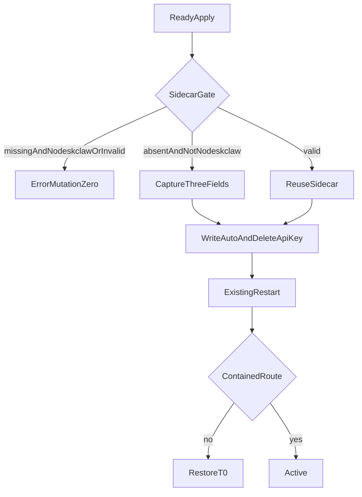

# Enterprise Execution Containment v1.5 实现计划

依据 [docs/work/PRD-WORK-RUNTIME-PROVIDER-ENTERPRISE-EXECUTION-CONTAINMENT-v1.5.md](docs/work/PRD-WORK-RUNTIME-PROVIDER-ENTERPRISE-EXECUTION-CONTAINMENT-v1.5.md)。实现以 §0.6 的 `EEC-D-01`～`EEC-D-16` 为准，并覆盖正文中与之冲突的旧句。仓库内没有 `smc-plan-from-approved-prd-ponytail` 技能包，因此沿用 [`.cursor/plans/runtime_diagnostics_plan_d58bb7cb.plan.md`](.cursor/plans/runtime_diagnostics_plan_d58bb7cb.plan.md) 的 `smc.plan.v3.7` 字段，claim `GES_NATIVE`。

2026-09-28 PRD 状态已是 `APPROVED_FOR_PLAN`。本计划状态是 `planned`。未执行的 v1.2、v1.3、v1.4 与 v1.5 Golden 都记 `BLOCKED`，不得记 `PASS`。

基线：smc-copilot `79ba099897831792a59630ada8601d40c4cdb9cd`。不改 NodeDeskClaw Backend、Hermes Agent Core、NEW-API、llm-proxy、remote/ssh 发送。不新增 Auxiliary slot，不新建第二套调度器或诊断系统。slot 列表只从 [`AUX_TASK_SLOTS`](apps/work/src/main/auxiliary-config.ts) 读取。英文文案只加在 `apps/work/src/shared/i18n/locales/en/providers.ts`。Member Key 保持只在内存。sidecar 与 Support Bundle 都不含密钥。



## 现有入口

- Auxiliary 写入在 [`setAuxiliaryTask`](apps/work/src/main/auxiliary-config.ts) 和 `resetAuxiliaryToAuto`。它们只改 `provider`、`model`、`base_url`。IPC 在 [`set-auxiliary-task`](apps/work/src/main/ipc/register.ts) 和 `reset-auxiliary-config`，现在没有 Runtime lock。remote/ssh 保持现有行为：ssh 分支直接返回，不写本地 yaml。
- 主 adoption 文件是 `runtime-provider-adoption.json`，由 [`captureManagedFiles`](apps/work/src/main/runtime-provider/runtime-provider-projection.ts) 纳入 T0。新 sidecar 必须另加，不得扩展这个 schema。`config.yaml` 已经在同一快照里，所以三个路由字段和 `api_key` 的失败回滚跟着现有文件恢复。
- READY apply 在 [`applyReady`](apps/work/src/main/runtime-provider/runtime-provider-orchestrator.ts)。logout 与 NOT_READY 走 `purgeRuntime`：NOT_READY 清密钥并保持 NOT_READY；logout 才恢复主 adoption。v1.5 只在 logout 恢复 Auxiliary，并在 purge 成功后删除 sidecar。
- 托管锁已有 `isRuntimeSettingsLocked`。v1.4 明确不锁 Auxiliary tab。本计划按 `EEC-D-03` 覆盖这条：local 且 Runtime 不是 `UNBOUND` 时，Auxiliary 写入返回 `RUNTIME_PROVIDER_SETTINGS_LOCKED`。页面仍保留，只禁用 Edit、Reset 和模型发现。
- drift 修正在下一次已有的登录、恢复、手动刷新、profile switch 或调度读取里完成。不新增文件监听，也不新开 timer。

## Todos

每个 Todo 的 `status` 从 `planned` 开始。只有对应验收跑出 Evidence 才能标 `verified`。

```yaml
id: eec-t1-sidecar
requirement_refs: [REQ-AUX-002, EEC-D-05, EEC-D-06, EEC-D-11, EEC-D-13, EEC-D-16]
acceptance_refs: [A-ADOPT-001, A-ADOPT-002, A-ADOPT-003, A-ADOPT-004]
files_or_symbols:
  - apps/work/src/main/runtime-provider/runtime-provider-auxiliary-adoption.ts
implementation_goal: schema 1.0 sidecar 只含 11 个 slot 的 provider、model、base_url。每个字段有 present 与 value。缺失记为 present=false 且 value=null，空字符串记为 present=true 且 value=""。禁止 secret、api_key、token。已存在且有效则复用且字节不变。缺失且主 provider 已是 nodeskclaw，或 schema、profile、forbidden key 非法时，返回对应错误且 mutation 为 0。安全首次捕获只读取写入前的三个字段。
preconditions: AUX_TASK_SLOTS 与现有 profile 目录。
state_transition: 无 sidecar 到一份 sidecar，或维持已有 sidecar。
side_effect_scope: 仅当前 profile 的新 sidecar 文件。
failure_cases: [把缺失写成空字符串, 用当前 auto 覆盖已有 sidecar, 非法 sidecar 被猜补]
verification: 缺失字段解析为 present=false。重复捕获 digest 不变。nodeskclaw 且无 sidecar 时文件写入数为 0。
status: planned
evidence: pending
```

```yaml
id: eec-t2-project-and-transaction
requirement_refs: [REQ-AUX-001, REQ-TXN-001, EEC-D-02, EEC-D-08, EEC-D-11, EEC-D-16]
acceptance_refs: [A-AUX-001, A-AUX-002, A-TXN-001, A-TXN-002]
files_or_symbols:
  - apps/work/src/main/runtime-provider/runtime-provider-orchestrator.ts
  - apps/work/src/main/runtime-provider/runtime-provider-projection.ts
  - apps/work/src/main/runtime-provider/runtime-provider-transaction.ts
implementation_goal: sidecar 门禁通过后，把捕获与投影放进同一次 T0。快照增加 sidecar 字节或缺失。随后把每个 canonical slot 写成 auto、空 model、空 base_url，并删除该 slot 的 api_key。timeout 与 extra_body 不动。投影、重启或复验失败时恢复 config.yaml 与 sidecar 到 T0，包括尝试开始前存在的 api_key。成功 logout 不恢复 api_key。
preconditions: t1 的捕获与门禁。
state_transition: 写入前失败则磁盘不变。写入后失败回到 T0。
side_effect_scope: 当前 profile 的 config.yaml 与 sidecar。
failure_cases: [sidecar 非法后仍改主投影, 回滚丢掉 T0 里的 api_key, 覆盖主 adoption schema]
verification: 非法 sidecar 的 config 与 sidecar digest 不变。投影中途失败后 auxiliary 与 sidecar 回到写入前。
status: planned
evidence: pending
```

```yaml
id: eec-t3-integrity
requirement_refs: [REQ-CHECK-001, EEC-D-12, EEC-D-14]
acceptance_refs: [A-CHECK-001, A-CHECK-002, A-CHECK-003]
files_or_symbols:
  - apps/work/src/main/runtime-provider/runtime-provider-integrity.ts
  - apps/work/src/main/runtime-provider/runtime-provider-contract.ts
implementation_goal: 三个路由字段偏离 contained route，或 canonical slot 出现 api_key（包括空字符串），都记为 AUXILIARY_ROUTING_DRIFT。同一次已有 apply 修回三个字段并删除 api_key。不新开 Bootstrap。复验后仍偏离则回滚 T0，错误码 RUNTIME_PROVIDER_POST_APPLY_DRIFT，不进入 ACTIVE。sidecar 缺失或非法仍按写入前的门禁返回，不改成另一种原因码。
preconditions: t2 的投影。现有 post-apply check。
state_transition: DRIFTED 修成功后记录 MATCH。修不掉则 ERROR。
side_effect_scope: 现有投影事务。
failure_cases: [另开 timer, api_key 写回后仍保持 ACTIVE, 日志含密钥]
verification: 注入 api_key 后下一次 refresh 将它删除，原因是 AUXILIARY_ROUTING_DRIFT，ACTIVE 前复验失败则 ACTIVE 次数为 0。
status: planned
evidence: pending
```

```yaml
id: eec-t4-lock
requirement_refs: [REQ-LOCK-001, REQ-COMP-001, EEC-D-03, EEC-D-09]
acceptance_refs: [A-LOCK-001, A-LOCK-002, A-COMP-001, A-COMP-002]
files_or_symbols:
  - apps/work/src/main/ipc/register.ts
implementation_goal: local 且 Runtime 不是 UNBOUND 时，set-auxiliary-task 与 reset-auxiliary-config 返回 RUNTIME_PROVIDER_SETTINGS_LOCKED，且不重启 Gateway。UNBOUND 时恢复原写入。remote 与 ssh 不创建 sidecar，不增加这把锁，ssh 仍走现有不写本地的返回。
preconditions: 现有 isRuntimeSettingsLocked。
state_transition: 锁只跟着现有 public state。
side_effect_scope: 拒绝写入。
failure_cases: [托管时仍改 auxiliary, remote 模式写出 sidecar]
verification: ACTIVE 时 auxiliary IPC 的 yaml 写入数为 0。ssh 模式的 sidecar 创建数为 0。
status: planned
evidence: pending
```

```yaml
id: eec-t5-logout
requirement_refs: [REQ-LIFE-001, EEC-D-07, EEC-D-11, EEC-D-16]
acceptance_refs: [A-LIFE-001, A-LIFE-002, A-LIFE-003, A-LIFE-004]
files_or_symbols:
  - apps/work/src/main/runtime-provider/runtime-provider-orchestrator.ts
  - apps/work/src/main/auxiliary-config.ts
implementation_goal: NOT_READY、STALE_ACTIVE 和已有 sidecar 的 ERROR 保持 contained route 与 sidecar。logout 先验证 sidecar，清除内存密钥，恢复主 adoption 与三个 Auxiliary 字段，再做 Gateway purge。present=false 的字段恢复为删除该字段，不写成空字符串。不写回 api_key。purge 成功后删除 sidecar 并进入 UNBOUND。恢复失败保留 sidecar，密钥保持空，错误码 RUNTIME_AUXILIARY_RESTORE_FAILED。删除失败同样不把密钥装回，错误码 RUNTIME_AUXILIARY_ADOPTION_CLEANUP_FAILED。只处理当前 profile。
preconditions: t1 的 sidecar 与 t2 的 T0。
state_transition: 成功 logout 到 UNBOUND 且 sidecar 不存在。失败停在 ERROR。
side_effect_scope: 当前 profile 的 config、sidecar、内存密钥与现有 Gateway 重启。
failure_cases: [NOT_READY 提前恢复用户路由, logout 写回 api_key, 恢复失败后密钥仍在内存]
verification: logout 后三个字段与捕获一致，api_key 不存在，sidecar 已删除。注入恢复失败后密钥为空且 sidecar 仍在。
status: planned
evidence: pending
```

```yaml
id: eec-t6-ui
requirement_refs: [REQ-UI-001, EEC-D-03, EEC-D-15]
acceptance_refs: [A-UI-001, A-UI-002]
files_or_symbols:
  - apps/work/src/renderer/src/components/AuxiliaryTasksSection.tsx
  - apps/work/src/shared/i18n/locales/en/providers.ts
implementation_goal: local 且 Runtime 不是 UNBOUND 时隐藏或禁用 Edit、Reset，且不打开编辑框、不触发模型发现。显示英文句子 These auxiliary tasks follow the enterprise model. Route changes are unavailable while enterprise runtime is managed. UNBOUND 时恢复现有可编辑界面。组件里不写死中文。Auxiliary tab 本身仍在。
preconditions: t4 的 Main 锁。
state_transition: 展示跟着现有 Runtime state event。
side_effect_scope: 无文件写入。
failure_cases: [托管时仍能提交 setAuxiliaryTask, 中文写死在组件]
verification: ACTIVE 时 Edit 与 Reset 不可用。UNBOUND 时原按钮恢复。
status: planned
evidence: pending
```

```yaml
id: eec-t7-verification
requirement_refs: [REQ-OBS-001, REQ-EVID-001, EEC-D-10]
acceptance_refs: [A-OBS-001, A-OBS-002, A-EVID-001, A-EVID-002]
files_or_symbols:
  - apps/work/src/main/runtime-provider/runtime-provider.test.ts
implementation_goal: drift 原因进入现有 projection reasons。诊断读取不写文件、不带 sidecar 正文、不含 api_key。记录本地命令。未执行的 v1.2、v1.3、v1.4 与 v1.5 Golden 分开记为 BLOCKED。
preconditions: t1 到 t6 的断言已实现。
state_transition: planned 到 implemented 只表示代码写完。verified 需要实际 Evidence。
side_effect_scope: 测试与 evidence 记录。
failure_cases: [把状态放行写成 Golden PASS, Bundle 含 sidecar]
verification: 本地 A-AUX 到 A-UI 各有一条 evidence。四条未执行 Golden 都是 BLOCKED。
status: planned
evidence: pending
```
