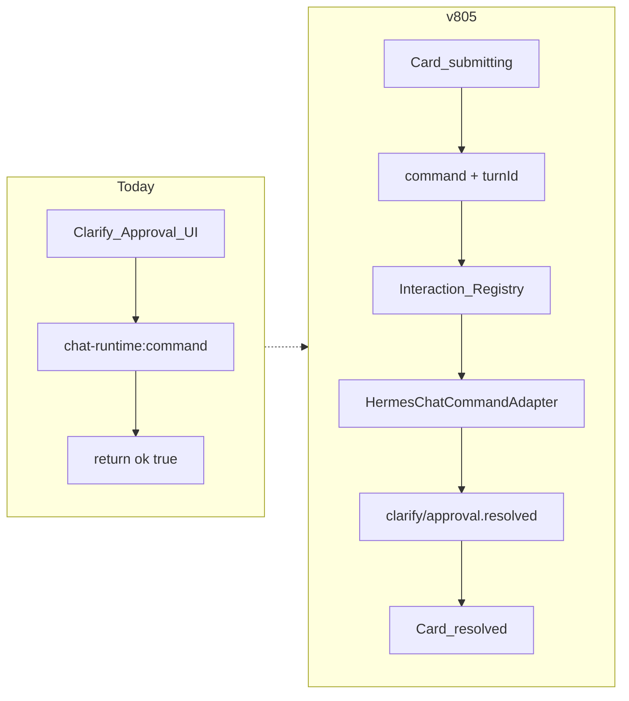

# Chat Interaction Loop (v8.0.5 · PR1–PR4)

I'm using the writing-plans skill to create the implementation plan.

## 范围

- **纳入**：PR1 Runtime Command 契约；PR2 Hermes Interaction Bridge + Clarify/Approval UI；PR3 Turn Snapshot / Queue / Retry；PR4 Session Files Live Badge。
- **顺延**：PR5 Playwright Electron E2E / 截图基线；PR6 deprecated API cleanup（`forcedSessionId` / `send` / `filesToggleSlot` 暂留）。
- **不改**：Expert/Skill 协议、File Parser、Web Operator、视觉大改。

Gateway 现状：仅有入站 SSE `hermes.clarify.requested` / `hermes.approval.requested`（[`hermes.ts`](src/main/hermes.ts)），无出站 Command API。Adapter 落地优先级固定为：

1. 探测/封装原生 Command（若日后存在则走此路径）
2. **结构化 Follow-up Message**（默认实现：同 `sessionId` + `profileId` 向 Gateway 发带约定前缀的 continuation user message，并继续当前 run 的 SSE 消费）
3. 无法执行时返回 `GATEWAY_UNSUPPORTED`（**禁止**假 `ok: true`）

## 根因 → 修复



当前空实现：[`chat-runtime-ipc.ts`](src/main/chat-runtime/chat-runtime-ipc.ts) L518–535；UI 乐观 resolved：[`ClarifyCard.tsx`](src/renderer/src/modules/chat/components/clarify/ClarifyCard.tsx)；Approval 内联无风险确认：[`MessageList.tsx`](src/renderer/src/modules/chat/components/messages/MessageList.tsx)；Queue 仅文本：[`useChatQueue.ts`](src/renderer/src/modules/chat/hooks/useChatQueue.ts)；Badge 硬编码：[`AiosCopilotChatHost.tsx`](src/renderer/src/screens/Hermes/pages/Chat/AiosCopilotChatHost.tsx) `sessionFilesCount={0}`。

---

## PR1 — Runtime Command Contract

**Shared** [`chat-runtime-contract.ts`](src/shared/chat-runtime/chat-runtime-contract.ts) / [`chat-runtime-events.ts`](src/shared/chat-runtime/chat-runtime-events.ts)：

- `ChatRuntimeCommand` 必含 `runId` + `turnId` + `requestId`（可选 `sessionId`）
- `ChatRuntimeCommandResult`：成功带 `runId/turnId/requestId/acceptedAt`；失败带 `code`（`RUN_NOT_FOUND` | `TURN_MISMATCH` | `REQUEST_NOT_FOUND` | `REQUEST_ALREADY_RESOLVED` | `INVALID_STATE` | `GATEWAY_UNSUPPORTED` | `COMMAND_FAILED`）
- 新增事件：`clarify.resolved` / `approval.resolved` / `interaction.failed`

**Preload / Host / ChatSurface**：command 调用补 `turnId`（来自 controller `activeTurnId`）；仅在 `*.resolved` / `interaction.failed` 后更新 Card，不在 invoke 成功时乐观 resolved。

**测试**：contract shape + 旧 turn command 被拒绝的 reducer/IPC 单测。

---

## PR2 — Hermes Interaction Bridge + UI

**Main**

- 扩展 [`chat-runtime-manager.ts`](src/main/chat-runtime/chat-runtime-manager.ts) `ChatRunHandle`：`turnId`、`pendingInteractions`、`respondClarify` / `approve` / `deny`
- 新增 `chat-interaction-registry.ts`：在 emit `clarify.requested` / `approval.requested` 时登记；command 校验 run/turn/request/type/未处理/waiting 状态
- 新增 `hermes-chat-command-adapter.ts`：Follow-up Message 默认路径；接线进 [`chat-runtime-ipc.ts`](src/main/chat-runtime/chat-runtime-ipc.ts) `chat-runtime:command`
- 成功：emit `*.resolved`，清 pending，run 回 `streaming`；失败：emit `interaction.failed`，Card 可 Retry

**Renderer**

- `chatViewTypes` / `chatReducer`：`ChatPendingInteractionState` + `INTERACTION_SUBMIT` / `RESOLVED` / `FAILED`
- 抽出 [`approval/ApprovalCard.tsx`](src/renderer/src/modules/chat/components/approval/ApprovalCard.tsx)：Tool / Summary / Risk；`high` 二次确认；Deny 可填 reason
- ClarifyCard：submit → loading；等 resolved；失败 Retry；已 resolved 不可再提交
- [`AiosCopilotChatHost.tsx`](src/renderer/src/screens/Hermes/pages/Chat/AiosCopilotChatHost.tsx) `onRuntimeCommand` 传入完整 command（含 `turnId`）

**验收**：点击后 Main 真转发；假 `ok: true` 删除；跨 turn 命令被拒。

---

## PR3 — Turn Snapshot / Queue / Retry

**新增** [`chatTurnSnapshot.ts`](src/renderer/src/modules/chat/controller/chatTurnSnapshot.ts)：`ChatTurnRequestSnapshot`（raw/effective text、attachments、session/model、expert/skill、workMode/permission、promptHint、invocationSource、createdAt）。

**Queue** [`useChatQueue.ts`](src/renderer/src/modules/chat/hooks/useChatQueue.ts)：`QueuedChatTurn { id, snapshot, enqueuedAt }`；busy 时 `submitPayload` enqueue 完整快照（不清附件进“丢失”路径——快照内保留）。

**Controller**：`BEGIN_TURN` 时写 `lastTurnSnapshot`；drain queue 用 snapshot 重放（含 attachments + context 字段进 `runtime.submit`）。

**Retry UI**（MessageList / error actions）：

- **Retry** → 重放 `lastTurnSnapshot`（或 error 关联快照）
- **Edit and retry** → 恢复 text+attachments+model/context 到 Composer，不自动发送
- **Retry with current context** → 原 text+attachments，当前 Model/Expert/WorkMode

避免重复追加已存在的 User Message（重放时跳过再 append 同一 user 行或先裁剪失败轮）。

**测试**：queue 含附件；retry 三种模式快照字段；不丢 expert/model。

---

## PR4 — Session Files Live Badge

- Shared：`src/shared/chat-files/chat-files-events.ts`（`ChatFilesChangedEvent`）
- Main：upload/remove/migrate/context/agent-output 后 `emit` → Preload `chatFiles.onChanged`
- Renderer：`useSessionFilesSummary({ sessionId, profileId })`（list + 事件刷新 `total`）
- Host：`sessionFilesCount={filesSummary.total}`，删除硬编码 `0`
- Badge 与 Panel 同源 summary，避免双请求分叉

**测试**：changed 事件后 summary.total 更新；无 session 时 disabled 逻辑保持。

---

## 测试与文档（收尾）

Vitest（无 Playwright）：

- `chat-runtime-command-contract` / turn mismatch
- `chat-interaction-registry` / adapter follow-up（mock）
- `chat-turn-snapshot-queue-retry`
- `session-files-summary`

验证命令：

```bash
npm run check:no-reference-imports
npm run check:chat-boundaries
npm run typecheck:chat
npm run typecheck
npm test
npm run build
```

文档（007）：`AGENTS.md` / `docs/INDEX.md` 版本行 v8.0.5；`docs/API_CONTRACTS.md` Command/`turnId`/新事件/`chat-files:changed`；`docs/renderer/screens/Hermes.md`；`lat.md/domain/chat.md`（interaction loop、snapshot queue、files summary）+ `lat check`。

## 实施顺序

PR1 → PR2 → PR3 → PR4 → 测试/文档。PR2 依赖 PR1 契约；PR3/PR4 可在 PR2 后并行开发但合并顺序仍建议串行以免事件面分叉。
