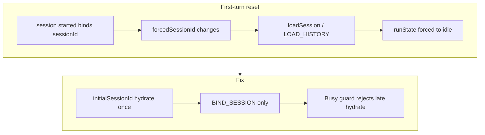

# Chat Turn Lifecycle Stable (v8.0.4 · PR1–PR4)

## 目标与范围

修复截图/PRD 中的三个 P0 问题，并补齐 Turn 隔离：

1. **首轮完成后被 `LOAD_HISTORY` 打回 idle**（`forcedSessionId` 绑定与恢复混用）
2. **Send 不清空 Input/Draft**（`send(text)` 走 override 分支）
3. **Prompt Navigator / Session Files 不在右侧固定浮动层**

- **纳入**：PR1 Session hydrate/bind 拆分 + Main `session.started` 去重；PR2 Composer 提交事务；PR3 `turnId` + 终态单调；PR4 `ChatFloatingRail` + Status 每秒刷新。
- **不纳入**：Playwright Electron E2E / 截图基线（仓库仍无 harness；与 v8.0.3 一致顺延）。验收用 Vitest 覆盖 PRD §11 的关键场景。
- **不改**：Expert/Skill 协议、File Parser、Web Operator、左侧导航、消息视觉风格。

## 根因 → 修复映射



当前关键代码：

- [`useChatController.ts`](src/renderer/src/modules/chat/controller/useChatController.ts)：`forcedSessionId` 变化即 `loadSession`；`send(overrideText)` 有值时不清空
- [`chatReducer.ts`](src/renderer/src/modules/chat/controller/chatReducer.ts)：`LOAD_HISTORY` 无条件 `runState: "idle"`
- [`chat-runtime-ipc.ts`](src/main/chat-runtime/chat-runtime-ipc.ts)：`onSessionStarted` 与 `onDone` 各发一次 `session.started`
- [`ChatSurface.tsx`](src/renderer/src/modules/chat/components/ChatSurface.tsx)：`PromptNavigator` 在 scroll 内；`filesToggle` 在 Composer 左栏

---

## PR1 — First Turn Session Fix

拆分「恢复历史」与「运行时绑定」。

- Props：`forcedSessionId` → `initialSessionId`（仅挂载 hydrate）；运行时绑定走 `BIND_SESSION`，**不**触发历史加载。
- Reducer：新增 `HYDRATE_SESSION`（仅 `idle`/`interrupted` 且 messages 空时可覆盖）与 `BIND_SESSION`（只改 `activeSessionId`）。保留/收窄 `LOAD_HISTORY`，busy 时 no-op。
- Controller：`initialHydrationIdRef` / `hydratedSessionIdRef` / `runtimeBoundSessionIdRef`；hydration requestId 竞态保护（开始提交/切 Run/卸载作废旧请求）。
- Host：[`AiosCopilotChatHost.tsx`](src/renderer/src/screens/Hermes/pages/Chat/AiosCopilotChatHost.tsx) 传 `initialSessionId={run.identity.sessionId}` 仅作初始值语义（用 ref 固定首次），`onSessionIdChange` → `patchRun` identity，不再把更新后的 id 当作 forced hydrate 源。
- Main：[`chat-runtime-ipc.ts`](src/main/chat-runtime/chat-runtime-ipc.ts) 增加 `emitSessionStartedOnce(sessionId)`，`onSessionStarted`/`onDone` 共用。

**验收**：New Chat 第一次提交完成后仍为 completed，助手内容不丢，不回空白。

## PR2 — Composer Transaction

发送即清空，Draft 单一入口。

- Controller：`submitComposer()` / `submitPayload({ text, attachments, source })` 取代模糊 `send(text?)`；同步 `commitInput("")` + 清 attachments + `onDraftChange?.("")`，再 append messages / `runtime.submit`。
- Input：`inputRef + bumpInput` → `useState` + `commitInput`；Suggestion/Voice/Slash/Restore 全走同一路径。
- [`CopilotChatInput.tsx`](src/renderer/src/modules/chat/components/composer/CopilotChatInput.tsx)：`onSend()` 无 override（或 Host 改调 `submitComposer`）；失败不自动回填，消息行提供 Retry / Edit and retry / Copy（最小 UI）。
- Host：`onDraftChange` 写 `run.presentation.draft`；Send 后 draft 必空。

**验收**：Send/Enter 后 ≤50ms Input 与 Draft 为空；切 Run 不恢复旧 Prompt。

## PR3 — Turn Lifecycle

同 Run 多轮事件隔离。

- Shared：[`chat-runtime-contract.ts`](src/shared/chat-runtime/chat-runtime-contract.ts) / [`chat-runtime-events.ts`](src/shared/chat-runtime/chat-runtime-events.ts) 增加必填 `turnId`（事件与 submit）。
- Main：submit 接受或生成 `turnId`，所有 emit 带回同一 `turnId`；终态后丢弃同 turn 非终态事件；配合 PR1 的 session.started 去重。
- Controller：`BEGIN_TURN` / `activeTurnId`；只消费 `event.runId === active && event.turnId === activeTurnId`；终态后 ignore delta/tool/session.started。
- Workspace：[`chatWorkspaceReducer.ts`](src/renderer/src/modules/chat/workspace/chatWorkspaceReducer.ts) 每轮 busy 从 terminal/idle 进入时重置 `startedAt`；`ChatRunStatus` 每秒 `setInterval` 刷新 duration；usage 按轮重置，累计放 tooltip。

**验收**：上一轮迟到 `message.delta` 不能改已 completed / 下一轮状态。

## PR4 — Floating Actions + Status

统一右侧浮动层。

- 新增 [`components/floating/ChatFloatingRail.tsx`](src/renderer/src/modules/chat/components/floating/ChatFloatingRail.tsx)、`FloatingActionButton.tsx`；Prompt Navigator Trigger/Panel 相对 rail 左向展开（可复用现有 utils，去掉 `suppressed || narrow` 隐藏逻辑，窄屏改 icon）。
- [`ChatSurface.tsx`](src/renderer/src/modules/chat/components/ChatSurface.tsx)：`ChatFloatingRail` 为 `chat-main` 直接子节点（与 scroll、composer 并列）；从 Composer 移除 `filesToggle`。
- CSS：`.chat-main { position: relative }`；`.chat-floating-rail` absolute 垂直居中、`inset-inline-end: 14px`、`z-index: 30`；面板打开时随 `chat-main` 变窄左移。
- Session Files：Folder + badge（数量）+ active；无 session 且无 draft 文件时 disabled。

**验收**：两按钮固定在 Chat 最右侧，不随消息滚动，不出现在 Composer/左下角。

## 测试（Vitest）

新增/扩展（路径可落在 `tests/` 或 `modules/chat/**/*.test.ts`，与现有一致）：

- `first-turn-session` / `session-hydration-race`：BIND 不 hydrate；busy 时晚到 hydrate 丢弃
- `composer-submit`：submitComposer 清空 input/draft/attachments
- `turn-state-machine` / `terminal-event-guard`：终态后 drop late events
- `floating-actions`：rail 挂载位置、prompt&lt;2 隐藏 trigger

验证命令：

```bash
npm run check:no-reference-imports
npm run check:chat-boundaries
npm run typecheck:chat
npm run typecheck
npm test
npm run build
```

（`test:e2e:electron` 顺延。）

## 文档

收尾按 007：`AGENTS.md` / `docs/INDEX.md` 版本行 v8.0.4；`docs/API_CONTRACTS.md` Chat Runtime 增 `turnId`；`docs/renderer/screens/Hermes.md`；`lat.md/domain/chat.md` 增 Session hydrate vs bind、Turn、Floating Rail，并 `lat check`。

## 实施顺序

严格按 PR1 → PR2 → PR3 → PR4 → 测试/文档。PR1 是 P0 稳定性；PR3 依赖 Shared/Main 契约，宜在 PR2 后立刻做以免事件面分叉。