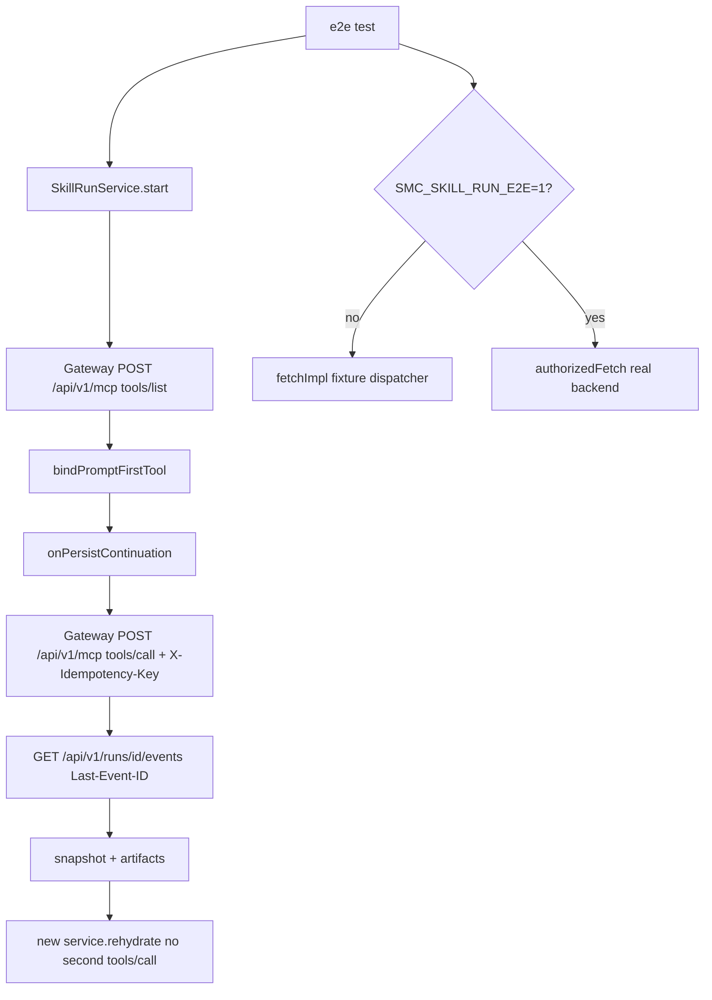

# Work v4.0.1 Checkpoint B Live E2E Plan

**Mode：CREATE**（目标 [`.cursor/plans/work-v4.0.1-skill-first-checkpoint-b-live-e2e.plan.md`](.cursor/plans/work-v4.0.1-skill-first-checkpoint-b-live-e2e.plan.md) 尚不存在；**不得覆盖**已有 A/B/C `.plan.md`）

**切片：** ROADMAP Checkpoint B 真实链路验收（M0 已关之后）

**PRD：** [docs/work/PRD-WORK-v4.0.1-skill-first-layout-run-integration.md](docs/work/PRD-WORK-v4.0.1-skill-first-layout-run-integration.md)

**接地（用户已选）：** Execute 第一步 **commit Checkpoint C + M0**，再用新 SHA 写 v3.2 Plan（`grounding_source: committed_baseline`）。不得把当前脏工作区静默当批准事实。

**验证运行时（用户已选）：** 真实 NoDeskClaw backend 为主 oracle；合同 fixture HTTP replay 做 CI 可重跑负向场景。缺 live 环境时 fixture 仍必须绿；AC-12 跨端不得声称 proven。

**commit_policy：** `post_review`

确认本 Cursor Plan 后顺序固定：

1. Commit C+M0（用户已授权此前提）
2. 用新 `grounded_commit` 落盘 `.cursor/plans/work-v4.0.1-skill-first-checkpoint-b-live-e2e.plan.md`（v3.2 全表）
3. 跑 `validate_generation_integrity.py`、`validate_plan.py`、`assess_plan_review.py`
4. Contract/Data Flow 非 None → **smc-plan-review PASS** 后才能改 `apps/work`（T0 commit 除外）

## Approved PRD

[docs/work/PRD-WORK-v4.0.1-skill-first-layout-run-integration.md](docs/work/PRD-WORK-v4.0.1-skill-first-layout-run-integration.md)

ROADMAP Checkpoint B：真实发布 Skill 跑 Catalog → Submit → Run → Result → Artifact → Restart；负向含 unauthorized、unpublish、offline/reconnect、duplicate submission、cancel、artifact failure。M5/M6 本切片 Out。

## Scope

**In**

- 一条可观察 happy path：`listCatalog` → `start`（prompt-first）→ SSE/poll 终态 → result text → artifact list → dispose + `rehydrate` **零第二次** `tools/call`
- 负向：401 catalog、tool 从 catalog 消失、SSE 断线 + `Last-Event-ID` 重连、同一 `X-Idempotency-Key` replay 同一 `run_id`、cancel、artifact discovery 失败不把 succeeded 打成 failed
- CI：fixture `fetchImpl` 调度（复用已有 `createAuthorizedBackendTransport({ fetchImpl })` + `createSkillRunService`）
- Live：`describe.skipIf`，环境变量提供 backend URL / access token / 已发布 `toolName`；证据文件脱敏（无 JWT/绝对 URL）
- `lat.md` 写明 Checkpoint B live 边界与 live skip 时 AC-12 未 proven

**Out**

- 不改 Skill Run 生产生命周期语义（除非 E2E 发现合同路径仍不匹配——那时 STOP 并 RETURN_PRD，不在 E2E 里补 parser）
- 不新建第二套 Service / Playwright Skill Chat / 平行 session DB
- 不把 Provider schema 复制进 `contracts/` 之外的 SOT（fixture JSON 只活在测试文件）
- M5 生产默认、遥测 dashboard、M6 P1、Expert REMOVE
- 不在证据或日志中留下 JWT / prompt 全文 / artifact bytes

**Owner 继承：** Lifecycle = `SkillRunService`；HTTP = Gateway + authorized transport；File = 现有 File Platform（live 只断言 descriptor 进入 `onUpsertArtifact`，不新 download IPC）

## 调用链（最小，不新 owner）

## 未执行功能（对照当前源码，相对本切片）

- Happy/负向 **真实 HTTP** 与 **CI fixture 全链路** 测试文件不存在（仅有 mock lifecycle 单测与 idempotency 单元）
- `npm` 无 skill-run E2E script
- `lat.md` 仍把 live backend E2E 标为 Still Out
- 生产 `start` / gateway JSON-RPC 已在 M0 对齐，本切片 **默认 KEEP**

## Change IDs

- **C01** ADD [`apps/work/src/main/skill-run/skill-run-e2e.test.ts`](apps/work/src/main/skill-run/skill-run-e2e.test.ts) — fixture dispatcher + live skipIf；入口 `createSkillRunService` + `createSkillRunGatewayClient`。`MINIMAL_NEW`。T1
- **C02** MODIFY [`apps/work/package.json`](apps/work/package.json) — `test:skill-run-e2e` → vitest 该文件（`--pool=threads --maxWorkers=1`）。`MODIFY_EXISTING`。T2
- **C03** MODIFY [`apps/work/lat.md/skill-run.md`](apps/work/lat.md/skill-run.md) — Checkpoint B live 边界、env 名、AC-12 证据分级。`MODIFY_EXISTING`。T3

KEEP：`skill-run-service.ts#start`、gateway JSON-RPC、parser、lock、IPC、Chat/Layout、File Platform 生产路径。无 `NEW_DEPENDENCY`。Generated Outputs：None。

## Implementation Decisions

- **C01 MINIMAL_NEW：** Expert/PRD-v1.1 E2E 不能拥有 Skill Run 合同；现有 `skill-run-service.test.ts` 已是 mock lifecycle，再塞 live/负向会再次 OOM/挂死。新文件只测真实入口，不平行 Service。
- **C02 MODIFY_EXISTING：** 复用 vitest，不引入 Playwright Electron。
- **C03 MODIFY_EXISTING：** lat 已是 skill-run 边界页。

Fixture dispatcher 必须覆盖合同路径：`POST /api/v1/mcp` method `tools/list`|`tools/call`，`X-Idempotency-Key` replay 同一 `run_id`，SSE `event: run.completed` + `event_id`/`event_seq`。Live 用 `createAuthorizedBackendTransport({ ensureAccessToken })`，`getFeatureMode: () => "skill-first"`，`hasConsumerLock: true`（lock 文件已存在亦可走真实 `hasSkillRunConsumerLock()`）。

Live env（执行时写入 lat，不进 git secret）：

- `SMC_SKILL_RUN_E2E=1`
- `SMC_SKILL_RUN_E2E_BACKEND_URL`
- `SMC_SKILL_RUN_E2E_ACCESS_TOKEN`
- `SMC_SKILL_RUN_E2E_TOOL_NAME`
- `SMC_SKILL_RUN_E2E_PROMPT`（可选，默认短 prompt）

## Write Ownership

- **T0** commit C+M0 — git only — Depends `-`
- **T0b** 落盘 C Plan — `.cursor/plans/work-v4.0.1-skill-first-checkpoint-b-live-e2e.plan.md` — Depends T0
- **T1** C01 — 只写 `skill-run-e2e.test.ts` — Reads service/gateway/parser/lock — Depends T0b — parallel no
- **T2** C02 — 只写 `package.json` scripts — Depends T1 — parallel no（同仓库 manifest hotspot）
- **T3** C03 — 只写 `lat.md/skill-run.md` — Depends T1 — parallel no vs T2 可 yes（不同文件）

Hotspot：`apps/work/package.json` → T2

New file：仅 `skill-run-e2e.test.ts`（现有 expert e2e / service mock 不能拥有 Skill live 合同）

## Requirement Coverage（本切片阻断 vs 继承）

本切片 **阻断证明：** AC-06 catalog discriminator（fixture 混入 connector 被丢弃）；AC-07/08 lock+tool_name/run_id；AC-11 Main owner；AC-12 同 key 只一个 Run（fixture 必过；live 为跨端 proven）；AC-13 SSE replay/reconnect/poll；AC-15 cancel；AC-16 unknown event fail-soft；AC-17 restart 不重复 start；AC-18 artifact + discovery 失败不翻盘；AC-20/21 无 silent fallback（unpublish/401 不走 Expert）。

其余 AC（Layout/键盘/DOM 隐藏等）本切片 Change `-`，Verification 指向已有 C 单测/回归，**不重做 UI**。

DOD-01：lock pin 测试（已有）+ 本切片 e2e 假定 lock 存在。DOD-02：本切片 V 全过。DOD-03 生产 Checklist：**不宣称**；lat 记 M5 Still Out。

## Lifecycle Closure

- Trigger：test 调 `start`（Chat snapshot 形状：toolName/prompt/clientRequestId/sessionId/profileId）
- 非终态：pending-submit → starting → running → waiting-approval
- Success/fail/cancel writer：仍为 `SkillRunService.updateProjection`
- 幂等 identity：`clientRequestId` = `X-Idempotency-Key`
- Rehydrate：不新 `tools/call`（fetch spy 计数）

## Contract / Data Flow（非 None → 必须 smc-plan-review）

1. **Catalog：** Gateway `tools/list` → `mapPublicSkillCatalogTools` → Service bind
2. **Start：** Service persist → Gateway `tools/call` + idempotency header → Accepted `run_id`
3. **Events：** SSE envelope → `parseSkillRunEvent` → projection
4. **Restart：** continuation 形状 → `rehydrate` → 可选 SSE，禁止第二 call
5. **Live duplicate：** 两次 start 同 key → 同一 `run_id`（backend replay）

Failure：401→catalog unauthorized / start CATALOG_UNAVAILABLE；缺 tool→TOOL_NOT_FOUND；409→IDEMPOTENCY_CONFLICT；cancel→cancelled；artifact list 5xx→phase 仍 succeeded

## Immediate Read（仅 T1 前）

- [`skill-run-service.ts#createSkillRunService`](apps/work/src/main/skill-run/skill-run-service.ts)
- [`skill-run-gateway-client.ts#createSkillRunGatewayClient`](apps/work/src/main/skill-run/skill-run-gateway-client.ts)
- [`skill-run-gateway-client.test.ts`](apps/work/src/main/skill-run/skill-run-gateway-client.test.ts)（idempotency 单测模式）
- [`authorized-backend-transport.ts#createAuthorizedBackendTransport`](apps/work/src/main/auth/authorized-backend-transport.ts)

**Triggered：** live 401/超时再读 token-store；artifact upsert 失败再读 `upsert-skill-run-remote-artifact.ts`（默认只 spy callback，不改 File Platform）

## Verification Ledger

- **V01** UNIT/INTEGRATION fixture：`npm test -- src/main/skill-run/skill-run-e2e.test.ts --pool=threads --maxWorkers=1` — happy + 六负向；`tools/call` 次数在 duplicate/restart 下为 1。Evidence：`artifacts/work-v4.0.1-checkpoint-b-live-e2e/v01-fixture.txt`
- **V02** REAL_PROCESS live：同上文件，`SMC_SKILL_RUN_E2E=1` + URL/token/tool — Catalog 含已发布 skill，一次 call，终态，artifact 或显式空列表，rehydrate 无第二 call。缺 env → skip，Completion = `IMPLEMENTED_NOT_PROVEN` for AC-12 跨端。Evidence：`artifacts/work-v4.0.1-checkpoint-b-live-e2e/v02-live.txt`（脱敏）
- **V03** `npm run test:skill-run-e2e` 与 V01 同 oracle
- **V04** 回归：`npm test -- src/main/skill-run/skill-run-service.test.ts src/main/skill-run/skill-run-gateway-client.test.ts src/main/skill-run/skill-run-consumer-lock.test.ts --pool=threads --maxWorkers=1`
- **V05** Expert：`npm test -- src/main/expert/expert-gateway-client.test.ts`

## Completion Gate

- **IMPLEMENTED_AND_PROVEN：** V01+V04+V05 绿且 evidence 留存；**且** V02 live 实际跑过（非 skip）才可宣称 AC-12 跨端
- **IMPLEMENTED_NOT_PROVEN：** fixture 绿但 live skip
- **BLOCKED：** 无 lock（不应发生）；或 live 环境不可达且用户要求必须 proven
- **RETURN_PRD：** 要求 E2E 改走 Expert client、无 lock 生产 HTTP、或第二套 session/file owner

## 禁止

- 覆盖 A/B/C `.plan.md`
- T0b 未 validator+review PASS 前改生产代码（T0 commit 除外）
- 证据文件写入 token / raw event payload / artifact bytes
- Skill cancel 调 `abortChat`
- 为 E2E 新建 Playwright Skill 页面
