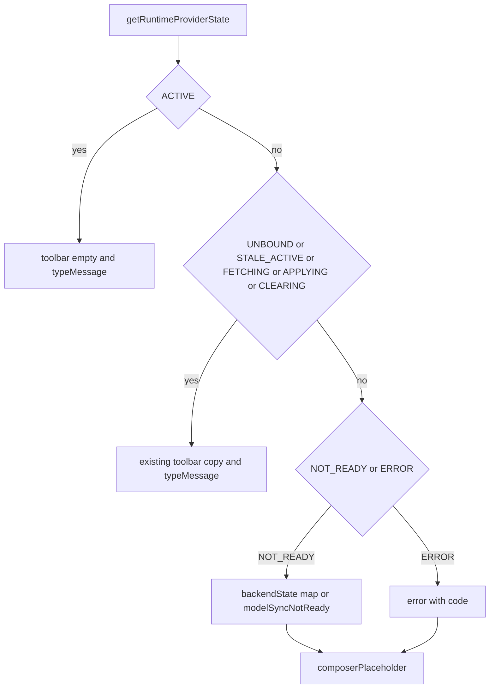

# Composer Status Placeholder 实现计划

依据 [docs/work/PRD-WORK-RUNTIME-PROVIDER-COMPOSER-STATUS-PLACEHOLDER-HOTFIX-v1.7.md](docs/work/PRD-WORK-RUNTIME-PROVIDER-COMPOSER-STATUS-PLACEHOLDER-HOTFIX-v1.7.md)，`status = APPROVED_FOR_PLAN`。实现以 `HF-G-01`、`HF-G-02` 与 `HF-D-01`～`HF-D-09` 为准（§0.1 只写到 `HF-D-08`，正文 `HF-D-09` 一并纳入：不按连接模式特判）。本计划 `plan_contract: smc.plan.v3.7`，claim `GES_NATIVE`。仓库内没有 `smc-plan-from-approved-prd-ponytail` 技能包，因此沿用 [`.cursor/plans/session_restore_splash_faae8f3f.plan.md`](.cursor/plans/session_restore_splash_faae8f3f.plan.md) 的字段。本计划状态是 `planned`，不是 `approved`。

基线：smc-copilot `06f10901`。不改 Bootstrap 合同、公开状态机、`gateLocalRuntimeSend`、`isRuntimeSettingsLocked`、诊断卡、zh-CN 及其他语言包。不碰 Providers 只读门控、`purgeRuntime` 幂等、`AuxiliaryTasksSection`。



## 现有入口

- 工具栏文案只来自 [`apps/work/src/renderer/src/screens/Chat/hooks/useModelConfig.ts`](apps/work/src/renderer/src/screens/Chat/hooks/useModelConfig.ts) 的 `runtimeStatusKey`。`ACTIVE` 返回 `chat.runtimeProvider.active`。`NOT_READY` 与 `ERROR` + `RUNTIME_BOOTSTRAP_UNAVAILABLE` 经 `syncFailureLeavesLocalChat` 返回空串。`showRuntimeRefresh` 只对 `STALE_ACTIVE` 和其他 `ERROR` 为真。hook 返回值没有占位符字段。
- [`apps/work/src/renderer/src/screens/Chat/ModelPicker.tsx`](apps/work/src/renderer/src/screens/Chat/ModelPicker.tsx) 在 `runtimeStatus` 非空时渲染 `.chat-runtime-provider-status`。空串不渲染。本计划不改这个条件。
- [`apps/work/src/renderer/src/screens/Chat/Chat.tsx`](apps/work/src/renderer/src/screens/Chat/Chat.tsx) 在约 2210 行把 `modelConfig.runtimeStatus` 传给 `ModelPicker`，约 2138 行渲染唯一的 `ChatInput`。Skill 模式、消息编辑、remote 共用这个输入框。
- [`apps/work/src/renderer/src/screens/Chat/ChatInput.tsx`](apps/work/src/renderer/src/screens/Chat/ChatInput.tsx) 第 805 行写死 `placeholder={t("chat.typeMessage")}`。`ChatInputProps` 没有占位符参数。
- 英文源在 [`apps/work/src/shared/i18n/locales/en/chat.ts`](apps/work/src/shared/i18n/locales/en/chat.ts) 的 `runtimeProvider`。`NOT_READY` 九个键和 `error` 已存在。`active` 只被 `useModelConfig.ts` 引用，删键安全。`NOT_READY_STATES` 在 [`apps/work/src/main/runtime-provider/runtime-provider-contract.ts`](apps/work/src/main/runtime-provider/runtime-provider-contract.ts) 第 13–23 行，且当前未导出。映射表写在 hook 内，不改主进程文件。
- 测试：[`useModelConfig.test.tsx`](apps/work/src/renderer/src/screens/Chat/hooks/useModelConfig.test.tsx) 的 `t` mock 只回传 key，忽略插值。[`ChatInput.test.tsx`](apps/work/src/renderer/src/screens/Chat/ChatInput.test.tsx) 用 `getByPlaceholderText("chat.typeMessage")`。[`ModelPicker.test.tsx`](apps/work/src/renderer/src/screens/Chat/ModelPicker.test.tsx) 还没有 runtime status 断言。

## 接口（不得另选）

- `composerPlaceholder: string` 由 `useModelConfig` 内 `t()` 译完再返回。
- `NOT_READY`：按 PRD HF-D-03 九个 `backendState` 取现有键；缺失或未知取 `chat.runtimeProvider.modelSyncNotReady`。
- `ERROR`（含 `RUNTIME_BOOTSTRAP_UNAVAILABLE`）：`t("chat.runtimeProvider.error", { code: errorCode || "" })`。
- 其余状态，含 `ACTIVE`、`STALE_ACTIVE`、`UNBOUND`、`FETCHING`、`APPLYING`、`CLEARING`：返回 `""`。
- `ChatInput` 新增可选 `placeholder?: string`，渲染 `placeholder={placeholder || t("chat.typeMessage")}`。空串与 `undefined` 都回退 `chat.typeMessage`。
- 不按 local / remote / SSH / skill 模式分支。textarea 已有内容时不另写隐藏逻辑。

## Todos

每个 Todo 的 `status` 从 `planned` 开始。只有对应验收跑出 Evidence 才能标 `verified`。

```yaml
id: hf-t1-hook-placeholder
requirement_refs: [HF-D-01, HF-D-02, HF-D-03, HF-D-04, HF-D-05, HF-D-09]
acceptance_refs: [A-HF-001, A-HF-002, A-HF-003, A-HF-004, A-HF-005, A-HF-006, A-HF-007]
files_or_symbols:
  - apps/work/src/renderer/src/screens/Chat/hooks/useModelConfig.ts#runtimeStatusKey
  - apps/work/src/renderer/src/screens/Chat/hooks/useModelConfig.ts#composerPlaceholder
  - apps/work/src/renderer/src/screens/Chat/hooks/useModelConfig.test.tsx
implementation_goal: ACTIVE 的 runtimeStatusKey 返回空串。新增 NOT_READY backendState 映射与 ERROR 占位符，挂到返回值 composerPlaceholder。工具栏对 STALE_ACTIVE、过渡期和其他 ERROR 保持原样；NOT_READY 与 RUNTIME_BOOTSTRAP_UNAVAILABLE 的工具栏继续为空，Refresh 只在现有条件出现。不改发送门和模型过滤。
preconditions: 现有 NOT_READY / UNBOUND / bootstrap-unavailable 用例的 runtimeStatus 仍为空。
state_transition: ACTIVE 从工具栏就绪文案变成无文案且占位符为空。NOT_READY 与 ERROR 从无 Composer 提示变成仅占位符有文案。
side_effect_scope: 仅 hook 派生字段与其测试。不写主进程、不改 ModelPicker 渲染条件。
failure_cases: [未知 backendState 落到 modelSyncNotReady, ERROR 无 errorCode 时 code 为空串]
verification: 扩展 useI18n mock，使带 code 的调用可断言插值，且不破坏现有断言。apps/work 下跑 useModelConfig.test.tsx，覆盖 ACTIVE、MODEL_LIST_EMPTY、未知 backendState、RUNTIME_GATEWAY_RESTART_FAILED、RUNTIME_BOOTSTRAP_UNAVAILABLE、STALE_ACTIVE、UNBOUND。
status: planned
evidence: pending
```

```yaml
id: hf-t2-chatinput-wire
requirement_refs: [HF-D-02, HF-D-08]
acceptance_refs: [A-HF-001, A-HF-002, A-HF-006]
files_or_symbols:
  - apps/work/src/renderer/src/screens/Chat/ChatInput.tsx#ChatInputProps
  - apps/work/src/renderer/src/screens/Chat/Chat.tsx
  - apps/work/src/renderer/src/screens/Chat/ChatInput.test.tsx
implementation_goal: ChatInput 接收译后 placeholder。Chat 把 modelConfig.composerPlaceholder 传给这一处 ChatInput。未传入或空串时仍显示 chat.typeMessage。
preconditions: hf-t1 已提供 composerPlaceholder。
state_transition: 不可用状态的提示从输入框占位符可见；可用与其余状态占位符不变。
side_effect_scope: Chat 主 Composer 唯一输入框，含 skill 模式复用同一组件。已有输入内容不处理。
failure_cases: [空字符串不得覆盖默认占位符]
verification: ChatInput.test.tsx 断言传入非空 placeholder 时渲染该字符串，未传入时仍是 chat.typeMessage。现有 getByPlaceholderText("chat.typeMessage") 用例保持通过。
status: planned
evidence: pending
```

```yaml
id: hf-t3-en-and-toolbar-guard
requirement_refs: [HF-D-01, HF-D-06, HF-D-07, HF-D-08]
acceptance_refs: [A-HF-001, A-HF-008]
files_or_symbols:
  - apps/work/src/shared/i18n/locales/en/chat.ts
  - apps/work/src/renderer/src/screens/Chat/ModelPicker.test.tsx
implementation_goal: 删除 en 的 runtimeProvider.active。ModelPicker 在 runtimeStatus 为空时不渲染 .chat-runtime-provider-status；非空时仍渲染。诊断卡、zh-CN、主进程零改动。
preconditions: hf-t1 已去掉 active 的唯一引用。
state_transition: 英文源不再包含 Enterprise models are ready。
side_effect_scope: 仅 en/chat.ts 的 active 键与 ModelPicker 回归测试。
failure_cases: [删除 active 后若仍有引用则类型检查失败]
verification: 全库检索 chat.runtimeProvider.active 为 0。ModelPicker.test.tsx 覆盖空与非空 runtimeStatus。apps/work 下一起跑 useModelConfig.test.tsx、ChatInput.test.tsx、ModelPicker.test.tsx。
status: planned
evidence: pending
```
