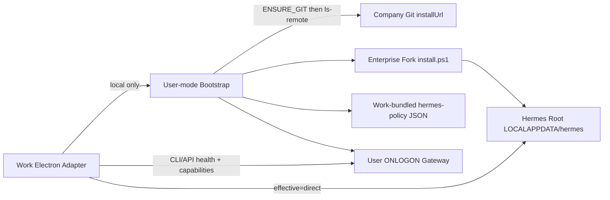

# Hermes Native Enterprise Runtime v2.1.1 Implementation Plan

## Approved PRD / Workspace

- PRD: [docs/architecture/PRD-WORK-Hermes-Native-Enterprise-Fork-Runtime-v2.0.0.md](docs/architecture/PRD-WORK-Hermes-Native-Enterprise-Fork-Runtime-v2.0.0.md) (`version: 2.1.1`, `APPROVED_FOR_PLAN`)
- ADR: [docs/adr/ADR-038-hermes-native-enterprise-lifecycle.md](docs/adr/ADR-038-hermes-native-enterprise-lifecycle.md)
- Implementation workspace: **`work/prd-v6.0 @ 1ad1af60a2ab13d93da92cb06cb3b7aff7a08e31`**
- Hermes fork working copy: `e:\git\hermes-agent` (origin `http://git.superic.com/aiplatform/hermes-agent.git`)
- Normative overrides: PRD §0.2 > §0.1 > body. Capability SOT remains [`apps/work/src/main/run-stream.ts`](apps/work/src/main/run-stream.ts) `supportsHermesRunsTransport` (do not copy feature names into tests/docs).
- Out of scope: Phase 6 migration / `MIGRATION_REQUIRED`; Salt trees; hardcoding Git URL outside `release/client-release.yaml#hermes.source`.

## Target architecture

## Phase map (PRD §30)

| Phase | Outcome |
|---|---|
| 0 | Release config v2 + identity/error contracts frozen in repo |
| 1 | Enterprise fork: RepoUrl, no GitHub ZIP, official-source reader, smc-managed extras |
| 2 | Work Native adapter: LOCALAPPDATA home OK; observed/effective control-owner |
| 3 | Root vs Active Profile Home; settings → userData; named-port KEEP |
| 4 | Bootstrap mutex + policy merge + gateway install + Repair + INSTALLING blocks chat |
| 5 | Release `all` disconnects hermes/installer/runtime/opsi stages (tree may remain) |
| 6 | CANCELLED — do not implement |
| 7 | Synthetic + Golden Consumer + failure injection |
| 8 | Physical delete of managed bundle / WiX / OPSI Hermes **only after Phase 7 Required AC PASS** |

---

## T0 — Release contract freeze (Phase 0)

**Baseline today:** [`release/client-release.yaml`](release/client-release.yaml) is `smc.client-release.config.v1` (`hermes.repo`, `opsi.*`). Loader [`tools/release/client/release_config.py`](tools/release/client/release_config.py) accepts **only v1**.

Replace YAML + loader to **v2** per PRD §9.1:

- Required: `hermes.distribution=enterprise-native`, `hermes.source.installUrl`, ONE-OF `repositoryHttp|Https|Ssh`, `allowedHosts`, `defaultBranch`, `approvedCommit`, `hermes.update.policy=follow-defaultBranch`, `hermes.bootstrap.authMode=anonymous-internal`, compatibility min/tested versions, gateway host/port, `hermes.policy.version`.
- Golden: HTTP-only `installUrl=http://git.superic.com/aiplatform/hermes-agent.git` (omit fake HTTPS/SSH).
- Validator: missing/invalid → `RELEASE_CONFIG_INVALID` (stop accepting v1 in production path).
- Generate `hermes-native-manifest.json` provenance stub (digest of install.ps1 + source identity).
- Keep `run-stream.ts` as capability SOT; YAML must not list required feature names.
- Policy input stays [`release/hermes-runtime-profiles.yaml`](release/hermes-runtime-profiles.yaml)#smc-managed extras L20–27 (already match fork `pyproject` optional-deps names).

**Verify:** unit parse of HTTP-only YAML PASS; YAML missing `installUrl` FAIL; v1 YAML rejected by production loader.

---

## T1 — Enterprise Hermes Fork (Phase 1, repo `e:\git\hermes-agent`)

Patch fork (not Salt/OPSI trees). Grounded touchpoints:

1. [`scripts/install.ps1`](e:/git/hermes-agent/scripts/install.ps1):
   - Add `-RepoUrl` (param block L15–76 today has none).
   - Replace hardcoded NousResearch `$RepoUrlSsh`/`$RepoUrlHttps` (L386–387) and clone path (L2365–2380) with enterprise `installUrl`.
   - **Remove** GitHub ZIP fallback L2383–2438.
   - KEEP `-Stage git` / `Stage-Git` (L4690/4728) for ENSURE_GIT; KEEP `-Commit` pin for approvedCommit.
2. [`hermes_cli/update_cmd.py`](e:/git/hermes-agent/hermes_cli/update_cmd.py): replace `OFFICIAL_REPO_URLS` (L2842–2849); disable `_add_upstream_remote` / `_sync_with_upstream_if_needed` (L2869–3097); kill ZIP update pattern (L1928). Read Hermes Root `official-source.json`.
3. [`hermes_cli/banner.py`](e:/git/hermes-agent/hermes_cli/banner.py): replace `_UPSTREAM_REPO_URL` / `_github_compare_behind` (L141–211, L242–307) with Official Identity only.
4. Native setup: exact
   `uv sync --extra messaging --extra mcp --extra web --extra google --extra voice --extra edge-tts --extra hindsight`
   plus Node `@modelcontextprotocol/server-filesystem@2025.8.21`; core-only after `--extra all` fail ≠ PASS (A-FORK-003).
5. Root resolution for `official-source.json`: if `HERMES_HOME` ends with `\profiles\<name>`, Root = ancestor; else Root = `HERMES_HOME` (C-003 / A-OFFICIAL-001).
6. [`gateway_windows.py`](e:/git/hermes-agent/hermes_cli/gateway_windows.py) `get_task_name()` L294–307 already yields `Hermes_Gateway_<profile>` — **KEEP**; no rename work in T1.

**Verify:** fork unit/E2E fixture + public-upstream negative (zero NousResearch requests).

---

## T2 — Work Native runtime + control-owner (Phase 2)

**Baseline today:**

- Adapter: [`runtime-manager.ts`](apps/work/src/main/runtime/runtime-manager.ts) wires **LegacyLocalRuntimeAdapter** only; build-info `legacy-local` / `managed-local-v1`. No `native-hermes-runtime-backend.ts`.
- [`legacy-local-runtime-adapter.ts`](apps/work/src/main/runtime/legacy-local-runtime-adapter.ts) L71–74 / L152–158: `isForbiddenSelfInstallHome` → `configuration_error`. Test lock: [`tests/runtime-adapter.test.ts`](apps/work/tests/runtime-adapter.test.ts) L305–328 (must flip).
- [`hermes-runtime-config.ts`](apps/work/src/main/runtime/hermes-runtime-config.ts) L28–31: Windows default home still `C:\ProgramData\SMC\Hermes`.
- Control owner: [`shared/runtime/control-owner.ts`](apps/work/src/shared/runtime/control-owner.ts) L19–21 + [`hermes/control-owner.ts`](apps/work/src/main/hermes/control-owner.ts) L43–82 — single `owner`; no `{ observed, effective }`.
- IPC [`register.ts`](apps/work/src/main/ipc/register.ts): Doctor/Update blocked by `isExternallyManagedControlOwner()` L786–799; `get-control-owner` L710 returns snapshot only; local `start-gateway` → `MANAGED_GATEWAY_MESSAGE` (L1796–1814) — probe-only, not F-008 start.
- UI: [`RuntimePane.tsx`](apps/work/src/renderer/src/components/settings/RuntimePane.tsx) / [`ConnectionErrorScreen.tsx`](apps/work/src/renderer/src/screens/ConnectionError/ConnectionErrorScreen.tsx) treat `managed-local-v1` as self-install-unreachable and salt/opsi as enterprise-waiting; tests expect that (must rewrite for effective `direct`).

**Change:**

1. **ADD** [`native-hermes-runtime-backend.ts`](apps/work/src/main/runtime/native-hermes-runtime-backend.ts); make it production local default in `runtime-manager` / build-info (REPLACE legacy path).
2. Delete LOCALAPPDATA forbid (A-RUNTIME-003); default Root `%LOCALAPPDATA%\hermes` in locator/config/paths/CLI runner; pin process `HERMES_HOME` to Root before profile switch (F-002).
3. `ensureReady` must be able to invoke Native gateway start recovery when health fails (F-008), not probe-only.
4. Control owner (C-005 / A-OWNER-001):
   - Extend shared types with `{ observed, effective }`.
   - Production: observed may be `opsi|salt`; **effective always `direct`**; `runtime` remains explicit lab.
   - IPC Update/Doctor/version gates use **effective**; Doctor MAY warn on observed.
   - RuntimePane / ConnectionErrorScreen: do not disable local capabilities on observed opsi/salt.
5. Extend/flip tests: `runtime-adapter`, `hermes-control-owner`, `enterprise-opsi-mode`, `enterprise-salt-mode`, RuntimePane/ConnectionErrorScreen; update guards `check-runtime-adapter-contract.mjs` / salt-mode no-spawn scripts for observed/effective semantics.

**Verify:** A-RUNTIME-001..003, A-OWNER-001, A-GW-001.

---

## T3 — State separation (Phase 3)

**Baseline:** [`config.ts`](apps/work/src/main/config.ts) `desktopConfigFile()` L73–74 = `join(HERMES_HOME, "desktop.json")` (Work connection settings in Hermes home). `runtime.json` already under Electron userData (`hermes-runtime-config.ts` L68–71).

**Change:**

- Profile semantics in [`utils.ts`](apps/work/src/main/utils.ts) / [`hermes.ts`](apps/work/src/main/hermes.ts): Hermes Root constant; Active Profile Home may be `Root\profiles\<name>`; CLI `-p <name>` + env Home = Active Profile Home (A-PROFILE-001..003). `ensureApiServerConfig` / `buildGatewayEnv` already bind `HERMES_HOME` — keep that pattern with corrected Root.
- KEEP [`gateway-ports.ts`](apps/work/src/main/gateway-ports.ts) `getProfilePort` L98–118 (8642 reserved for default; named allocates `platforms.api_server.extra.port`).
- Move Work settings SOT to Electron `userData` (`work-settings.json`); stop using Hermes `desktop.json` as Work SOT (A-CONFIG-001). Extend [`tests/connection-config-security.test.ts`](apps/work/tests/connection-config-security.test.ts).
- Plugin root under Native Home via Native Plugin CLI path (skills/plugin modules).

**Verify:** A-PROFILE-*, A-CONFIG-001.

---

## T4 — Bootstrap + Policy + Gateway + Repair (Phase 4)

**Baseline:** [`app/start.ts`](apps/work/src/main/app/start.ts) L63–94 logs control owner only — **no** Bootstrap / mutex / INSTALLING. Renderer `App.tsx` connect path is auth + `runtime.connect()` only.

ADD Work-owned bootstrap module (triggered from `app/start.ts` + IPC), contract C-007:

1. Only `connectionMode=local` (default); remote/ssh → zero local mutation (A-INSTALL-006).
2. PowerShell: `%SystemRoot%\System32\WindowsPowerShell\v1.0\powershell.exe` with `-NoProfile -NonInteractive -ExecutionPolicy Bypass -File <bundled install.ps1>`.
3. Sequence: PRECHECK → **ENSURE_GIT** (`-Stage git`) → ls-remote with that git → install (`-RepoUrl installUrl -Commit approvedCommit`) → write Root `official-source.json` (§9.3 atomic tempfile+rename) → policy apply (§9.4 table only) → `hermes gateway install` / start → health + `supportsHermesRunsTransport`.
4. Mutex `Local\SMC-Work-HermesBootstrap-<WindowsUserName>`; timeout 1800s kill tree; log under `userData/logs/hermes-bootstrap-<operationId>.log` redacted (A-INSTALL-004/005).
5. INSTALLING/ABSENT/FAIL: main window OK, local chat blocked (A-INSTALL-003).
6. Named profile first use: `getProfilePort` → `hermes -p <name> gateway install` → start if health≠200; delete → `gateway uninstall` (A-GW-003/004). Work exit must not stop Gateway (A-GW-002).
7. Wrong origin: `HERMES_REPO_ORIGIN_MISMATCH`; Repair only after explicit confirm (A-REPAIR-001). No silent `git remote set-url`.
8. Bundle Work-packaged `hermes-policy/<version>.json` generated from [`release/hermes-runtime-profiles.yaml`](release/hermes-runtime-profiles.yaml)#smc-managed using §9.4 map only (`managed-node` → Native node.exe; paths under Hermes Root).

**Verify:** A-INSTALL-001..006, A-GW-001..004, A-POLICY-001..003, A-REPAIR-001, A-SOURCE-*, A-OFFICIAL-001, A-SEC-001..003.

---

## T5 — Release pipeline disconnect (Phase 5)

**Baseline today:**

- [`scripts/build-client-release.ps1`](scripts/build-client-release.ps1) L2–3 stages include `hermes`, `hermes-installer`, `runtime`, `opsi-stage`, `opsi-package`; forwards `--hermes-zip` / `--opsi-package` (L52–63).
- [`tools/release/client/build_client_release.py`](tools/release/client/build_client_release.py): `STAGES` L36–47; `assemble` **requires** `--work-dist --hermes-zip --opsi-package` (L650–652); `all`/`build_all` still builds managed bundle / OPSI (L489–520, L675–689). Paths: `MAKEPACKAGE` → `infra/opsi/products/smc-hermes-agent/...` (L48); `HERMES_INSTALLER_SCRIPT` → WiX installer (L49).

**Change:**

- Production stages: `preflight`, `work`, **`hermes-bootstrap`** (NEW: pin install.ps1 + write `hermes-native-manifest.json`), `assemble`, `verify`, `all`.
- `all` MUST NOT invoke `hermes`, `hermes-installer`, `runtime`, `opsi-stage`, `opsi-package`, `build_managed_bundle`, or `makepackage.py`.
- `assemble` MUST NOT require `HermesZip` / `OpsiPackage` / `Wheelhouse` / `NodeRoot` / `OpsiTooling` / `OpsiClientInstaller`.
- Ship Work + bundled enterprise `install.ps1` + `hermes-native-manifest.json` only.
- Source trees under `tools/release/hermes/`, `infra/windows/hermes-agent/installer`, `infra/opsi/products/smc-hermes-agent` **MAY remain** for lab until T7, but MUST NOT be called by main pipeline (A-RELEASE-001/002).

**Verify:** stage log + artifact inventory; forbidden payload count = 0.

---

## T6 — Pilot evidence (Phase 7)

- Synthetic fixtures for authMode, host allowlist, mutex, remote skip, capability miss (A-COMPAT-001 mirrors `supportsHermesRunsTransport`).
- Real Golden Consumer: Work @ `1ad1af60` + enterprise Git + clean Windows greenfield → READY; Repair path; failure injection mid-clone/policy/gateway.
- Evidence digests only; no credential-bearing URLs.

---

## T7 — Physical removal (Phase 8, gated)

Only after Phase 7 Required AC all PASS:

- Delete `tools/release/hermes/build_runtime.py` production path / managed bundle entrypoints
- Delete `infra/windows/hermes-agent/installer`
- Delete `infra/opsi/products/smc-hermes-agent`

Do not run T7 early. Do not implement Phase 6.

---

## Execution rules for coding agents

- One production owner per capability; REPLACE implies REMOVE under Phase 8 conditions.
- If any Todo cannot uniquely resolve SOT/behavior → emit `SPEC_SEMANTIC_GAP` and stop that Todo.
- Prefer TDD against AC IDs listed in PRD §20 / §25.
- Commit policy: only when user asks; review-staged before commit.
