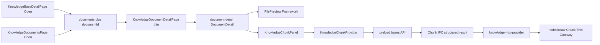

# DocumentDetail Hybrid v2.0 Implementation Plan

## Approved PRD / Workspace

- PRD: [docs/knowledge/PRD-WORK-KNOWLEDGE-DOCUMENT-DETAIL-HYBRID-v2.0.md](docs/knowledge/PRD-WORK-KNOWLEDGE-DOCUMENT-DETAIL-HYBRID-v2.0.md) (`version: 2.0`, `status: APPROVED_FOR_PLAN`)
- Conflict authority: **§1.4 Grilling Decision Lock** > body（含 REQ-NAV `[Open]`、无 mock、Back=`onBack`、resize MUST、Chunk-only IPC sanitize）
- Tree: `apps/work` only；不改 FilePreview Framework 公共合同；不碰 Salt
- Out of scope: RAGFlow iframe、Chunk add/delete/content edit、本地 keyword filter、Hybrid 上 Build/retrieval、产品 `dataMode=mock` 数据集、非 Chunk IPC 全量 retrofit、Upload drawer Open

## Target architecture



## Locked decisions (do not re-decide)

- Base 文件表 Actions **`[Open]`**（`knowledge.host.open`）；fileName 静态；保留 Activate/Reparse/Archive
- Target: `{ page: "documents", params: { knowledgeBaseId, documentId: file.id } }`；`documentId` ≡ `sourceFileId`
- Back = 路由栈 `onBack()`
- Hybrid 默认 45/55；**MUST** 可拖拽；失败降级固定 45/55；无跨会话持久化
- Chunk IPC 结构化错误 **仅** `listFileChunks` / `setFileChunkAvailability`
- 无产品 mock Chunk；测试可注入 facade；Golden **只认 live**
- Hybrid **不**展示 Build/retrieval；`available === null` 禁止 PATCH
- 模块根路径：`apps/work/components/knowledge/document-detail/`

## Key code leverage

| Area | Anchor |
|---|---|
| Shared IPC contract | [knowledge-base-ipc.ts](apps/work/src/shared/knowledge/knowledge-base-ipc.ts) — `KNOWLEDGE_BASE_IPC_CHANNELS` + `HermesKnowledgeBasesAPI` additive |
| Main handlers | [register-knowledge-base-ipc.ts](apps/work/src/main/knowledge/register-knowledge-base-ipc.ts) `registerKnowledgeBaseIpcHandlers`；既有模式 `requireAuth` → 可选 mock → `getKnowledgeHttpProvider()` → `sanitizeIpcError`（仅 code）。Chunk 两通道 **不走** 该 throw 路径，改返回 `KnowledgeChunkIpcResult` |
| Main wiring | [register.ts](apps/work/src/main/ipc/register.ts) 已调用 `registerKnowledgeBaseIpcHandlers(ipcMain)` |
| HTTP | [knowledge-http-provider.ts](apps/work/src/main/knowledge/knowledge-http-provider.ts) — `requestJson` / `getFile` 模板；扩展 `KnowledgeHttpProvider` 接口 + `createKnowledgeHttpProvider` |
| Schema | [knowledge-schema.ts](apps/work/src/main/knowledge/knowledge-schema.ts) — `unwrapApiData` + fail-closed `parse*`；新增 `parse*Chunk*` |
| Preload | [knowledge-job-api.ts](apps/work/src/preload/knowledge-job-api.ts) `createKnowledgeJobApi().bases` — 今日为 thin `ipcRenderer.invoke`（无 unwrap）。Chunk 两方法须在 preload **显式 unwrap** `{ok,error}` → Renderer `KnowledgeFacadeError`；暴露于 `hermesAPI.knowledgeJobs.bases`（[preload/index.ts](apps/work/src/preload/index.ts)） |
| Facade | [use-knowledge-facade.ts](apps/work/src/shared/knowledge/use-knowledge-facade.ts) — `probe.bases` from inject / `hermesAPI.knowledgeJobs.bases` |
| Base Open 模板 | [KnowledgeDocumentsPage.tsx](apps/work/src/renderer/src/screens/Knowledge/pages/KnowledgeDocumentsPage.tsx) ~303–342（`knowledge.host.open`） |
| Base 接线点 | [KnowledgeBaseDetailPage.tsx](apps/work/src/renderer/src/screens/Knowledge/pages/KnowledgeBaseDetailPage.tsx) Actions `flex` ~517–557；`_onNavigate` → `onNavigate` |
| Host switch | [KnowledgePages.tsx](apps/work/src/renderer/src/screens/Knowledge/KnowledgePages.tsx) `case "documents"` + `documentId` |
| Fat screen → thin | [KnowledgeDocumentDetailPage.tsx](apps/work/src/renderer/src/screens/Knowledge/pages/KnowledgeDocumentDetailPage.tsx) — load/actions/`FilePreview`/sheets 迁入 `components/knowledge/document-detail/`（目录尚不存在） |
| Test doubles | [tests/helpers/knowledge-bases-api.ts](apps/work/tests/helpers/knowledge-bases-api.ts) — 扩展 `makeBasesApi` / `unusedKnowledgeBaseOps` |
| Tests | [knowledge-bases-page.test.ts](apps/work/tests/knowledge-bases-page.test.ts)、[knowledge-documents-page.test.ts](apps/work/tests/knowledge-documents-page.test.ts)、[knowledge-page-host.test.ts](apps/work/tests/knowledge-page-host.test.ts)、[knowledge-preview-chain-trace.test.ts](apps/work/tests/knowledge-preview-chain-trace.test.ts)、[knowledge-http-provider.test.ts](apps/work/src/main/knowledge/knowledge-http-provider.test.ts)、[knowledge-base-ipc.test.ts](apps/work/src/shared/knowledge/knowledge-base-ipc.test.ts) |

**Resize 实现选定：** 仓库无 `react-resizable-panels`；Hybrid 用模块内 pointer-drag divider（会话 `useState` 比例，钳制 30–70%）；`<960px` 垂直堆叠；拖拽不可用时固定 45/55。不新增依赖。

**Mock 路径：** Chunk Main handlers **禁止** `mockFacade()` 分支；未认证/无 live transport → 结构化错误；不扩展产品 mock 集。既有非 Chunk mock 分支保持不动（拆除另项）。

**T5 澄清（相对 PRD「Preload unwrap」）：** 非 Chunk bases 方法保持 thin invoke；仅 Chunk 两通道在 preload 做 envelope unwrap，避免误伤现有 error=`Error(code)` 契约。

## Migration sequence (todos)

### T1 — Shared Chunk types / channels
- **Refs:** REQ-API-001, §10.1, §1.4 IPC
- Add to [knowledge-base-ipc.ts](apps/work/src/shared/knowledge/knowledge-base-ipc.ts): `KnowledgeFileChunk*`, inputs/results, channels `listFileChunks` / `setFileChunkAvailability`, `KnowledgeChunkIpcResult<T>`, extend `HermesKnowledgeBasesAPI`
- Extend [tests/helpers/knowledge-bases-api.ts](apps/work/tests/helpers/knowledge-bases-api.ts) stubs
- Unit: type/channel constants smoke ([knowledge-base-ipc.test.ts](apps/work/src/shared/knowledge/knowledge-base-ipc.test.ts))

### T2 — Schema parsers
- **Refs:** REQ-API-002, REQ-API-003, §10.3
- [knowledge-schema.ts](apps/work/src/main/knowledge/knowledge-schema.ts): fail-closed parse Chunk page/item；`available` boolean|null；reject provider IDs；pageSize 1–100
- Unit: golden JSON fixtures + invalid → `KNOWLEDGE_CONTRACT_INVALID`

### T3 — HTTP GET/PATCH
- **Refs:** REQ-API-002, REQ-API-003, REQ-SEC-001
- [knowledge-http-provider.ts](apps/work/src/main/knowledge/knowledge-http-provider.ts):
  - `GET /api/v1/source-files/{id}/chunks?page&page_size&keywords`
  - `PATCH .../chunks/{chunkId}` body **only** `{ file_version_id, available }`
- Defaults page=1/pageSize=50；keywords trim/omit empty/max 200；no auto-retry non-idempotent PATCH
- Unit: [knowledge-http-provider.test.ts](apps/work/src/main/knowledge/knowledge-http-provider.test.ts)

### T4 — Structured Chunk IPC only
- **Refs:** REQ-IPC-001, P-004, §1.4
- [register-knowledge-base-ipc.ts](apps/work/src/main/knowledge/register-knowledge-base-ipc.ts): 仅两 Chunk handler 返回 `{ ok, data|error }`（保留 code/httpStatus/messageKey/retryable/operationId）；**不**改既有 `sanitizeIpcError` 全量行为
- Chunk handlers MUST NOT 进入 `isMockMode()`/`mockFacade()` 成功路径
- Unit: 403/409/501/503 shape preservation

### T5 — Preload Chunk unwrap only
- **Refs:** REQ-API-001, REQ-IPC-001
- [knowledge-job-api.ts](apps/work/src/preload/knowledge-job-api.ts): 为 Chunk 两方法 `invoke` → unwrap `KnowledgeChunkIpcResult` → throw Renderer `KnowledgeFacadeError`；其余 bases 方法保持 thin invoke
- Unit: unwrap / invalid envelope → contract invalid

### T6 — KnowledgeChunkProvider + panel state
- **Refs:** REQ-CHUNK-001..005, REQ-STATE-001, REQ-ERR-001, §9.2
- New under `apps/work/components/knowledge/document-detail/`: provider/hook owning LOADING/READY/EMPTY/STALE/WAITING_PARSE/VERIFYING/ERROR/READ_ONLY_UNSUPPORTED；pageSize 10/25/50/100；search debounce 300；no optimistic available；null available → disabled toggle
- Unit: state transitions + discard stale generation

### T7 — DocumentDetail Hybrid module
- **Refs:** REQ-ARCH-001, REQ-UI-001/002, REQ-PREV-001, REQ-STATE-002/003, REQ-POLL-001, NON-GOAL-015
- Module exports `DocumentDetail`：Header（Back=`onBack`、Info/Versions/Parse drawers、Reparse/Archive/Delete）、Source pane=`FilePreview`、Chunk pane；无 Build/retrieval UI
- Migrate load/actions/drawers from fat [KnowledgeDocumentDetailPage.tsx](apps/work/src/renderer/src/screens/Knowledge/pages/KnowledgeDocumentDetailPage.tsx)
- Parse poll: `listFileVersions` 2s→5s schedule；unmount cancel；Reparse → WAITING_PARSE（同 version id 亦清 current）
- RTL: panes, resize bounds, preview/chunk failure isolation

### T8 — Base Detail `[Open]`
- **Refs:** REQ-NAV-001, A-NAV-001, §1.4
- [KnowledgeBaseDetailPage.tsx](apps/work/src/renderer/src/screens/Knowledge/pages/KnowledgeBaseDetailPage.tsx): restore `onNavigate`；Actions 加 Open（对齐 Documents 的 `knowledge.host.open`）；fileName 静态；`data-testid` 建议 `knowledge-base-file-open-${file.id}`
- Test: extend [knowledge-bases-page.test.ts](apps/work/tests/knowledge-bases-page.test.ts) — Open → exact route params；fileName 无导航

### T9 — Thin route adapter
- **Refs:** REQ-ARCH-001, A-ARCH-001/002
- [KnowledgeDocumentDetailPage.tsx](apps/work/src/renderer/src/screens/Knowledge/pages/KnowledgeDocumentDetailPage.tsx): 只做 facade + param 校验 + `<DocumentDetail />`；禁止 page 内 import ChunkList/ChunkItem
- Update [knowledge-documents-page.test.ts](apps/work/tests/knowledge-documents-page.test.ts)、[knowledge-page-host.test.ts](apps/work/tests/knowledge-page-host.test.ts)、preview-chain for adapter + Hybrid smoke

### T10 — i18n / regression / evidence / Golden
- **Refs:** Release Gate §31, REQ-OBS-001, §1.4 MOCK/GOLDEN, DoD
- Locale keys（chunkResult、waitingParse、versionStale、availabilityUnknown 等）
- Focused vitest + existing Knowledge regression（`apps/work`: `npm test` / `vitest run`）
- Evidence JSON（commit-bound）；Golden Consumer **live-only** checklist（假数据不计 PASS）
- 不拆除既有 mock 工程（deprecated，另项）

## Verification commands (implement phase)

```text
cd apps/work && npx vitest run tests/knowledge-bases-page.test.ts tests/knowledge-documents-page.test.ts tests/knowledge-page-host.test.ts
cd apps/work && npx vitest run src/main/knowledge/knowledge-http-provider.test.ts src/shared/knowledge/knowledge-base-ipc.test.ts
# plus new document-detail / chunk / ipc structured tests as added
# Golden: live nodeskclaw only — record evidence; mock MUST NOT PASS
```

## Explicit non-goals for this plan

- 拆除 Knowledge `dataMode=mock` 产品路径
- 全量 Knowledge IPC sanitize 迁移
- FilePreview Framework 语义变更
- Upload drawer Open / 新 `bases+documentId` 路由
