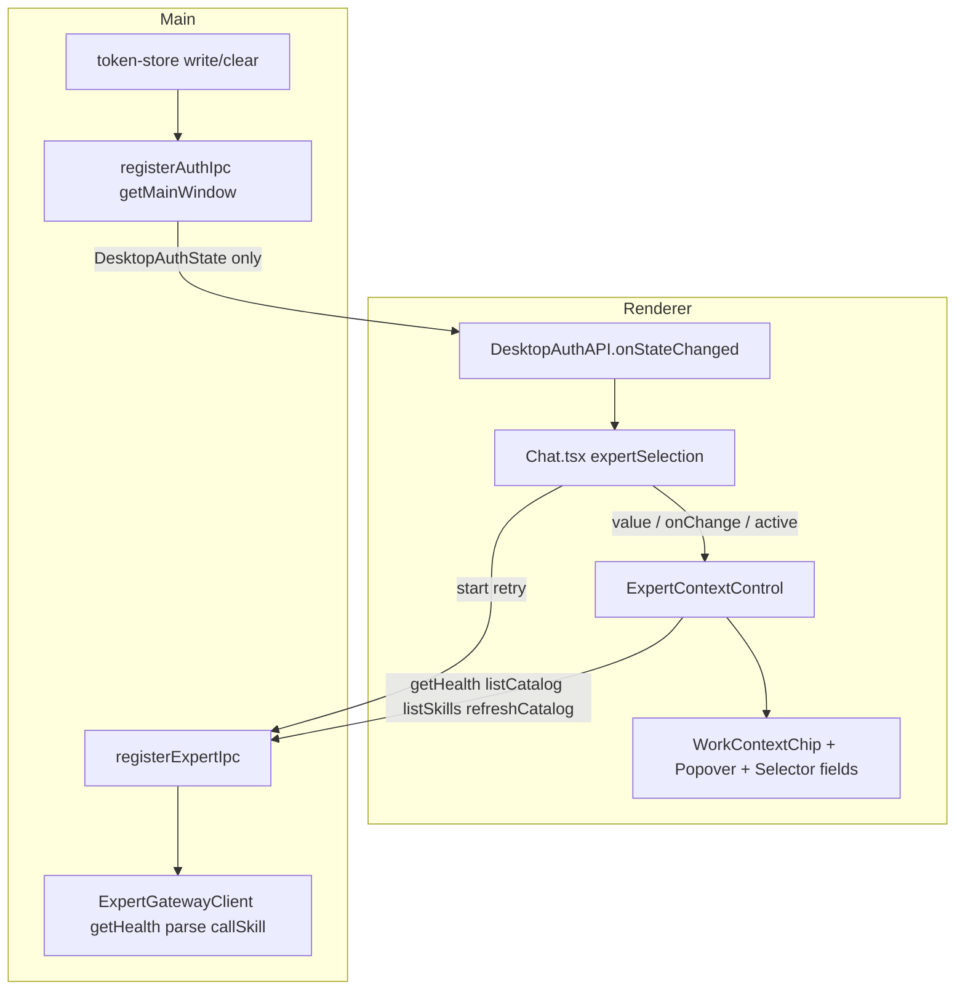

# Expert Context Selector Implementation Plan

## Approved PRD

[docs/work/PRD-WORK-v3.0.1-expert-context-selector.md](docs/work/PRD-WORK-v3.0.1-expert-context-selector.md)（`status: APPROVED`，`review_verdict: PASS`；`validate_prd.py --require-approved` 已通过）

落地文件（确认后写入并跑 `validate_plan.py`）：[`.cursor/plans/work-expert-v3.0.1-expert-context-selector.plan.md`](.cursor/plans/work-expert-v3.0.1-expert-context-selector.plan.md)

## Scope

在 `apps/work` 内完成 Expert Context 选择 / 展示 / health / 静默调用门禁。功能迁移只消费 WORK-EXPERT-CONTRACT v1.0.2 的 `GET /api/v1/expert/health` 与 MCP annotations；Hermes Task / SSE / Artifact / Queue / continuation Owner **KEEP**。

源码与 PRD **无冲突**：`ChatProps.active`、`openAuthorizedGet`（`redirect: "error"` + `withAuthRetry`）、`toPublicState`、`assertAuthGeneration` 的 `user:${id}` 形态均已存在。外部 tag `work-expert-contract-v1.0.2`（peeled `ed408c354539eab3f4cabb119fbbc3df4b95efad`）的 `SHA256SUMS` 可拉取，Consumer Lock 可实施。

不在本 Plan：`loadGate=unmet`、Provider release/CI、Desktop Chip import、平行 gateway / IPC wrapper / Context store。

## Immediate Read

Todo 1 开始前只读：

- [`apps/work/src/shared/expert.ts`](apps/work/src/shared/expert.ts) — `WORK_EXPERT_CONTRACT_VERSION`（现 `"1.0.1"`）、`ExpertCatalogItem` / `ExpertSkillItem`、`EXPERT_IPC_CHANNELS`、`ExpertApi`
- PRD Behaviour 中 `canSilentCallExpertSkill` 五条件与 `consumer-lock.json` 字段（已在 APPROVED PRD 冻结）

## Triggered Read

- **Auth push 真正动手时：** [`token-store.ts`](apps/work/src/main/auth/token-store.ts) `writeStoredSession` / `clearStoredSession`；[`auth-ipc.ts`](apps/work/src/main/auth/auth-ipc.ts) `registerAuthIpc`；[`auth-api.ts`](apps/work/src/preload/auth-api.ts)；[`auth-contract.ts`](apps/work/src/shared/auth/auth-contract.ts) `DesktopAuthAPI` / `toPublicState`；[`start.ts`](apps/work/src/main/app/start.ts) L75–78；[`ensure-access-token.ts`](apps/work/src/main/auth/ensure-access-token.ts) `performRefresh`；preload `onUpdateStateChanged` 退订模式（[`preload/index.ts`](apps/work/src/preload/index.ts) L1378–1390）
- **Gateway 门禁动手时：** [`expert-gateway-client.ts`](apps/work/src/main/expert/expert-gateway-client.ts) `parseCatalogTools` L173–193、`parseSkillTools` L195–210、`callSkill` L451–470、`openAuthorizedGet` L539–553、`readJson` L126–134（**不得**用于 health）、[`expert-gateway-client.test.ts`](apps/work/src/main/expert/expert-gateway-client.test.ts)
- **IPC 动手时：** [`expert-ipc.ts`](apps/work/src/main/expert/expert-ipc.ts) `listCatalog` handler 模式；[`expert-api.ts`](apps/work/src/preload/expert-api.ts)
- **Control UI 动手时：** [`ExpertSelector.tsx`](apps/work/src/renderer/src/modules/expert/ExpertSelector.tsx)、[`expert.css`](apps/work/src/renderer/src/modules/expert/expert.css)、[`index.ts`](apps/work/src/renderer/src/modules/expert/index.ts)；ChatInput `.chat-input-toolbar`（密度测量）；Desktop Chip **仅参考、禁止 import**
- **Chat 路由动手时：** [`Chat.tsx`](apps/work/src/renderer/src/screens/Chat/Chat.tsx) `handleSubmitOrQueue` L1040–1094、`authGeneration` L364/392–401、`toolbarExtras` L1440–1504、`onQuickAsk` L1437；[`ExpertRunCard.tsx`](apps/work/src/renderer/src/modules/expert/ExpertRunCard.tsx) L80–103
- **lat 更新时：** [`apps/work/lat.md/expert-execution.md`](apps/work/lat.md/expert-execution.md)、[`expert-execution-tests.md`](apps/work/lat.md/expert-execution-tests.md)

## Change Matrix

磁盘 `.plan.md` 必须用六列表格（`File / Symbol | Action | Existing Owner | Target State | PRD Capability | New File?`）。摘要：

KEEP（不进 Todo）

- `ChatInput.tsx#toolbarExtras` — Composer 插槽 — no
- `Layout.tsx` 每 run 一挂载 + `ChatProps.active` — 多实例 — no
- `Chat.tsx#expertSelection` 选择 truth — 不把 Control 变成第二 Owner — no
- `expert-ipc.ts#assertSender` / `requireAuthSession` — 新 channel 复用 — no
- `ExpertRunService` start/retry 继续调 `callSkill` — 执行 Owner — no
- SSE / Task / Queue / Projection / continuation / artifact — v3.0 Owner — no
- `ExpertRunCard` `attachmentRefs: []` — 本 PRD 不修附件 — no

MODIFY

- `Chat.tsx#handleSubmitOrQueue` / local-controls / `onQuickAsk` / auth 订阅 / `active` 下传 — 发送判定与门控 — no
- `token-store.ts` — `subscribeStoredSessionChanges` — Auth session 事件源 — no
- `start.ts#startMainProcess` — `registerAuthIpc({ getMainWindow: () => mainWindow })` — 复用现有窗口 — no
- `auth-contract.ts` / `auth-ipc.ts` / `auth-api.ts` — `AUTH_STATE_CHANGED_CHANNEL` + `onStateChanged` — Auth 推送 — no
- `shared/expert.ts` — 版本 `1.0.2`、Health DTO、`canSilentCallExpertSkill`、IPC — Shared DTO — no
- `parseCatalogTools` / `parseSkillTools` / `callSkill` — v1.0.2 拒绝 + 门禁 — Gateway — no
- `expert-ipc.ts` / `expert-api.ts` — `getHealth` / `refreshCatalog` 零网络参数 — IPC 窄桥 — no
- `ExpertRunCard.tsx` — retry IPC 拒绝可见（`console.warn` 不够） — Run Card — no
- `expert.css` — Chip / Popover / density — Expert renderer — no
- 现有测试：`expert-gateway-client.test.ts`、`ensure-access-token.test.ts`、`Chat.layout.test.tsx`、`parseBackgroundCommand.test.ts` — 各测试 Owner — no

ADD（既有 Owner 内，非新生产 Owner）

- `ExpertGatewayClient.getHealth` — 直出 JSON — Gateway health — **no**
- `refreshCatalog` IPC = `clearCache()` + `listCatalog()` — 手动刷新 — **no**
- `canSilentCallExpertSkill` — 唯一谓词 — **no**（落在 `shared/expert.ts`）

ADD 新文件

- `contracts/work-expert/v1.0.2/consumer-lock.json` — Consumer Lock — **yes**
- `contracts/work-expert/v1.0.2/SHA256SUMS` — 从 tag 逐字复制 — **yes**
- `ExpertContextControl.tsx` — UI 读取生命周期 / revision / callability 投影 — **yes**
- `WorkContextChip.tsx` / `WorkContextPopover.tsx` — Work 本地 Chip/Popover — **yes**
- Context renderer tests、`expert-ipc` 真实 handler tests、`shared/expert.test.ts`、auth push tests — **yes**（测试/治理）

REPLACE → REMOVE

- REPLACE：`ExpertSelector.tsx` 内 `listCatalog` / `listSkills` / `cancelled`-only effect
- REMOVE：落地后删除 Selector 内一切 `window.hermesAPI` 与 cancelled-only skill effect；Chat `toolbarExtras` 改挂 Control
- REMOVE：`parseCatalogTools` 生产分支 `slug = tool.name`（只允许 tests/fixtures）

## Implementation Decisions

1. **`getHealth`**：在 `createExpertGatewayClient` 内调用已有 `openAuthorizedGet("/api/v1/expert/health")`，再用新的 `parseHealthResponse` 做严格 JSON（required：`ok` boolean、`status` string、`gateway` object、`catalog` object）。禁止 `httpGetData` / `unwrapApiData`；禁止复用 `readJson` 的「非法 JSON 当文本」回退（不改全局 `readJson`，以免打到 JSON-RPC）。
2. **2xx 非法 JSON / 缺字段**：抛 `ExpertGatewayError`，`status` = 实际 HTTP（通常 200），`errorCode = "INVALID_HEALTH_PAYLOAD"`。合法且 `ok === false` 返回 DTO、不抛。
3. **`refreshCatalog`**：不新增 gateway 方法；IPC handler 调现有 `clearCache()` 再 `listCatalog()`。
4. **`callSkill` 顺序**（每次、无 health TTL）：`getHealth()` → catalog item（cache 可）`status === "ready"` → skill item + `canSilentCallExpertSkill(...) === true` → 才 `tools/call`。任一步失败必须让测试断言 fetch 未出现 `tools/call`。
5. **谓词唯一实现**：`canSilentCallExpertSkill` 放 [`shared/expert.ts`](apps/work/src/shared/expert.ts)；Main `callSkill` 与 Control 投影都 import，Chat 不写第二份。
6. **IPC 错误形状**：`getHealth` 抛错时必须让 Renderer 读到 `status` + `errorCode`。若 Electron Error clone 丢自定义字段，IPC handler 改为抛/返回可结构化克隆的 plain object。Control 映射：`INVALID_HEALTH_PAYLOAD` / 403 / 404 / `ok === false` → `error`；5xx / 网络 / `redirect:"error"` 抛错 / 401 重试仍失败 → `unavailable`。映射表不含 HTTP 3xx。
7. **Auth 推送**：`AUTH_STATE_CHANGED_CHANNEL = "auth:state-changed"` 定义在 `auth-contract.ts`。`token-store` 在 `setMemoryCache` 之后 notify（覆盖 `performRefresh` 清会话）。`registerAuthIpc` 唯一订阅者：`toPublicState(readStoredSessionSync(), readAuthEndpointConfig())` → `getMainWindow()?.webContents.send`。preload `onStateChanged` 复制 `onUpdateStateChanged` 的 `ipcRenderer.on` + `removeListener` 退订。窗口未创建则跳过 push。
8. **`authGeneration` wire**：认证 `user:${id}`，未认证字面量 `"user:unknown"`。Chat 初始 `getState()` + 订阅；仅 identity key 变化才让 Control 升 revision。同用户 refresh success 不升。
9. **密度**：Chip 对最近 `.chat-input-toolbar` 做 `ResizeObserver`（不是 `window.innerWidth`）。`>=960` full、`720–959` expert、`<720` icon。默认文案 `Local Chat`。不改 `ChatInput` 结构，除非 closest 找不到该节点（Triggered）。
10. **`ExpertSelection`** 仍定义在 `ExpertSelector.tsx` 并 re-export；Control 受控，不 `useState<ExpertSelection>`。
11. **`onQuickAsk`**：在 `Chat.tsx` 包一层；`expertSlug != null` 时 toast 并 return。不改 `useChatActions.runBackground`。
12. **`/btw` 顺序 KEEP**：继续先 `parseBackgroundCommand` 再通用 slash（与 PRD Source Anchors 一致）。命中且 `expertSlug != null` 时停止。toast：`Background questions are not available while an expert is selected.`
13. **Retry 可见**：`callSkill` 拒绝已由 `beginAccepted` 写入 `projection.errorMessage`（KEEP Run Service）。补的是 IPC `.catch` 目前只有 `console.warn` — 改为 Run Card 内 `role="alert"`。`attachmentRefs: []` 不动。
14. **Consumer Lock**：`SHA256SUMS` 从 peeled commit 逐字复制（已确认可拉取）。禁止手写 checksum。测试断言 `WORK_EXPERT_CONTRACT_VERSION === "1.0.2"` 与 lock 一致，且本 PRD 消费的 health / catalog-annotations / skill-annotations artifact 行存在于复制文件。
15. **不新增** 第二 gateway、IPC wrapper、Context store、Auth 窗口 registry。

## New File Justification

- `consumer-lock.json` + `SHA256SUMS`：Provider 合同在外部仓库；Consumer 需要不可变 identity 证据，不复制 schema SOT。
- `ExpertContextControl.tsx`：Selector 不能同时当 fields 与 lifecycle Owner；Chat 不能吞 catalog 列表。
- `WorkContextChip.tsx` / `WorkContextPopover.tsx`：禁止 Desktop import；Desktop `remote` 与本 PRD 状态合同不同。
- Context renderer tests / `expert-ipc` 真实 handler tests / auth push tests / `shared/expert.test.ts`：现有测试未覆盖这些路径；不是新生产 Owner。

## Todo 1 — Consumer Lock + shared DTO + silent-call

**Goal：** 锁 v1.0.2 identity；DTO/谓词/IPC 名字就位，尚不接网络。

**Immediate anchors：** `shared/expert.ts#WORK_EXPERT_CONTRACT_VERSION`

**Changes**

- 新增 `contracts/work-expert/v1.0.2/consumer-lock.json`（PRD 字段）与从 tag 复制的 `SHA256SUMS`
- `WORK_EXPERT_CONTRACT_VERSION = "1.0.2"`
- 扩展 `ExpertCatalogItem` / `ExpertSkillItem`（status、counts、callEnabled、riskLevel、approvalMode、displayName）
- 新增 `ExpertHealthResponse`、`ExpertGatewayStatus`、`SelectedCallability`、`canSilentCallExpertSkill`
- `EXPERT_IPC_CHANNELS` + `ExpertApi` 增加 `getHealth` / `refreshCatalog`（preload 可先空实现或与 Todo 4 一起接线，但类型本 Todo 完成）

**Stop conditions**

- [ ] 版本与 lock 均为 `1.0.2`；SHA256SUMS 与 tag 逐字一致
- [ ] `canSilentCallExpertSkill` 仅 `ready+ready+callEnabled===true+riskLevel==="low"+approvalMode==="auto"` 为 true
- [ ] focused：`apps/work/src/shared/expert.test.ts`

## Todo 2 — Auth identity push

**Goal：** write/clear（含 `performRefresh` 失败）把 `DesktopAuthState` 推到 Renderer；无 token 泄露。

**Immediate anchors：** `token-store.ts#writeStoredSession`、`registerAuthIpc`、`start.ts` L75

**Changes**

- `subscribeStoredSessionChanges`
- `registerAuthIpc({ getMainWindow })` 唯一订阅并 `webContents.send`
- `DesktopAuthAPI.onStateChanged(): () => void`
- `startMainProcess` 传入现有 `mainWindow`

**Stop conditions**

- [ ] 测试捕获 `webContents.send("auth:state-changed", DesktopAuthState)`；payload 无 token
- [ ] `performRefresh` 失败 clear → unauthenticated；unsubscribe 有效
- [ ] focused：`ensure-access-token.test.ts` + 新 `auth-ipc`/`token-store` 测试

## Todo 3 — Gateway health + parser 拒绝 + callSkill 门禁

**Goal：** 生产 parser 删除 `slug = tool.name`；`callSkill` 在 `tools/call` 前强制 health + ready + silent-call。

**Immediate anchors：** `parseCatalogTools`、`callSkill`、`openAuthorizedGet`

**Changes：** 仅 [`expert-gateway-client.ts`](apps/work/src/main/expert/expert-gateway-client.ts) + 现有 test。非法整表 → `[]`。`getHealth` 无 cache。

**Stop conditions**

- [ ] 缺 slug / 非法 kind / 非法 count → 丢弃该条；无 `tool.name` 回填
- [ ] 2xx 非法 JSON → `INVALID_HEALTH_PAYLOAD` 且 status≠合成 500
- [ ] `ok !== true` / catalog 非 ready / 非 allowlist → **零** `tools/call` HTTP
- [ ] focused：`npm run test -- src/main/expert/expert-gateway-client.test.ts`（在 `apps/work`）

## Todo 4 — IPC 真 handler：health / refresh

**Goal：** Renderer 经现有桥调用，零网络参数；refresh 清 TTL。

**Immediate anchors：** `registerExpertIpc` listCatalog 模式、`createExpertApi`

**Changes：** `expert-ipc.ts`、`expert-api.ts`；ADD `expert-ipc-registration` 测试（调真实 `registerExpertIpc`，不复制 wrapper）。

**Stop conditions**

- [ ] sender/auth 拒绝；refresh 后 catalog 重新拉取；invoke 无 URL/token/path
- [ ] `status`/`errorCode` 能到 Renderer 映射层

## Todo 5 — Control + Chip/Popover；REMOVE Selector fetch

**Goal：** 单一 UI 读取 Owner；Selector 只剩受控 fields；过期 revision 不 `onChange`。

**Immediate anchors：** `ExpertSelector.tsx`、`modules/expert/index.ts`

**Changes：** 三新组件 + 抽空 Selector + `expert.css`。单一 revision：mount 0→1、选 Expert、Refresh、`authGeneration` 变化、unmount。仅 `active` 时 window focus 重拉；`active` false→true 补拉。删除修正规则按 PRD。P0 无 Permission 选择器。

**Stop conditions**

- [ ] 无并列双原生 select；默认 Chip `Local Chat`；Escape / outside click / 空 Catalog
- [ ] A→B 快切时 A 的延迟 Skills 不覆盖 B；卸载后无 setState
- [ ] Selector 源码无 `window.hermesAPI`
- [ ] focused：新 Context renderer tests

## Todo 6 — Chat 路由 + Run Card 拒绝可见

**Goal：** Chat 为唯一 selection truth 与 UI 发送判定；`callSkill` 仍是权威拦截。

**Immediate anchors：** `Chat.tsx#handleSubmitOrQueue`、`toolbarExtras`、`ExpertRunCard` retry catch

**Changes**

- 挂 `ExpertContextControl`：`value={expertSelection}` `onChange={setExpertSelection}` `active={active}`
- 只读缓存 `gatewayStatus` / `SelectedCallability`
- 发送顺序按 PRD Behaviour（不完整 Context 禁止 Local Chat；`checking`/`unknown` 阻止；`unavailable`/`error` toast `Expert Gateway unavailable.`）
- `expertSlug != null` 时禁用整个 `chat-toolbar-local-controls`（四控件）；web preview 仍可用
- `/btw` 与 `onQuickAsk` 在已选 Expert 时停止
- Run Card retry 错误可见
- 更新 `lat.md/expert-execution.md` + tests spec

**Stop conditions**

- [ ] 仅选 Expert 发送被拦且无 Local Chat
- [ ] 后台挂载实例不因 focus 发 health（测 Control `active`，不改 Layout）
- [ ] retry 拒绝在卡片可见；`attachmentRefs: []` 仍在
- [ ] focused：扩展 `Chat.layout.test.tsx` 和/或 `parseBackgroundCommand.test.ts`

不改 `Layout.tsx`、`ExpertRunService`、SSE/Task/artifact。

## Verification

每个 Todo 只跑其 focused 测试。全部完成后在 `apps/work`：

- `npm run test -- src/shared/expert.test.ts src/main/expert/expert-gateway-client.test.ts src/main/expert/expert-ipc-registration.test.ts src/main/auth/ensure-access-token.test.ts`
- 加上本 Plan 新增的 auth-ipc / Control / Chat 测试文件
- `npm run lint`、`npm run typecheck`、`lat check`

确认后：写入 `.cursor/plans/work-expert-v3.0.1-expert-context-selector.plan.md`，执行 `python tools/agent-skills/validate_plan.py <plan>`。失败只修 Plan，不改 APPROVED PRD。
