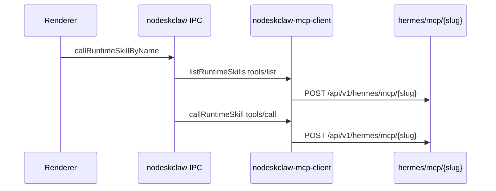
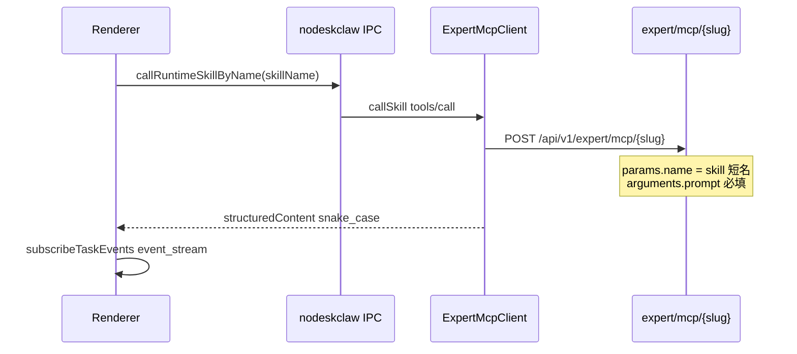

# v7.5.1 Chat Send 切换至 Expert MCP Gateway

## 背景与目标

当前 **Send** 链路（已调通 hermes 路由）：



目标 **Send** 链路（[wiki_nodeskclaw/expert_mcp_gateway.md](wiki_nodeskclaw/expert_mcp_gateway.md) v6.3.2）：



**不变部分（明确禁止改动）：**

| 阶段 | 接口 | 现有入口 |
|------|------|----------|
| Gateway 健康 | `GET /api/v1/expert/health` | [useWorkChatContext.ts](src/renderer/src/screens/Hermes/pages/Chat/hooks/useWorkChatContext.ts) → [workExpertGatewayApi.ts](src/renderer/src/screens/Hermes/api/workExpertGatewayApi.ts) |
| 专家列表 | `POST /api/v1/expert/mcp` tools/list | [ExpertSelector.tsx](src/renderer/src/screens/Hermes/pages/Chat/components/work/ExpertSelector.tsx) |
| 技能列表 | `POST /api/v1/expert/mcp/{slug}` tools/list | [ExpertSkillSelector.tsx](src/renderer/src/screens/Hermes/pages/Chat/components/work/ExpertSkillSelector.tsx) |
| SSE / 产物 | `GET /api/v1/hermes/tasks/{id}/events` 等 | [useNodeskclawTaskStream.ts](src/renderer/src/screens/Hermes/pages/Chat/hooks/useNodeskclawTaskStream.ts) + [nodeskclaw-task-stream.ts](src/main/nodeskclaw/nodeskclaw-task-stream.ts) |
| 普通 Hermes Chat | `hermesDefaultChat` | 无 expert/skill 时分支 |

---

## 核心策略（最小改动）

**不在 nodeskclaw 里再拼 hermes URL**，而是在 Send 的 Main 实现中 **复用已有** [expert-mcp-client.ts](src/main/hermes-experts/expert-mcp-client.ts) 的 `callSkill()`：

- URL 已由 [expert-mcp-endpoint.ts](src/main/hermes-experts/expert-mcp-endpoint.ts) `resolveExpertMcpSlugUrl()` 解析为 `/api/v1/expert/mcp/{slug}`
- 请求体已由 `buildExpertToolArguments()` 构造 `{ prompt, context }`，与 wiki 一致
- 鉴权头与 `ExpertMcpClient.fetchWithAuth` 已对齐（Bearer + `X-NoDeskClaw-*`）

Send 侧 **去掉** 发送前多余的 `tools/list`（`resolveRuntimeToolForSkill` / `isRuntimeSkillTool` 校验），直接使用 ExpertSkillSelector 已选中的 **skill 短名**（`WorkChatSelectedSkill.name`）作为 `tools/call` 的 `params.name`。

---

## 文件级改动（仅 Send 相关）

### 1. 共享契约收窄 Send 入参

**文件：** [runtime-skill-contract.ts](src/shared/nodeskclaw/runtime-skill-contract.ts)

```ts
export interface CallRuntimeSkillInput {
  expertSlug: string;
  skillName: string;   // 替代 tool: McpTool
  prompt: string;
  context: RuntimeSkillCallContext;
}
```

`McpTool` 类型保留（供 list IPC 等），但 Send IPC 不再要求传入完整 tool 对象。

### 2. Main：Send 委托 Expert MCP

**文件：** [nodeskclaw-runtime-skill-client.ts](src/main/nodeskclaw/nodeskclaw-runtime-skill-client.ts)

`callRuntimeSkill()` 改为：

1. 调用 `getExpertMcpClient().callSkill({ slug: expertSlug, skillName, arguments: buildExpertToolArguments({ prompt, context }) })`
2. 从 `result.structuredContent` 映射为 `RuntimeSkillStructuredContent`（字段已是 snake_case：`task_id` / `event_stream` / `result_url` / `artifact_url`）
3. **相对 URL 补全**：wiki 返回的 `event_stream` 等为 `/api/v1/hermes/tasks/...` 相对路径时，用 `resolveBackendBaseUrl()` 拼成绝对 URL（仅在此映射函数内，约 5 行 helper）
4. 移除 Send 路径上的 `assertRuntimeSkillTool` / `ensureMcpInitialized` / `callMcpGateway`

`listRuntimeSkillTools()` **保持不动**（IPC 仍存在，但 Chat Send 不再调用）。

### 3. Renderer：Send 直传 skillName

**文件：** [runtimeSkillApi.ts](src/renderer/src/screens/Hermes/api/runtimeSkillApi.ts)

- `callRuntimeSkillByName()`：**删除** `resolveRuntimeToolForSkill()` 前置步骤
- 直接 `callRuntimeSkill({ expertSlug, skillName, prompt, context })`
- 顺带整理当前文件多余空行（无行为变化）

**不改：** [useRuntimeSkillSend.ts](src/renderer/src/screens/Hermes/pages/Chat/hooks/useRuntimeSkillSend.ts)（已传 `expert.slug` + `skill.name`）

### 4. 不动 / 仅类型跟随

| 文件 | 动作 |
|------|------|
| [nodeskclaw-ipc.ts](src/main/nodeskclaw/nodeskclaw-ipc.ts) | handler 签名随 `CallRuntimeSkillInput` 自动对齐，逻辑不改 |
| [nodeskclaw-runtime-skill-api-contract.ts](src/preload/...) + [preload](src/preload/nodeskclaw-runtime-skill-api.ts) | 类型跟随契约 |
| [nodeskclaw-mcp-client.ts](src/main/nodeskclaw/nodeskclaw-mcp-client.ts) / [nodeskclaw-auth.ts](src/main/nodeskclaw/nodeskclaw-auth.ts) | **不改**（仅 list 路径仍用 hermes，Chat Send 不再经过） |
| [expert-mcp-client.ts](src/main/hermes-experts/expert-mcp-client.ts) | **不改**（直接复用） |
| Chat 组件 / workExpertGatewayApi / hermes-experts IPC | **不改** |

---

## wiki 对齐检查点（Send 验收）

1. **URL**：`POST {backend}/api/v1/expert/mcp/{expert_slug}`（断点：`ExpertMcpClient.callSkill` 内 `postJsonRpc`）
2. **Body**：`method: "tools/call"`, `params.name` = skill 短名（如 `customer-profiling`），`arguments.prompt` 非空
3. **响应**：`structuredContent.task_id` / `event_stream` / `artifact_url` / `result_url`（snake_case）
4. **SSE**：`useNodeskclawTaskStream` 收到 `task.started` → `task.progress` → `task.completed`
5. **隔离**：未选 expert+skill 时仍走 `hermesDefaultChat`；Expert 下拉仍只打 `/api/v1/expert/*` 健康/列表接口

---

## 验证

```bash
npm run typecheck
```

手工（`pnpm run dev` + Main attach 9229）：

1. 选专家 `market-profiling` + 任一 skill → Send
2. 断点 `expert-mcp-client.ts` `callSkill`：确认 URL 为 `/api/v1/expert/mcp/market-profiling`，**不是** `/api/v1/hermes/mcp/...`
3. 确认不再出现 Send 前的 hermes `tools/list` 请求
4. Timeline / artifact 正常

---

## 不在本次范围

- 不新增 `devHttpBreakpoint` / `desktop-http-trace` 等调试代码
- 不改 PRD 文档、不改 ExpertSelector / SkillSelector UI
- 不删除 `nodeskclaw:list-runtime-skills` IPC（避免波及面扩大；Chat Send 不再使用即可）
