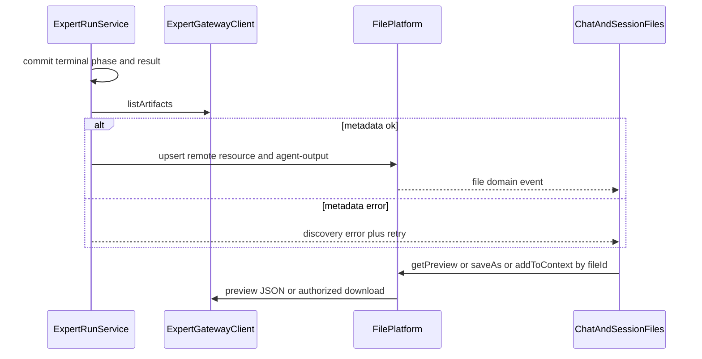

# Expert Remote Artifact Implementation Plan

## Approved PRD

[docs/work/PRD-WORK-v3.1-expert-remote-artifact-chat-file-resource.md](../../docs/work/PRD-WORK-v3.1-expert-remote-artifact-chat-file-resource.md)

## Scope

在 `apps/work` 内完成 Expert 远程 artifact 的元数据发现、File Platform 远程资源/会话关联、Chat 卡片与 Session Files 展示、Main 中介 Preview/Download/Materialize，以及 REPLACE/REMOVE 旧 Expert download 桥。消费 WORK-EXPERT-CONTRACT v1.0.2（[consumer-lock.json](contracts/work-expert/v1.0.2/consumer-lock.json)）。不改 NoDeskClaw 生产/存储、不自动物化全部 artifact、不平行新建 ArtifactService。

KEEP：Gateway 鉴权/同源、Run Service 任务真源、File Platform 唯一文件 Owner、`files.getPreview` + File Preview Panel、既有本地附件/Open/Reveal/Save As。

## Immediate Read

- [apps/work/src/shared/files/managed-file.ts](apps/work/src/shared/files/managed-file.ts)`#ManagedFile` / `#ManagedFileView`
- [apps/work/src/main/files/file-association-store.ts](apps/work/src/main/files/file-association-store.ts)`#migrateSchema` / `#upsertManagedFile` / `#findAssociation`
- [apps/work/src/main/files/file-metadata.ts](apps/work/src/main/files/file-metadata.ts)`#toManagedFileView`
- [apps/work/src/shared/expert.ts](apps/work/src/shared/expert.ts)`#ExpertRunProjection` / `#ExpertArtifactDescriptor`
- [apps/work/src/main/expert/expert-run-service.ts](apps/work/src/main/expert/expert-run-service.ts)`#updateProjection` / `#confirmTerminal`

## Triggered Read

- Gateway：`expert-gateway-client.ts#listArtifacts` / `#openAuthorizedGet` / `#buildArtifactDownloadPath` / `#parseApiError`
- Discovery 调用链：`expert-run-service.ts#applyEvent` / `#applySnapshot`；`expert-continuation.ts#projectionToContinuationItem`（禁止把 artifact 写入 continuation）
- 传输 REPLACE：`expert-artifact-download.ts#downloadExpertArtifact`；`expert-ipc.ts` download handler；`preload/expert-api.ts`；`file-operation-service.ts#saveAs`；`file-store.ts#allocateTempPath` / `#storeManagedCopy` / `#hashFileStream`
- Preview：`file-preview-service.ts#getPreviewDescriptor`；`file-path-policy.ts#canPreview`；`useFilePreview.ts`；`FilePreviewPanel.tsx`；`index.ts#registerArtifactSchemePrivileged`（仅当需要特权 scheme）
- Context：`file-service.ts#addToSessionContext`；`file-parse-service.ts`；`file-context-builder.ts#buildSessionFileContext`
- UI：`Chat.tsx` expert transcript effect；`MessageRow.tsx`；`AgentOutputFileCard.tsx`；`useSessionFiles.ts`
- Cleanup/config：`file-cleanup-service.ts#cleanupTempFiles`；`file-config.ts`；`file-contracts.ts#DesktopFilesPreviewConfig`；`file-errors.ts`
- Tests：`expert-run-service.test.ts`；`file-preview-service.test.ts`；`AgentOutputFileCard.test.tsx`；`expert-ipc-registration.test.ts`；`expert-session-materialize.test.ts`
- lat：`apps/work/lat.md/expert-execution.md`；`file-domain.md`；`file-platform.md`；`file-ui-components.md`
- Contract 字段：仅在实现 Preview JSON 解析时对照 consumer-lock 指向的 v1.0.2 fixture 字段名；禁止发明未钉住字段

## Change Matrix

| File / Symbol | Action | Existing Owner | Target State | PRD Capability | New File? |
|---|---|---|---|---|---|
| `ExpertGatewayClient` auth / same-origin / `openAuthorizedGet` | KEEP | Gateway Client | 仍是唯一 Provider URL/JWT Owner | Expert HTTP transport | no |
| `ExpertRunService` task SSE/poll/cancel/retry | KEEP | Run Service | 任务真源不变；只改完成与 discovery 协调 | Expert task lifecycle | no |
| `useFilePreview` / `FilePreviewPanel` / `files.getPreview` | KEEP | File Preview UI | 仍按 `fileId` 打开；Main 解析 locality | fileId preview UI | no |
| Local Attachments / Save As / Open / Reveal / parse / search | KEEP | File Platform + Session Files | 本地行为回归通过 | existing local files | no |
| `ExpertRunProjection.artifactIds` as domain/UI truth | REMOVE | shared expert DTO | 删除 IDs-only 真源；live 改为 discovery state + `fileId` refs | IDs-only artifact truth | no |
| `EXPERT_IPC_CHANNELS.downloadArtifact` / `ExpertApi.downloadArtifact` / preload | REMOVE | Expert IPC | 生产通道删除；无 renderer consumer 后移除 | Expert download bridge | no |
| `expert-artifact-download.ts#downloadExpertArtifact` | REMOVE | Expert download module | 统一 ops 就绪后删除模块 | Expert-specific materialization | no |
| `expert-artifact-download.ts` transfer/ManagedFile insert | REPLACE | Expert download module | File Platform 按 `fileId` Download/Materialize；Gateway 只提供传输 | unified File Platform ops | no |
| `expert.ts#ExpertRunProjection` | MODIFY | shared expert DTO | 增加 `artifactDiscovery` + renderer-safe `artifactFileIds`；任务 phase 与 discovery 分离 | Artifact discovery projection | no |
| `expert-run-service.ts#updateProjection` / `#confirmTerminal` | MODIFY | Run Service | 先提交终态与 result；再异步 `listArtifacts`；失败不改 phase | Expert artifact discovery | no |
| `expert.ts#ExpertArtifactDescriptor` | MODIFY | shared expert DTO | 消费 `preview_supported`，缺省 `false`；locators 不进入 Renderer DTO | contract preview capability | no |
| `ExpertGatewayClient.getArtifactPreview` / `buildArtifactPreviewPath` | ADD | Gateway Client | 同源 Preview JSON；403/404/size 可区分；不新建 Client | Expert remote provider binding | no |
| `managed-file.ts#ManagedFile` / `#ManagedFileView` | MODIFY | Managed File domain | 远程 identity/availability/canPreview/canOpen/canReveal；无 path/URL/JWT | unified file resource record | no |
| `file-association-store.ts#migrateSchema` / `#upsertManagedFile` | MODIFY | File index DB | 远程列 + `(profile,provider,artifactId)` 唯一；本地 hash 去重不作用于 remote | unified file resource record | no |
| `file-association-store.ts#findAssociation` / insert uniqueness | MODIFY | association store | `(profile,session,fileId,role)` 幂等 | durable session membership | no |
| `file-metadata.ts#toManagedFileView` | MODIFY | File metadata | 远程不输出 `displayPath`/绝对 cache path；Main 规范化 `canPreview` | Renderer access | no |
| `file-service.ts#fileService` | MODIFY | File Platform | upsert 远程资源；`saveAs`/`getPreview`/`addToSessionContext`/`open`/`reveal` 按 locality 分支 | File preview and operations | no |
| `file-preview-service.ts#getPreviewDescriptor` | MODIFY | File preview | 远程：Provider Preview JSON 或显式 Preview 后的 cache；无本地路径不再一律 `FILE_NOT_FOUND` | Remote preview | no |
| `file-preview-protocol` registration in File Platform + `index.ts` | ADD | File Platform preview | `hermes-file-preview://{fileId}`，Renderer 不收绝对 cache path | Preview cache | no |
| `file-cleanup-service.ts` | MODIFY | cleanup | 清 preview/temp cache；保留远程引用与用户 Download | Preview cache | no |
| `file-config.ts` / `file-contracts.ts` | MODIFY | File config | 独立 preview/transfer 限额；offline cached copy 默认拒绝 | Remote availability / limits | no |
| `file-operation-service.ts#saveAs` | MODIFY | File operations | 远程：选目标 → partial + sha256 + atomic；取消/失败无终态文件 | Download | no |
| `file-service.ts#addToSessionContext` | MODIFY | File context | `context-file` 指向同一远程 `fileId`；缺 backing 时内部 Materialize | Add to Context | no |
| `file-parse-service.ts` / `file-context-builder.ts` | MODIFY | parse/context | 仅在内部 backing 存在后解析；失败不影响 `agent-output` | Session Files and context | no |
| `file-path-policy.ts#canPreview` | MODIFY | path policy | 远程 `canPreview` 由 Main 按 Provider Preview 或受支持的 client binary preview 计算 | Remote preview | no |
| `file-errors.ts#FileErrorCode` | MODIFY | File errors | 增加 integrity / forbidden / not-found 可映射码（不新建 error owner） | Remote availability | no |
| `expert-ipc.ts` `retryArtifactDiscovery` | ADD | Expert IPC | `{ clientRequestId }`；零网络参数；复用 assertSender/auth | Artifact discovery retry | no |
| `Chat.tsx` live transcript + file domain refresh | MODIFY | Chat | 结果先可见；discovery loading/error/retry 旁挂；卡片来自 File Platform view | Chat artifact presentation | no |
| `AgentOutputFileCard.tsx` | MODIFY | Session Files UI | 远程隐藏 Open/Reveal 直至 materialized；展示 availability；Download=saveAs | Session Files Agent output | no |
| `ExpertArtifactCards.tsx` | ADD | Expert renderer | 助手结果下一卡片/文件；Preview/Download/Add to Context/`Added`；不复制 metadata | Chat artifact card | yes |
| `file-association-store.test.ts` | ADD | File store tests | 远程身份唯一、hash 不折叠、association 幂等 | AC 3/15 | yes |
| existing expert/file/UI tests | MODIFY | 各测试 Owner | 覆盖 discovery、preview、download integrity、403/404、UI flags、IPC 删除 | Acceptance Criteria | no |

## Implementation Decisions

1. **不新建 File/Artifact Service。** File Platform 直接 `getExpertGatewayClient()` 做 preview/download；Run Service 只负责完成后调用 `listArtifacts` 再 `upsert` File Platform。绑定不是第三 Owner。
2. **不要把 `FileTransportMode`（Hermes 附件 local/remote）当成远程资源 locality。** Expert 远程 artifact 是 `ManagedFile` 上的 `locality: "remote"` + `provider: "expert"` + `remoteArtifactId`。
3. **修复 `confirmTerminal` 与 `terminalConfirmed` 的耦合：** `updateProjection` 在终态时置 `terminalConfirmed` 导致随后的 `confirmTerminal` 直接 return（当前 SSE 完成路径基本不 `listArtifacts`）。终态提交与 discovery 拆开：phase/result 先 emit；discovery 在 `terminalConfirmed === true` 之后仍可运行，且不得把 phase 改回非终态或 `failed`。
4. **Live projection 字段（Renderer-safe）：** `artifactDiscovery: "idle" | "loading" | "ready" | "error"`、`artifactDiscoveryError: string | null`、`artifactFileIds: string[]`。禁止 `preview_url` / `download_url` / JWT / base URL。`artifactIds` 从生产 DTO/测试真源删除；`task.artifact_ready` 不再把 ID 当作 UI 真源（完成后再 `listArtifacts`）。
5. **远程 upsert 身份：** `UNIQUE(profile_id, provider, remote_artifact_id) WHERE locality='remote'`。现有 `idx_managed_files_profile_hash` 改为仅 local（含旧行 `locality IS NULL`）。禁止 `findByHash` 合并两个不同 artifact。
6. **Session 关联：** discovery 成功后 `findAssociation({ sessionId, fileId, role: "agent-output" })` 已存在则跳过。`messageId = expertTranscriptBubbleIds(clientRequestId).assistant`，`taskId` 写入 association。`toManagedFileView` 增加 renderer-safe `messageId` 供 Chat 按气泡过滤。
7. **Restart：** 已成功 discovery 的 metadata 只从 `file-index.db` 读；session load 不 preview/download/re-auth。Discovery 失败且进程退出后不保证 retry（continuation 在 succeeded 时已删除）；live retry 经 `expert:retry-artifact-discovery`。
8. **Gateway Preview：** `GET /api/v1/hermes/artifacts/{id}/preview`（与现有 download path 对称）。解析 JSON 字符串 content；缺字段/非 JSON → invalid metadata/preview error。`preview_supported` 缺省 `false`。Download 继续 `buildArtifactDownloadPath` + `openAuthorizedGet`。
9. **`canPreview`（Main only）：** `true` 当 Provider Preview 可用（text/markdown/code/html）或 File Platform 允许的 client binary preview（pdf/image，且仅在显式 Preview 后用 Download bytes 写入 preview cache）。Renderer 不得用文件名/MIME 自行推断。
10. **Preview cache path 不进 IPC：** 二进制 preview 的 `FilePreviewDescriptor.localUrl` 使用 `hermes-file-preview://{fileId}`；特权 scheme 注册仿 `registerArtifactSchemePrivileged`，handler 属于 File Platform，不复用 `hermes-artifact://`（那是 HTML sandbox）。文本 preview 只走 descriptor `content`。
11. **403/404：** Provider 403 → resource `availability=forbidden`，作废该 identity 的 preview cache，任务 phase 不变。404 → 保留历史引用 `not-found`。Preview 与 Download 独立 in-flight/error。
12. **Offline cache：** `desktop.files.preview.allow_offline_cached_copy` 默认 `false`。显式开启时 descriptor 带 `cachedCopy: true`，UI 标 `Cached copy`。
13. **Download：** 复用 `files.saveAs(profile, fileId)`。远程分支：`dialog.showSaveDialog` → `{dest}.partial` 流式写入 → 流中执行 size cap（独立于 preview cap，默认复用/扩展 `desktop.files` 限额，不采用 Expert 模块硬编码 50MB 作为唯一政策）→ 若有 `sha256` 则 `hashFileStream` 比对 → atomic rename。取消/失败删除 partial，不改远程记录。
14. **Materialize：** 无独立 UI 按钮。`addToSessionContext` 或 parse/context 需要 bytes 时，对同一 `fileId` 下载到 `objects/` 并写 `managedPath`，不新建 Session 资源、不删远程 identity。Open/Reveal 仅 `hasManagedCopy === true` 时出现。
15. **Filename：** 复用并收紧 `sanitizeGeneratedFileName`（NFKC、去 traversal/UNC/非法字符、长度上限）；Provider `file_name` 只作 label。
16. **Chat 卡片 Owner：** 新建 `ExpertArtifactCards.tsx`（Expert renderer），数据仍是 `ManagedFileView`。Session Files 继续 `AgentOutputFileCard`。两者都走 `files.getPreview` / `saveAs` / `addToSessionContext`。卡片 `Added` = 已有 originating `agent-output`（本 scope 不提供 Add to Session）。
17. **REPLACE 完成条件：** Chat/Session Files/Download/Materialize/integrity 测试通过，且生产搜索无 `downloadArtifact` / `expert:download-artifact` renderer consumer 后，删除 IPC、preload、`expert-artifact-download.ts`。
18. **不新增** 第二 Gateway、第二 Store、compat adapter、自动全量 materialize。

## New File Justification

- `apps/work/src/renderer/src/modules/expert/ExpertArtifactCards.tsx`：`ExpertRunCard` 在 `taskId` 到手后卸载；`MessageRow` 是通用气泡、不能变成 Expert discovery Owner；`AgentOutputFileCard` 是 Session Files 操作卡。Chat 需要「结果旁」的 discovery loading/error/retry + 同一 `ManagedFileView` 卡片，且不把 metadata 再写进 message content。
- `apps/work/src/main/files/file-association-store.test.ts`：store 无现有测试文件；远程唯一索引与 hash 不去重必须打在 schema Owner 上，不能塞进 preview 测试冒充。
- `ExpertArtifactCards` 配套测试：现有 `ExpertTimeline.test.tsx` 只断言组件类型，覆盖不了卡片/discovery UI。

Preview protocol handler 放进现有 [file-preview-service.ts](apps/work/src/main/files/file-preview-service.ts) + [index.ts](apps/work/src/main/index.ts) 注册，不新增 protocol owner 文件。

## Todo 1 — Remote ManagedFile identity

**Goal**
File Platform 能持久化无本地路径的远程 Expert 资源，Renderer view 不含 path/URL；本地 hash 去重不折叠不同 artifact。

**Immediate anchors**
- `managed-file.ts#ManagedFile`
- `file-association-store.ts#migrateSchema`
- `file-metadata.ts#toManagedFileView`

**Changes**
- 扩展 `ManagedFile`/`ManagedFileView`：`locality`、`provider`、`remoteArtifactId`、`remoteTaskId`、`availability`、`providerPreviewSupported`、`canPreview`、`canOpen`、`canReveal`、`messageId?`
- schema migration：ALTER 列；partial unique indexes；association 幂等查询（必要则 unique index）
- `toManagedFileView`：远程不设 `displayPath`；`hasManagedCopy` 仅内部 backing
- `upsertManagedFile` 读写新列；`findByRemoteIdentity`

**Stop conditions**
- [ ] 无 `managedPath` 的远程行可 upsert，重启后仍可读 name/type/size/availability
- [ ] 两 remote artifact 相同 sha256 仍是两行
- [ ] 同一 `(session,fileId,agent-output)` 二次 insert 不重复
- [ ] focused：`file-association-store.test.ts`

**Triggered reads**
- `file-service.ts#listSessionFiles` 是否要把 `messageId` 带进 view

## Todo 2 — Async discovery and session association

**Goal**
任务成功可见不依赖 artifacts；完成后异步 discovery，有效项 upsert 并关联 originating session。

**Immediate anchors**
- `expert-run-service.ts#confirmTerminal`
- `expert-run-service.ts#updateProjection`
- `expert-gateway-client.ts#listArtifacts`

**Changes**
- 终态与 discovery 解耦；`artifactDiscovery` 状态机；空列表不建 association
- 缺 identity/`file_name` 的 item 单条拒绝，不影响同胞与 task success
- discovery 成功调用 File Platform upsert + `agent-output` association + `file:association-created`
- `expert:retry-artifact-discovery` IPC；metadata error 可 retry
- 从生产路径移除 `artifactIds`

**Stop conditions**
- [ ] completed 的 result 在 `listArtifacts` resolve 前已出现在 projection
- [ ] `listArtifacts` throw 不把 phase 改为 failed；error + retry 可见
- [ ] 0 个有效 artifact → 0 张卡、0 条 agent-output
- [ ] focused：`expert-run-service.test.ts`（补 mock File Platform upsert）

**Triggered reads**
- `expert-ipc.ts` channel 注册模式；`expert-session-materialize.test.ts` 对 `artifactIds` 的夹具

## Todo 3 — Remote preview, cache, availability

**Goal**
显式 Preview 才拉内容；文本走 Provider Preview JSON；pdf/image 走授权 Download → preview cache → `hermes-file-preview://{fileId}`；403/404 按 PRD 更新 availability。

**Immediate anchors**
- `file-preview-service.ts#getPreviewDescriptor`
- `ExpertGatewayClient` preview/download
- `file-cleanup-service.ts#cleanupTempFiles`

**Changes**
- Gateway `buildArtifactPreviewPath` + `getArtifactPreview`
- `getPreviewDescriptor` 远程分支；`canPreview===false` → unsupported descriptor 而非假成功
- preview cache 键：provider + artifactId + hash（若有）；cleanup 只删 cache
- 403 作废 cache；offline cached copy 默认拒绝
- `FilePreviewDescriptor` 增加 `cachedCopy?`；Panel 显示 `Cached copy`
- 注册 `hermes-file-preview` privileged scheme

**Stop conditions**
- [ ] 远程无本地路径时显式 Preview 可返回 text descriptor，且 IPC 无绝对路径
- [ ] 未 Preview 前不写 objects/ 用户目录
- [ ] 403 → forbidden 且不以 cache 当权威；404 → 保留 not-found
- [ ] focused：`file-preview-service.test.ts`；gateway preview 解析测试

**Triggered reads**
- `ImageFilePreview` / `PdfFilePreview` 对 `localUrl` 的消费
- `file-config.ts` preview key 读取模式

## Todo 4 — Download, Materialize, Add to Context

**Goal**
用户 Download 与内部 Materialize 共用授权流/integrity；Context 指向同一远程 `fileId`。

**Immediate anchors**
- `file-service.ts#saveAs`
- `file-service.ts#addToSessionContext`
- `file-operation-service.ts#saveAs`

**Changes**
- 远程 `saveAs`：destination dialog + partial + sha256 + atomic；失败清 partial
- Materialize：同一 `fileId` 写入 `managedPath`；不新建 association
- `addToSessionContext`：幂等 `context-file`；需要时 materialize+parse；失败只报 context error
- `openExternal`/`revealInFolder`：无 backing 时明确错误，不把 cache 当用户文件
- 从 Expert download 模块迁过 sanitizer/stream size guard，完成后删除该模块（本 Todo 完成 REPLACE 的 File Platform 侧；IPC REMOVE 在 Todo 5）

**Stop conditions**
- [ ] sha256 不匹配：无终态目标文件、远程记录不变、返回 integrity error
- [ ] cancel/失败：无 destination 终态文件
- [ ] context-file 与 agent-output 共存于同一 `fileId`；context 失败不删 agent-output
- [ ] focused：file-service/operation 测试（优先扩现有测试；若无则加在 store/preview 测试旁的最小用例）

**Triggered reads**
- `file-parse-service.ts#resolvePath`；`generated-file-name.ts#sanitizeGeneratedFileName`

## Todo 5 — Chat / Session Files UI and REMOVE Expert download

**Goal**
Chat 展示真实 artifact 卡片；Session Files Agent output 同一资源；删除 Expert download 桥与 IDs-only 真源。

**Immediate anchors**
- `Chat.tsx` expert transcript effect
- `AgentOutputFileCard.tsx`
- `expert-ipc.ts` download handler

**Changes**
- `ExpertArtifactCards`：discovery loading/error/retry + 每 artifact 一卡（Preview/Download/Add to Context/`Added`）
- Chat 用 `listSessionFiles` + `messageId` 过滤（或 live `artifactFileIds` + domain event refresh）；不把 metadata 写入 bubble content
- Session Files：远程隐藏 Open/Reveal；availability 文案
- 删除 `expert:download-artifact`、preload、`ExpertDownloadArtifactInput`、`expert-artifact-download.ts`、`cleanupExpertArtifactTemps` 的生产引用
- 更新 lat.md；生产搜索确认无 `downloadArtifact` consumer

**Stop conditions**
- [ ] 助手结果与卡片同时可见；metadata 失败不隐藏 result
- [ ] 远程卡无 Open/Reveal；`canPreview===false` 时 Preview disabled
- [ ] `rg` 生产代码无 `expert:download-artifact` / `downloadExpertArtifact`
- [ ] focused：`ExpertArtifactCards` 测试、`AgentOutputFileCard.test.tsx`、`expert-ipc-registration.test.ts`

**Triggered reads**
- `MessageList.tsx` / `MessageRow.tsx` 插入点；`modules/expert/index.ts` export
- `lat.md/expert-execution.md` Continuation and artifacts

## Verification

- Todo 1：`npx vitest run src/main/files/file-association-store.test.ts`（在 `apps/work`）
- Todo 2：`npx vitest run src/main/expert/expert-run-service.test.ts src/main/expert/expert-ipc-registration.test.ts`
- Todo 3：`npx vitest run src/main/files/file-preview-service.test.ts src/main/expert/expert-gateway-client.test.ts`
- Todo 4：Download/Materialize/context 对应 focused 测试
- Todo 5：`npx vitest run src/renderer/src/screens/Chat/session-files/AgentOutputFileCard.test.tsx` + ExpertArtifactCards 测试；生产 `rg "downloadArtifact|expert:download-artifact|downloadExpertArtifact" apps/work/src --glob '!**/node_modules/**'` 无生产命中
- 回归：现有 local file / Expert SSE / cancel-retry 测试仍通过
- 实现后：更新 `apps/work/lat.md` 并 `lat check`
- Manual / Live Evidence / 实机 403-404-offline 不由 Cursor 标记 proven
