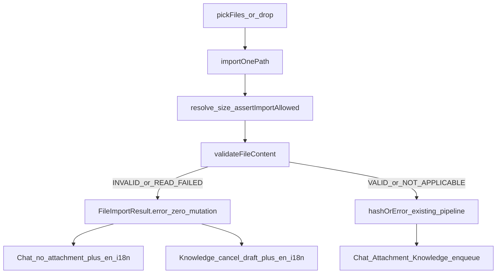

# File Import P0 Content Readability Gate

**PRD:** [docs/work/smc-copilot-File-Import-P0-明文可读性校验-PRD-v1.0.md](docs/work/smc-copilot-File-Import-P0-明文可读性校验-PRD-v1.0.md) (`PRD-WORK-FILE-PROTECTED-CONTENT-P0` v1.1, `APPROVED_FOR_PLAN`)

**Ship bar:** `CODE_RELEASE` only (A-PFC-001~012 + A-PFC-002b + typecheck/lint). Field Spike / `VERIFIED` is out of this plan’s implementation todos.



## Approach (locked)

- New Main detector module; gate only in [`importOnePath`](apps/work/src/main/files/file-import-service.ts) after `assertImportAllowed`, before `hashOrError` (today L173–176).
- Extend sniff helpers in [`file-security.ts`](apps/work/src/main/files/file-security.ts): keep `detectMagicKind` API compatible; add strict kinds (`ole`, `bmp`, per-image kinds) used by the Gate only. Do not use text heuristic for STRICT hard-block.
- PDF: `%PDF-` search within first 1024 bytes (not offset-0-only). OOXML: ZIP signature only.
- Clipboard / `stageClipboardImport`: unchanged (NON-GOAL-007).
- No new npm deps; no 亿赛通 SDK; no `contentHash` change; no persistent encrypted flag.

## Implementation slices

### 1. Error contract + detector

- Add `FILE_CONTENT_ENCRYPTED_OR_INVALID` to [`file-errors.ts`](apps/work/src/shared/files/file-errors.ts).
- New [`protected-file-detector.ts`](apps/work/src/main/files/protected-file-detector.ts):
  - `MAX_PREFIX_BYTES = 16 KiB`
  - `validateFileContent(path, fileName)` → PRD `FileContentValidationResult`
  - Applicability matrix + `detectStrictContentKind(prefix)` per §9.3
  - Prefix via `fs/promises.open` + read + close; never log prefix bytes
- Export from [`files/index.ts`](apps/work/src/main/files/index.ts) as needed for tests.
- Wire in `importOnePath`:
  - catch → `FILE_READ_FAILED`
  - `INVALID_OR_ENCRYPTED` → `FILE_CONTENT_ENCRYPTED_OR_INVALID` with actionable English message (same prose as en i18n)
  - emit one structured `console` metadata event (`stage: CONTENT_CHECK`, status/extension/kinds/bytesInspected/errorCode); swallow log failures
- Extend [`file-security.ts`](apps/work/src/main/files/file-security.ts) / tests for OLE + BMP + image kind split used by detector.

### 2. Chat consumer + en i18n

- [`composerFilePlatform.ts`](apps/work/src/renderer/src/screens/Chat/composerFilePlatform.ts): map new code → `read-failed`; keep `platformErrors` = `FileError.message`.
- [`ChatInput.tsx`](apps/work/src/renderer/src/screens/Chat/ChatInput.tsx) `applyIngestResult`: when `platformErrors[0]` is present and paired `AttachmentError` is `read-failed`, **prefer `platformErrors[0]`** (or `t("chat.attachContentUnreadable")` when import error code is the new one—pass via platformErrors message equality / dedicated branch so actionable copy wins over generic `attachReadFailed`).
- Add key only in [`locales/en/chat.ts`](apps/work/src/shared/i18n/locales/en/chat.ts): e.g. `attachContentUnreadable` — format mismatch / possible protection / retry readable copy; MUST NOT say confirmed Eisoo.
- New unit test file [`composerFilePlatform.test.ts`](apps/work/src/renderer/src/screens/Chat/composerFilePlatform.test.ts) (does not exist today): A-PFC-007 multi-select isolation, A-PFC-009 mapping + message assertions.

### 3. Knowledge consumer (minimal UI + regression)

- Cancel-on-empty-import already exists in [`KnowledgeUploadPanel.tsx`](apps/work/src/renderer/src/screens/Knowledge/features/file-job/KnowledgeUploadPanel.tsx) L180–183 — keep that logic.
- Minimal product change (grilling Q8/REQ-006): when pick returns non-ok with `FILE_CONTENT_ENCRYPTED_OR_INVALID`, surface `t("knowledge.uploads.contentUnreadable")` from [`locales/en/knowledge.ts`](apps/work/src/shared/i18n/locales/en/knowledge.ts) (banner/inline error state); still cancel draft; never enqueue/upload.
- Extend [`apps/work/tests/knowledge-uploads-page.test.ts`](apps/work/tests/knowledge-uploads-page.test.ts) for A-PFC-008: mock `pickFiles` → `{ ok:false, error:{ code: FILE_CONTENT_ENCRYPTED_OR_INVALID } }` → `cancel` called, no provider upload, message shown.

### 4. Tests for Gate + import zero-mutation

- New [`protected-file-detector.test.ts`](apps/work/src/main/files/protected-file-detector.test.ts): matrix cases 1/1b/2–11/15 (PDF leading-junk, empty pdf BLOCK, text NOT_APPLICABLE, OLE/ZIP/images).
- New or colocated [`file-import-service` content-gate tests](apps/work/src/main/files/) (pattern from [`file-import-knowledge-job.test.ts`](apps/work/src/main/files/file-import-knowledge-job.test.ts)): spy `hashOrError` / store / upsert / association / enqueue → count 0 on mismatch; path-policy reject → detector not called (A-PFC-011); log marker absence (A-PFC-010).

## Out of scope (do not implement)

- Clipboard Gate, vendor SDK, P0.1 second-read sniff, FIELD Spike execution, zh-CN/ja locale edits, ManagedFile schema changes.

## Verification (CODE_RELEASE)

From `apps/work`:

```bash
npm test -- protected-file-detector.test.ts file-import-service composerFilePlatform.test.ts knowledge-uploads-page.test.ts file-security.test.ts
npm run typecheck
npm run lint
```

(Adjust vitest path globs to match actual new filenames.)

## Residual / escalate (document only in PRD; no code)

False ZIP pass, unverified 亿赛通 hypothesis, secondary read OOS — Appendix D/E. Escalate triggers are future P0.1.
