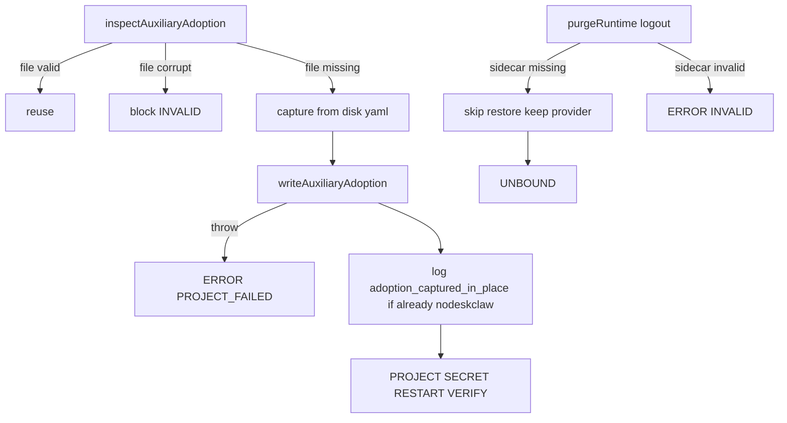

# First-Login Adoption Hotfix 实现计划

依据 [docs/work/PRD-WORK-RUNTIME-PROVIDER-FIRST-LOGIN-ADOPTION-HOTFIX-v1.8.md](docs/work/PRD-WORK-RUNTIME-PROVIDER-FIRST-LOGIN-ADOPTION-HOTFIX-v1.8.md) v1.8.2，`status = APPROVED_FOR_PLAN`。实现以 HF-G-01～HF-G-11 与 AC-01～AC-13 为准。`plan_contract: smc.plan.v3.7`，claim `GES_NATIVE`。仓库内没有 `smc-plan-from-approved-prd-ponytail` 技能包，因此沿用 [.cursor/plans/session_restore_splash_faae8f3f.plan.md](.cursor/plans/session_restore_splash_faae8f3f.plan.md) 的字段。本计划状态是 `planned`，不是 `approved`。

基线：smc-copilot `d32fb43b303c792cdf1a3b3df625f1816b704774`。不改 hermes-builder、不预置 JSON、不猜 `localhost`、不落盘 apiKey、不重写 YAML 库、不加 UI 横幅、不从联合类型删除 `RUNTIME_AUXILIARY_ADOPTION_MISSING`。



## 现有入口（不得另选）

- Inspect：[apps/work/src/main/runtime-provider/runtime-provider-auxiliary-adoption.ts](apps/work/src/main/runtime-provider/runtime-provider-auxiliary-adoption.ts) `inspectAuxiliaryAdoption` 在文件不存在且 `getModelConfig().provider === nodeskclaw` 时 `block`/`RUNTIME_AUXILIARY_ADOPTION_MISSING`。改为文件不存在一律 `{ action: "capture" }`。`INVALID` 分支不动。类型联合里的 `MISSING` 保留，inspect 不再返回它。
- Apply：[apps/work/src/main/runtime-provider/runtime-provider-orchestrator.ts](apps/work/src/main/runtime-provider/runtime-provider-orchestrator.ts) `applyReady` 在 SNAPSHOT 后、`setState(APPLYING)` 前调用 `writeAuxiliaryAdoption`。今天该调用在 PROJECT `try` 外。必须单独接住写盘抛错，`setState({ state: "ERROR", errorCode: "RUNTIME_PROVIDER_PROJECT_FAILED" })`，不得进入 `projectManagedRuntime`。ACTIVE+MATCH noop 保持在 SNAPSHOT 之前，不改。
- 就地捕获日志：同一点用现有 `logRuntimeProviderOperation`，字段必须含 `adoption_captured_in_place: true`、`profile`、当时 `provider`、`has_active_model_sidecar`（布尔）。仅当 capture 时当前 provider 已是 `nodeskclaw` 才打这条（干净首次不打）。
- Active-model：[apps/work/src/main/runtime-provider/runtime-provider-projection.ts](apps/work/src/main/runtime-provider/runtime-provider-projection.ts) `rememberAdoption` 已是 nodeskclaw 时继续 `return` 且不写文件。文件不存在时补一条诊断（`stage`/`message` 含 skip，不得把 nodeskclaw 写成原值）。文件已存在不得覆盖（现有逻辑已满足）。
- Logout：同文件 `purgeRuntime("logout")` 在 auxiliary 文件不存在时，删掉 `setState(MISSING)`，设 `auxiliaryRestored = true`，不改 `model.provider`。损坏文件仍 `INVALID`。有效文件仍 restore 后 `deleteAuxiliaryAdoption`。Gateway 成功则 `UNBOUND`。
- Profile：[apps/work/src/main/auth/auth-ipc.ts](apps/work/src/main/auth/auth-ipc.ts) 的 `auth:login` 与 `restoreRuntimeProviderOnce` 必须 `bootstrapRuntimeProvider(reason, getActiveProfileNameSync())`。从 [apps/work/src/main/utils.ts](apps/work/src/main/utils.ts) 导入，与 reconcile 同一函数。该函数缺 `active_profile` 时已回退 `"default"`，不另造诊断。
- 登录表面：现有 login catch + `settleTransientRuntimeProviderFailure` KEEP。不改 Composer / Splash 挡门。AC-09 只锁 IPC：session 成功且 bootstrap 抛错时公共状态 ERROR。

## 接口（不得另选）

- 捕获来源只能是 `writeAuxiliaryAdoption(profile, snapshot.files.config || "")`，即当前磁盘 yaml 快照。禁止合成默认 auxiliary。
- capture 写盘失败的可观察码只有 `RUNTIME_PROVIDER_PROJECT_FAILED`。
- apply/logout 生产路径不再 `setState(MISSING)`。
- `getActiveProfileNameSync()` 的返回值原样作为 bootstrap 第二参（包括 `"default"`）。

## Todos

每个 Todo 的 `status` 从 `planned` 开始。只有对应验收跑出 Evidence 才能标 `verified`。

```yaml
id: hf-t1-inspect-capture
requirement_refs: [HF-G-07, HF-G-11]
acceptance_refs: [AC-01, AC-02, AC-05]
files_or_symbols:
  - apps/work/src/main/runtime-provider/runtime-provider-auxiliary-adoption.ts#inspectAuxiliaryAdoption
  - apps/work/src/main/runtime-provider/runtime-provider-auxiliary-adoption.test.ts
implementation_goal: 文件不存在时一律返回 capture，不再读取 provider 来 block MISSING。文件损坏仍 INVALID。不重写 reuse。删除「blocks a nodeskclaw profile that has no sidecar」的正确期望，改为 nodeskclaw 无文件时 capture。
preconditions: 现有 reuse / empty-string-present 用例仍可跑。
state_transition: nodeskclaw + 无 sidecar 从 block MISSING 变成 capture。
side_effect_scope: 仅 inspect 决策。不在本 Todo 改 orchestrator。
failure_cases: [损坏 sidecar 仍不得 capture]
verification: apps/work 下跑 runtime-provider-auxiliary-adoption.test.ts。覆盖 nodeskclaw 无文件 capture、localhost 无文件 capture、损坏文件 INVALID、有效文件 reuse。
```

```yaml
id: hf-t2-apply-inplace
requirement_refs: [HF-G-01, HF-G-06, HF-G-09, HF-G-10, HF-G-11]
acceptance_refs: [AC-01, AC-03, AC-04, AC-06, AC-07, AC-12]
files_or_symbols:
  - apps/work/src/main/runtime-provider/runtime-provider-orchestrator.ts#applyReady
  - apps/work/src/main/runtime-provider/runtime-provider-projection.ts#rememberAdoption
  - apps/work/src/main/runtime-provider/runtime-provider-orchestrator.test.ts
  - apps/work/src/main/runtime-provider/runtime-provider-projection.test.ts
implementation_goal: applyReady 在 APPLYING/PROJECT 之前接住 writeAuxiliaryAdoption 抛错并 setState PROJECT_FAILED。就地捕获（当时 provider 已是 nodeskclaw）打 adoption_captured_in_place 诊断。rememberAdoption 在已是 nodeskclaw 时不创建 runtime-provider-adoption.json；缺文件只诊断。已有 localhost adoption json 的 project 不覆盖该文件。ACTIVE+MATCH noop 与 IDENTITY_CONFLICT/POST_APPLY_DRIFT 不改。
preconditions: hf-t1 已让 inspect 对缺失文件返回 capture。
state_transition: 现场态 yaml=nodeskclaw 且无 auxiliary sidecar 的 login apply 可走到 ACTIVE（gateway mock ok），provider 不被改成 localhost。
side_effect_scope: applyReady 写 sidecar 的失败面；rememberAdoption 诊断。不改 logout。
failure_cases: [writeAuxiliaryAdoption throw 不得调用 projectManagedRuntime, PROJECT throw 后 sidecar 仍在且再次 inspect 为 reuse]
verification: orchestrator 测试增加：config.yaml 预置 nodeskclaw、无 sidecar、bootstrap login → ACTIVE、无 localhost 写回、有 auxiliary sidecar、无「原值=nodeskclaw」的 adoption json、日志含 adoption_captured_in_place。mock writeAuxiliaryAdoption throw → PROJECT_FAILED 且 yaml 未变成新托管内容。mock projectManagedRuntime throw → 磁盘有 auxiliary sidecar。projection 测试：预置 nodeskclaw 且无 adoption json 时 project 后该文件仍不存在；预置 localhost adoption json 时内容不变。现有 IDENTITY/DRIFT/重启失败用例仍绿。命令：npm test -- src/main/runtime-provider/runtime-provider-orchestrator.test.ts src/main/runtime-provider/runtime-provider-projection.test.ts src/main/runtime-provider/runtime-provider-auxiliary-adoption.test.ts（在 apps/work）。
```

```yaml
id: hf-t3-logout-unbound
requirement_refs: [HF-G-08]
acceptance_refs: [AC-10, AC-13, AC-07]
files_or_symbols:
  - apps/work/src/main/runtime-provider/runtime-provider-orchestrator.ts#purgeRuntime
  - apps/work/src/main/runtime-provider/runtime-provider-orchestrator.test.ts
implementation_goal: logout 在 auxiliary sidecar 不存在时跳过还原、不 setState MISSING、auxiliaryRestored=true，成功重启后 UNBOUND。无 active-model sidecar 时不改 model.provider。损坏 sidecar 仍 INVALID。已有 localhost adoption json 时 KEEP 现有「logout 还原 openai」用例。
preconditions: hf-t2 就地捕获后磁盘可有 auxiliary sidecar、yaml 可为 nodeskclaw。
state_transition: nodeskclaw + 无 sidecar 的 logout 从 ERROR MISSING 变成 UNBOUND。就地捕获成功后 logout 删除 auxiliary sidecar，provider 仍 nodeskclaw；再次 bootstrap login 再次 capture 且可 ACTIVE。
side_effect_scope: 仅 purgeRuntime logout 缺文件分支。
failure_cases: [不得为还原而写入 localhost]
verification: orchestrator 测试：预置 nodeskclaw yaml、无两份 sidecar、clearRuntimeProvider logout → UNBOUND 且 provider 仍 nodeskclaw。就地捕获 ACTIVE 后 logout → UNBOUND、无 auxiliary sidecar、provider 仍 nodeskclaw；再 login → ACTIVE。现有 restores adopted model 用例仍绿。
```

```yaml
id: hf-t4-auth-profile
requirement_refs: [HF-G-03, HF-G-04]
acceptance_refs: [AC-08, AC-09]
files_or_symbols:
  - apps/work/src/main/auth/auth-ipc.ts#auth:login
  - apps/work/src/main/auth/auth-ipc.ts#restoreRuntimeProviderOnce
  - apps/work/src/main/auth/auth-ipc.test.ts
  - apps/work/src/main/auth/restore-runtime-provider-for-splash.test.ts
implementation_goal: local 模式 login 与 splash restore 把 getActiveProfileNameSync() 传入 bootstrapRuntimeProvider。login 抛错仍返回 authenticated session 并 settleTransient。不改 Composer、不挡主界面、不改 auth:refresh。
preconditions: 无。可与 hf-t1 并行，但与 t2/t3 无文件冲突。
state_transition: 现有 toHaveBeenCalledWith("login") / ("restore") 变成带第二参。
side_effect_scope: auth-ipc 两处调用。测试里 vi.mock ../utils 的 getActiveProfileNameSync 返回固定名如 work。
failure_cases: [remote 模式仍不 bootstrap]
verification: auth-ipc.test.ts 登录断言 CalledWith("login", "work")；bootstrap throw 时 authenticated 仍 true。restore-runtime-provider-for-splash.test.ts 断言 CalledWith("restore", stub 返回值)。现有 notify throw 仍登录成功的用例保持。命令：npm test -- src/main/auth/auth-ipc.test.ts src/main/auth/restore-runtime-provider-for-splash.test.ts。
```

## 不做

- 不改 hermes-bootstrap / hermes-repair / electron-builder extraResources。
- 不改 `safeWriteFile` overwrite 语义，不打 overwrite 诊断。
- 不改 Composer / EnterpriseRuntimeCard / recoveryActions 映射。
- 不从 [apps/work/src/main/runtime-provider/runtime-provider-contract.ts](apps/work/src/main/runtime-provider/runtime-provider-contract.ts) 删除 `RUNTIME_AUXILIARY_ADOPTION_MISSING`。
- 不把 MISSING 补成 retry 按钮。
- 不在本计划混入未提交的 MSI PROGRAM_MANAGED 改动。
