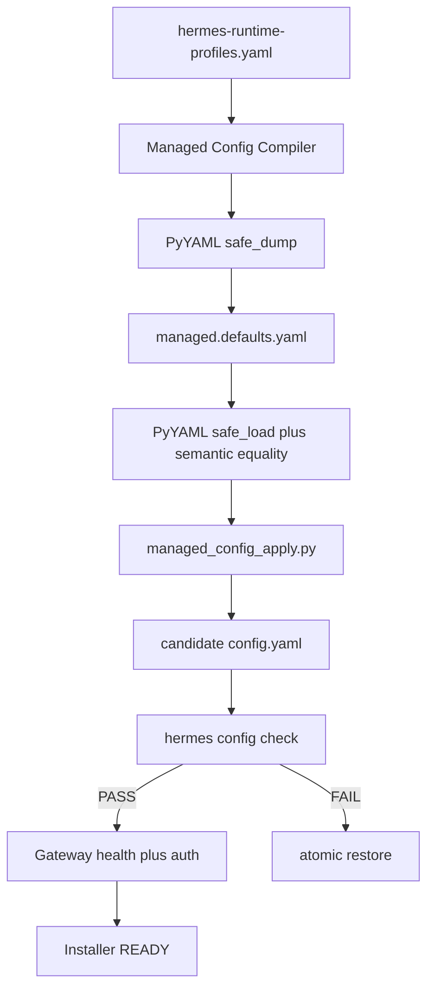

# Hermes Agent 打包：Config Integrity（PRD v2.1.6）

对照 [docs/opsi/PRD-OPSI-v2.1.6.md](docs/opsi/PRD-OPSI-v2.1.6.md)，当前生产链路仍是 **自研 Writer + 同源 Reader**。工作区里 `simple_yaml.py` 只加了未提交的 `@` 补丁，不足以满足 DoD。本次按你确认的范围一次做完 **P0 + Production Closure**。

## 现状与目标

当前失败链：

```text
simple_yaml.dump_yaml → 同源 _parse_block PASS → 非法 config.yaml → Hermes PyYAML FAIL
```

目标链：



不改：Hermes schema、Capability Matrix 键语义、PATH immutability、Salt/Runtime/OPSI 控制面。

## 阶段 1 — P0 Hotfix（先阻断非法 YAML）

### 1. 共享 Regression Corpus

新增单一 SOT：[tools/release/tests/fixtures/yaml_q_corpus.yaml](tools/release/tests/fixtures/yaml_q_corpus.yaml)（YAML-Q01–Q15 + PRD §21 全部 scalar）。Python 与 Pester 共用，禁止再手写互不一致的简化样例。

至少覆盖：`@modelcontextprotocol/server-filesystem`、`@foo`、`` `command ``、Windows 路径、URL colon、`#value`、`true`/`null`/`123` 字符串、首尾空格、Unicode、`${API_SERVER_KEY}`、引号/撇号、nested list/map、empty collection。

### 2. Python Serializer

- 补全 [tools/release/simple_yaml.py](tools/release/simple_yaml.py) `_needs_quotes()`：YAML plain scalar 禁止首字符 `? : , [ ] { } # & * ! | > ' " % @ \``，以及 empty/reserved/numeric/whitespace/control。**这是 hotfix，不是最终 Production writer。**
- [tools/release/hermes/managed_config.py](tools/release/hermes/managed_config.py) 的 `render_managed_defaults_yaml()` 改为：

```python
yaml.safe_dump(payload, allow_unicode=True, sort_keys=True, default_flow_style=False)
```

  UTF-8、LF、确定性 key order。`assert_managed_defaults_roundtrip()` 改为 `yaml.safe_load` + defaults/enforced **深层语义 equality**（不再用 `_parse_block` 当 oracle）。
- `simple_yaml.dump_yaml` 降级为 legacy helper；生产写入与最终 validity 不再走它。

**真实 bug 回归（必须 RED→GREEN）**：[tools/release/tests/test_yaml_compatibility.py](tools/release/tests/test_yaml_compatibility.py)

- 用旧 `_needs_quotes`（无 `@`）dump `@modelcontextprotocol/server-filesystem` → `yaml.safe_load` 失败。
- 新 Production dump → load 后值/类型完全相等。

### 3. PowerShell Scalar Hotfix + Gate 解耦

改 [infra/windows/hermes-agent/scripts/SmcHermesManaged.psm1](infra/windows/hermes-agent/scripts/SmcHermesManaged.psm1)：

- `ConvertTo-SmcYamlScalar()` 同步 corpus：至少 `@ \` # : ! & * %` 及 reserved/numeric/whitespace。P0 期间 merge 仍走 PowerShell AST，必须与 Python hotfix 同一 corpus。
- **Always validate**：`Set-SmcHermesManagedTerminalConfig` 在 `Changed=false` 时仍跑 Standard YAML + Native check；`Changed` 只决定是否写盘。
- **Skip 解耦**：
  - `SMC_HERMES_INSTALLER_SKIP_GATEWAY=1` **只**跳过 Gateway / Scheduled Task / network。
  - 新增 **仅 test harness** 使用的 `SMC_HERMES_INSTALLER_SKIP_NATIVE_CONFIG=1`：跳过 `hermes.exe config check`（PE stub 无法跑 CLI），**永不**跳过 Standard YAML。
  - 禁止 production 把 `SKIP_GATEWAY` 当成 Config skip。
- Native oracle：`Invoke-SmcHermesConfigCheck` 设 `HERMES_HOME`，要求 exit 0，并扫描 fallback 文案（`Failed to parse` / `Falling back to default config` / `every user override ... IGNORED`）。失败映射 `CONFIG_NATIVE_CHECK_FAILED` / `CONFIG_FALLBACK_DETECTED`。
- 错误码落地：`CONFIG_YAML_PARSE_FAILED`、`CONFIG_NATIVE_CHECK_FAILED`、`CONFIG_MANAGED_MERGE_FAILED`、`CONFIG_ROLLBACK_FAILED`、`CONFIG_FALLBACK_DETECTED`。日志脱敏，不输出 config 全文/密钥。

### 4. Smoke Fixture 单一 SOT

改 [tools/release/hermes/build_installer_smoke_fixture.py](tools/release/hermes/build_installer_smoke_fixture.py)：`managed.defaults.yaml` 改为 `load_profiles` → `compile_managed_defaults` → Production serializer，不再手写简化 baseline。Smoke 仍可用 PE stub（T0–T2），但 config fixture 必须来自真实 Profile。

## 阶段 2 — Production Closure

### 5. Embedded Python Apply Tool

新增 [infra/windows/hermes-agent/scripts/managed_config_apply.py](infra/windows/hermes-agent/scripts/managed_config_apply.py)（Runtime 安装后路径：`{ProgramRoot}\scripts\managed_config_apply.py`）。

职责（离线、无 Registry/网络/Secret Provider）：

- `yaml.safe_load` 读 existing `config.yaml` + `managed.defaults.yaml`
- deep merge：`defaults` existing wins，`enforced` enterprise wins
- 保护 `model/models/provider/providers/auxiliary/delegation/API_SERVER_KEY/api_server_key`
- 强制 `terminal.cwd` 等 managed keys
- `safe_dump` 到同目录 `config.yaml.tmp.smc`，read-back semantic validation
- 原子协议：`config.yaml` / `config.yaml.tmp.smc` / `config.yaml.bak.smc`
- 结构化 stdout（JSON）+ 明确 exit code；失败不留下半写入正式文件

打包：

- [tools/release/hermes/windows_runtime.py](tools/release/hermes/windows_runtime.py) `ENDPOINT_SCRIPTS` 增加该文件。
- [infra/windows/hermes-agent/installer/build.ps1](infra/windows/hermes-agent/installer/build.ps1) staging 同步复制（工具随 Runtime zip，不依赖 MSI scripts 目录单独一份）。

### 6. PyYAML 成为正式 Runtime 依赖

- [release/hermes-runtime-profiles.yaml](release/hermes-runtime-profiles.yaml) `python.requiredPackages` 增加 `pyyaml`。
- [tools/release/hermes/capability_matrix.py](tools/release/hermes/capability_matrix.py) 增加 **baseline**（非新 capability）：始终 probe `import yaml`，`ALLOWED_IMPORT_MODULES` 含 `yaml`。不改 v2.1.4 capability 键。
- Wheelhouse / inventory / import gate 必须带上 PyYAML；禁止 Endpoint 在线 pip。
- Build 侧：CI 已通过 `uv run --project services/opsi-control` 锁定 `pyyaml>=6,<7`（uv.lock 6.0.3）。在 builder job 显式 `import yaml` gate，禁止偶然安装。

### 7. PowerShell 退为编排层

`Merge-SmcHermesManagedConfig` 改为：定位 `{ProgramRoot}\python\python.exe` + `managed_config_apply.py` → 调工具 → 映射 exit code → 再跑 Native `config check` → Native 失败则原子 restore `.bak.smc`。

生产 merge **不再调用** `Read-SmcYaml*` / `ConvertTo-SmcYamlSubset` / `Write-SmcYamlValue`。这些函数可留作 Pester 内部或删除；DoD 以生产路径不再依赖为准。

Pester（无 Embedded Python 的 MOCK 环境）：用 `setup-python` + PyYAML，经 test-only 注入 apply 解释器路径；名称/报告标注 MOCK/UNIT。

### 8. Installer Config Gate

改 [infra/windows/hermes-agent/installer/InstallerCore.psm1](infra/windows/hermes-agent/installer/InstallerCore.psm1) readiness：

```text
CLI/version → Managed Home → config.yaml exists
  → Standard YAML + managed semantic assertions
  → Hermes native config check（含 fallback 扫描）
  → Workspace/Temp → Gateway Task → TCP /health /v1/models
  → PATH unchanged → READY commit
```

- Config invalid 时即使 Gateway 200 也 FAIL，并 rollback，不提交 control-owner READY。
- Certification 路径：检测到 `SKIP_GATEWAY` / `SKIP_NATIVE_CONFIG` / `SMC_HERMES_MANAGED_TEST_ROOT` 立即失败。
- 成功日志至少：`config.standard_yaml=PASS`、`config.hermes_native=PASS`、`config.fallback_detected=false`、`gateway.health=PASS`、`gateway.auth=PASS`、`environment.path.unchanged=true`、`install.readiness=PASS`。

`Set-SmcHermesManagedTerminalConfig` 在 merge 已强制 cwd 后以 **assert + native check** 为主，避免第二套 YAML writer。

### 9. Release 元数据：Build Success ≠ Certified

扩展 [tools/release/client/release_manifest.py](tools/release/client/release_manifest.py)（及 verify）：

- `buildStatus`: artifacts + structural gates
- `certificationStatus`: `uncertified | certified | failed`
- artifact SHA256、runner/snapshot id、evidence locator、时间
- **禁止** `liveEligible=true` 或 CI 绿自动写成 Release Certified

现有 `windows-installer` smoke job 继续作为 T2，报告必须标明 MOCK/SMOKE，不得叫 certified。

### 10. CI Jobs

改 [.github/workflows/opsi-package-ci.yml](.github/workflows/opsi-package-ci.yml)：

| Job | Runner | 证明范围 |
|-----|--------|----------|
| `yaml-compatibility` | ubuntu-latest | PyYAML corpus/oracle；始终跑 |
| 现有 `pester` / `builder` / `windows-installer` | github-hosted | T0–T2；报告标注 MOCK/SMOKE |
| `windows-runtime-certification` | `[self-hosted, windows, smc-hermes-cert]` | 真实 Python/Hermes/Node；禁止 `skip_functional_gates` / PE stub |
| `windows-installer-build` | 同上或可构建真实 runtime 的 Windows | 真实 MSI 生成 + digest freeze |
| `windows-installer-certification` | `smc-hermes-cert` | **同一个** frozen MSI：Fresh / Repair / Upgrade / Uninstall + PATH bit-for-bit |

Certification job 拒绝一切 skip/test-root。Upgrade 必须 previous certified RC → current，不得用 fresh install 冒充。

**Runner 风险**：若 `smc-hermes-cert` 尚未接入，cert 三 job 用 `if: vars.SMC_HERMES_CERT_ENABLED == 'true'`（或 `workflow_dispatch`）避免每个 PR 挂起；未跑时 `certificationStatus` 保持 `uncertified`，**不能**当发布 GO。代码、unit/contract 与 yaml-compatibility 仍在 github-hosted 上强制。

## 测试分层

- **T0/T1**：`test_yaml_compatibility.py`、`assert_managed_defaults_roundtrip` 深层 equality、Pester quoting/merge corpus、SKIP_GATEWAY 不解耦 Config 的负向测试、unchanged 仍 validate（REG-CFG-001）。
- **T2**：apply tool 事务（tmp 校验失败不覆盖正式文件、rollback 错误码）、InstallerCore 结构化日志。
- **T3–T6**：仅 certification job；MOCK 测试文件名/Describe 带 `MOCK`/`UNIT`。

Pester 现有 `$second.Changed | Should Be $false` 保留「不写盘」断言，并新增「unchanged 仍执行 validation」断言。

## 关键文件

- 写：`simple_yaml.py`、`managed_config.py`、`managed_config_apply.py`（新）、`SmcHermesManaged.psm1`、`InstallerCore.psm1`、`build_installer_smoke_fixture.py`、`windows_runtime.py`、`capability_matrix.py`、`hermes-runtime-profiles.yaml`、`release_manifest.py`、`opsi-package-ci.yml`、`test_yaml_compatibility.py`（新）、Pester 测试、`Product.wxs`/`build.ps1`（若 installer staging 需要显式列出脚本）。
- 不改：`infra/salt`、`services/salt-control`、`services/runtime`、`contracts/runtime-api`。
