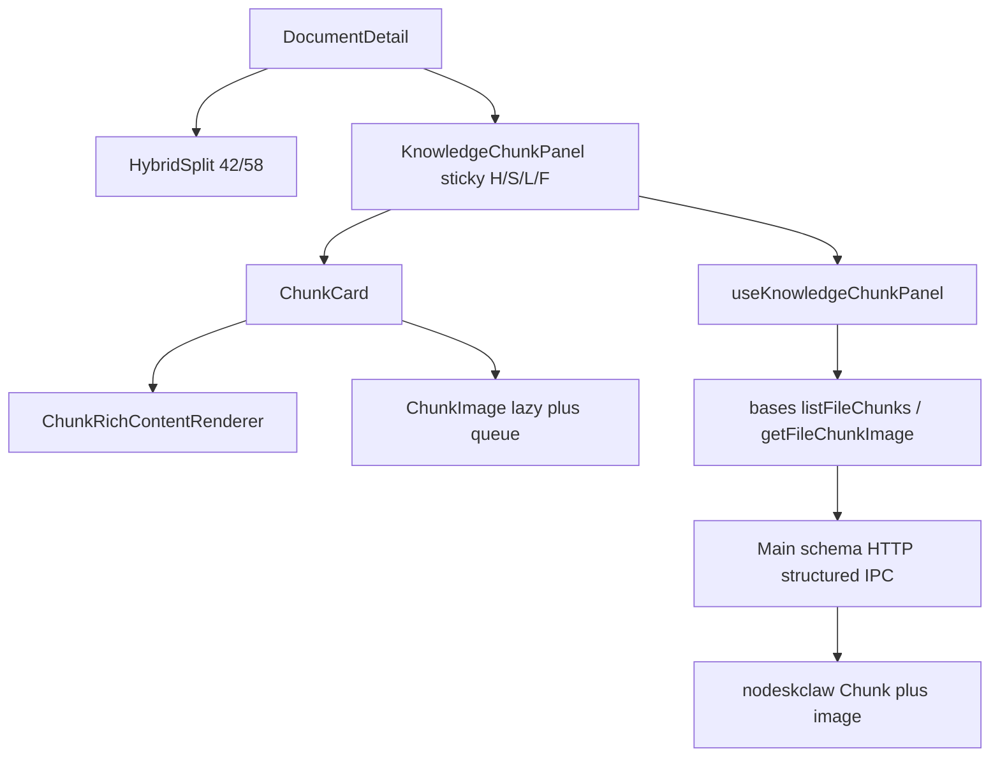

# DocumentDetail Hybrid v2.1 Implementation Plan

## Approved PRD / Workspace

- PRD: [docs/knowledge/PRD-WORK-KNOWLEDGE-DOCUMENT-DETAIL-HYBRID-v2.1-LAYOUT-PAGINATION-RICH-IMAGE.md](docs/knowledge/PRD-WORK-KNOWLEDGE-DOCUMENT-DETAIL-HYBRID-v2.1-LAYOUT-PAGINATION-RICH-IMAGE.md) (`version: 2.1`, `status: APPROVED_FOR_PLAN`)
- Conflict authority: **§1.3 Grilling Decision Lock** > body；本 PRD **REPLACE** v2.0
- Contract SOT: `E:\git\nodeskclaw2\nodeskclaw-knowledge\contracts\frontend\v1.0.0`（`FRONTEND-INTEGRATION.md` + schemas；包标签可为 1.0.0）
- Baseline: `work/prd-v6.2` @ `ed2824ef0062c9bfa9b37b4eff7ee8eafec11052`（原 PRD/plan 锚定 `e098f3f0`；其间仅 `useKnowledgeChunkPanel.test.ts` stub 加 `...overrides` + 非 Hybrid 打包/类型修复，**不改变** T1–T7 落点与缺口）
- Tree: `apps/work` only；不改 FilePreview Framework；不碰 Salt
- Out of scope: click-to-expand Dialog、content 内 ``、`dangerouslySetInnerHTML`、RAGFlow iframe、产品 mock Chunk

### Baseline revalidation (2026-09-20)

```text
plan_was: e098f3f0 (Hybrid v2.0 ship)
HEAD_now: ed2824ef (fix: 0.7.6 asar packaging)
hybrid_path_delta: useKnowledgeChunkPanel.test.ts +1 (...overrides only)
impact: NONE on layout/pagination/rich/image scope
action: Baseline pointer updated; todos unchanged
```

## Target architecture



## Locked decisions (do not re-decide)

- Default split **42/58**；clamp 30–70；reopen reset；无跨会话持久化
- Header: Back/FileName/Status/Info/Versions/Parse；**Reparse/Archive/Delete → More menu**（保留确认）
- Chunk IA: sticky Header / Search / flex List / sticky PaginationFooter
- UI **pageSize default 10**；options 10/25/50/100；显式 query
- Page GET success MUST validate `sourceFileId/fileVersionId/page/pageSize/total`；version mismatch→STALE；其它 mismatch→ERROR
- `hasImage`: missing→false；non-boolean→CONTRACT_INVALID
- Image IPC: structured envelope like list/PATCH；preload unwrap；MIME png/jpeg/webp/gif；≤20MiB；no SVG
- Lazy: IntersectionObserver `rootMargin=200px`；Ellipse/Full 均可图；**max 3 in-flight**；revoke Object URL；无 expand Dialog
- Rich: DOMParser allowlist；fail→PlainText；Ellipse max ~8 lines height clamp
- Inherit v2.0: no mock Chunk；Open/Back/no Build；null available 禁 PATCH

## Key code leverage

| Area | Anchor |
|---|---|
| Layout / More | [DocumentDetail.tsx](apps/work/components/knowledge/document-detail/DocumentDetail.tsx) — `sourcePercent` 现 45；header 按钮堆叠 |
| Split | [HybridSplit.tsx](apps/work/components/knowledge/document-detail/HybridSplit.tsx) |
| Panel / `<pre>` | [KnowledgeChunkPanel.tsx](apps/work/components/knowledge/document-detail/KnowledgeChunkPanel.tsx) |
| Hook | [useKnowledgeChunkPanel.ts](apps/work/components/knowledge/document-detail/useKnowledgeChunkPanel.ts) — `useState(50)`；仅校验 `fileVersionId` |
| Shared IPC | [knowledge-base-ipc.ts](apps/work/src/shared/knowledge/knowledge-base-ipc.ts) — 扩展 `hasImage` + `getFileChunkImage` |
| Schema / HTTP / IPC / Preload | [knowledge-schema.ts](apps/work/src/main/knowledge/knowledge-schema.ts)、[knowledge-http-provider.ts](apps/work/src/main/knowledge/knowledge-http-provider.ts)、[register-knowledge-base-ipc.ts](apps/work/src/main/knowledge/register-knowledge-base-ipc.ts)、[knowledge-job-api.ts](apps/work/src/preload/knowledge-job-api.ts) — 复用 Chunk structured result 模式 |
| UI menu | [components/ui/dropdown-menu.tsx](apps/work/components/ui/dropdown-menu.tsx) |
| Tests / doubles | [useKnowledgeChunkPanel.test.ts](apps/work/components/knowledge/document-detail/useKnowledgeChunkPanel.test.ts)、[knowledge-bases-api.ts](apps/work/tests/helpers/knowledge-bases-api.ts)、[knowledge-http-provider.test.ts](apps/work/src/main/knowledge/knowledge-http-provider.test.ts) |
| i18n | [knowledge.ts](apps/work/src/shared/i18n/locales/en/knowledge.ts) `chunk.*` |

**Image binary IPC 选定：** Main 读 bytes → `Uint8Array` 放入 structured `{ok,data:{mimeType,bytes}}`；失败 `{ok:false,error:shape}`；与 list/PATCH 同 unwrap 路径。不做 click-to-expand。

**Rich renderer 选定：** 新建 `ChunkRichContentRenderer.tsx`（同目录）；`DOMParser` + allowlist 建 React 节点；表格外包 `overflow-x-auto`；无新 HTML sanitizer 依赖。

**Image concurrency 选定：** 模块级简易 semaphore（max 3）包住 `getFileChunkImage` 调用。

## Migration sequence (todos)

### T1 — Layout 42/58 + More menu
- **Refs:** REQ-UI-001, A-UI-001..003, §1.3
- [DocumentDetail.tsx](apps/work/components/knowledge/document-detail/DocumentDetail.tsx): default `sourcePercent=42`；Reparse/Archive/Delete 收入 DropdownMenu「More」；Delete 仍走确认
- HybridSplit failure fallback 文案/行为对齐 42/58
- RTL: header 结构 + More 打开/Delete confirm

### T2 — Chunk panel sticky IA
- **Refs:** REQ-UI-002, A-UI-004
- [KnowledgeChunkPanel.tsx](apps/work/components/knowledge/document-detail/KnowledgeChunkPanel.tsx): sticky Header（result/total/Refresh/Ellipse/Full）、SearchToolbar（search+pageSize）、List `min-h-0 flex-1 overflow-y-auto`、PaginationFooter sticky
- i18n 补齐如需

### T3 — Pagination default 10 + page contract
- **Refs:** REQ-PAGE-001/002/003
- Hook: default pageSize **10**；success 校验六项；mismatch→STALE/ERROR；query generation 清空 current list
- Tests: total=11/size=10→2 pages；Next page=2；size/search reset page；HTTP echo page/page_size

### T4 — hasImage + getFileChunkImage contract stack
- **Refs:** REQ-IMG-001/003, §9, §1.3
- Shared types/channel/`HermesKnowledgeBasesAPI.getFileChunkImage`
- Schema: `has_image` parse（缺失 false；类型错 invalid）；image result MIME allowlist + ≤20MiB
- HTTP GET `.../chunks/{id}/image?file_version_id=`
- IPC structured envelope only（no mock success）；preload unwrap
- Extend `makeBasesApi` stubs

### T5 — ChunkRichContentRenderer
- **Refs:** REQ-RICH-001
- New component；allowlist tags/attrs；Ellipse height clamp；wire into card 替换 `<pre>`-only
- Unit: table→structure；`<script>` 剥离；plain fallback；无 `dangerouslySetInnerHTML`

### T6 — ChunkImage lazy + Blob + concurrency 3
- **Refs:** REQ-IMG-002, REQ-CHUNK-001, §1.3
- `ChunkImage` + hook：observer rootMargin 200px；semaphore ≤3；Blob URL revoke on unmount/reload/page change
- Card: hasImage 区 128×120；失败隔离文本；item Retry 一次；**无** expand Dialog
- Ellipse/Full 均可加载图

### T7 — Preserve availability + i18n/regression/evidence
- **Refs:** REQ-CHUNK-002, REQ-SEC-001, REQ-OBS-001, SCOPE-012, DoD
- 保持 null available 禁 PATCH / no optimistic
- Focused vitest + existing document-detail/http/bases tests
- Evidence JSON；Golden live-only checklist（pagination page1/2 + image；mock 不计 PASS）

## Verification commands

```text
cd apps/work
npx vitest run components/knowledge/document-detail src/main/knowledge/knowledge-http-provider.test.ts src/shared/knowledge/knowledge-base-ipc.test.ts tests/knowledge-documents-page.test.ts
# Golden: live nodeskclaw only — PENDING until recorded
```

## Explicit non-goals

- click-to-expand Dialog
- FilePreview Framework 合同变更
- 产品 mock Chunk / 假数据 Golden
- 全量非 Chunk IPC sanitize retrofit
