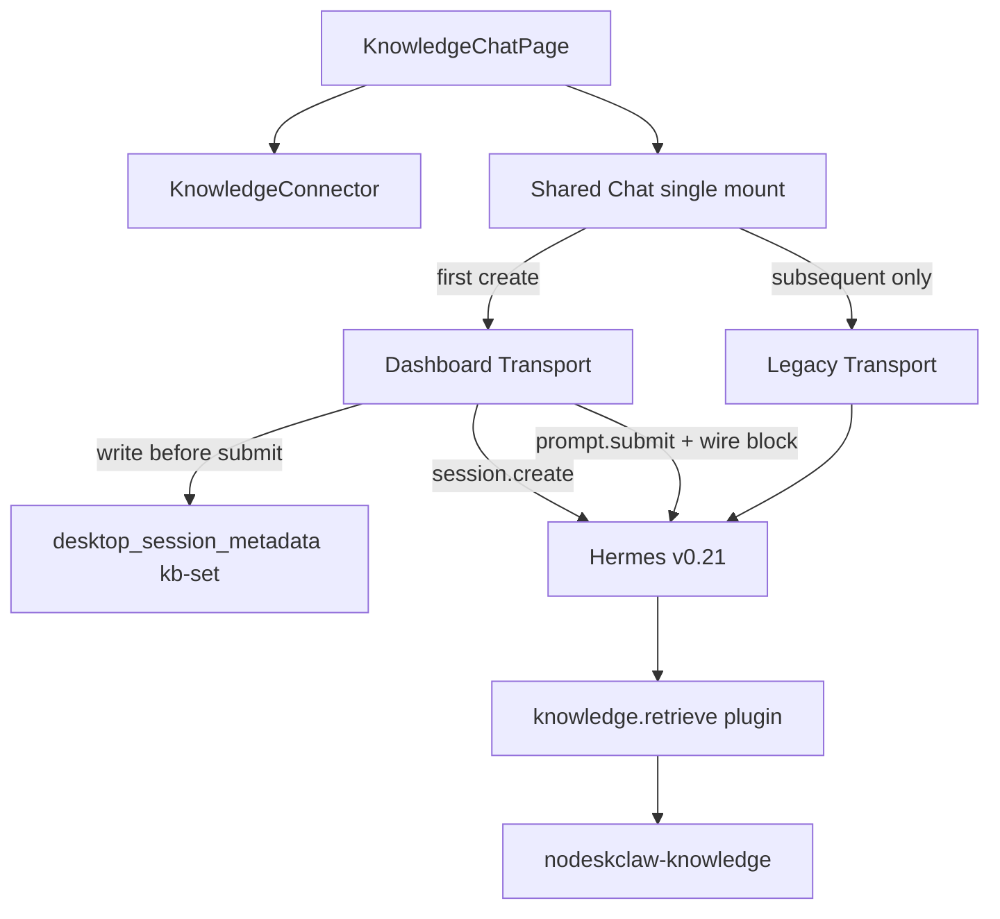

# KnowledgeChat Hermes Connector v1.1 Implementation Plan

## Approved PRD / Workspace

- PRD: [docs/knowledge/PRD-WORK-KNOWLEDGE-CHAT-v1.0-hermes-knowledge-connector.md](docs/knowledge/PRD-WORK-KNOWLEDGE-CHAT-v1.0-hermes-knowledge-connector.md) (`version: 1.1.0`, `APPROVED_FOR_PLAN`)
- Conflict authority: PRD **§0.1 Grilling Amendment Lock (G1–G9)** > body
- Implementation tree: `apps/work` on current branch (Work routing per [AGENTS.md](AGENTS.md))
- Out of scope: plugin auth/schema (NON-GOAL-004), Portal→Hermes credential bridge (G9/SEC-006), Evidence/Citation rail, second Chat runtime, `desktop_session_knowledge_context` table, Salt trees

## Target architecture



## Locked decisions (do not re-decide)

Mirror PRD §27.1 / §0.1: one Chat runtime; `kb-set` on existing metadata store; list/search exclude; Knowledge-only mount; create→write→submit; Dashboard-only first create; profile switch abort+unload; delete by `session_id`; BLOCKED read-only transcript; wire+Golden observe-once; no Portal token on set selection.

## Key code leverage

| Area | Anchor |
|---|---|
| Metadata SOT | [session-metadata-store.ts](apps/work/src/main/session-metadata-store.ts) — extend CHECK + `knowledge_set_id`; migration (not IF NOT EXISTS alone) |
| Sync backfill | [session-cache.ts](apps/work/src/main/session-cache.ts) `localChatClassification` / `ensureChatSessionMetadata` — must not downgrade `kb-set` |
| Delete | [sessions.ts](apps/work/src/main/sessions.ts) `deleteSessionRows` — delete **all** metadata rows by `session_id` |
| Search/list | `searchSessions` + Sessions UI / cache consumers — filter `session_kind !== kb-set` |
| Resume guard | [chatRuns.ts](apps/work/src/renderer/src/screens/Layout/chatRuns.ts) `resolveResumeExecutionMode` / Layout resume — reject kb-set |
| Dashboard order | [useDashboardChatTransport.ts](apps/work/src/renderer/src/screens/Chat/hooks/useDashboardChatTransport.ts) `ensureRuntimeSession` then submit — insert metadata write between create and submit when Knowledge |
| Legacy send | [hermes.ts](apps/work/src/main/hermes.ts) / preload `sendMessage` — optional context; require existing kb-set row |
| Knowledge host | [KnowledgeChatPage.tsx](apps/work/src/renderer/src/screens/Knowledge/pages/KnowledgeChatPage.tsx) replace facade synthetic thread; [KnowledgeView.tsx](apps/work/src/renderer/src/screens/Knowledge/KnowledgeView.tsx) + [Layout.tsx](apps/work/src/renderer/src/screens/Layout/Layout.tsx) pass `activeProfile` |
| Toolbar slot | [ChatInput.tsx](apps/work/src/renderer/src/screens/Chat/ChatInput.tsx) `toolbarExtras` |
| Sets API | existing `hermesAPI.knowledgeJobs.sets.list/get` (Main token-store; no token in Chat context) |

## Implementation todos

Each todo uses PRD §27.2 fields. `status` starts `pending`; `implemented` and `verified` stay separate during execution.

### Phase 1 — Contract + metadata

**T1 — `chat-knowledge-context` pure contract**
```yaml
id: T1-chat-knowledge-context
requirement_refs: [REQ-API-001, SCOPE-014, SEC-006]
acceptance_refs: [A-API-001, A-API-002, A-SEC-001]
files_or_symbols:
  - apps/work/src/shared/knowledge/chat-knowledge-context.ts
  - apps/work/src/shared/knowledge/chat-knowledge-context.test.ts
implementation_goal: ChatKnowledgeContextV1 + composeKnowledgeScopedPrompt; null = identity; no token fields
preconditions: none
state_transition: none (pure)
side_effect_scope: NONE
failure_cases: empty knowledgeSetId → KNOWLEDGE_SET_REQUIRED path for callers
verification: unit tests deterministic / escaping / no JWT substring
status: pending
evidence: ""
```

**T2 — `session-metadata-store` kb-set migration + APIs**
```yaml
id: T2-kb-set-metadata
requirement_refs: [REQ-STATE-001, SCOPE-006, G1, G4, G6]
acceptance_refs: [A-STATE-001, A-STATE-002, A-NEG-201]
files_or_symbols:
  - apps/work/src/main/session-metadata-store.ts
  - apps/work/src/main/session-metadata-store.test.ts
  - apps/work/src/main/session-cache.ts
implementation_goal: Migrate desktop_session_metadata for session_kind=kb-set + knowledge_set_id; upsert/get/conflict; empty-chat upgrade when message_count=0; ensureChatSessionMetadata MUST NOT overwrite kb-set; deleteAllMetadataForSessionId(session_id)
preconditions: T1 types available if shared
state_transition: none|chat(empty) → kb-set; conflict 0 mutation
side_effect_scope: local SQLite only
failure_cases: conflict; write fail; non-empty chat cannot upgrade
verification: store unit tests + cache sync does not demote kb-set
status: pending
evidence: ""
```

**T3 — IPC/preload get/set + delete wiring + list/search filter**
```yaml
id: T3-ipc-list-search-delete
requirement_refs: [REQ-STATE-001, SCOPE-011, G2, G6]
acceptance_refs: [A-STATE-002, A-STATE-101]
files_or_symbols:
  - apps/work/src/main/ipc/register.ts
  - apps/work/src/preload/index.ts
  - apps/work/src/preload/index.d.ts
  - apps/work/src/main/sessions.ts
  - apps/work/src/renderer/src/screens/Sessions/Sessions.tsx
implementation_goal: getSessionKnowledgeContext / setSessionKnowledgeContext; deleteSessionRows deletes all metadata by session_id; searchSessions + list/cache paths exclude kb-set
preconditions: T2
state_transition: delete session → metadata gone
side_effect_scope: IPC + SQLite + search results
failure_cases: conflict surfaced on set; missing row → null
verification: IPC/store tests; search fixture with kb-set returns 0
status: pending
evidence: ""
```

### Phase 2 — Shared Chat capability

**T4 — Chat props + send guard + ordinary mount reject**
```yaml
id: T4-chat-props-guard-mount
requirement_refs: [REQ-UI-003, SCOPE-003, SCOPE-013, G3]
acceptance_refs: [A-NEG-001, A-API-002]
files_or_symbols:
  - apps/work/src/renderer/src/screens/Chat/Chat.tsx
  - apps/work/src/renderer/src/screens/Chat/hooks/useChatActions.ts
  - apps/work/src/renderer/src/screens/Layout/chatRuns.ts
  - apps/work/src/renderer/src/screens/Layout/Layout.tsx
implementation_goal: Optional knowledgeContext / knowledgeRequired / knowledgeControl; required+no set disables Send; resolveResumeExecutionMode + Layout resume REJECT kb-set (fail closed, do not open as local-chat)
preconditions: T1, T3
state_transition: ordinary resume of kb-set → rejected
side_effect_scope: Renderer only for guard; no Hermes send
failure_cases: KNOWLEDGE_SET_REQUIRED; mount reject
verification: Chat.knowledge-context.test + chatRuns/Layout tests; ordinary Chat null-context zero-change
status: pending
evidence: ""
```

**T5 — Dashboard first-create path**
```yaml
id: T5-dashboard-create-metadata-submit
requirement_refs: [REQ-API-002, REQ-STATE-001, SCOPE-012, G4]
acceptance_refs: [A-STATE-001, A-API-101]
files_or_symbols:
  - apps/work/src/renderer/src/screens/Chat/hooks/useDashboardChatTransport.ts
implementation_goal: When Knowledge first create — session.create → setSessionKnowledgeContext → prompt.submit with composed wire; on write fail do not submit and delete empty Hermes session; Dashboard unavailable → KNOWLEDGE_DASHBOARD_REQUIRED (no Legacy)
preconditions: T2, T3, T4
state_transition: READY → STARTING_SESSION → PERSISTING_KB_SET → BOUND
side_effect_scope: Hermes create; metadata write; optional empty-session delete
failure_cases: persist fail; dashboard down; conflict
verification: transport unit/integration with mocked client + Main store
status: pending
evidence: ""
```

**T6 — Legacy subsequent-turn only**
```yaml
id: T6-legacy-subsequent-knowledge
requirement_refs: [REQ-API-003, SCOPE-005, G4]
acceptance_refs: [A-API-201, A-API-202]
files_or_symbols:
  - apps/work/src/main/hermes.ts
  - apps/work/src/preload/index.ts
  - apps/work/src/renderer/src/screens/Chat/hooks/useChatActions.ts
implementation_goal: Optional ChatKnowledgeContext on sendMessage; Main composes Knowledge→File→User on wire only; reject send if no kb-set row (first create); display message unchanged
preconditions: T3, T5
state_transition: none on metadata for later turns
side_effect_scope: wire compose only
failure_cases: first-create via Legacy rejected
verification: main IPC knowledge send tests
status: pending
evidence: ""
```

### Phase 3 — Connector + Knowledge scope

**T7 — KnowledgeConnector + useKnowledgeChatScope**
```yaml
id: T7-connector-scope
requirement_refs: [REQ-UI-002, REQ-STATE-002, SCOPE-002, G2, G5, G7]
acceptance_refs: [A-UI-101, A-UI-102, A-STATE-101, A-NEG-101, A-NEG-202]
files_or_symbols:
  - apps/work/src/renderer/src/screens/Chat/knowledge/KnowledgeConnector.tsx
  - apps/work/src/renderer/src/screens/Knowledge/features/chat/useKnowledgeChatScope.ts
implementation_goal: list/get active sets; pre-session switch; bound lock + New knowledge chat; resume from kb-set row for activeProfile only; BLOCKED read-only when set/provider/auth fail; route knowledgeSetId only before session
preconditions: T3, T4
state_transition: UNBOUND↔READY; BOUND immutable; BLOCKED read-only
side_effect_scope: sets.list/get network; no retrieval; no token bind
failure_cases: F-UI-101..105; RESUME_BLOCKED
verification: connector + scope unit tests
status: pending
evidence: ""
```

**T8 — Single Chat mount + profile switch abort**
```yaml
id: T8-single-mount-profile
requirement_refs: [SCOPE-013, G3, G5]
acceptance_refs: [A-UI-001]
files_or_symbols:
  - apps/work/src/renderer/src/screens/Knowledge/pages/KnowledgeChatPage.tsx
  - apps/work/src/renderer/src/screens/Knowledge/KnowledgeView.tsx
  - apps/work/src/renderer/src/screens/Layout/Layout.tsx
implementation_goal: Knowledge page mounts at most one Chat; switch session releases prior; Layout passes activeProfile; profile change aborts in-flight Knowledge turn, unloads Chat, refreshes kb-set list for new profile
preconditions: T7
state_transition: profile switch → unload
side_effect_scope: abort Chat; no metadata rewrite
failure_cases: mid-stream abort
verification: page/hook tests for single mount + profile change
status: pending
evidence: ""
```

### Phase 4 — Replace KnowledgeChatPage

**T9 — Remove synthetic path; mount Shared Chat**
```yaml
id: T9-replace-knowledge-chat-page
requirement_refs: [REQ-UI-001, REQ-MIGRATE-001, SCOPE-001, SCOPE-009]
acceptance_refs: [A-UI-001, A-UI-002, A-MIGRATE-001, A-NEG-301]
files_or_symbols:
  - apps/work/src/renderer/src/screens/Knowledge/pages/KnowledgeChatPage.tsx
  - apps/work/src/renderer/src/screens/Knowledge/KnowledgePages.tsx
implementation_goal: Delete LocalMessage/echo/synthetic citation/mock send gate; mount Shared Chat with knowledgeRequired + connector toolbarExtras; kb-set session list from metadata (current profile); no second runtime
preconditions: T5–T8
state_transition: product path = Hermes Chat only
side_effect_scope: UI composition
failure_cases: provider unavailable without synthetic fallback
verification: KnowledgeChatPage tests; source oracles A-MIGRATE-001
status: pending
evidence: ""
```

### Phase 5 — Integration / evidence

**T10 — Focused suite + Golden observe-once**
```yaml
id: T10-verify-release-gate
requirement_refs: [REQ-AGENT-001, G8, Release Gate §26]
acceptance_refs: [A-INT-001, A-INT-002, A-SEC-001, all Required A-*]
files_or_symbols:
  - apps/work tests under Chat/Knowledge/main as listed in PRD §31
implementation_goal: npm test / typecheck / guard green for touched package; Golden Consumer ≥1 knowledge.retrieve with matching knowledge_set_id; no Portal token in context/metadata; BLOCKED read-only path covered
preconditions: T9
state_transition: n/a
side_effect_scope: test/evidence only
failure_cases: injection matrix PRD §23
verification: Required AC PASS; BLOCKED/SKIPPED ≠ PASS
status: pending
evidence: ""
```

## Execution order

```text
T1 → T2 → T3 → T4 → T5 → T6 → T7 → T8 → T9 → T10
```

T6 may start after T5’s create path is green; do not enable Legacy first-create.

## Explicit non-goals in this plan

- Do not inject Portal JWT into ChatKnowledgeContext, kb-set rows, or wire blocks
- Do not modify hermes-plugin-nodeskclaw-knowledge
- Do not add Evidence/Citation rail
- Do not list kb-set in ordinary Sessions or search
