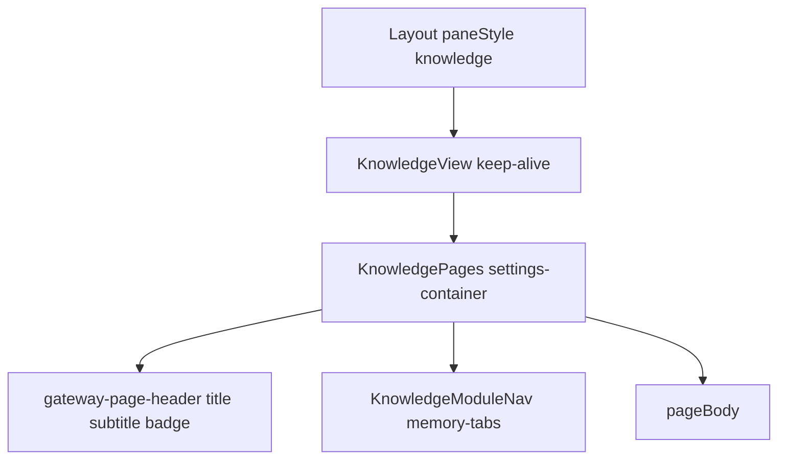

# Knowledge Layout 与实体页还原

对照 [PRD-WORK-KNOWLEDGE-v1.1-RM-MOCK-02](docs/work/PRD-WORK-KNOWLEDGE-v1.1-RM-MOCK-02-page-feature-migration.md)（APPROVED）。已有 GES plan [work-knowledge-ui-01-page-feature-migration.plan.md](.cursor/plans/work-knowledge-ui-01-page-feature-migration.plan.md) 交付了 **route-scope host + Facade 数据桩**；本轮不重开 Architecture / 不改 Job/Facade 合同，只补 **C02 模块框架** 与 **C03–C08 页面信息架构**。

## 现状

- Host：[KnowledgePages.tsx](apps/work/src/renderer/src/screens/Knowledge/KnowledgePages.tsx) 已切换六页，但子菜单是无样式 `<button>` + inline flex；[KnowledgeView.tsx](apps/work/src/renderer/src/screens/Knowledge/KnowledgeView.tsx) 还露出调试 `knowledge-route-page` 文本。
- 六页已存在于 [pages/](apps/work/src/renderer/src/screens/Knowledge/pages/)，数据与 fail-closed 已通，UI 仍是 `<ul>`/`<input>` 桩，不是源站实体页。
- 源站对照（只读，禁止 runtime import）：[apps/knowledge/lat.md/features.md](apps/knowledge/lat.md/features.md) + `apps/knowledge/src/features/{knowledge-home,knowledge-bases,knowledge-sets,documents,uploads,knowledge-chat}`。不迁 Profile / Preferences。

## 关键约束

- **不扩** [KnowledgeFacadeEntitySnapshot](apps/work/src/shared/knowledge/knowledge-job-ipc.ts)：公开字段只有 `id/kind/title/permission`。Mock adapter 会把额外 `patch` 写入 payload，但 **get/list 不回传**。因此还原的是 **布局与交互壳**，筛选只作用在 `title` + `permission.visibility`；description/tags/status/bindings/retrieval/parse 作为 **可见分区 + 本地 draft**，mock 下 `mutateEntity` 可写，reload 后非 snapshot 字段为空。需要扩 snapshot 则 STOP 并回 Architecture（FULL）。
- `listEntities.parentId` 已在类型里，mock store **未按 parent 过滤**。Base 详情「文档」Tab 列全量 document，不假装 scoped API。
- 禁止 import `apps/knowledge`、shadcn、TanStack Router/Query、Zustand、Sonner。
- 文案只写 [en/knowledge.ts](apps/work/src/shared/i18n/locales/en/knowledge.ts)。
- 保留现有 `data-testid`（`knowledge-module-nav`、`knowledge-nav-*`、各页 `knowledge-*-page`），避免拆坏 V01–V07。

## 1. 模块 Layout + 顶部子菜单

用户已选 **顶部 Tabs**（对齐 Memory / Discover，不再套内部左栏）。

改动：

- 新增 [KnowledgeModuleNav.tsx](apps/work/src/renderer/src/screens/Knowledge/KnowledgeModuleNav.tsx)：复用 `.memory-tabs` / `.memory-tab`（或 `.discover-tab`），Lucide 图标，`aria-current="page"`，点击 `onNavigate({ page, params: {} })`。根节点保留 `data-testid="knowledge-module-nav"`。
- 重写 [KnowledgePages.tsx](apps/work/src/renderer/src/screens/Knowledge/KnowledgePages.tsx)：
  - 根：`settings-container` + `height: 100%` 列布局，避免被 `ActiveSessionsBar` 压扁。
  - Header：`gateway-page-header` + `settings-header` + **按页** subtitle（`knowledge.*.description`），不再六页共用 `knowledge.host.subtitle`。
  - Mock badge 从 View 调试行挪进 header（`settings-card-badge is-update`，`data-persistent` 保留）。
- [KnowledgeView.tsx](apps/work/src/renderer/src/screens/Knowledge/KnowledgeView.tsx)：去掉可见 route 文本；`data-page` / `data-testid` 留在 host。
- CSS：只在 [main.css](apps/work/src/renderer/src/assets/main.css) 补窄宽度 Tabs wrap（PRD C02），不发明第三套 nav 视觉。

## 2. 共享 Knowledge chrome（Work token，不抄源站）

在 `screens/Knowledge/` 增加薄封装（类名来自 Work，不是 shadcn）：

- 页内 toolbar：`discover-search` / `discover-search-input` + `btn btn-secondary btn-sm`
- 区块：`settings-section`、`settings-card`、`settings-card-badge`
- 空态 / 不可用：已有 `gateway-empty-state`
- Loading：`OrbLoader`（Memory/Gateway 先例），替换裸 `
loading
`
- Dialog：`AppModal` 做创建/编辑/确认删除
- 页内二级 Tabs（详情 documents/settings/…）：同样用 `memory-tab`，**不要**再做一层模块导航

## 3. 实体页还原（相对源站 IA）

每个域拆 **list + detail 组合**（host 仍一个 page id）。现有 `Knowledge*Page.tsx` 变成薄 switch；实体 UI 落到同目录子文件。数据路径保持 `useKnowledgeFacade` / `knowledgeJobs` / File APIs。

| Work 页 | 源站对照 | 本轮必须还原的 IA | 明确不做 |
|---|---|---|---|
| Home | `knowledge-home/index.tsx` | 概览卡（mock 计数可点进对应页）；最近 sets/docs；快捷上传/问答。provider：**结构在、数字不伪造** | 跨 feature Query；假 parse 统计 |
| Bases | `knowledge-base-list/detail.tsx` | 搜索 + visibility 筛 + **card/table 切换**；`AppModal` 创建/编辑；确认删除；详情：返回、上传入口（`onNavigate uploads`）、分区 Documents / Settings / Members / Runtime | 真授权；RAGFlow ID；扩 snapshot |
| Sets | `knowledge-set-list/detail.tsx` | 搜索 + 卡片列表；创建/编辑 dialog；详情：Info / Bindings（checkbox 列表 + weight draft）/ Retrieval form / Usage。provider 不可提交 | 远端检索；`parentId` 真绑定 |
| Documents | `documents-list/detail.tsx` | 搜索 + visibility 筛 + 表格行；详情：Preview / Info / Versions / Parse / Permission（display-only）。有 ManagedFile 时用 Work preview **body**，不接 Chat「加入上下文」 | 把 permission 写成授权；硬编码 version/parse 冒充真实管线 |
| Uploads | `uploads-page.tsx` | 目标 Base 选择 + `useFilePicker`/`FilePickerButton` → `createDraft`；Job 卡片 + 进度/取消/重试；无 Renderer `setInterval` | sample timer；改 Job IPC |
| Chat | `knowledge-chat-page.tsx` | 三栏：session rail / 消息+composer / citation；`AppModal` 新建会话（选 set）；provider composer disabled；mock send 只打 Facade | Work Chat/Skill Run；TanStack chat |

详情路由继续用现有 params：`knowledgeBaseId` / `knowledgeSetId` / `documentId` / `sessionId`，不写 window URL。

Documents preview：复用 [useFilePreview](apps/work/src/renderer/src/hooks/files) + [FilePreviewRouter](apps/work/src/renderer/src/components/files/preview/FilePreviewRouter.tsx)（或等价 preview body）。不要整页嵌入带 Chat `sessionId` 的 [FilePreviewPanel](apps/work/src/renderer/src/components/files/preview/FilePreviewPanel.tsx)，以免「加入会话上下文」。

## 4. 验证

- 扩展现有 `apps/work/tests/knowledge-*-page.test.ts`：Tabs 切换、card/table、dialog open、provider 控件可见但 mutation disabled、Chat 仍无 Chat Run import。
- 保留 `knowledge-page-host` / fail-closed / i18n-source-locale-only。
- UI 落地后用浏览器走六页：宽/窄内容区、list→detail→back、mock CRUD、uploads Job、Chat 发送与 citation。无 Electron 窗口时用测试 + 结构 checklist 说明未覆盖项。

## 不在本轮

- Mode Controller / Facade / Job / mock store schema
- 真实 Remote Adapter
- Profile / Preferences / 第二 Shell / Module Registry
- 把 payload 提升为公开 snapshot 字段
