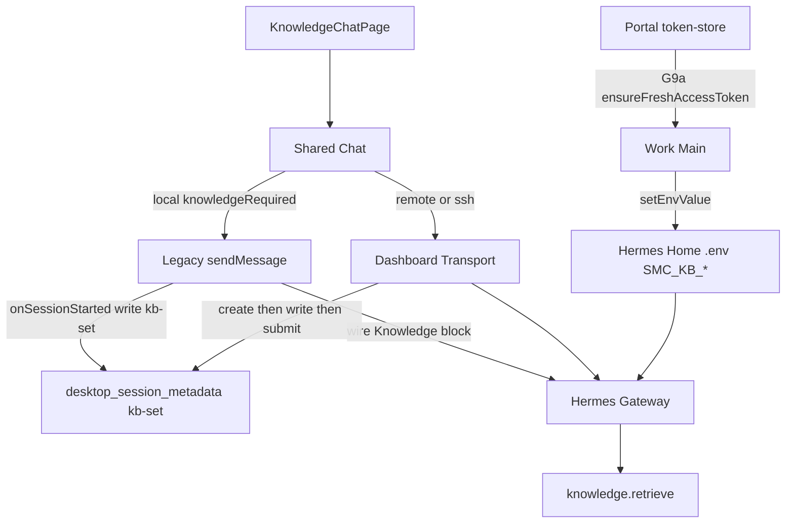

# KnowledgeChat Plan B — PRD v1.1.1 Amendment Plan

## Approved PRD / Workspace

- PRD: [docs/knowledge/PRD-WORK-KNOWLEDGE-CHAT-v1.0-hermes-knowledge-connector.md](docs/knowledge/PRD-WORK-KNOWLEDGE-CHAT-v1.0-hermes-knowledge-connector.md) (`version: 1.1.1`, `APPROVED_FOR_PLAN`)
- Conflict authority: **§0.1 G1–G9a** > body（body 中仍残留的 Dashboard-only / Legacy reject 句以 §0.1 为准，并由本计划 T-P1 清掉）
- Supersedes first-create assumptions in [.cursor/plans/knowledge_chat_connector_3174e83f.plan.md](.cursor/plans/knowledge_chat_connector_3174e83f.plan.md)（T5/T6「仅 Dashboard 首创 / Legacy 禁止首创」作废）
- Tree: `apps/work` only；不改 plugin 源码、不碰 Salt

## Baseline (already shipped in tree)

v1.1.0 connector T1–T10 remain complete. Plan B code already present:

| Capability | Anchor |
|---|---|
| G9a sync Portal→`.env` | [knowledge-plugin-credentials.ts](apps/work/src/main/knowledge/knowledge-plugin-credentials.ts) + IPC `sync-knowledge-plugin-credentials` |
| Legacy first-create + kb-set on `onSessionStarted` | [register.ts](apps/work/src/main/ipc/register.ts) `send-message` Knowledge branch |
| Local Knowledge forces Legacy | [useDashboardChatTransport.ts](apps/work/src/renderer/src/screens/Chat/hooks/useDashboardChatTransport.ts) `knowledgeChatForcesLegacyTransport` + [Chat.tsx](apps/work/src/renderer/src/screens/Chat/Chat.tsx) |
| Cache materialize as `kb-set` | [session-cache.ts](apps/work/src/main/session-cache.ts) `recordVisibleChatSession(..., { sessionKind: "kb-set" })` |

Ordinary Chat / remote Dashboard first-create path unchanged.

## Target architecture (Plan B)



## Locked decisions (do not re-decide)

- Local + `knowledgeRequired` → Legacy only（避开 `HERMES_DASHBOARD_SESSION_TOKEN`）
- Legacy 首创顺序：compose wire → `sendMessage` → `session_id` → Main 写 kb-set（优先 `onSessionStarted`，先于 `ensureChat` demote）
- `ChatKnowledgeContextV1` 只带 `knowledge_set_id`；JWT 只走 G9a
- Remote/SSH 仍可走 Dashboard create→metadata→submit
- 普通 Chat 不启用本分支

## Remaining work (this plan)

### T-P1 — Align PRD body with §0.1

```yaml
id: T-P1-prd-body-align
requirement_refs: [G4, G9a, SCOPE-012, REQ-API-002, REQ-API-003]
acceptance_refs: [A-API-101, Failure Injection §23]
files_or_symbols:
  - docs/knowledge/PRD-WORK-KNOWLEDGE-CHAT-v1.0-hermes-knowledge-connector.md
implementation_goal: >
  Rewrite §23 rows that still say "Dashboard unavailable → no Legacy create"
  and "Legacy first create attempt → rejected". Point REQ-API-002/003 Acceptance
  at Local Legacy first-create + G9a. Keep Dashboard-preferred wording for remote.
verification: grep body for Dashboard-only / Legacy rejected = 0 conflicts with §0.1
status: pending
```

### T-P2 — Gateway consumes synced SMC_KB_* (fix live 401)

```yaml
id: T-P2-gateway-env-reload
requirement_refs: [G9a, REQ-AGENT-001]
acceptance_refs: [A-INT-001]
files_or_symbols:
  - apps/work/src/main/knowledge/knowledge-plugin-credentials.ts
  - apps/work/src/main/hermes.ts (restartGateway)
implementation_goal: >
  After writing SMC_KB_API_TOKEN, if token changed vs previous Hermes .env value
  and local gateway is running under Work runtime management, call restartGateway(profile)
  once so knowledge.retrieve sees the Portal JWT. Skip restart when token unchanged.
  Do not put JWT on Chat wire.
preconditions: T-P1 wording ok; sync API already exists
failure_cases: auth missing → KNOWLEDGE_PLUGIN_AUTH; restart fail surfaced, no silent stale token claim
verification: unit test token-unchanged skips restart; token-changed invokes restart; manual local Knowledge retrieve no HTTP 401
status: pending
```

### T-P3 — Contract tests for Legacy first-create + local force

```yaml
id: T-P3-legacy-first-tests
requirement_refs: [G4, REQ-API-003, SCOPE-012]
acceptance_refs: [A-API-101 path Local, A-NEG-*]
files_or_symbols:
  - apps/work/src/main/knowledge/knowledge-plugin-credentials.test.ts
  - apps/work/src/main/session-cache.test.ts
  - apps/work/src/renderer/.../useDashboardChatTransport.test.tsx
  - apps/work/src/renderer/.../useChatActions (or register send-message focused test if extractable)
implementation_goal: >
  Keep/extend unit coverage: no KNOWLEDGE_DASHBOARD_REQUIRED on Legacy first create;
  kb-set written before chat demote; knowledgeChatForcesLegacyTransport(local)=true;
  ordinary Chat still dashboard-capable.
verification: focused vitest green
status: pending
```

### T-P4 — Evidence + Release Gate refresh

```yaml
id: T-P4-evidence-v111
requirement_refs: [Release Gate §26, G8, G9a]
acceptance_refs: [A-INT-001, A-SEC-001, A-API-101]
files_or_symbols:
  - docs_agent/evidence/WORK-KNOWLEDGE-CHAT-connector-v1.1-evidence.json
implementation_goal: >
  Bump evidence prd_version to 1.1.1; record T-P2/T-P3 commands; note Live Golden
  observe still env-gated but Local Legacy path is the intended golden path.
verification: evidence JSON valid; Required AC not marked PASS without command result
status: pending
```

## Execution order

```text
T-P1 → T-P2 → T-P3 → T-P4
```

Do not reopen v1.1.0 T1–T10 unless a regression appears.

## Explicit non-goals

- Do not spawn Work-owned local Dashboard for Knowledge
- Do not inject Portal JWT into ChatKnowledgeContext / kb-set / Renderer
- Do not change hermes-plugin-nodeskclaw-knowledge
- Do not enable Legacy first-create for ordinary (non-knowledge) Chat
