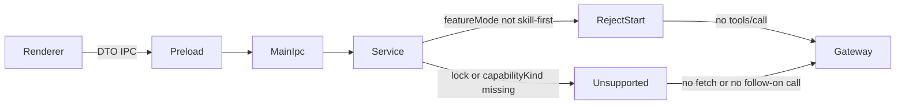

# M1 Main/Preload Dark Foundation Plan

Mode: **CREATE**. Target `.cursor/plans/work-v4.0.1-m1-main-preload-dark-foundation.plan.md` does not exist. Source PRD is APPROVED with review PASS. `commit_policy: post_review`.

This is a **KEEP-only** Plan. Ponytail stops at `REUSE_EXISTING`. T1 collects blocking evidence; it does not write Skill Run production symbols. If focused tests fail, stop and revise the Plan (or RETURN_PRD). Do not patch off-matrix.

After this Plan is confirmed, persist the v3.2 file, then run generation-integrity, `smc-plan-validator`, and `assess_plan_review`. IPC/auth KEEP plus a non-None contract matrix means **semantic review is REQUIRED** before Execute.

---

Frontmatter to persist:

- `plan_contract: smc.plan.v3.2`
- `commit_policy: post_review`
- `source_revision: WORK-SKILL-FIRST-LAYOUT-V4.0.1@v2.1/RM-02`
- `grounded_commit: ac88d25ea93722126a1d3661ac55404ed92e7eef`
- `grounding_source: committed_baseline`
- `working_tree_fingerprint: clean`

## Approved PRD

[docs/work/PRD-WORK-v4.0.1-M1-main-preload-dark-foundation.md](docs/work/PRD-WORK-v4.0.1-M1-main-preload-dark-foundation.md)

## Scope

- In: reuse and re-prove shared DTO, consumer lock, Gateway, Service start gate, narrow IPC, Preload wrapper, default `expert-compat`, and the four focused suites.
- Out: Provider Bundle edits, default `skill-first`, RM-01 live replay, real start/retry/recovery/cancel, session continuation, artifacts, Layout/Chat selection UI, P1, Expert removal.
- Production Owner inherited from PRD: Main `SkillRunGatewayClient` / `SkillRunService`; `apps/work/src/shared/skill-run.ts` owns cross-process DTO; Preload is an IPC wrapper only.

## Grounding Evidence Ledger

KEEP rows exist so the generation-integrity table is non-empty. Non-KEEP set is empty, so no new symbol resolution is required.

- C01 `apps/work/src/shared/skill-run.ts#SKILL_RUN_IPC_CHANNELS` — exists at grounded_commit — Preload and Main import this DTO — no second IPC contract found — PASS
- C02 `apps/work/src/main/skill-run/skill-run-consumer-lock.ts#isCompleteSkillRunBundleDir` and `.../skill-run-gateway-client.ts#createSkillRunGatewayClient` — lock miss does not fetch; missing `capabilityKind` returns `contract-unsupported` — PASS
- C03 `apps/work/src/main/skill-run/skill-run-service.ts#createSkillRunService` and `.../feature-mode-store.ts#getSkillRunFeatureMode` — default `expert-compat`; start returns `START_DISABLED_FEATURE_MODE` and does not call `gateway.callSkill` — PASS
- C04 `apps/work/src/main/skill-run/skill-run-ipc.ts#registerSkillRunIpc` and `apps/work/src/preload/skill-run-api.ts#createSkillRunApi` — start path validates sender, auth generation, required fields, length; Preload is invoke/on only — PASS
- C05 four existing test files (29 tests) — PASS

## Requirement Coverage Ledger

Obligation text is the PRD numbered items. Todo is T1 for evidence collection only; Change IDs stay KEEP.

- AC-01 SECURITY — C01, C04 — T1 — V01, V02 — UNIT — yes
- AC-02 CONTRACT — C02 — T1 — V01 — UNIT — yes
- AC-03 NEGATIVE — C03 — T1 — V01 — UNIT — yes
- AC-04 SECURITY — C04 — T1 — V01 — UNIT — yes
- AC-05 SCOPE — C01, C03, C05 — T1 — V01, V03 — DIFF_SCOPE — yes
- AC-06 EVIDENCE — C05 — T1 — V01 — UNIT — yes
- AC-07 OPERATIONS — C02, C03 — T1 — V04 — DOCUMENT_SEMANTIC — yes
- DOD-01 EVIDENCE — C05 — T1 — V01, V02, V03, V04 — EVIDENCE — yes
- DOD-02 OPERATIONS — C03 — T1 — V04 — DOCUMENT_SEMANTIC — yes
- DOD-03 SCOPE — C02, C03 — T1 — V04 — DOCUMENT_SEMANTIC — yes

## Lifecycle Closure Matrix

None. No PRD State and Concurrency Invariants. No requirement classified LIFECYCLE. M1 start must not enter a run.

## Contract / Data Flow Closure Matrix

Not None. Two KEEP IPC flows remain in scope for AC proof.

- Catalog fail-closed: producer `createSkillRunGatewayClient.listCatalog`; transport `SkillCatalogResponse` on `skill-run:list-catalog`; consumer `createSkillRunApi.listCatalog`; required fields `status`, `tools`; validation owner Gateway `listCatalog`; failure `contract-unsupported` and empty tools, no follow-on `tools/call`; retry identity not used; evidence V01
- Start disabled: producer Renderer `SkillRunStartInput` via Preload; transport `skill-run:start`; consumer `registerSkillRunIpc` then `createSkillRunService.start`; required fields `toolName`, `prompt`, `clientRequestId`, `sessionId`, `profileId`, `authGeneration`; validation owner IPC `registerSkillRunIpc`; failure throw on invalid input, or `START_DISABLED_FEATURE_MODE` with `callSkill` not invoked; retry identity not used on this path; evidence V01

## Verification Ledger

- V01 UNIT — `cd apps/work && npx vitest run src/main/skill-run/skill-run-consumer-lock.test.ts src/main/skill-run/skill-run-gateway-client.test.ts src/main/skill-run/skill-run-service.test.ts src/main/skill-run/skill-run-ipc.test.ts` — 29 tests pass; catalog `contract-unsupported` without lock or `capabilityKind`; default mode `expert-compat`; start returns `START_DISABLED_FEATURE_MODE` and `callSkill` is not called; IPC rejects invalid sender, missing fields, and auth-generation mismatch — negative: lock-absent fetch and disabled start — evidence `apps/work/artifacts/rm-02-m1/v01-focused-tests.log` — local apps/work — blocking yes
- V02 UNIT — Python read of `apps/work/src/preload/skill-run-api.ts` asserting no `fetch(`, `Authorization`, `accessToken`, or backend origin — oracle: file is ipcRenderer invoke/on only — negative: those strings absent — evidence `apps/work/artifacts/rm-02-m1/v02-preload-isolation.log` — local — blocking yes
- V03 DIFF_SCOPE — `git diff --exit-code ac88d25ea93722126a1d3661ac55404ed92e7eef -- apps/work/src/shared/skill-run.ts apps/work/src/main/skill-run/skill-run-consumer-lock.ts apps/work/src/main/skill-run/skill-run-gateway-client.ts apps/work/src/main/skill-run/skill-run-service.ts apps/work/src/main/skill-run/feature-mode-store.ts apps/work/src/main/skill-run/skill-run-ipc.ts apps/work/src/preload/skill-run-api.ts` — oracle exit 0, no production KEEP-target diff — negative: any enablement of default `skill-first` or new owner — evidence `apps/work/artifacts/rm-02-m1/v03-prod-diff.log` — local git — blocking yes
- V04 DOCUMENT_SEMANTIC — Roadmap still has RM-01 and RM-04 `BACKLOG`; `feature-mode-store.ts` still has `DEFAULT_MODE = "expert-compat"` — this Plan is not RM-01 live proof — evidence `apps/work/artifacts/rm-02-m1/v04-roadmap-gates.log` — local docs — blocking yes

## Immediate Read

- [docs/work/PRD-WORK-v4.0.1-M1-main-preload-dark-foundation.md](docs/work/PRD-WORK-v4.0.1-M1-main-preload-dark-foundation.md)
- `apps/work/src/main/skill-run/skill-run-service.ts#createSkillRunService`
- `apps/work/src/main/skill-run/feature-mode-store.ts#getSkillRunFeatureMode`
- `apps/work/src/main/skill-run/skill-run-ipc.ts#registerSkillRunIpc`
- `apps/work/src/preload/skill-run-api.ts#createSkillRunApi`
- the four focused test files listed in V01

## Triggered Read

- If V01 fails: only the failing test and its existing production owner. Then stop for Plan REVISE or RETURN_PRD. Do not add a write target that is not in the Matrix.
- If the gap needs a new Provider schema, Bundle change, or default `skill-first`: RETURN_PRD. Do not mix into M1.
- Do not read Renderer Catalog UI, `skill-run-e2e.test.ts` live path, continuation, session materialize, or artifact transfer.

## Change Matrix

All rows Action KEEP, Todo Owner `-`, New File? `no`.

- C01 PROD `apps/work/src/shared/skill-run.ts#SKILL_RUN_IPC_CHANNELS` — unique DTO/IPC names remain
- C02 PROD `apps/work/src/main/skill-run/skill-run-consumer-lock.ts#isCompleteSkillRunBundleDir` and `.../skill-run-gateway-client.ts#createSkillRunGatewayClient` — lock/discriminator fail-closed
- C03 PROD `apps/work/src/main/skill-run/feature-mode-store.ts#getSkillRunFeatureMode` and `.../skill-run-service.ts#createSkillRunService` — default-off start
- C04 PROD `apps/work/src/main/skill-run/skill-run-ipc.ts#registerSkillRunIpc` and `apps/work/src/preload/skill-run-api.ts#createSkillRunApi` — authenticated narrow IPC
- C05 TEST the four focused test files — re-runnable M1 evidence

## Implementation Decisions

Each KEEP Change is `REUSE_EXISTING`. Root-cause is the symbols above. Minimum because a new client, store, parser, or test harness would duplicate the approved owner.

## Write Ownership Ledger

- T1 — Owns Changes `-` — Writes `-` — Reads the C01–C04 symbols and the four test files — Depends On `-` — Parallel Safe yes

T1 is an evidence slice, not a production writer.

## Integration Hotspots

None

## Generated Outputs Ledger

None

## Todo T1 — Re-prove M1 dark foundation with focused evidence

**Owns Changes**
- none (KEEP C01–C05 stay unowned)

**Goal**
Produce V01–V04 evidence that the committed Main/Preload foundation still matches the APPROVED M1 boundary. Do not enable real `tools/call`. Do not add files, owners, or default `skill-first`.

**Immediate anchors**
- `apps/work/src/main/skill-run/skill-run-service.ts#createSkillRunService`
- `apps/work/src/main/skill-run/skill-run-ipc.ts#registerSkillRunIpc`
- `apps/work/src/preload/skill-run-api.ts#createSkillRunApi`

**Changes**
- None. Create `apps/work/artifacts/rm-02-m1/` only as Execute evidence output, not as a production write.

**Stop conditions**
- [ ] V01–V04 evidence files exist and match their oracles
- [ ] git diff of KEEP production symbols vs `ac88d25e` is empty
- [ ] no Skill Run production or test file was edited unless a later authorized Plan REVISE adds a Matrix MODIFY

**Triggered reads**
- If V01 fails: failing test plus its existing owner, then stop
- Otherwise: none

## Verification

Run V01–V04 as in the Verification Ledger. Expected: 29 focused tests pass; default start is disabled; Preload has no token or network; KEEP production files are unchanged; RM-01 remains the live-execution gate.

Negative/regression: missing lock or `capabilityKind` must not proceed to execution; invalid IPC input must not reach Service.

Do not run `skill-run-e2e` live replay as M1 proof.

## Completion Gate

- IMPLEMENTED_AND_PROVEN — all blocking V01–V04 outputs retained; empty production diff is success for KEEP, not a reason to invent a code commit
- IMPLEMENTED_NOT_PROVEN — symbols unchanged but evidence files missing
- BLOCKED — vitest/env cannot run V01
- RETURN_PRD — proof needs new Provider schema, Bundle change, default `skill-first`, or a second Skill Run owner

Post-review commit: evidence/docs only if needed. Do not manufacture a production diff to satisfy DOD-01.

## Downstream gates after persist

1. `python .agents/skills/smc-plan-from-approved-prd-ponytail/scripts/validate_generation_integrity.py .cursor/plans/work-v4.0.1-m1-main-preload-dark-foundation.plan.md`
2. `python .agents/skills/smc-plan-validator/scripts/validate_plan.py .cursor/plans/work-v4.0.1-m1-main-preload-dark-foundation.plan.md`
3. `python .agents/skills/smc-plan-review/scripts/assess_plan_review.py ...` — expect REQUIRED (auth/IPC)
4. `smc-plan-review` must PASS before Execute
5. Execute T1 with `commit_policy: post_review`