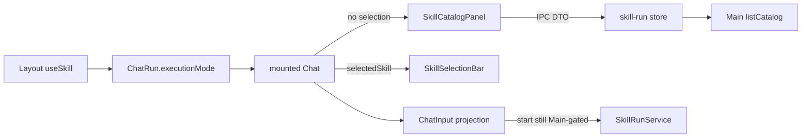

# M2 Layout, Catalog, and Safe Selection Plan

Mode: **CREATE**. Target [`.cursor/plans/work-v4.0.1-m2-layout-catalog-selection.plan.md`](.cursor/plans/work-v4.0.1-m2-layout-catalog-selection.plan.md) does not exist. Source PRD is APPROVED (`status: APPROVED`, `review_verdict: PASS`, `approved_at: 2026-09-02T12:01:26+08:00`). `commit_policy: post_review`. `grounded_commit: 07d70278a3d9fd310aa2670638eed21b1a96bcd8`.

Do not rewrite PRD owners. Layout owns tab `executionMode` only; mounted Chat owns selection; Main still owns Catalog HTTP and start. RM-01 stays `BACKLOG`.

After this Cursor plan is confirmed, persist the full v3.2 file, then run generation-integrity, `smc-plan-validator`, and `assess_plan_review`. Contract / Data Flow Closure is not `None` → **semantic review REQUIRED** before Execute.

---

## Approved PRD

[docs/work/PRD-WORK-v4.0.1-M2-layout-catalog-selection.md](docs/work/PRD-WORK-v4.0.1-M2-layout-catalog-selection.md)

## Scope

- In: Layout “使用技能” tab transition, Catalog panel states/search/keyboard, Chat-local selection + Composer projection, focused renderer tests; KEEP session display restore and Main no-execution gate.
- Out: Provider Bundle, real `tools/call`, pending-submit/SSE/cancel/retry, artifacts, Session writer, M5 default, P1, Expert removal.
- Production Owner inherited from PRD: Layout/`ChatRun` for mode; Chat for selection/submit; Main IPC/Gateway for Catalog data and Backend.

## Grounding (C01–C03 only)

- **C01** [`Layout.tsx`](apps/work/src/renderer/src/screens/Layout/Layout.tsx) `handleUseSkill` already: skill scratch → stay; blank scratch → set `executionMode: skill-run`; else reuse/mint skill scratch. It does not call `abortChat` (abort is only `handleCloseRun`). Transition is untested because logic is inline. Root cause: hoist to [`chatRuns.ts`](apps/work/src/renderer/src/screens/Layout/chatRuns.ts) next to `isScratchRun` / `mintRun`.
- **C02** [`SkillCatalogPanel.tsx`](apps/work/src/renderer/src/modules/skill-run/SkillCatalogPanel.tsx) already maps loading / contract-unsupported / unauthorized / backend-unavailable / empty / ready; search + Arrow/Enter/Escape exist; store uses `window.hermesAPI.skillRun` only. Gaps: no renderer tests; category pills lack `aria-pressed`; refresh has `title` but no `aria-label`.
- **C03** [`Chat.tsx`](apps/work/src/renderer/src/screens/Chat/Chat.tsx) holds `selectedSkill`; Catalog vs Selection Bar; submit blocked without selection; `toolbarExtras={isSkillRunMode ? null : …}` removes Expert/Model/Reasoning/Fast/Context Folder; [`ChatInput`](apps/work/src/renderer/src/screens/Chat/ChatInput.tsx) `attachmentsDisabled` hides attach. Restore effect inlines catalog lookup. Tests: extend [`ChatInput.test.tsx`](apps/work/src/renderer/src/screens/Chat/ChatInput.test.tsx); extract restore helper in Chat; add Selection Bar test file.

C04/C05 KEEP: `getSessionMode` restore and `createSkillRunService.start` `START_DISABLED_FEATURE_MODE` already exist; evidence only.

## Requirement coverage (AC-01–AC-08, DOD-01–03)

Obligation text must match PRD numbered items exactly in the persisted ledger.

- AC-01 BEHAVIOR → C01 T1 V01
- AC-02 BEHAVIOR → C01 T1 V01
- AC-03 CONTRACT → C02 T2 V02
- AC-04 BEHAVIOR → C02 T2 V02
- AC-05 BEHAVIOR → C03 T3 V03
- AC-06 BEHAVIOR → C03 T3 V03
- AC-07 NEGATIVE → C05 T3 V04 (KEEP Main gate; Chat still routes start through IPC)
- AC-08 EVIDENCE → C01–C03 T1–T3 V01–V03
- DOD-01 EVIDENCE → C01–C03 V01–V04
- DOD-02 OPERATIONS → C05 V04 + V05 (roadmap RM-01/RM-04 BACKLOG)
- DOD-03 SCOPE → C05 V05

Lifecycle Closure: **None** (no LIFECYCLE requirement; M2 must not enter a run).

## Contract / Data Flow Closure

| Flow | Requirements | Producer | Transport | Consumer | Required fields | Validation | Failure | Identity | Evidence |
|---|---|---|---|---|---|---|---|---|---|
| Catalog DTO | AC-03 | Main `listCatalog` | `SkillCatalogResponse` via `skill-run:list-catalog` | `fetchSkillRunCatalog` → panel | `status`, `tools` (skill-only from Main) | Gateway discriminator | UI `contract-unsupported`; no guess | not used | V02 |
| Start still gated | AC-07 | Chat `submitSkill` | `skill-run:start` | `createSkillRunService.start` | start DTO fields | Service feature mode | `START_DISABLED_FEATURE_MODE`; no `callSkill` | not used when disabled | V04 |

## Verification Ledger

- **V01** `npx vitest run src/renderer/src/screens/Layout/chatRuns.test.ts` (cwd `apps/work`) — scratch in-place mode change; non-scratch does not mutate other `loading` runs; no selectedSkill on ChatRun — evidence `apps/work/artifacts/rm-03-m2/v01-chatRuns.log`
- **V02** `npx vitest run src/renderer/src/modules/skill-run/SkillCatalogPanel.test.tsx` — all catalog statuses; search/category; Arrow/Enter/Escape; non-callable not selected — evidence `.../v02-catalog-panel.log`
- **V03** `npx vitest run src/renderer/src/screens/Chat/ChatInput.test.tsx src/renderer/src/modules/skill-run/SkillSelectionBar.test.tsx` plus Chat restore-helper tests colocated in ChatInput or a Chat export test — attach hidden; toolbar extras not in ChatInput; restore maps session tool display — evidence `.../v03-selection-composer.log`
- **V04** `npx vitest run src/main/skill-run/skill-run-service.test.ts` — default start `START_DISABLED_FEATURE_MODE` / `callSkill` not called — evidence `.../v04-start-disabled.log`
- **V05** document/roadmap check RM-01 and RM-04 `BACKLOG`; Layout has no `selectedSkill` field — evidence `.../v05-roadmap-scope.log`

All blocking yes.

## Change Matrix

KEEP rows: Todo Owner `-`.

- C01 PROD MODIFY [`chatRuns.ts#selectSkillModeTransition`](apps/work/src/renderer/src/screens/Layout/chatRuns.ts) (new symbol in existing file) + [`Layout.tsx#handleUseSkill`](apps/work/src/renderer/src/screens/Layout/Layout.tsx) T1
- C01 TEST MODIFY [`chatRuns.test.ts`](apps/work/src/renderer/src/screens/Layout/chatRuns.test.ts) T1
- C02 PROD MODIFY [`SkillCatalogPanel.tsx#SkillCatalogPanel`](apps/work/src/renderer/src/modules/skill-run/SkillCatalogPanel.tsx) T2 — `aria-pressed` on category pills, `aria-label` on refresh
- C02 TEST ADD `apps/work/src/renderer/src/modules/skill-run/SkillCatalogPanel.test.tsx` T2
- C03 PROD MODIFY [`Chat.tsx`](apps/work/src/renderer/src/screens/Chat/Chat.tsx) export `resolveRestoredSkillSelection` from existing restore effect T3
- C03 TEST MODIFY [`ChatInput.test.tsx`](apps/work/src/renderer/src/screens/Chat/ChatInput.test.tsx) T3
- C03 TEST ADD `SkillSelectionBar.test.tsx` T3
- C04 KEEP session restore reader
- C05 KEEP `createSkillRunService` / `getSkillRunFeatureMode`

No production new files. Two new **test** files require New File Justification (no existing skill-run renderer test files).

## Implementation Decisions

- C01 `MODIFY_EXISTING` — callers converge on Layout callback; hoist to `chatRuns.ts` once; Layout only applies result + `goTo("chat")`
- C02 `MODIFY_EXISTING` — panel already owns states/keyboard; add a11y attrs + tests; no second catalog store
- C03 `MODIFY_EXISTING` — keep Chat-local `selectedSkill`; extract restore mapper; extend ChatInput tests; do not put selection on Layout
- C04/C05 KEEP `REUSE_EXISTING` (traceability only; no Todo writes)

## Write Ownership Ledger

- T1 C01 — Writes: `chatRuns.ts#selectSkillModeTransition`, `Layout.tsx#handleUseSkill`, `chatRuns.test.ts` — Reads: `isScratchRun`, `mintRun` — Depends `-` — Parallel **yes**
- T2 C02 — Writes: `SkillCatalogPanel.tsx#SkillCatalogPanel`, `SkillCatalogPanel.test.tsx` — Reads: `store.ts#fetchSkillRunCatalog` — Depends `-` — Parallel **yes**
- T3 C03 — Writes: `Chat.tsx#resolveRestoredSkillSelection`, `ChatInput.test.tsx`, `SkillSelectionBar.test.tsx` — Reads: `ChatInput` attachmentsDisabled, session-mode shape — Depends `-` — Parallel **yes**

Integration Hotspots: **None**. Generated outputs: **None**.

## Todos

**T1 — Skill mode tab transition**
- Add `selectSkillModeTransition(runs, activeRunId, profile)` matching current `handleUseSkill` (including `isScratchRun(active)` without mode for blank local→skill).
- Assert: blank in-place; non-scratch leaves other `loading` tabs unchanged; ChatRun still has no skill payload.
- Wire `handleUseSkill` to that helper + `goTo("chat")` only.
- Stop when V01 passes. Do not touch Catalog/Chat selection.

**T2 — Catalog states and keyboard**
- Mock `fetchSkillRunCatalog` / catalog state; cover five statuses; search; category; Arrow/Enter/Escape; disabled non-callable.
- Add `aria-pressed` / refresh `aria-label` using existing `t("skillRun.*")` English keys only (do not edit zh-CN).
- Stop when V02 passes.

**T3 — Selection truth and Composer projection**
- Export restore mapper; unit-test catalog hit vs display fallback.
- ChatInput: `attachmentsDisabled` hides attach control and `addFiles` returns disabled error.
- SkillSelectionBar: clear button fires `onClear`.
- Do not add Layout selection state; do not enable `skill-first`.
- Stop when V03+V04 pass.

## Immediate Read (T1)

- PRD M2
- `chatRuns.ts`, `Layout.tsx#handleUseSkill`
- `chatRuns.test.ts`

## Triggered Read

- If Catalog DTO shape unclear: `apps/work/src/shared/skill-run.ts` `SkillCatalogResponse`
- If ChatInput attach markup differs: `ChatInput.tsx` around `attachmentsDisabled`
- If restore helper cannot live in Chat.tsx without circular import: keep it in the same file, no new production module
- Do not read e2e live, continuation, artifact transfer

## Completion Gate

- IMPLEMENTED_AND_PROVEN — V01–V05 outputs retained
- IMPLEMENTED_NOT_PROVEN — code changed, evidence missing
- BLOCKED — vitest cannot run
- RETURN_PRD — need Provider schema, real start, or second Chat/Session owner

Downstream: persist v3.2 → integrity + validator → assessor → **smc-plan-review** (contract matrix) → Execute with `post_review` (no Todo commits).