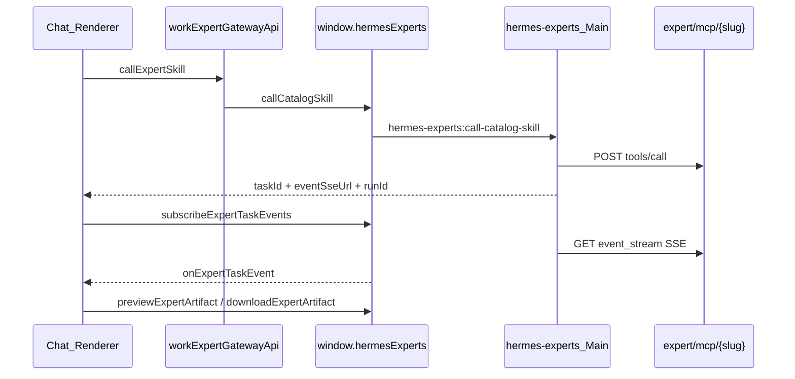

# nodeskclaw 退役 → hermesExperts 全量收敛

## 目标架构



**退役后不再存在：** `window.nodeskclawRuntimeSkillAPI`、`nodeskclaw:*` IPC、`src/main/nodeskclaw/` 整目录、`src/shared/nodeskclaw/` 整目录。

---

## Phase 1 — 删死代码（零行为变化）

仅删除无调用方的遗留物，Send/SSE 仍走 nodeskclaw，便于单独验证 typecheck。

| 动作 | 文件 |
|------|------|
| 删除 | [`useWorkExpertGatewaySend.ts`](src/renderer/src/screens/Hermes/pages/Chat/hooks/useWorkExpertGatewaySend.ts)（无任何 import） |
| 删除 IPC + Preload 方法 | `nodeskclaw:list-runtime-skills`：[`nodeskclaw-ipc.ts`](src/main/nodeskclaw/nodeskclaw-ipc.ts)、[`nodeskclaw-runtime-skill-api.ts`](src/preload/nodeskclaw-runtime-skill-api.ts)、[`nodeskclaw-runtime-skill-api-contract.ts`](src/shared/nodeskclaw/nodeskclaw-runtime-skill-api-contract.ts) 中的 `listRuntimeSkills` |
| 删除 | [`nodeskclaw-mcp-client.ts`](src/main/nodeskclaw/nodeskclaw-mcp-client.ts)（仅 `listRuntimeSkillTools` 使用，Chat 已不走 hermes/mcp list） |
| 删除 | `listRuntimeSkillTools()` 及 [`nodeskclaw-types.ts`](src/main/nodeskclaw/nodeskclaw-types.ts)（list 专用） |
| 删 export | [`nodeskclaw/index.ts`](src/main/nodeskclaw/index.ts) 中 `listRuntimeSkillTools` export |
| 清理类型 | [`work-chat.ts`](src/renderer/src/screens/Hermes/types/work-chat.ts) 中 `WorkChatSelectedSkill.runtimeTool?: McpTool`（list 时代遗留） |
| 清理 guards | [`runtime-skill-guards.ts`](src/shared/nodeskclaw/runtime-skill-guards.ts) 中 `isRuntimeSkillTool` / `assertRuntimeSkillTool`（仅 list 用）；**保留** `assertNoHermesRunEventStream` 直至 Phase 3 |

**验证：** `npm run typecheck`

---

## Phase 2 — Send 合并到 hermesExperts

### 2.1 Main 补齐 wiki 字段（小修，避免切 Send 后 SSE 断链）

[`expert-runtime.ts`](src/main/hermes-experts/expert-runtime.ts) 的 `parseEventStreamAccepted()` 当前只读 `eventSseUrl` / `event_sse_url`，wiki v6.3.2 返回 `event_stream`。需：

1. 增加 `structured.event_stream` fallback（与 nodeskclaw `toStructuredContent` 对齐）
2. 增加相对 URL 补全 helper（从 [`nodeskclaw-runtime-skill-client.ts`](src/main/nodeskclaw/nodeskclaw-runtime-skill-client.ts) 的 `resolveHermesTaskUrl` 迁到 `expert-runtime.ts` 或 `src/main/hermes-experts/expert-task-url.ts`，对 `eventSseUrl` / `artifactUrl` / `resultUrl` 统一处理）

### 2.2 Renderer Send 改走已有 API

修改 [`useRuntimeSkillSend.ts`](src/renderer/src/screens/Hermes/pages/Chat/hooks/useRuntimeSkillSend.ts)：

- **删除** `runtimeSkillApi` 依赖
- 改调 [`workExpertGatewayApi.callExpertSkill`](src/renderer/src/screens/Hermes/api/workExpertGatewayApi.ts)（内部已是 `window.hermesExperts.callCatalogSkill`）
- 处理三种结果（与死 hook `useWorkExpertGatewaySend` 逻辑一致）：
  - `event_stream` → `taskStream.startStream({ taskId, eventSseUrl, artifactUrl, runId, ... })`
  - `sync_result` → `appendLocalMessage` + `setExternalRunState("completed")`
  - `!ok` → error 分支
- 传入 `permissionMode`、`attachmentIds`、`sessionId`（现有 `workExpertGatewayApi` 已支持 metadata）

删除 [`runtimeSkillApi.ts`](src/renderer/src/screens/Hermes/api/runtimeSkillApi.ts)。

删除 nodeskclaw Send 路径：

- IPC `nodeskclaw:call-runtime-skill`（[`nodeskclaw-ipc.ts`](src/main/nodeskclaw/nodeskclaw-ipc.ts)）
- [`nodeskclaw-runtime-skill-client.ts`](src/main/nodeskclaw/nodeskclaw-runtime-skill-client.ts) 整文件
- Preload/contract 中 `callRuntimeSkill`
- [`runtime-skill-contract.ts`](src/shared/nodeskclaw/runtime-skill-contract.ts) 中 `CallRuntimeSkillInput` / `RuntimeSkillStructuredContent` / `McpTool`（若 Phase 3 后无引用则整文件删除）

**验证：** `npm run typecheck`；手工 Send 断点落在 `ExpertMcpClient.callSkill`，URL 为 `/api/v1/expert/mcp/{slug}`

---

## Phase 3 — SSE + Artifact 迁 hermesExperts，退役 nodeskclaw

`hermes-experts` 已有平行实现（与 nodeskclaw 几乎 1:1）：

| nodeskclaw | hermes-experts 替代 |
|------------|---------------------|
| `subscribeTaskEvents` | `subscribeExpertTaskEvents` |
| `onTaskEvent` | `onExpertTaskEvent` |
| `previewArtifact` | `previewExpertArtifact` |
| `downloadArtifact` | `downloadExpertArtifact` |
| [`nodeskclaw-task-stream.ts`](src/main/nodeskclaw/nodeskclaw-task-stream.ts) | [`expert-task-stream.ts`](src/main/hermes-experts/expert-task-stream.ts) |
| [`nodeskclaw-artifact-client.ts`](src/main/nodeskclaw/nodeskclaw-artifact-client.ts) | [`expert-artifact-client.ts`](src/main/hermes-experts/expert-artifact-client.ts) |

### 3.1 新建/重命名 Renderer Hook（最小父组件改动）

将 [`useNodeskclawTaskStream.ts`](src/renderer/src/screens/Hermes/pages/Chat/hooks/useNodeskclawTaskStream.ts) **重命名/改写**为 `useExpertTaskStream.ts`：

- `window.nodeskclawRuntimeSkillAPI` → `window.hermesExperts`
- 事件类型：`NodeskclawTaskEvent` → `ExpertTaskEvent`（[`expert-task-stream-contract.ts`](src/shared/hermes-experts/expert-task-stream-contract.ts)）
- Timeline/Artifact 类型：复用已有 [`expert-task-stream.ts`](src/renderer/src/screens/Hermes/types/expert-task-stream.ts)（`ExpertTaskTimelineEntry` / `ExpertTaskArtifactView`），**删除** [`runtime-skill-stream.ts`](src/renderer/src/screens/Hermes/types/runtime-skill-stream.ts)

更新 [`HermesDefaultWebChatSurface.tsx`](src/renderer/src/screens/Hermes/pages/Chat/HermesDefaultWebChatSurface.tsx) import 与 prop 名（`runtimeSkillTimelines` → `expertTaskTimelines` 或保持 prop 名仅换类型，二选一，推荐改 prop 名避免混淆）。

同步更新消费 Timeline 的 Chat 子组件（如 `ChatScrollArea` 中 `runtimeSkillTimelines` prop）。

### 3.2 删除 nodeskclaw 基础设施

| 删除 |
|------|
| 目录 [`src/main/nodeskclaw/`](src/main/nodeskclaw/) 全部 8 文件 |
| 目录 [`src/shared/nodeskclaw/`](src/shared/nodeskclaw/) 全部 6 文件 |
| [`src/preload/nodeskclaw-runtime-skill-api.ts`](src/preload/nodeskclaw-runtime-skill-api.ts) |
| [`index.ts`](src/main/index.ts) 中 `registerNodeskclawIpc` / `shutdownNodeskclawIpc` 注册与 import |
| [`preload/index.ts`](src/preload/index.ts) + [`preload/index.d.ts`](src/preload/index.d.ts) 中 `nodeskclawRuntimeSkillAPI` 暴露 |

### 3.3 expert-task-stream 守卫迁移

`assertNoHermesRunEventStream` 从 nodeskclaw guards 迁到 [`expert-task-stream.ts`](src/main/hermes-experts/expert-task-stream.ts) 内联或 `src/shared/hermes-experts/expert-task-stream-guards.ts`（subscribe 前校验 URL 含 `/hermes/tasks/`）。

---

## 不在本次范围

- 不改 ExpertSelector / ExpertSkillSelector UI
- 不改 [`workExpertGatewayApi`](src/renderer/src/screens/Hermes/api/workExpertGatewayApi.ts) 发现侧（health/list 已走 hermesExperts）
- 不新增调试基础设施
- PRD / `docs/API_CONTRACTS.md` 可在收尾按 007 rule 增量同步（非阻塞实现）

---

## 验收清单

```bash
npm run typecheck
```

手工（`pnpm run dev` + Main attach 9229）：

1. 选 expert + skill → Send：断点 `ExpertMcpClient.callSkill`，URL `/api/v1/expert/mcp/{slug}`
2. Network：**无** `nodeskclaw:*` IPC；**无** `/api/v1/hermes/mcp/` 请求
3. Timeline：`task.started` → `task.progress` → `task.completed`（经 `hermes-experts:task-event`）
4. Artifact 预览/下载正常
5. 未选 expert+skill 时仍走 `hermesDefaultChat`
6. `window.nodeskclawRuntimeSkillAPI` 在 DevTools 中为 `undefined`

---

## 风险与注意

- `callCatalogSkill` 会写入 **expert run SQLite**（nodeskclaw Send 不写库）——这是预期行为，与 Workbench Experts 页一致；Chat 可获得 `runId` 供后续 Runs 页追溯。
- `parseEventStreamAccepted` 未补 `event_stream` 前切 Send 会导致 SSE URL 为空；**必须先做 Phase 2.1**。
