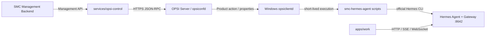

# Cursor Implementation Plan — OPSI v1.0

## 1. 执行依据与当前基线

本计划依据外部 PRD：`D:/smc-sz-hr21007/Downloads/SMC Copilot OPSI Endpoint Control Plane 功能扩展解决方案 PRD.md`（v1.0，2026-08-14）。

开始实施前必须阅读：

- [`AGENTS.md`](../../AGENTS.md)
- [`apps/work/AGENTS.md`](../../apps/work/AGENTS.md)
- [`docs/architecture/contract-flow.md`](../../docs/architecture/contract-flow.md)
- [`docs/adr/ADR-026-salt-endpoint-control-plane.md`](../../docs/adr/ADR-026-salt-endpoint-control-plane.md)
- [`docs/adr/ADR-030-runtime-endpoint-decommission.md`](../../docs/adr/ADR-030-runtime-endpoint-decommission.md)
- [`contracts/runtime-api/ENDPOINT_CONTROL_PLANE_FREEZE.md`](../../contracts/runtime-api/ENDPOINT_CONTROL_PLANE_FREEZE.md)
- [`apps/work/lat.md/runtime-connection.md`](../../apps/work/lat.md/runtime-connection.md)

已核验的仓库事实：

- 当前不存在 `infra/opsi`、`services/opsi-control` 或 `contracts/opsi`。
- Work 默认 `direct`，Chat 直接访问 Hermes Gateway；企业 Salt 模式使用 probe-only Availability，不依赖 Runtime `:8765`。
- [`apps/work/src/shared/runtime/control-owner.ts`](../../apps/work/src/shared/runtime/control-owner.ts) 当前只允许 `direct | salt | runtime`；OPSI 必须新增互斥 owner，而不是伪装成 `salt`。
- [`apps/work/src/main/hermes/availability-backend.ts`](../../apps/work/src/main/hermes/availability-backend.ts)、Main IPC 和 Renderer 仍有 `SALT_MANAGED` / `isSaltControlOwner()` 专用分支，实施时必须泛化为外部托管语义。
- Runtime Endpoint Control Plane 已冻结；本项目不得向 `services/runtime` 或 `contracts/runtime-api` 增加 OPSI 能力。
- 当前工作树已有用户对 `infra/salt/**`、`services/salt-control/**` 的修改；实施者不得覆盖、格式化、暂存或混入这些文件。建议在独立 `codex/opsi-v1` 分支/工作树实施。

OPSI 4.3 官方接口基线：

- `opsiconfd` 通过 HTTPS `:4447/rpc` 提供 JSON-RPC；服务端对象包括 `host`、`productOnClient`、`productOnDepot`、`productPropertyState`，并提供 `log_read`。
- OPSI Product 使用 `control.toml`，`localboot` Product 由 `setup.opsiscript` 等脚本驱动；包通过 `opsi-makepackage` 构建、`opsi-package-manager` 安装。
- 实际目标 OPSI Server 的版本、许可模块、可用 RPC 与日志/文件回传能力必须由 Phase 0 Lab 记录，禁止仅凭文档假设生产可用。

官方参考：

- [opsiconfd Interfaces / JSON-RPC](https://docs.opsi.org/opsi-docs-en/4.3/server/interfaces/jsonrpc-api.html)
- [opsiconfd Service](https://docs.opsi.org/opsi-docs-en/4.3/server/components/opsiconfd.html)
- [Creating OPSI Products](https://docs.opsi.org/opsi-docs-en/4.3/clients/macos-client/softwareintegration.html)
- [OPSI Command Line Tools](https://docs.opsi.org/opsi-docs-en/4.3/server/components/commandline.html)

## 2. 冻结架构与不可突破边界



固定边界：

- OPSI 是与 Salt 平行的新 Control Plane；仓库可共存，代码与部署不混用。
- `infra/salt/**`、`services/salt-control/**`、`contracts/salt-control-api/**` 不做 OPSI 功能修改。
- 单 Endpoint 只能有一个 Hermes lifecycle owner。`%ProgramData%\SMC\control-owner.json` 的 `hermes` 值扩展为 `direct | salt | opsi | runtime`；OPSI Endpoint 写 `{ "hermes": "opsi" }`。
- `smc-hermes-agent` 是由 OPSI Product 临时调用的 PowerShell Management Adapter，不监听端口、不常驻、不代理 Chat。
- `services/opsi-control` 只连接 OPSI Server，不直接连接 Windows Endpoint、Hermes Gateway 或 Work。
- `apps/work` 不调用 `opsi-control`，不暴露 OPSI RPC、凭据、Job 或 Product Property；Connection Ready 的最终真值是 Gateway health。
- OPSI Server/Control 离线不得停止已健康的 Hermes Gateway 或 Work Chat。
- 禁止收集 Chat、Session、Memory、Workspace、用户文档、Prompt、Assistant Message、完整 `.env`。
- Hermes 必须使用精确版本和 SHA256 校验；生产终端不得联网解析 `latest`。

## 3. Phase 0 — 架构冻结与 OPSI Lab PoC

### 目标

在大规模编码前关闭 PRD 中最关键的不确定项：动作如何被唯一关联、详细结果和诊断如何从 Endpoint 回到 OPSI Server，以及 SYSTEM/User 两层如何安全交接。

### 实施

1. 新增 [`docs/adr/ADR-031-opsi-parallel-endpoint-control-plane.md`](../../docs/adr/ADR-031-opsi-parallel-endpoint-control-plane.md)：
   - 将 ADR-026 的“Salt 唯一实现”扩展为“Endpoint Control Plane 默认 SOT 为 Salt，但客户部署可选择独立 OPSI Provider”；不改写 Salt 实现。
   - 冻结 `direct | salt | opsi | runtime` owner 互斥规则。
   - 明确 Work Data Plane 不随 Provider 改变。
   - 明确 Runtime Endpoint API 继续冻结。
2. 新增 [`docs/opsi/decisions/action-result-transport.md`](../../docs/opsi/decisions/action-result-transport.md)，在真实 OPSI 4.3 Lab 验证并记录：
   - `host_getObjects` / `productOnDepot_getObjects` / `productOnClient_getObjects` Inventory 查询。
   - client-specific `productPropertyState` 写入与并发隔离。
   - `productOnClient.actionRequest` 的 `setup | update | uninstall | custom` 下发与状态变化。
   - `request_id` 如何进入 Endpoint 脚本，如何从标准 `actionResult` 与 `instlog`/批准的服务器端通道恢复详细 `smc.opsi.action-result.v1`。
   - 诊断 JSON、日志尾部与 Bundle 的大小上限、分块、校验和、保留期和下载方式。
   - Endpoint Offline、服务重启、重复请求、旧日志残留时的关联准确性。
3. 结果通道必须满足：
   - 不把单次请求参数写入全局 Product Default。
   - 不在普通 Product Property、OPSI Log 或服务日志写 Secret。
   - 不要求 `opsi-control` 直接访问 Endpoint。
   - 以 `request_id + client_id` 唯一关联；内容有 schema version、SHA256、大小限制和 redaction 标记。
4. 新增 Machine/User Bootstrap Spike：SYSTEM 只写 `C:\ProgramData\SMC\opsi` 和注册登录触发器；真正的 Hermes Home 初始化、Gateway 启动在目标登录用户上下文执行。记录 SID、并发登录、无登录用户、注销/重启行为。

### 退出门禁

- [ ] Lab 证明两个 Client 可同时执行不同 `custom_operation`，参数不互相覆盖。
- [ ] `request_id` 可从 API 一直关联到 Product、Endpoint 日志/结果和规范化响应。
- [ ] 结果/诊断回传方案不依赖 Endpoint 直连，不泄露 Secret，并有明确大小上限。
- [ ] SYSTEM 执行不会把 Hermes 安装进 `systemprofile`。
- [ ] ADR 和 PoC 证据评审通过后，才进入 Phase 1-5 主体开发。

## 4. Phase 1 — 仓库、契约与 CI 骨架

### 目录

创建并保持独立：

```text
infra/opsi/
services/opsi-control/
contracts/opsi/
docs/opsi/
```

### 契约

在 [`contracts/opsi`](../../contracts/opsi) 建立：

```text
endpoint-state.schema.json      smc.hermes.state.v1
action-request.schema.json      smc.opsi.action-request.v1
action-result.schema.json       smc.opsi.action-result.v1
diagnostic.schema.json          smc.hermes.diagnostic.v1
managed-config.schema.json      smc.opsi.managed-config.v1
openapi.yaml                    generated from opsi-control
```

要求：

- JSON Schema 统一约束 UTC/offset timestamp、枚举、`additionalProperties`、最大字符串/数组大小和 request/client ID 格式。
- Action 状态：`CREATED | QUEUED | DISPATCHED | RUNNING | SUCCEEDED | FAILED | CANCELLED | UNKNOWN`。
- Endpoint Health：`HEALTHY | WARNING | CRITICAL | OFFLINE | UNKNOWN`；Config：`CURRENT | OUTDATED | APPLYING | FAILED | UNKNOWN`。
- [`contracts/version.json`](../../contracts/version.json) 新增 `opsiControlApi: "1.0.0"`；不要修改 `runtimeApi` / `saltControlApi` 版本。
- `services/opsi-control` 的 Pydantic/FastAPI 是 OpenAPI SOT；增加 `export_opsi_control_openapi.py` 与 drift check，并纳入 [`contracts/project.json`](../../contracts/project.json) 的 generate/check。

### 工程与门禁

- 新建独立 Python 3.12 / FastAPI / Pydantic / httpx / uv 项目，提供 `project.json`、`pyproject.toml`、`src/`、`tests/`。
- 新增 `.github/workflows/opsi-control-ci.yml`：ruff、pytest、OpenAPI drift、schema validation、secret scan。
- 新增 `.github/workflows/opsi-package-ci.yml`：PowerShell static checks/Pester、manifest/schema 校验、在 OPSI Linux runner 或容器中执行 `opsi-makepackage` smoke test。
- 新增 OPSI isolation guard：OPSI PR 对 `infra/salt`、`services/salt-control`、`contracts/salt-control-api` 的 base diff 必须为空；同时阻止 `services/opsi-control` 导入 `services/runtime` 或 `services/salt-control`。
- 更新 [`docs/architecture/contract-flow.md`](../../docs/architecture/contract-flow.md)、[`docs/architecture/monorepo.md`](../../docs/architecture/monorepo.md) 和 [`docs/INDEX.md`](../../docs/INDEX.md)。

### 退出门禁

- [ ] 空服务 `/health`、`/ready` 与生成契约可运行。
- [ ] `npm run contracts:check` 包含 OPSI 且通过。
- [ ] 隔离 CI 能对 Salt 路径改动和跨服务 import 失败。
- [ ] 新增目录不依赖 Runtime Endpoint API。

## 5. Phase 2 — `smc-hermes-agent` OPSI Product

### Product 结构

在 [`infra/opsi/products/smc-hermes-agent`](../../infra/opsi/products/smc-hermes-agent) 创建：

```text
OPSI/control.toml
CLIENT_DATA/setup.opsiscript
CLIENT_DATA/update.opsiscript
CLIENT_DATA/uninstall.opsiscript
CLIENT_DATA/custom.opsiscript
scripts/common/
scripts/install/
scripts/gateway/
scripts/config/
scripts/health/
scripts/diagnostics/
scripts/repair/
bootstrap/machine/
bootstrap/user/
managed/config/
managed/diagnostics-rules/
packaging/
lab/
tests/
```

### Product 契约

- Product ID：`smc-hermes-agent`；type：`localboot`。
- `productVersion = Hermes Version`；`packageVersion = SMC Packaging Revision`。
- Product Properties：`hermes_version`、`release_channel`、`gateway_port`、`gateway_autostart`、`managed_profile`、`config_revision`、`diagnostics_enabled`、`diagnostic_log_lines`、`auto_repair_level`、`custom_operation`、`request_id`。
- `release_channel` 只允许 `testing | stable`，服务端发布前必须解析成精确 `hermes_version`。
- `custom_operation` 只允许 `status | collect-log | apply-config | restart-gateway | diagnose | repair`。

### 脚本入口

- `.opsiscript` 只负责读取 client-specific Properties、验证必填值、以 argv 调用签名 PowerShell 脚本、映射退出码并输出受控结果标记。
- PowerShell 入口统一使用严格模式、结构化日志、超时和稳定错误码；禁止动态拼接可执行字符串、`Invoke-Expression` 和宽泛进程终止。
- `custom.opsiscript` 只分发 allowlist operation；未知操作 fail closed。
- 所有脚本必须幂等：重复 setup/update/custom 不破坏当前健康状态；相同 `request_id` 不重复产生副作用。

### 打包

- 包内生成 artifact manifest：文件名、版本、平台、SHA256、大小、签名信息。
- `opsi-makepackage` 输出名固定包含 Product Version 与 Package Version。
- 发布脚本只生成/安装到指定 Lab/Depot；不得默认修改生产 Depot。

### 退出门禁

- [ ] `control.toml` 可被 OPSI 4.3 工具解析并构建 `.opsi` 包。
- [ ] 四个 Action 入口均可在无 Hermes、已有同版本、旧版本、失败重试场景幂等执行。
- [ ] 并发 Client Property 测试证明请求隔离。

## 6. Phase 3 — Hermes 生命周期与 Machine/User Bootstrap

### Windows Machine Layer

- 受管根目录固定为 `C:\ProgramData\SMC\opsi\`，只包含 OPSI Adapter、bootstrap、managed policy、state、diagnostics 和 logs。
- SYSTEM 校验 Artifact SHA256/签名，原子 staging 到版本目录，写 `version.json`，注册/更新 User Bootstrap；不写用户 Hermes Home。
- 安装、更新、卸载使用 transaction journal：`prepare → apply → verify → commit`，失败恢复 last-known-good。
- 卸载只删除 OPSI 受管文件和触发器；默认保留 Profiles、Config、Skills、Plugins、Memory、Sessions、Credentials、Workspace。

### Logged-in User Layer

- 以明确 Windows SID/账户解析目标用户；禁止使用 `C:\Users\<username>\.hermes` 推断。
- 优先使用 `hermes config path` / `hermes config env-path` / 环境变量解析实际 `HERMES_HOME`。
- 首选 Hermes 原生 Gateway Install/Autostart；不可用时使用“登录用户”Scheduled Task，任务定义需版本化、幂等、最小权限且可卸载。
- 无登录用户时返回 `USER_CONTEXT_PENDING`，保留 Machine staging，待下次登录完成，不伪报安装成功。

### Hermes / Gateway

- 生命周期：`inspect | install | update | uninstall | reinstall | verify`。
- 所有管理动作优先调用官方 Hermes CLI：`status`、`doctor`、`config check`、`gateway status/start/stop/restart`。
- 禁止按 `python.exe` 进程名管理；端口冲突必须报告占用者证据，不强杀未知进程。
- Gateway 默认 `127.0.0.1:8642`，允许受管 property 覆盖；健康同时验证进程、端口和 HTTP health。

### 退出门禁

- [ ] Fresh Install 后精确版本正确、Gateway 健康、Work 可连接。
- [ ] Update 失败可恢复旧版本和 Gateway，用户数据不丢失。
- [ ] Windows reboot、logout/login、无用户登录、双用户登录行为有明确结果。
- [ ] Uninstall 不删除任何 PRD 禁止删除的用户数据。

## 7. Phase 4 — 状态、配置、诊断与修复

### Endpoint State

- 原子写入 `C:\ProgramData\SMC\opsi\state\hermes.json`，按 `endpoint-state.schema.json` 校验。
- 状态至少包含 owner=`opsi`、client、timestamp、Hermes 精确版本/Profile、Gateway port/reachable、Config revision/status、Health。
- state 是可选快速显示，不替代 Work 对 Gateway health 的探测，也不成为第二套服务端 Inventory DB。

### Managed Config

- 配置按 Revision 应用：拒绝旧 Revision；相同 Revision 幂等；新 Revision 先 backup、merge allowlist、validate，再原子 replace。
- 只改 Enterprise Managed keys；用户模型、Profile、Skills、Plugins、Memory、Session、Workspace 保留。
- `hermes config check` 失败立即回滚；只有受影响字段需要时才重启 Gateway。
- Secret 不进入 Managed Config、Product Property、日志、结果或诊断；Secret 必须引用外部安全来源或保留在现有 Hermes 安全存储。

### Health / Logs / Diagnostics

- Health 检测：installed、version、CLI、config、Gateway process/port/health、profile、doctor、disk space。
- Log 默认每类最多 500 行；总 Bundle 大小、单文件大小、执行时间和保留期均配置上限。
- Redaction 在写 Bundle 和返回结果前各执行一次；覆盖 API Key、Token、Password、Authorization、`.env` 和常见 URI credential。
- 确定性错误码按 PRD 固化，不调用 LLM。
- `diagnostic.json` 与 Bundle manifest 必须包含 schema、request/client、issue code/severity、recommended action、每个文件 SHA256。

### Repair

- L0 Observe、L1 Gateway Restart、L2 Config/Doctor/Dependency Repair 自动化。
- L3 Reinstall 必须显式 policy 允许并先备份/验证用户数据；L4 仅生成诊断交人工。
- `auto_repair_level` 超出批准级别时拒绝并返回 `MANUAL_ACTION_REQUIRED`。

### 退出门禁

- [ ] Config 12→13 只改 managed keys，非法配置恢复 12。
- [ ] Gateway Crash 可由 `restart-gateway` 恢复并使 Work 自动重连。
- [ ] Diagnostic Bundle 泄密扫描为零，且不包含 Chat/Session/Memory/Workspace。
- [ ] 所有操作生成符合 schema 的 Action Result。

## 8. Phase 5 — `services/opsi-control`

### 服务结构

采用与现有独立控制服务一致的分层，但禁止代码 import/共享实现：

```text
src/api/v1/{clients,products,actions,policies,results,diagnostics,health}.py
src/schemas/
src/services/
src/integrations/opsi_jsonrpc.py
src/db/{models,repositories,unit_of_work}.py
src/workers/{action_dispatcher,result_reconciler}.py
src/core/{config,auth,logging,errors}.py
```

### OPSI Adapter

- 只通过 TLS 访问 `https://<opsi-server>:4447/rpc`；证书校验默认开启，凭据来自 Secret Provider/环境注入，禁止进 Git 和日志。
- 封装 timeout、bounded retry、request ID、响应大小、JSON-RPC error mapping 和审计。
- Inventory/Product/Action/Property/Log 只暴露任务所需的固定方法 allowlist；禁止通用“执行任意 RPC”API。
- Adapter Protocol 配 Fake 用于单元测试，Live Adapter 仅在明确 `SMC_OPSI_ENV=lab|production` 且配置完整时启用。

### API

实现 PRD API：

```text
GET  /api/v1/opsi/clients
GET  /api/v1/opsi/clients/{clientId}
GET  /api/v1/opsi/products
GET  /api/v1/opsi/clients/{clientId}/state
POST /api/v1/opsi/actions
GET  /api/v1/opsi/actions/{requestId}
GET  /api/v1/opsi/actions/{requestId}/results
POST /api/v1/opsi/policies/apply
GET  /api/v1/opsi/diagnostics/{requestId}
```

规则：

- `POST actions` 以 `request_id` 幂等；同 ID 不同 payload 返回 409。
- `setup/update/uninstall` 映射同名 OPSI Action；管理动作映射 client-specific Properties + `custom`。
- 为每个 target 建独立 target record，部分成功不覆盖其他 Client。
- 调度顺序固定为“写 client-specific request properties → 回读验证 → 写 actionRequest → 记录 dispatch snapshot”；任一步失败均不产生不完整成功记录。
- Result Reconciler 从 OPSI 标准 Product state 与 Phase 0 批准的详细结果通道规范化状态；服务重启后可续跑，超时转 `UNKNOWN` 而非伪造失败/成功。
- 取消只在尚未 dispatch 时保证；已被 opsiclientd 接收的动作按 OPSI 实际能力返回不可取消/最终状态。

### 持久化边界

PostgreSQL 只保存：

- SMC request 与 payload digest。
- request-target 与 OPSI action/property dispatch correlation。
- Operator/action audit。
- normalized result、diagnostic index、poll cursor/lease。

禁止复制 OPSI Client Inventory、Product Catalog、Deployment Engine 成为第二真值库。

### 安全与运维

- `/health` 只表示进程存活；`/ready` 检查 DB、OPSI `/status`/RPC、Secret Provider。
- OIDC/JWKS + scope：read inventory、dispatch action、apply policy、read diagnostics 分离。
- 生产配置不完整、TLS 无效、Fake/InMemory 依赖时 fail closed。
- 所有日志默认结构化和脱敏；敏感字段进入日志前丢弃而非掩码后保留原值。

### 测试

- JSON-RPC contract fixtures：成功、RPC error、timeout、重复/乱序、超大响应、证书失败。
- API：认证/授权、幂等冲突、多 target 部分失败、服务重启恢复、状态机终态。
- PostgreSQL integration 与 migration upgrade/downgrade/upgrade。
- OPSI Lab：真实 Client、Product、Property、Action、`log_read`/批准结果通道。

### 退出门禁

- [ ] Client/Product/Action/Policy/Result/Diagnostics 六类能力闭环。
- [ ] Endpoint Offline/重连后 request 仍可正确收敛。
- [ ] 服务不直接连接 Endpoint/Hermes，不保存第二份 Inventory SOT。
- [ ] OpenAPI drift、数据库迁移、鉴权和 secret scan 通过。

## 9. Phase 6 — Work Direct Hermes 兼容

### Main / Shared

修改范围限于必要文件：

- [`apps/work/src/shared/runtime/control-owner.ts`](../../apps/work/src/shared/runtime/control-owner.ts)：owner 增加 `opsi`。
- [`apps/work/src/main/hermes/control-owner.ts`](../../apps/work/src/main/hermes/control-owner.ts)：解析 `opsi`，增加 `isExternallyManagedControlOwner()` 和 provider-aware message；保留现有 Salt 行为兼容。
- [`apps/work/src/main/hermes/availability-backend.ts`](../../apps/work/src/main/hermes/availability-backend.ts)：泛化为 Salt/OPSI 共用的 probe-only Adapter，错误改为稳定的 `EXTERNALLY_MANAGED` 并附 `provider`，不得调用安装、更新、Gateway start/restart 或 Runtime `:8765`。
- [`apps/work/src/main/runtime/runtime-manager.ts`](../../apps/work/src/main/runtime/runtime-manager.ts)：`opsi` 选择外部托管 Availability Adapter。
- 将 [`apps/work/src/main/hermes.ts`](../../apps/work/src/main/hermes.ts) 与 [`apps/work/src/main/ipc/register.ts`](../../apps/work/src/main/ipc/register.ts) 的所有 Salt 专用生命周期禁止分支改为外部托管 owner 判断，避免 OPSI 模式漏出本地 Start/Doctor/Update/Restart。

### Renderer

- [`apps/work/src/renderer/src/runtime/RuntimeProvider.tsx`](../../apps/work/src/renderer/src/runtime/RuntimeProvider.tsx)：`salt | opsi` 均只调用 `runtimeGetStatus`，不调用 `runtimeEnsureLocalReady`。
- [`apps/work/src/renderer/src/components/settings/RuntimePane.tsx`](../../apps/work/src/renderer/src/components/settings/RuntimePane.tsx) 与 Connection Error：显示“Managed by organization / Provider: OPSI”，仅提供 Refresh/Retry/Open Logs；隐藏 Choose Home、Install、Update、Repair、Restart OPSI 等动作。
- 可选读取 `C:\ProgramData\SMC\opsi\state\hermes.json` 只用于管理状态展示；解析失败/过期不影响 Gateway health 判定。
- 不新增 `window.opsiApi`、OPSI Job UI、RPC Client、Credentials 或 Product Property 到 preload/Renderer。

### 测试

- 扩展 `hermes-control-owner.test.ts`：env/file/default 与非法 owner。
- 增加 `enterprise-opsi-mode.test.ts`，与 Salt canary 对称验证：
  - `opsi` owner 走 Availability-only。
  - Start/Update/Doctor/Restart 全部拒绝本地执行。
  - 不请求 Runtime `:8765` 或 `opsi-control`。
  - Gateway health 恢复后 Work 进入 READY 并继续直连 Chat transport。
- 保留并通过现有 Salt enterprise tests，证明泛化没有改变 Salt 行为。
- 更新 [`apps/work/lat.md/runtime-connection.md`](../../apps/work/lat.md/runtime-connection.md)，运行 `lat check`。

### 退出门禁

- [ ] `direct`、`salt`、`opsi`、`runtime` 四种 owner 分支都有 exhaustiveness tests。
- [ ] OPSI Offline + Gateway Healthy 时 Work Chat 正常。
- [ ] Gateway Unavailable 只显示等待企业管理恢复与 Retry，不提供 OPSI 管理动作。
- [ ] Renderer/Preload 无任何 OPSI RPC/凭据表面。

## 10. Phase 7 — 验收、灰度与发布

### 自动化矩阵

- PowerShell/Pester：路径解析、SYSTEM/User、Artifact、幂等、回滚、配置 merge、redaction、size limit、错误码。
- Contract：全部示例验证、向后兼容、OpenAPI drift。
- Service：unit/integration/PostgreSQL/Mock JSON-RPC。
- Work：typecheck、lint、Vitest、build；Salt enterprise regression 必须通过。
- Isolation：OPSI PR 的 Salt 实现路径 diff 为零；Runtime frozen route diff 为零。

### Windows 实机矩阵

Windows 10 与 Windows 11 均验证：

- opsi-client-agent enrollment / inventory。
- Product setup、Hermes fresh install、User Context、Gateway startup、Work connect。
- Config apply、Gateway restart、update、diagnose、collect-log、uninstall。
- Windows reboot、user logout/login、Gateway crash、port 8642 conflict、disk low、Hermes CLI failure、invalid config。
- OPSI Server offline、Endpoint offline/reconnect、action retry、opsi-control restart。

### 核心 AC

- AC-01 Fresh Install：Hermes 精确版本、Gateway Healthy、Work Connect PASS。
- AC-02 Upgrade：受保护用户数据不丢失，失败可回滚。
- AC-03 Config：12→13 只改 Managed Keys。
- AC-04 Gateway Recovery：Crash→restart-gateway→health + Work reconnect。
- AC-05 Diagnostics：Bundle/diagnostic.json 齐全且 secret/chat/session/memory/workspace 泄漏为零。
- AC-06 OPSI Offline：已运行 Gateway 与 Work Chat 不受影响。
- AC-07 Repository Isolation：Salt 实现路径无 OPSI 功能 diff。

### 灰度

1. Development：2~5 台，覆盖全动作和故障注入。
2. Pilot：10~20 台，至少一个完整升级/回滚周期；重大 Hermes 版本禁止跳过 Pilot。
3. Production：按精确版本和签名 Package 分批发布，保留 previous package 与回滚 Runbook。

### 人工门禁

- OPSI Server/Depot 安装、真实 Endpoint 下发、Pilot/Production 扩容均为外部状态变更，只能由授权操作员执行。
- Cursor/CI 可生成脚本、模板和 `implemented` 证据，不得把未执行的实机步骤标记 PASS/proven。
- 本 plan 的 `opsi-p7-acceptance-release` 只有在 Windows 10/11 与 Pilot 证据、Security Signoff、Release Signoff 均归档后才能标记 completed。

## 11. PR 拆分

每个 PR 可独立评审、测试和回退：

1. `docs(opsi): freeze parallel endpoint control plane and result transport`
2. `feat(opsi): scaffold isolated contracts service and ci`
3. `feat(opsi): add smc-hermes-agent localboot package`
4. `feat(opsi): add hermes machine and user lifecycle`
5. `feat(opsi): add config health diagnostics and repair`
6. `feat(opsi-control): add opsi server adapter and action api`
7. `feat(work): add opsi managed availability mode`
8. `test(opsi): add windows endpoint acceptance and release evidence`

任何 PR 都不得顺手修改 Salt 实现；跨 PR 契约变更先合并 Contract/ADR，再合并 producer/consumer。

## 12. 验证命令

仓库契约：

```text
npm run contracts:check
npm run check:runtime-path-ownership
```

OPSI Control：

```text
uv sync --project services/opsi-control --extra dev
uv run --project services/opsi-control ruff check .
uv run --project services/opsi-control ruff format --check .
uv run --project services/opsi-control pytest -q
uv run --project services/opsi-control alembic upgrade head
```

OPSI Product：

```text
Invoke-Pester infra/opsi/tests
opsi-makepackage
```

Work：

```text
cd apps/work
lat check
npm run typecheck
npm run lint
npm test
npm run build
```

隔离校验在干净 PR 分支执行：

```text
git diff --exit-code <base>...HEAD -- infra/salt services/salt-control contracts/salt-control-api
git diff --exit-code <base>...HEAD -- services/runtime contracts/runtime-api
```

## 13. Definition of Done

- [ ] 四个 OPSI 独立目录建立，契约和 CI 纳入 Monorepo。
- [ ] Salt 与 Runtime Endpoint Control 实现无 OPSI 功能修改。
- [ ] OPSI Client Inventory、Product Version、ActionRequest、Action Result 可关联。
- [ ] Hermes install/version/update/uninstall 完成且保护用户数据。
- [ ] Gateway status/restart/health 与 Work reconnect 完成。
- [ ] Revision Config、Log、Diagnostics、L1/L2 Repair 完成。
- [ ] Windows 10 与 Windows 11 全矩阵通过。
- [ ] Work `opsi` 模式只探测 `localhost:8642`，OPSI 离线不影响健康 Chat。
- [ ] 无新 Runtime HTTP daemon，无 Renderer OPSI API，无用户业务会话采集。
- [ ] Security、Pilot、Release 证据由授权人员签署。

