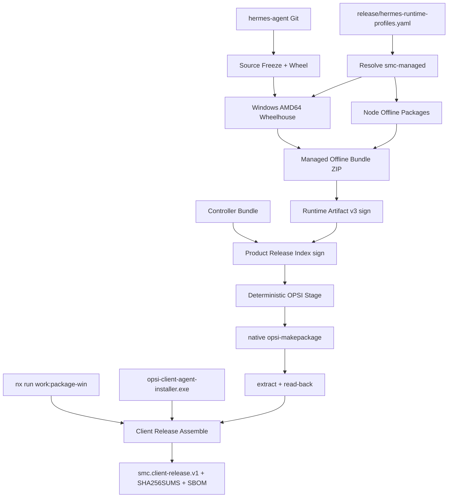

# OPSI v1.7.1 — Unified Client Release Builder

## 执行依据与边界

- PRD：[docs/opsi/PRD-OPSI-v1.7.1.md](docs/opsi/PRD-OPSI-v1.7.1.md)；前置 v1.7 工程已全部完成（见 [opsi_v1.7 plan](.cursor/plans/opsi_v1.7_real_release_client_deployment.plan.md)，Phase 9/10 为人工门禁，不在本迭代）。
- 基线分支 `opsi/prd-v1.0`，建议实现分支 `opsi/prd-v1.7.1`。
- 固定边界：不改 Salt/Runtime control plane；不实现 Docker builder（native-only，经用户确认）；Live Gate RB-01~03 中需要真实 hermes-agent repo / Windows endpoint 的部分只交付能力与 runbook，不由 Cursor 标记 proven；只实现 `smc-managed` profile；只做 `windows-amd64`。
- 版本模型：Client Release `1.7.1`、OPSI Product `1.7.1-1`、Controller revision、Hermes version（来自 hermes-agent `pyproject.toml`）互相独立；禁止 Product version == Hermes version 强绑定。

## 现状关键锚点（已探明）

- Release builder 现状：[makepackage.py](infra/opsi/products/smc-hermes-agent/packaging/makepackage.py)（`build_release`/`stage_release`/`write_opsi_archive`，Python zipfile 产 .opsi）、[artifact_v3.py](infra/opsi/products/smc-hermes-agent/packaging/artifact_v3.py)、[controller_manifest.py](infra/opsi/products/smc-hermes-agent/packaging/controller_manifest.py)、[product_release.py](infra/opsi/products/smc-hermes-agent/packaging/product_release.py)。
- Endpoint 安装链：[Install-Hermes.ps1](infra/opsi/products/smc-hermes-agent/scripts/install/Install-Hermes.ps1) → `Install-SmcRuntimeSlot`（[SmcController.psm1](infra/opsi/products/smc-hermes-agent/controller/SmcController.psm1)），ZIP 解压模型、entrypoint 默认 `hermes.exe`，已有 `runtime/versions/<ver>-<digest>/` + `active.json`；无 Python/Node 前置校验。
- Contracts：`contracts/opsi/*.schema.json` 手写（Draft 2020-12，`additionalProperties:false`），[validate_schemas.py](infra/opsi/tests/validate_schemas.py) 维护 required 列表；`contracts/version.json` 的 `opsiControlApi` 保持 `1.7.0`（新 JSON Schema 不影响 OpenAPI，不 bump）。
- `tools/release/`、`release/`、`infra/opsi/builder/` 均不存在，需新建。

## 目标流水线



## Phase 1 — Contracts 与 Runtime Profile

- 新增手写 schema（沿用 `contracts/opsi/` 惯例，`title` 为 contract ID）：
  - `contracts/opsi/runtime-profile.schema.json`（`smc.hermes.runtime-profile.v1`）
  - `contracts/opsi/runtime-build.schema.json`（`smc.hermes.runtime-build.v1`，含 source.revision/dirty、profile、python.wheelhouseDigest、node.packageLockDigest、liveEligible）
  - `contracts/opsi/client-release.schema.json`（`smc.client-release.v1`）
  - `contracts/opsi/client-release-config.schema.json`（`smc.client-release.config.v1`，PRD §32）
- 扩展 [runtime-artifact-manifest.schema.json](contracts/opsi/runtime-artifact-manifest.schema.json) v3 分支：`installType`（enum 含 `python-wheelhouse`）、`runtimeEntrypoint`（如 `venv/Scripts/hermes.exe`）、`requires.python`/`requires.node` range、`profile`；保持 tolerant-reader，v2 行为不变。
- 新建 `release/hermes-runtime-profiles.yaml`（仅 `smc-managed` v1：python extras mcp/web/google、lazyInstall=false、node packages 固定版本、gateway 127.0.0.1:8642）与 `release/client-release.yaml`（PRD §32 结构，路径占位）。
- 更新 [validate_schemas.py](infra/opsi/tests/validate_schemas.py) required 列表；新增 schema fixture 正/负向测试。

## Phase 2 — Hermes Source Builder（tools/release/hermes/）

新建 `tools/release/hermes/`：`source_metadata.py`、`runtime_profile.py`、`build_wheel.py`、`build_wheelhouse.py`、`build_node_packages.py`、`build_runtime.py`（编排入口）、`verify_runtime.py`、`build_runtime.ps1`。

- source freeze：git SHA/branch/dirty、`pyproject.toml`+`uv.lock` SHA256；production dirty 必须 fail，`--allow-dirty` 时 `liveEligible:false`；`--hermes-version` 必须与 pyproject 一致；禁止 `latest/current/main/unknown`。
- wheel：`uv build`（或 `python -m build`）产 `hermes_agent-<ver>-*.whl`。
- wheelhouse：`uv pip download`/`pip download --only-binary` 按 uv.lock + profile extras 解析 win_amd64/cp312 wheels，生成 `requirements.lock` + wheel inventory（name/version/sha256）；native wheel 平台不匹配 fail。
- node packages：仅 profile 声明的固定版本 `npm pack`；禁止扫描全部 skills；未固定版本 fail。
- bundle：按 PRD §5 布局（app/python/node/config/runtime-profile.json/runtime-build.json/LICENSES）产 `hermes-<ver>-windows-amd64.zip`；拒绝 .git/tests/.venv/node_modules/.env/python.exe/node.exe 等进入（PRD §6 黑名单扫描 fail-closed）。
- 测试（H01-H09）：clean/dirty source、version match/mismatch、wheelhouse 完整/缺依赖/错平台 wheel、profile 校验、node 依赖缺失。放在 `tools/release/tests/`，纳入 pytest。

## Phase 3 — Runtime Artifact v3 改造

- [artifact_v3.py](infra/opsi/products/smc-hermes-agent/packaging/artifact_v3.py)：支持 `installType: python-wheelhouse`、`runtimeEntrypoint`、`requires`、`profile`、runtime-build manifest digest 入 manifest；旧 `binary-zip`（现行为）保留为兼容值，controllerCompat 逻辑不变。
- [makepackage.py](infra/opsi/products/smc-hermes-agent/packaging/makepackage.py)：`build_runtime_envelope` 接受 managed bundle（不再假设 entrypoint 是 ZIP 根 hermes.exe）；从 bundle 的 `runtime-build.json` 读取 version/requires/profile 并交叉校验 control.toml。
- 扩展现有 `test_artifact_v3.py` / `test_v17_release.py` 断言新字段与 fail-closed 路径。

## Phase 4 — Endpoint Controller 离线安装改造

- 新增 prerequisite 校验（SmcController.psm1 或独立函数）：python 存在、AMD64、版本满足 range、venv 模块可用；node/npm 同理；失败进 `PREREQUISITE_FAILED` 并记录实际版本（PRD §9）。
- 改造 [Install-Hermes.ps1](infra/opsi/products/smc-hermes-agent/scripts/install/Install-Hermes.ps1) + `Install-SmcRuntimeSlot`：installType=python-wheelhouse 时走 PRD §23 事务：验签→staging 解压→逐文件校验→prereq→创建 slot→`python -m venv`→`pip install --no-index` wheelhouse→安装 hermes wheel→`npm install` 本地 tgz→`hermes --version`→gateway smoke→写 `runtime.json`→原子更新 `active.json`（含 previous 保留，任一步失败不切换）。
- `Resolve-SmcHermesCli` 经 `active.json` 的 `runtimeEntrypoint`（`venv/Scripts/hermes.exe`）解析；[Start-SmcHermesGateway.ps1](infra/opsi/products/smc-hermes-agent/controller/Start-SmcHermesGateway.ps1) 调用模式不变。
- 同步更新 controller 内 Python 镜像 [lifecycle.py](infra/opsi/products/smc-hermes-agent/controller/lifecycle.py) 保持测试对齐。
- 测试（E01-E10）：Pester/Python 行为测试覆盖 Python 缺失/错版本/32位、venv 创建、`--no-index` 离线安装（断言无 PyPI 访问）、CLI version、gateway smoke。

## Phase 5 — 真实 OPSI Package（native-only）

- [makepackage.py](infra/opsi/products/smc-hermes-agent/packaging/makepackage.py)：release 流程中 `write_opsi_archive` 降级为 dev-only；新增 `--opsi-tooling native` 路径：stage `--verify` 成功后在 Linux 上调用 `opsi-makepackage`，输出固定 `smc-hermes-agent_1.7.1-1.opsi`；Windows 上无 opsi-makepackage 时明确报错而非静默 fallback。
- 新增 read-back 模块：extract `.opsi` 并比对 product-release index、runtime manifest、runtime ZIP SHA256、controller manifest、public key、control.toml（PRD §29），任何差异 → Release FAILED。
- 保留 `infra/opsi/builder/`（Dockerfile/build.sh/README）为后续迭代，本计划不创建。
- 测试（O01-O06）：stage 校验、private key 入 stage fail、read-back 一致/mismatch；`opsi-makepackage` 缺失时测试 skip 并显式记录（O03 需 Linux/CI 环境）。

## Phase 6 — Work 与 OPSI Client Installer 接入

- orchestrator 调用 `npx nx run work:package-win`，收集 `copilot-desktop-<ver>-setup.exe` / `-portable.exe` + SHA256；失败即中断。
- `--opsi-client-installer` 输入：copy + SHA256 + version/Authenticode 元数据入 release inventory（不编译 OPSI client）。

## Phase 7 — Unified Release Orchestrator

新建 `tools/release/client/`：`release_config.py`（加载/校验 client-release.yaml）、`release_manifest.py`（smc.client-release.v1）、`release_inventory.py`、`verify_client_release.py`、`build_client_release.py`（R00-R18 编排，支持 `preflight/work/hermes/runtime/opsi-stage/opsi-package/assemble/verify/all` 子命令，PRD §35）；Windows 入口 `scripts/build-client-release.ps1`。

- 输出布局按 PRD §36：`dist/client-release/1.7.1/<build-id>/{work,hermes,opsi,bootstrap,manifests}`，含 client-release.json、product-release.json、provenance.json、sbom.cdx.json、SHA256SUMS。
- 最终验证：所有 artifact 验签/读回一致才 READY；任一失败整体非 READY；secret/private-key 扫描（PRD §39）fail-closed。
- runbook 更新：docs/opsi/runbooks 增加 v1.7.1 一键构建与 RB-01~03 执行指引；新建 `docs/opsi/evidence/v1.7.1/STATUS.md`（初始 not_implemented/NO-GO）。

## 自动化门禁（每阶段完成后运行）

```text
python -m pytest tools/release/tests -q
python -m pytest infra/opsi/tests -q
Invoke-Pester -Path infra/opsi/tests/SmcHermesAgent.Tests.ps1 -EnableExit
npm run contracts:check
python scripts/check-opsi-isolation.py --base <merge-base>
cd services/opsi-control && uv run pytest -q
```

## 建议 PR 拆分

1. `feat(contracts): add runtime-profile/runtime-build/client-release schemas`
2. `feat(release): add hermes source builder and managed offline bundle`
3. `feat(opsi): support python-wheelhouse runtime artifact v3`
4. `feat(opsi): offline venv runtime install in endpoint controller`
5. `build(opsi): native opsi-makepackage with extract read-back`
6. `feat(release): unified client release orchestrator and manifest`
7. `docs(opsi): v1.7.1 build runbooks and evidence skeleton`

## 完成检查表（对齐 PRD §43 DoD）

- [ ] 本地 hermes-agent Git → signed managed bundle（dirty 即 fail）
- [ ] ZIP 不含 Python/Node runtime、.venv、node_modules、secret
- [ ] wheelhouse 全离线（--no-index），node packages 固定版本
- [ ] Runtime manifest 声明 python/node 要求与 runtimeEntrypoint
- [ ] Controller prereq 校验 + slot venv + 离线安装 + active.json 原子切换
- [ ] 真实 opsi-makepackage（native）+ extract/read-back 一致
- [ ] Work 安装包与 OPSI client installer 纳入 bundle
- [ ] 一条命令产出 smc.client-release.v1，任一验证失败不 READY
- [ ] RB-01~03 能力就绪，Live 证据由 Operator 签署前保持 NO-GO