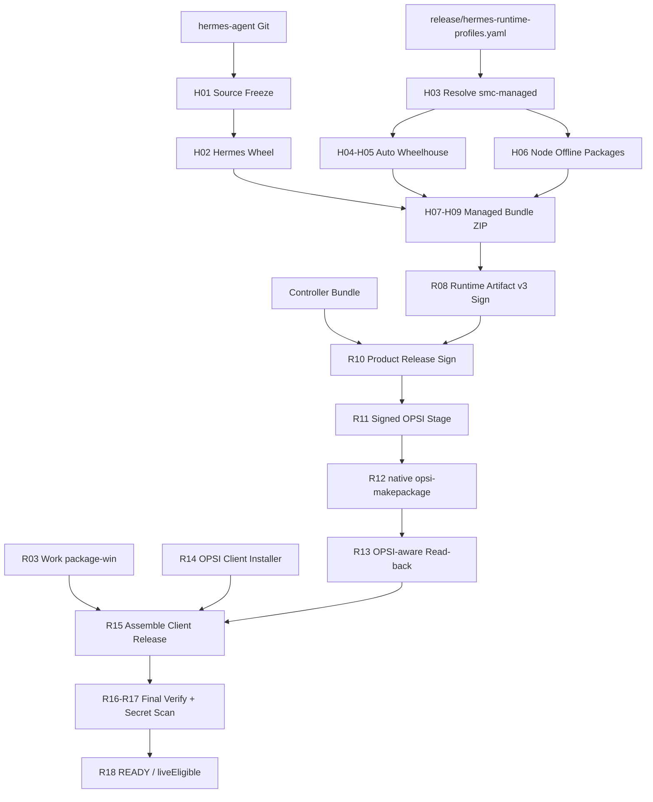

# OPSI v1.7.1 — Deployment Closure（Engineering）

## 执行依据与边界

- PRD：[docs/opsi/PRD-OPSI-v1.7.1-hotfix.md](docs/opsi/PRD-OPSI-v1.7.1-hotfix.md)；基线分支 `opsi/prd-v1.0`，建议实现分支 `opsi/prd-v1.7.1`。
- 范围（经确认）：只做工程闭环（PRD Phase 1-3 + 诊断/脚本）。真实 OPSI Server 发布、Clean Windows Live、Work 实机调用、Lifecycle Live Evidence 保持人工门禁，Cursor 不写 `proven`/`GO`。
- 固定边界：不改 Salt/Runtime control plane；不实现 Docker builder；`zipfile` 只允许 `.smoke.zip` 与单测 fixture，不得产生 `.opsi`；Production 唯一路径为 signed stage + native `opsi-makepackage`。

## 现状关键锚点（已探明）

- Hermes builder：[build_runtime.py](tools/release/hermes/build_runtime.py) 当前 `--wheelhouse` 必填；[build_wheelhouse.py](tools/release/hermes/build_wheelhouse.py) 已有 `download_wheelhouse()` 未接入主链。
- OPSI 打包：[makepackage.py](infra/opsi/products/smc-hermes-agent/packaging/makepackage.py) 当前 `--opsi-tooling` 默认 `zipfile`，`build_release` 默认走 `write_opsi_archive`；[opsi_readback.py](infra/opsi/products/smc-hermes-agent/packaging/opsi_readback.py) 为 ZIP reader。
- Endpoint：[SmcController.psm1](infra/opsi/products/smc-hermes-agent/controller/SmcController.psm1) 的 `Install-SmcRuntimeSlot` 当前 `npm install --offline` 未固定 `--prefix $slot\node`；无 `Test-SmcClientPrerequisites.ps1`。
- Unified Builder：[build_client_release.py](tools/release/client/build_client_release.py) 的 `build_all` 仍要求 `hermes_zip`/`opsi_pkg`；[verify_client_release.py](tools/release/client/verify_client_release.py) 只做文件存在+hash+secret scan。
- Enrollment：[scripts/opsi-enroll-local-client.ps1](scripts/opsi-enroll-local-client.ps1) 已存在。

## 目标流水线



## Phase 1 — Release Builder Closure

- [build_runtime.py](tools/release/hermes/build_runtime.py)：`--wheelhouse` 改为可选；未提供时调用 `download_wheelhouse()` 自动创建 Windows AMD64/cp312 wheelhouse；提供时使用缓存。同步更新 [build_runtime.ps1](tools/release/hermes/build_runtime.ps1)。
- [build_wheelhouse.py](tools/release/hermes/build_wheelhouse.py)：保持 fail-closed（拒绝 linux/macosx/win32/win_arm64/错误 ABI/sdist-only）；正式 bundle 必须含 `requirements.lock` + wheel SHA256 inventory。
- 支持 `online`/`offline` 构建模式：online 允许访问 PyPI/npm 建立 cache；offline 只允许本地 wheel/node cache，禁止网络下载。
- 测试：RB01-RB08 覆盖 clean/dirty source、自动 wheelhouse、错误平台 wheel、缺失 wheel、Node exact/latest。

## Phase 2 — OPSI Package Closure

- [makepackage.py](infra/opsi/products/smc-hermes-agent/packaging/makepackage.py)：`--opsi-tooling` 默认改为 `native`；`zipfile` 路径仅允许 smoke/fixture，禁止产出 `.opsi`；`build_release` 默认走 `build_opsi_native`。
- control.toml 动态 staging：stage 时根据本次构建 artifact 生成最终 `productVersion`/`packageVersion`/`hermes_version.default`/`controller_revision.default`，保证 control.toml = runtime-build.json = runtime artifact = product release 版本一致，不依赖人工修改。
- [opsi_readback.py](infra/opsi/products/smc-hermes-agent/packaging/opsi_readback.py)：改为 OPSI-aware extract 到临时 readback/，比较 `OPSI/control.toml`、`product-release.json`、runtime ZIP/manifest/sig、controller manifest、public key、artifact manifest，并校验 SHA256/Product/Package/Hermes/Controller revision。
- [build-real.sh](infra/opsi/products/smc-hermes-agent/packaging/build-real.sh)：与 native 路径对齐，不绕过 stage 验证。
- 测试：RB09-RB13 覆盖 artifact/controller/product release 签名、真实 `opsi-makepackage`（无则 skip）、read-back 一致/不一致。

## Phase 3 — Final Release Gate

- [verify_client_release.py](tools/release/client/verify_client_release.py)：从“文件存在+hash”提升为签名链验证：Work artifact hash、Hermes bundle signature/runtime manifest/files[]/runtime-build、Controller signature、Product Release signature、OPSI package real read-back、OPSI client hash、secret scan。全部 PASS 才允许 `liveEligible=true`。
- [build_client_release.py](tools/release/client/build_client_release.py)：`Stage all` 不再要求 `--hermes-zip`/`--opsi-package`；内部依次执行 R00-R18，任一失败即 `Release FAILED`。独立 stage（preflight/work/hermes/runtime/opsi-stage/opsi-package/assemble/verify）必须可实际执行。
- 测试：RB14-RB15 覆盖 secret scan 与 final release READY 判定。

## Phase 4 — Endpoint Node Slot 与诊断脚本

- [SmcController.psm1](infra/opsi/products/smc-hermes-agent/controller/SmcController.psm1)：Node 安装改为固定 runtime slot：`npm install --prefix $slot\node --offline`（或 `npm ci`），验证 `node_modules` 与 profile 声明 package；写入 `runtime.json` 的 `NodeDependencyStatus = PASS`；禁止写入 Product Cache/System32/CWD/%APPDATA%/用户 home。
- 新增 `Test-SmcClientPrerequisites.ps1`：输出 JSON（platform/architecture/python version+arch+venv/node version+npm），失败即 `PREREQUISITE_FAILED`，不得继续安装。
- 新增 Deployment Diagnostic Bundle 脚本：收集 clientId、OPSI product status、controller/runtime digest、active.json/runtime.json、Python/Node/npm 版本、Gateway task/port/status、last transaction/error、相关日志，并脱敏 API key/token/password/credential。
- 测试：WC01-WC02、Node slot 安装与验证、诊断脱敏。

## 自动化门禁

```text
python -m pytest tools/release/tests infra/opsi/tests -q
powershell -NoProfile -Command "Invoke-Pester -Path infra/opsi/tests/SmcHermesAgent.Tests.ps1 -EnableExit"
npm run contracts:check
python scripts/check-opsi-isolation.py --base <merge-base>
```

## 建议 PR 拆分

1. `feat(release): automatic windows wheelhouse and online/offline build mode`
2. `feat(opsi): native opsi-makepackage default and opsi-aware read-back`
3. `feat(release): unified stage-all orchestrator and final signature-chain verify`
4. `feat(opsi): node runtime slot install and client prerequisite gate`
5. `feat(opsi): deployment diagnostic bundle with secret redaction`

## 完成检查表（工程部分）

- [ ] `--wheelhouse` 可选，未提供时自动下载 Windows AMD64 wheelhouse
- [ ] Production 禁止 zipfile `.opsi`；native `opsi-makepackage` 为默认
- [ ] OPSI read-back 比较 control/product-release/runtime/controller/public key/artifact manifest
- [ ] `build-client-release all` 不再要求 `--hermes-zip`/`--opsi-package`
- [ ] Final Verify 包含签名链 + read-back + secret scan，全部 PASS 才 `liveEligible=true`
- [ ] Node 安装固定到 `$slot\node` 并验证 `node_modules`
- [ ] `Test-SmcClientPrerequisites.ps1` 输出 JSON 且 fail-closed
- [ ] Diagnostic bundle 收集关键状态并脱敏
- [ ] Live/Operator 证据保持 NO-GO，不由 Cursor 标记