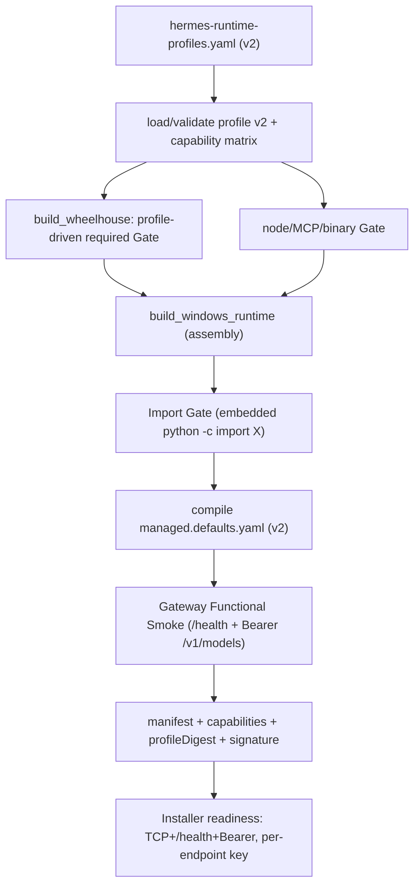

# PRD-OPSI-v2.1.4 实施计划：Hermes Runtime 能力闭包与 Managed Config 基线

## 目标与约束
- 落地 P0 + P1 全部**可代码化**改造与单测；真实 Windows/Gateway live 验收（DoD #10）留作人工签署，不在本轮代码环境完成。
- `capability → extra/package → import 模块名` 采用**代码侧受控 allowlist**（`capability_matrix.py`），Profile 只声明启用布尔与可覆盖的 extras/requiredPackages/node 包；import 探针模块名一律来自 allowlist，绝不把 Profile 原文拼接为 Python 代码（满足 FR-214-20 安全要求）。
- 所有 Gate **fail-closed**：任一 capability/config/dependency/import/gateway 不一致 → Release Build 直接失败。
- 遵守 `.cursor/rules/powershell-windows-encoding.mdc`：子进程一律 `encoding="utf-8"`；`.ps1/.psm1` UTF-8、`Set-StrictMode`+`$ErrorActionPreference="Stop"`。

## 构建流水线（目标链路）

## 工作流 A — Runtime Profile v2 与依赖矩阵 (P0: FR-214-01/02)
- 重写 [release/hermes-runtime-profiles.yaml](release/hermes-runtime-profiles.yaml) 为 `schema: smc.hermes.runtime-profile.v2`，含 `capabilities`(布尔)、`python.extras`+`requiredPackages`、`node`(`required`+pinned packages)、`gateway`(`authRequired: true`)、`managedConfig.defaults`/`enforced`（按 PRD §13/§17 的 baseline，先仅纳入已可运行 backend；若 baidu backend 未入 inventory 则 web 用已验证 backend 或禁用）。
- 升级 [tools/release/hermes/runtime_profile.py](tools/release/hermes/runtime_profile.py)：`SCHEMA` 改 v2，`validate_profile` 增加：capabilities 必须全布尔、`requiredPackages` 校验、node 精确版本（保留）、`gateway.authRequired` 必须为真且 bind=127.0.0.1、lazyInstall 与 `managedConfig.enforced.security.allow_lazy_installs` 一致性（任一允许即 FAIL）、拒绝 unknown schema。新增 `profile_digest(profile)` 返回 sha256。
- 新增 `tools/release/hermes/capability_matrix.py`：受控字典 `CAPABILITY_MATRIX = { "apiServer": {extras:["messaging"], required:["aiohttp"], imports:["aiohttp"], node:[], binaries:[]}, "mcp": {...import "mcp"...}, "filesystemMcp": {node:[server-filesystem]}, "web": {...}, "localStt":{extras:["voice"], imports:[...]}, "edgeTts":{...import "edge_tts"...}, "hindsight":{...}, "tirith":{binaries:[...]}, "lspAutoInstall":{...} }`。提供：`validate_capability_declaration(profile)`（能力→声明方向：启用能力的 canonical extras/required/node 必须已出现在 profile 声明中）、`expected_required_packages(profile)`、`expected_imports(profile)`、`expected_node_packages(profile)`、`enabled_binaries(profile)`。名称来源仅此文件的 allowlist。

## 工作流 B — 依赖闭包 Gate (P0: FR-214-19/21)
- [tools/release/hermes/build_wheelhouse.py](tools/release/hermes/build_wheelhouse.py)：`verify_required_wheels` 已存在但未被驱动。规范化保留（`-`/`_`/case）；在 build_runtime 装配后由 `expected_required_packages(profile)`（profile.requiredPackages ∪ 矩阵派生）驱动调用；补 duplicate/ABI/sdist 断言（多数已在）。缺 required/错 ABI/source-only → FAIL（DEP-001..005）。
- [tools/release/hermes/build_node_packages.py](tools/release/hermes/build_node_packages.py) + [windows_runtime.py](tools/release/hermes/windows_runtime.py)：filesystemMcp 启用时校验矩阵 node 包 + bin entry 离线可解析（`_gate_npm_npx` 已在，禁止 `npx -y`/registry）；enabled binary capability（如 tirith）校验 PE 架构/digest/version，未打包即启用 → FAIL（DEP-006）；disabled capability 的 baseline 不得引用其 command/provider（交由工作流 D 校验）。

## 工作流 C — Runtime 装配、Import Gate、managed.defaults 编译 (P0: FR-214-17/20)
- [tools/release/simple_yaml.py](tools/release/simple_yaml.py)：支持内联 `{}`/`[]` 空 flow 集合（`defaults: {}` → `{}`）；新增确定性 `dump_yaml(data)`（排序键、双引号转义 Windows 路径、稳定缩进）供编译使用。
- [tools/release/hermes/build_runtime.py](tools/release/hermes/build_runtime.py)：
  - 替换 `assemble_bundle` 中写死的 `managed.defaults.yaml`（`keys: {}`）为编译：读取 `profile.managedConfig` → 校验平台/能力一致 → `dump_yaml` 输出 `schema: smc.opsi.managed-config.v2 / profile / profileVersion / defaults / enforced`，确定性且可 read-back，记录 source profile digest/version。
  - `runtime-profile.json` schema 升级 v2 + 写入 digest；`runtime-build.json`（`write_runtime_build`）新增 `capabilities`、`managedConfigVersion:2`、`runtimeProfileVersion:2`、`runtimeProfile`、`runtimeProfileDigest`（FR-214-26）。
  - 新增 **Windows Import Gate**：runtime 组装后（Windows 构建主机上），用最终 embedded `python.exe -c "import X"` 逐个跑 `expected_imports(profile)`（受控矩阵），任一失败即 FAIL；仿照现有 `_gate_sqlite_version` 仅 `os.name=="nt"` 执行，Linux CI 跳过运行但仍做静态矩阵一致性校验。
- 新增 `tools/release/hermes/gateway_smoke.py`（FR-214-22）：临时 managed `HERMES_HOME` → 编译 baseline + 生成 test-only 随机 key（仅存临时目录/进程 env）→ 随机可用端口启动 `hermes.exe gateway run` → 有界超时等待 TCP → `GET /health==200` → Bearer `GET /v1/models==200` → 优雅终止 + 强制兜底 + orphan 检查。timeout/早退/401/403/非 200/未监听/orphan 均 FAIL；secret 不入日志/manifest/artifact。Windows-only 执行，逻辑抽成可注入以便单测。在 `build_managed_bundle` 中于 import gate 之后、release_v2 之前接入。

## 工作流 D — Manifest / 校验 / Baseline 一致性 (P0: FR-214-05/09/12/13/26)
- [tools/release/hermes/verify_runtime.py](tools/release/hermes/verify_runtime.py)：`verify_bundle_tree` 校验 runtime-build v2 的 capabilities/profileDigest 存在且与 profile 一致（read-back）；保留 forbidden 路径扫描。
- [tools/release/hermes/release_v2.py](tools/release/hermes/release_v2.py)：`build_release_manifest` 从 runtime-build.json read-back `capabilities/managedConfigVersion/runtimeProfileVersion/runtimeProfile/runtimeProfileDigest` 写入 manifest；`REQUIRED_RUNTIME_FILES` 增加 `config/managed.defaults.yaml`（或 runtime 内对应路径）。
- Baseline 一致性校验（build_runtime 编译期）：拒绝 Linux 路径 `/data/hermes/*`、`/usr/local/bin/gbrain`、`/data/hermes/obsidian-vault`（CFG-001）；`allow_lazy_installs=true`/LSP auto install/Bitwarden auto install/未打包 Tirith 启用 → FAIL（CFG-002/003）；model/provider/secret/业务 endpoint 不得进入 profile/baseline（CFG-004，FR-214-15）。

## 工作流 E — Installer 就绪与 per-endpoint Gateway Key (P0: FR-214-16/23)
- [infra/windows/hermes-agent/installer/InstallerCore.psm1](infra/windows/hermes-agent/installer/InstallerCore.psm1)：
  - 新增 `Set-SmcHermesEndpointSecret`：Fresh Install 生成 32-byte 强随机 `API_SERVER_KEY` 写入 ACL 保护的 `HermesHome\.env`（`API_SERVER_ENABLED/HOST=127.0.0.1/PORT=8642/KEY`）；Upgrade/Repair 保留现有有效 key；禁止固定/仓库/共享 key，禁止日志输出。
  - Gateway task launcher 注入 `API_SERVER_*`（`Get-SmcHermesGatewayTaskSpec`）。
  - `Test-SmcHermesReady` 升级为真实就绪：CLI 版本 + Task 契约（保留）→ **启动 task** → 有界 retry/backoff 探测 TCP 监听 + `GET /health==200` + 用 endpoint secret 的 Bearer `GET /v1/models==200`。Task 存在 ≠ Ready（GW-003）。失败触发现有 rollback/repair，不 `Commit-SmcControlOwner`、不写 READY（FR-214-11）。保留 `SMC_HERMES_INSTALLER_SKIP_GATEWAY` 用于 smoke fixture 结构校验。

## 工作流 F — Managed Config Merge 与 Doctor 能力诊断 (P1: FR-214-17/18/27)
- [infra/windows/hermes-agent/scripts/SmcHermesManaged.psm1](infra/windows/hermes-agent/scripts/SmcHermesManaged.psm1)：
  - 新增 `Merge-SmcHermesManagedConfig`：读取 ProgramRoot 内 `managed.defaults.yaml` → 合并进 `HermesHome\config.yaml`：defaults(existing wins) + enforced(enterprise wins)；结构化、原子(tmp+move)、可回滚、`hermes config check`；不覆盖 models/providers/secrets/未知字段，不回写 secret（FR-214-18）。在 Install/Upgrade/Repair 调用。
  - `Get-SmcHermesManagedDoctorReport` 增加 `Hermes Runtime Capabilities` 段：从 manifest/runtime-build read-back capabilities，逐项 API Server/aiohttp、MCP/Filesystem MCP、Web backend、Local STT、Edge TTS、Hindsight、Tirith/LSP disabled policy、Workspace、Gateway Health/Auth、Offline/lazy policy → PASS/FAIL/DISABLED，并显示 profile/version/digest；只诊断不安装、不泄露 secret。
- [infra/windows/hermes-agent/scripts/HostOperations.ps1](infra/windows/hermes-agent/scripts/HostOperations.ps1)：`doctor` verb 已调用 Doctor report；`repair` 增加 capability reconcile（触发 Merge + 重启 + 就绪探测）。

## 工作流 G — 测试矩阵与验收 runbook
- 扩展 [tools/release/tests/test_hermes_builder.py](tools/release/tests/test_hermes_builder.py)：Profile v2 加载/拒绝、capability 矩阵双向校验、DEP-001..006、CFG-001..004、managed.defaults 编译确定性+read-back、import gate 矩阵（可注入 runner）、manifest capabilities/digest、gateway_smoke（mock health/auth：200/401/timeout/orphan）。更新 `test_h07` 等引用 v1 的断言到 v2。
- 扩展 Pester：[infra/windows/hermes-agent/tests/Installer.Tests.ps1](infra/windows/hermes-agent/tests/Installer.Tests.ps1)（readiness：mock /health+/v1/models，GW-003 task-exists-but-down FAIL；per-endpoint key 生成/保留/不泄露 SEC-001）、[SmcHermesManaged.Tests.ps1](infra/windows/hermes-agent/tests/SmcHermesManaged.Tests.ps1)（defaults/enforced merge 语义、不覆盖 models/providers/secrets、Doctor capability 段）。
- 新增/更新 Windows acceptance runbook（Fresh Install/Upgrade/Offline，§35/§36），标注 live gate 由 Release/Endpoint Ops/Security Owner 现场签署（DoD #10），自动化 fixture 不替代 live。
- 入口不变：[scripts/build-client-release.ps1](scripts/build-client-release.ps1) 仍为唯一人工发布入口，无 bypass gates 的第二条 path（§32）。

## 关键风险
- Profile v2 声明的 extras/import 名必须与 hermes-agent `pyproject` 的 optional-dependencies 精确匹配；因采用受控矩阵，若构建时 wheelhouse 下载或 import gate 因名字不符失败，再据实调整矩阵/Profile。
- Import Gate 与 Gateway Smoke 只能在 Windows 构建主机真实执行；Linux CI 仅跑静态一致性与可注入 mock 单测。