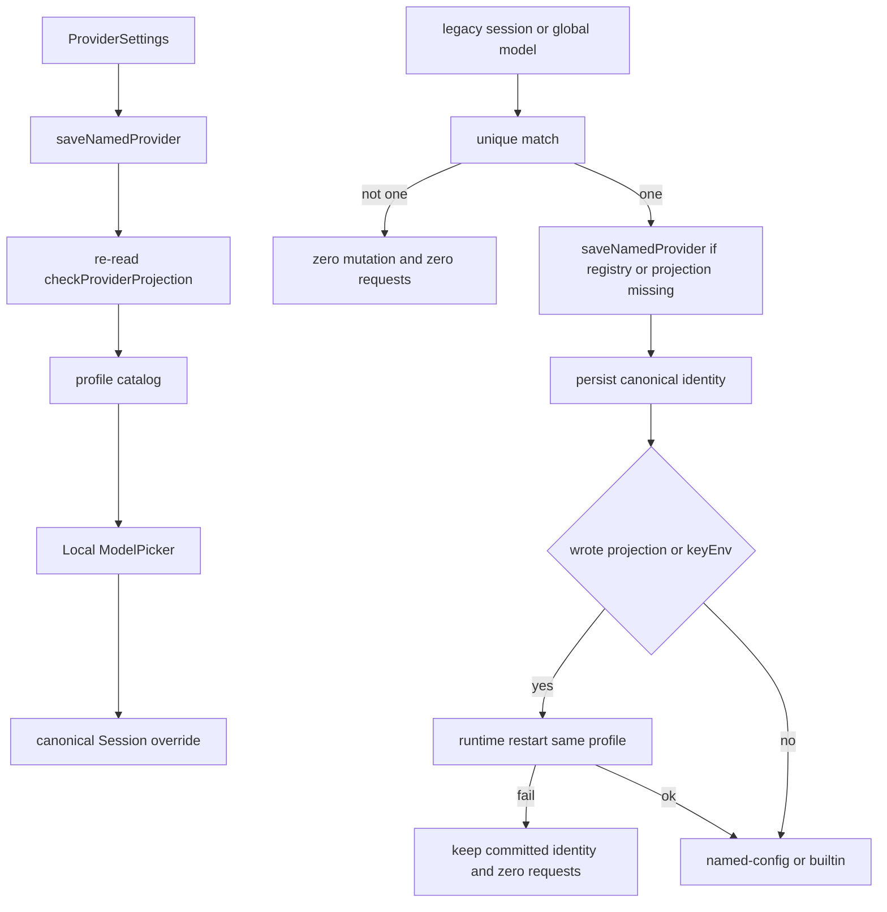

# Provider Identity P0.1 生产接线实现计划

依据 [docs/work/PRD-WORK-Provider-Identity-P0.1-Production-Wiring-Completion-v1.0.md](docs/work/PRD-WORK-Provider-Identity-P0.1-Production-Wiring-Completion-v1.0.md) v1.1，`status = APPROVED_FOR_PLAN`。实现以 §2.1 的 `P0.1-D-01`～`P0.1-D-23` 为准。本计划 `plan_contract: smc.plan.v3.7`，claim `GES_NATIVE`。仓库内没有 `smc-plan-from-approved-prd-ponytail` 技能包，因此沿用已落地的父计划 [`.cursor/plans/provider_identity_routing_03dd872c.plan.md`](.cursor/plans/provider_identity_routing_03dd872c.plan.md) 与本文 §28.2 / §29 的字段。本计划状态是 `planned`，不是 `approved`。

写入位置：`.cursor/plans/provider-identity-p0.1-production-wiring.plan.md`。

不改 Hermes Agent Core、NEW-API、NodeDeskClaw Bootstrap、remote/ssh 发送与重启、打包 bake-in、Knowledge Chat 业务语义。不改 [`removeCustomProvider()`](apps/work/src/main/providers-store.ts)（`KNOWN-GAP-P01-001` / `P0.1-D-17`）。不把 `PROVIDER_BASE_URLS` 当作 builtin 身份闭集。



## 现有入口

- Settings 保存仍在 [`apps/work/src/main/ipc/register.ts`](apps/work/src/main/ipc/register.ts) 的 `upsert-custom-provider`，调用 [`upsertCustomProvider()`](apps/work/src/main/providers-store.ts)。改为调用 [`saveNamedProvider()`](apps/work/src/main/provider-identity/provider-save-transaction.ts)。通道名保留。
- [`listCustomProviders()`](apps/work/src/main/providers-store.ts) 现会 `importAgentConfigProviders()` → `upsertCustomProviderRecordOnly()`，并可能写 `.env` 与 `mirrorFirstPartyAgentProviders()`。这次调用改为 0 mutation。
- [`saveNamedProvider()`](apps/work/src/main/provider-identity/provider-save-transaction.ts) 写完投影后只核对 registry 行的 `providerKey`。commit 前必须重读并调用 [`checkProviderProjection()`](apps/work/src/main/agent-config-providers.ts)。
- Catalog 文件今天固定是 Hermes Root 的 `models.json`（[`modelsFile()`](apps/work/src/main/models.ts)）。named profile 改为 `profileHome(profile)/models.json`。默认 profile 仍用 Root 文件。Settings 增删改查与本地 Picker 读写同一份。
- [`listModels()`](apps/work/src/main/models.ts) 在文件已存在时调用 `syncAgentConfigModels()`。该路径停掉。文件不存在时保留一次 `seedDefaults`。
- 本地 Picker 在 [`useModelConfig.ts`](apps/work/src/renderer/src/screens/Chat/hooks/useModelConfig.ts) 调用 `listConfiguredModels()`。改为读当前显式 profile catalog。[`listConfiguredAgentModels()`](apps/work/src/main/models.ts) 不再作为本地身份来源，也不在该次读取中把库镜像进 `custom_providers`。
- [`ModelPicker.tsx`](apps/work/src/renderer/src/components/ModelPicker.tsx) 与 [`Chat.tsx`](apps/work/src/renderer/src/screens/Chat/Chat.tsx) 的选择回调目前是 `provider, model, baseUrl`。必须显式传递 `providerRef`。新 Session 立即 canonical。
- [`migrateStoredSessionOverride()`](apps/work/src/main/session-model-override-store.ts) 只在测试里调用。生产发送在 [`local-migrate-and-send.ts`](apps/work/src/main/provider-identity/local-migrate-and-send.ts) 只做内存匹配。按 `P0.1-D-23` 接上持久化。
- 重启继续用 [`runtime-service-adapter.ts`](apps/work/src/main/runtime/runtime-service-adapter.ts) 的现有 `restart(profile)`。失败不回滚已提交的 Registry、投影和已经写上的 canonical identity。
- builtin 闭集不在本仓库。写入 `builtin:<slug>` 时读取 pinned Hermes v0.21.0（tag `v2026.8.31`）的 `hermes_cli/models.py`：`CANONICAL_PROVIDERS` 以及该文件自己的 alias。测试用从该 tag 得到的闭集夹具，不读 [`provider-registry.ts`](apps/work/src/main/provider-registry.ts) 的 `PROVIDER_BASE_URLS`。

## Todos

每个 Todo 的 `status` 从 `planned` 开始。只有对应验收跑出 Evidence 才能标 `verified`。

```yaml
id: p01-t1-provider-save-wiring
requirement_refs: [REQ-WIRE-001, REQ-DATA-001, REQ-PROJ-001]
acceptance_refs: [A-WIRE-001, A-DATA-001, A-PROJ-001, A-NEG-001]
files_or_symbols:
  - apps/work/src/main/ipc/register.ts#upsert-custom-provider
  - apps/work/src/main/provider-identity/provider-save-transaction.ts#saveNamedProvider
  - apps/work/src/main/agent-config-providers.ts#checkProviderProjection
  - apps/work/src/main/providers-store.ts#listCustomProviders
  - apps/work/src/preload/index.ts
  - apps/work/src/renderer/src/screens/Providers/Providers.tsx
implementation_goal: Settings 成功保存只走 saveNamedProvider，返回 ProviderRecordV2。commit 前重读投影并 semantic verify。listCustomProviders 本次 0 mutation。providerKey 继续用 generateProviderKey，冲突为 PROVIDER_KEY_CONFLICT。
preconditions: 显式 profile；不读 HERMES_PROFILE 覆盖调用方 profile。
state_transition: UNREGISTERED 或 EXISTING 到 COMMITTED；verify 失败回到 T0。
side_effect_scope: 该 profile 的 providers.json、可选的目标 .env key、providers:providerKey。list 路径无写入。removeCustomProvider 不改。
failure_cases: [PROVIDER_PROJECTION_DRIFT, PROVIDER_KEY_CONFLICT, PROVIDER_KEYENV_CONFLICT, PROVIDER_SAVE_TRANSACTION_FAILED, PROVIDER_SAVE_ROLLBACK_FAILED]
verification: 经真实 preload/IPC 表面保存；静默写错 baseUrl 必须失败并回到 T0；list 前后 providers.json、.env、config.yaml 字节不变。
status: planned
evidence: pending
```

```yaml
id: p01-t2-model-providerref
requirement_refs: [REQ-MODEL-001, REQ-PICKER-001]
acceptance_refs: [A-MODEL-001, A-PICKER-001, A-NEG-002, A-NEG-003]
files_or_symbols:
  - apps/work/src/main/models.ts#modelsFile
  - apps/work/src/main/models.ts#listModels
  - apps/work/src/main/models.ts#addModel
  - apps/work/src/main/models.ts#listConfiguredAgentModels
  - apps/work/src/renderer/src/screens/Chat/hooks/useModelConfig.ts
  - apps/work/src/renderer/src/components/ModelPicker.tsx
implementation_goal: 按显式 profile 分 catalog。已有文件的读取只补尚不存在且唯一匹配的 providerRef。本地 Picker 只列这份 catalog。无法解析的行可见不可选，点击为 MODEL_PROVIDER_UNRESOLVED。保留 provider、providerLabel、baseUrl。
preconditions: 匹配对象是当前 profile 已有 ProviderRecord，或 Hermes v2026.8.31 CANONICAL_PROVIDERS 及其 alias。
state_transition: 无 providerRef 且唯一命中则写成 named 或 builtin ref；已有 providerRef 不改写；0 或多候选项保持原行。
side_effect_scope: 仅当前 profile catalog 的 providerRef 字段。文件不存在时一次 seedDefaults。不写 providers.json、.env、config.yaml，不调用 saveNamedProvider。
failure_cases: [MODEL_PROVIDER_UNRESOLVED, 新 named 写入缺 providerRef]
verification: 新 named 行必有 providerRef；缺字段的 new-write 失败；Picker 选择值等于行上的 providerRef；Chat 不从 baseUrl 推导。
status: planned
evidence: pending
```

```yaml
id: p01-t3-session-canonical
requirement_refs: [REQ-SESSION-001]
acceptance_refs: [A-SESSION-001, A-NEG-004]
files_or_symbols:
  - apps/work/src/renderer/src/screens/Chat/Chat.tsx#handleSelectModel
  - apps/work/src/main/session-model-override-store.ts#setSessionModelOverride
implementation_goal: 选择可解析的 named 或 builtin 模型后，Session override 立即带 providerRef。migrationStatus 为 canonical。legacyProvider 与 legacyBaseUrl 为空。Session 有 id 之后立刻持久化。第一次发送不走 legacy identity recovery。
preconditions: Picker 已交出可解析 providerRef。不可选行不得写入 Session。
state_transition: NEW_SESSION 到 CANONICAL_OVERRIDE。
side_effect_scope: 当前 profile state.db 的 desktop_session_model_overrides。选择尚未有 session id 时只留在内存。
failure_cases: [缺 providerRef 的选择, 不可选行被点击]
verification: 任何模型请求前 Session store 已含 providerRef 与 migrationStatus canonical。
status: planned
evidence: pending
```

```yaml
id: p01-t4-legacy-session-migration
requirement_refs: [REQ-MIG-001, REQ-RUNTIME-001]
acceptance_refs: [A-MIG-SESSION-001, A-RUNTIME-001, A-NEG-005, A-NEG-009]
files_or_symbols:
  - apps/work/src/main/provider-identity/local-migrate-and-send.ts
  - apps/work/src/main/session-model-override-store.ts#migrateStoredSessionOverride
  - apps/work/src/main/runtime/runtime-service-adapter.ts
implementation_goal: legacy Session 同一次发送按 P0.1-D-23 顺序执行。唯一匹配后，缺 Registry 或投影才调用 saveNamedProvider。然后持久化 providerRef，必要时重启，再 resolve，再发送。重启失败保留已提交状态且 0 次模型请求。第二次发送直接读已持久化的 providerRef。
preconditions: connection mode 为 local。catalog 读取不得借此创建 Registry。
state_transition: LEGACY_OVERRIDE 到 migrated canonical override，或停在 unresolved。
side_effect_scope: 补齐时写该 profile 的 Registry、目标 .env key、providers 投影；Session 行写 providerRef。persist 失败回滚该 Session 行。
failure_cases: [SESSION_PROVIDER_UNRESOLVED, PROVIDER_RUNTIME_RELOAD_FAILED, session persist 失败]
verification: 唯一 baseUrl 的 legacy 行同一次发送持久化 named-config，bare custom 请求数为 0。注入 restart false 时期望 0 次网络且 desired state 仍在。歧义匹配 0 mutation、0 网络。
status: planned
evidence: pending
```

```yaml
id: p01-t5-global-model-migration
requirement_refs: [REQ-MIG-002, REQ-RUNTIME-001]
acceptance_refs: [A-MIG-GLOBAL-001, A-NEG-006, A-NEG-009]
files_or_symbols:
  - apps/work/src/main/provider-identity/local-migrate-and-send.ts
  - apps/work/src/main/config.ts#setModelConfig
implementation_goal: 无 Session override 时，legacy 全局 model 使用与 D-23 相同的顺序。成功后 model.provider 为 providerKey，作为身份的 base_url 删除。无法唯一匹配时 model 受管字段回到 T0。
preconditions: 无 Session override，connection mode 为 local。
state_transition: LEGACY_ACTIVE_MODEL 到 CANONICAL_ACTIVE_MODEL，或保持 T0。
side_effect_scope: 该 profile config.yaml 中 Desktop-owned 的 model.provider、model.default、model.base_url、model.api_mode。补齐 Registry 与投影的范围同 t4。
failure_cases: [ACTIVE_MODEL_PROVIDER_UNRESOLVED, 写回失败, PROVIDER_RUNTIME_RELOAD_FAILED]
verification: 发请求前 model.provider 已是 providerKey，identity base_url 已删除。歧义时受管字段等于 T0，网络次数为 0。
status: planned
evidence: pending
```

```yaml
id: p01-t6-route-parity
requirement_refs: [REQ-ROUTE-001, REQ-COMPAT-001]
acceptance_refs: [A-ROUTE-001, A-NEG-007, A-NEG-010]
files_or_symbols:
  - apps/work/src/main/hermes.ts
  - apps/work/src/main/ipc/register.ts#resolve-local-chat-route
  - apps/work/src/renderer/src/screens/Chat/hooks/useDashboardChatTransport.ts
implementation_goal: 同一 providerRef 加 model，本地 Gateway 与本地 Dashboard 得到相同的 strategy、hermesProvider、apiMode。正常路径 hermesProvider 不为 custom 或 custom:前缀。本地 Dashboard 在 resolver 不可用时失败关闭。remote/ssh 仍走现有猜测路径，行为不变。
preconditions: route 已由 Runtime Provider Resolver 生成。
state_transition: 无额外持久化。canonical 读取直接 resolve。
side_effect_scope: 无。发送本身的模型网络只在 route 成功之后。
failure_cases: [Gateway 与 Dashboard 身份不一致, 本地 baseURL 猜测, remote 或 ssh 行为变化]
verification: 同一 canonical input 两条 transport 的 route 字段一致。remote/ssh fixture 与改动前一致。
status: planned
evidence: pending
```

```yaml
id: p01-t7-security-profile-observability
requirement_refs: [REQ-PROFILE-001, REQ-SEC-001, REQ-OBS-001]
acceptance_refs: [A-PROFILE-001, A-SEC-001, A-OBS-001, A-NEG-008]
files_or_symbols:
  - apps/work/src/main/provider-identity/local-migrate-and-send.ts
  - apps/work/src/main/provider-identity/provider-save-transaction.ts
implementation_goal: 保存、catalog 绑定、Session 迁移、全局 model 迁移和 runtime restart 都使用同一个显式 profile。密钥只出现在该 profile 的 .env。路由日志与 Evidence 带 providerRef、strategy、source、transport、modelRequestCount、errorCode，不带 secret。
preconditions: 调用方传入 profile。进程环境 HERMES_PROFILE 不得改写目标。
state_transition: 错 profile 时停在 PROFILE_SCOPE_MISMATCH，0 mutation。
side_effect_scope: 仅显式 profile 的受管文件。不写 config.yaml model.api_key。
failure_cases: [PROFILE_SCOPE_MISMATCH, secret 出现在 JSON 或 Session 或 Evidence, model.api_key 被创建]
verification: explicit profile default 且 HERMES_PROFILE=coder 时只改 default。保存测试 secret 后扫描受管产物，只在目标 .env 出现。
status: planned
evidence: pending
```

```yaml
id: p01-t8-verification-golden
requirement_refs: [REQ-VERIFY-001, REQ-GATE-001]
acceptance_refs: [A-VERIFY-001]
files_or_symbols:
  - apps/work/src/main/provider-identity/*.test.ts
  - apps/work/src/main/models.ts
  - apps/work/src/main/session-model-override-store.test.ts
implementation_goal: 记录实际执行的 targeted tests、typecheck、full Work tests 与 build。Guard 或 governance 的既有失败标 BLOCKED_BASELINE，不标 Provider PASS。Golden 身份断言与上游 HTTP 分开：401 为 FAIL，不可达为 BLOCKED。
preconditions: t1 到 t7 的断言已实现。
state_transition: planned 到 implemented 只表示代码写完。verified 需要实际 Evidence。
side_effect_scope: 测试与 evidence 记录。合成 fixture 不替代最终 Golden Consumer。
failure_cases: [只有测试文件没有运行结果, HTTP 401, 上游不可达被写成全量 PASS, baseline Guard 被写成 Provider FAIL 或 PASS]
verification: 各 A-* 一条 evidence。modelRequestCount 与 hermesProvider 按 §24.1 记录。无 API Key。
status: planned
evidence: pending
```
