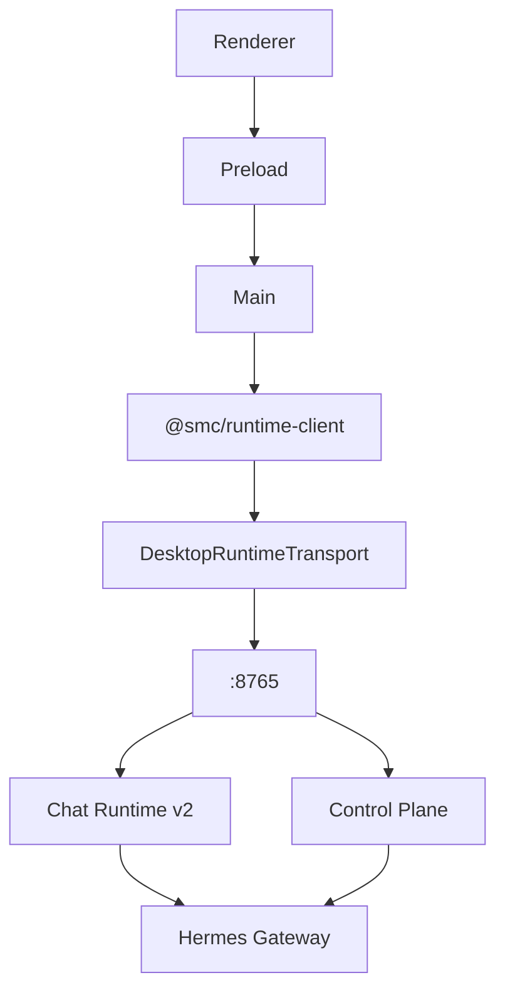

# SMC Copilot PRD v1.1 实施计划

## 基线结论

v1.0 Monorepo 结构已就绪（Nx 图 `runtime → contracts → runtime-client-ts → desktop`）。v1.1 要解决的 P0：

| P0 | 现状 | 目标 |
|---|---|---|
| 双 OpenAPI | Desktop 仍有 [`apps/desktop/src/shared/generated/copilot-serve/`](apps/desktop/src/shared/generated/copilot-serve/) + [`scripts/serve-client/`](apps/desktop/scripts/serve-client/) | 只保留 `contracts/runtime-api/openapi.yaml` |
| 最小 Client | [`create-runtime-client.ts`](packages/runtime-client-ts/src/client/create-runtime-client.ts) 仅 `getStatus/getCapabilities/getJobEvents` | Domain facade + Transport；Desktop 不手写 URL |
| runtimeFetch 不能直接删 | Desktop [`runtime-http-client.ts`](apps/desktop/src/main/copilot-runtime-client/runtime-http-client.ts) 已有鉴权/幂等/SSE | `DesktopRuntimeTransport` 复用现有能力 |
| Chat Runtime v2 | Desktop 已有 [`chat-runtime-client.ts`](apps/desktop/src/main/copilot-runtime-client/clients/chat-runtime-client.ts) 调 `/api/v1/chat-runs*`；Runtime **无**对应 Router | Runtime 实现持久化 ChatRun + Event Store |
| Workspace Chat | 仍走 `/profiles/*/chat/*`（[`workspace-chat-client.ts`](apps/desktop/src/main/workspace-chat/workspace-chat-client.ts)） | Cutover 到 Chat Runtime v2 |

约束（贯穿全程）：

- 按 PRD §26/§27 分阶段 + 建议 commit message；不推送远端
- Domain Client **禁止 Big Bang**；`runtimeFetch` 通过 Transport 注入，不整库替换
- Contract 版本号（`bundleVersion` / `runtimeApi` / `runtimeEvents`）在实施 Phase 2/3 时按实际兼容性写入，不臆造



---

## Phase 1：工程 Gate 修复（立即执行）

**目标：** `npm ci && npm run bootstrap && npm run check && npm run build` 全新可跑。

1. **runtime-client-ts install**
   - 在 [`packages/runtime-client-ts/project.json`](packages/runtime-client-ts/project.json) 增加 `install` target（`npm ci`）
   - [`package.json`](packages/runtime-client-ts/package.json) 补 `@types/node` 直接依赖；确保 `openapi-typescript` 本地可解析

2. **Generator 隔离**（PRD §15.1）
   - 改 [`tools/contract-generate/generate_ts_client.mjs`](tools/contract-generate/generate_ts_client.mjs)：只从 `packages/runtime-client-ts/node_modules` 解析，禁止 fallback 到 Desktop/root

3. **Runtime Ruff Blocking**
   - [`services/runtime/project.json`](services/runtime/project.json) lint/format-check 去掉软失败
   - [`.github/workflows/runtime-ci.yml`](.github/workflows/runtime-ci.yml) 删除 `|| true`（先修现存 Ruff 问题或分 commit 清债）

4. **Desktop Guard Nx target**
   - 新增 `desktop:guard`，聚合现有 scripts：`check:workspaces-no-tailwind`、`check:no-reference-imports`、`check:no-renderer-runtime-http`、`check:no-legacy-profile-chat`、`check:chat-boundaries`、`typecheck:chat` 等（按 PRD §17；缺的 guard script 补齐）
   - Desktop CI 将 `guard` 设为 Blocking 前置

5. **Nx inputs**
   - [`nx.json`](nx.json) `sharedGlobals` 去掉 `contracts/**/*`，仅保留根配置；契约变更靠 implicitDependencies 传播

Commit: `build(monorepo): close runtime-client bootstrap` + `ci(runtime): enforce ruff quality gates` + `ci(desktop): enforce serve-first architecture guards`

---

## Phase 2：版本与 Capability

1. **Desktop version SOT**
   - 删除 [`runtime-mode.ts`](apps/desktop/src/main/copilot-runtime-client/runtime-mode.ts) 硬编码 `DESKTOP_VERSION = "9.0.0"`
   - 新增 `tools/release/generate-build-info.mjs` → 生成 `apps/desktop/src/shared/generated/build-info.ts`（`DESKTOP_VERSION` / `RUNTIME_API_VERSION` / `GIT_COMMIT`）
   - 产品版本唯一来源：[`apps/desktop/package.json`](apps/desktop/package.json)（当前 `0.1.9`）；同步修正 AGENTS 版本叙述

2. **Runtime API version SOT**
   - 应用版本：[`services/runtime/pyproject.toml`](services/runtime/pyproject.toml) `1.6.0`
   - API version 与 [`capabilities.py`](services/runtime/src/core/capabilities.py) `api_version`、handshake 对齐为单一常量

3. **Contract `version.json`**
   - 增加 `bundleVersion`；按实际变更决定 `runtimeApi` / `runtimeEvents` bump（当前无 `bundleVersion`）

4. **Capability 类型化 + hard gate**
   - Runtime：`RuntimeFeatureId = Literal[...]`（含 `chat.runtime.v2`），OpenAPI 生成 enum/union
   - Desktop：按模块检查 Core/Chat/Task/MCP 所需 features（PRD §13.2），禁止「capabilities 非空即继续」

Commit: `fix(version): unify desktop and runtime contract versions` + `feat(capabilities): generate typed runtime capability contract`

---

## Phase 3：单一 Contract

1. 删除 Desktop OpenAPI 事实源与 generator：
   - `apps/desktop/src/shared/generated/copilot-serve/`
   - `apps/desktop/scripts/serve-client/`
   - npm scripts `generate:serve-client` / `check:serve-contract-drift`
2. 引用方改为 `@smc/runtime-client` generated types / facade
3. **统一 Error Contract**（PRD §14）
   - [`error_envelope.py`](services/runtime/src/api/middleware/error_envelope.py) 增加 `RequestValidationError` / `HTTPException` handler
   - 读取并回传 `X-Request-ID`（响应 header + envelope）
4. Breaking check 改为与 PR Base 比较（PRD §19）

验收：全库仅一个 Runtime OpenAPI 路径。

Commit: `refactor(contract): remove desktop-local OpenAPI snapshot`

---

## Phase 4：Domain Client 迁移

重构 [`packages/runtime-client-ts`](packages/runtime-client-ts) 为 PRD §7 结构：

```text
transport/ → domains/ → events/ → index.ts
```

关键步骤：

1. 定义 `RuntimeTransport` + `default-fetch-transport`
2. Desktop 实现 `DesktopRuntimeTransport`，包装现有 `runtimeFetch` / SSE / auth / error mapper
3. 按顺序迁移 domain（每域：generated type → facade → Desktop 切接入 → 测 → 删旧 DTO）：
   `runtime → instance → session → configuration → secret → attachment → approval → task → resource → diagnostics → endpoint → mcp`
4. Desktop Main domain clients 不再手写 path；保留 `runtime-http-client` 仅作 Transport 实现

Commit 按 PRD §27 拆分（至少 transport + runtime/instance + task/approval 两组）。

---

## Phase 5：Chat Runtime v2（Runtime 侧）

新增模块（PRD §8.1）：

- `api/v1/chat_runs.py`、`schemas/chat_runs.py`
- `services/chat_run_service.py` / `chat_event_service.py` / `chat_queue_service.py` / `chat_interaction_service.py`
- `db/models/chat_runtime.py` + Alembic + repos

实现 API（与 Desktop 已有 contract 对齐）：

- CRUD run / turn / abort / snapshot
- events list + SSE stream（`Last-Event-ID` / monotonic `sequence`）
- queue + interaction respond
- 持久化 Event Store（禁止仅内存 SSE）

Capability：`chat.runtime.v2`；再生 OpenAPI + event schemas + TS client `domains/chat.ts`。

可参考 Desktop 已有手写契约：[`chat-runtime-serve-contract.ts`](apps/desktop/src/shared/copilot-runtime/chat-runtime-serve-contract.ts)、[`ServeChatRuntimeAdapter`](apps/desktop/src/main/runtime-adapters/ServeChatRuntimeAdapter.ts)。

---

## Phase 6：Workspace Chat Cutover

1. `workspace-chat` 改为 Profile→Instance resolve → Chat Runtime v2
2. 删除或掏空对 `/profiles/*/chat/*` 的 production 调用
3. Runtime 删除 deprecated Profile Chat router（Sunset 已过）
4. `check:no-legacy-profile-chat` Blocking

Commit: `refactor(chat): migrate workspace chat to durable runtime` + `refactor(chat): remove legacy profile chat`

---

## Phase 7：Integration E2E

[`tools/integration/project.json`](tools/integration/project.json) 已存在但 L1/L2/L3 未齐：

- L1：generated-client 对真实 OpenAPI 的 contract 测试
- L2：Fake Hermes + durable chat runtime e2e
- L3：Windows real Runtime package smoke（CI 条件触发）

---

## Phase 8：Release Closure

按 PRD §21–§22：

- Desktop / Runtime / Contract 独立 artifact + SHA256
- 强化现有 [`tools/release/build-release-manifest.mjs`](tools/release/build-release-manifest.mjs) 与 [`release.yml`](.github/workflows/release.yml)
- 文档收口：`docs/architecture/*`、根/子 AGENTS、Cursor rules（PRD §24–§25）

---

## 执行节奏

1. **本会话/下一批优先 Phase 1**，验收通过后再 Phase 2…
2. 每阶段结束跑对应门禁；失败先修债再前进
3. 不在本计划中一次性改完 Chat + 全部 Domain；严格串行
