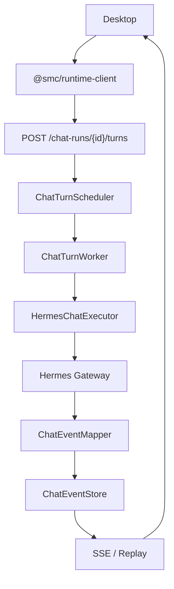

# SMC Copilot PRD v1.2 实施计划

## 基线结论

v1.1 已交付 durable ChatRun/EventStore/SSE Replay，但执行链未闭环。关键差距：

- Turn 执行仍是 [`_execute_turn_stub`](services/runtime/src/services/chat_run_service.py)（echo + 假 usage），无队列调度、无重启恢复
- Hermes 直连逻辑在 [`instance_chat_service.py`](services/runtime/src/services/instance_chat_service.py)（httpx stream → 直通 SSE，不落 Event Store）
- 事件类型为自由字符串；[`contracts/runtime-events/`](contracts/runtime-events/) 只有旧 workspace chat schema，`version.json` 中 `runtimeEvents=1.0.0`
- [`chat_runs.py`](services/runtime/src/api/v1/chat_runs.py) 部分接口返回 `dict[str, Any]`；[`domains/index.ts`](packages/runtime-client-ts/src/domains/index.ts) chat domain 全 `unknown`
- Workspaces Chat 面板（[`workspace-chat-client.ts`](apps/desktop/src/main/workspace-chat/workspace-chat-client.ts)）仍生产调用 `/instances/{id}/chat/completions`；主 Chat 已走 chat-runs
- 缺 `check:no-direct-instance-chat`、`check-runtime-path-ownership.mjs`；无真实 `runtime:package-windows` 目标

约束（贯穿全程）：按 PRD §27/§28 分阶段串行 + 建议 commit；不推送远端；Approval capability 仅当底层链真正支持 Tool Pause/Resume 时才发布（§11.2）。

---

## Phase 1：Chat Event Contract v2

1. Runtime 定义 `ChatRunEvent` Pydantic Discriminated Union（§16 全部 21 种事件），新建 `services/runtime/src/schemas/chat_events.py`
2. 新增 [`contracts/runtime-events/chat-run-event.schema.json`](contracts/runtime-events/chat-run-event.schema.json)；`contracts/version.json` 的 `runtimeEvents` → `2.0.0`
3. [`chat_runs.py`](services/runtime/src/api/v1/chat_runs.py) 全部接口补 `response_model`：`ChatRunResponse` / `ChatSnapshotResponse` / `ChatEventResponse` / `ChatQueueEntryResponse` / `ChatAbortResponse` / `ChatInteractionResponse`（§17），消除 `dict[str, Any]`
4. 重新生成 OpenAPI + TS schema；[`domains/index.ts`](packages/runtime-client-ts/src/domains/index.ts) chat domain 改用 generated 类型（如 `chat.createRun(body: ChatCreateRunBody): Promise<ChatAcceptedResult>`）
5. Event Store append 路径用新事件模型校验 payload（写库前 validate）

验收：`Pydantic → Contract → TS` 链路通；Breaking Change Check 通过。
Commit：`feat(contract): add durable chat event contract v2`

---

## Phase 2：HermesChatExecutor + Event Mapper

1. 新建 [`services/runtime/src/services/hermes_chat_executor.py`](services/runtime/src/services/hermes_chat_executor.py)：`HermesChatExecutor.execute(request, cancel) -> AsyncIterator[HermesExecutionEvent]`，复用 `instance_chat_service.py` 的 resolve/凭证/session/model/附件逻辑（instance resolve、gateway health、`GatewayCredentialService`、`resolve_default_model`、`AttachmentService.load_scoped` + `build_attachment_context`），支持 `asyncio.Event` 取消关闭 httpx stream
2. 新建 `hermes_chat_event_mapper.py`：定义内部 `HermesExecutionEvent`（§6 全类型）+ Hermes SSE → 内部事件解析（抽取现有 `_process_block` 解析逻辑，输出结构化事件而非 SSE 字符串）
3. 重构 [`instance_chat_service.py`](services/runtime/src/services/instance_chat_service.py) 为 Compatibility Adapter：底层改调 `HermesChatExecutor`，仅保留 SSE 格式化外壳（§5.3，禁止两套 Hermes 调用逻辑）
4. 单测：Fake Hermes Stream（fixture SSE 样本）→ 内部事件断言

Commit：`refactor(chat): extract hermes chat executor` + `feat(chat-runtime): map hermes stream into durable events`

---

## Phase 3：ChatTurnScheduler / Worker，删除 stub

1. 新建 [`chat_turn_scheduler.py`](services/runtime/src/services/chat_turn_scheduler.py)（per-Run 串行调度：同时仅一个 active Turn）、[`chat_turn_worker.py`](services/runtime/src/services/chat_turn_worker.py)（执行循环：queued → running → executor → terminal）
2. 统一 Turn 状态机（§7.1）：`queued / running / waiting_clarify / waiting_approval / completed / failed / cancelled`，清理 `pending` 混用；Run 状态按 §7.2
3. 删除 `_execute_turn_stub`；`create_turn` 改为入队 + 唤醒 scheduler
4. `HermesExecutionEvent → ChatEventMapper → ChatEventStore.append`（§6：先写库再允许消费）；`session` 事件回写 `ChatRun.sessionId`
5. Observability（§24）：turn 记录 requestId/startedAt/completedAt/durationMs/modelId/tokens/toolCount/errorCode；Alembic 迁移 `016_chat_turn_observability`；日志脱敏
6. Attachment 链路：`ChatTurn.attachmentIds` → Executor Attachment Context（§15）

验收：POST turn → Fake Hermes → durable event 全链通；`test_chat_runs.py` 改造为注入 fake executor。
Commit：`feat(chat-runtime): execute turns through hermes gateway` + `feat(chat-runtime): add durable turn scheduler`

---

## Phase 4：Queue / Abort / Recovery / Interaction

1. Queue 成为执行队列（§8）：`POST turns` 在已有 active turn 时自动 enqueue；turn 终态后 scheduler 取下一个 pending queue entry 启动；pending 可 edit/delete/cancel，running 禁改 payload；幂等约束 `UNIQUE(clientRunId)` / `UNIQUE(runId, clientTurnId)` 已在 DB，补重复提交测试
2. Abort（§10）：`abort()` → `ChatTurnWorker.cancel()` → cancel event 关闭 Hermes HTTP stream；abort 后禁止再 append message/tool 事件；最终事件必须 `turn.cancelled`；替换 `_ABORT_FLAGS` 轮询为 worker 持有 cancel handle
3. Recovery（§9）：新建 `chat_turn_recovery.py`，注册进 lifespan WorkerSupervisor；启动时 `queued/pending → 重新入队`，`running → interrupted + turn.failed(RUNTIME_RESTARTED_DURING_TURN)`，禁止重发 Hermes
4. Interaction 闭环（§11）：executor 收到 clarify → `clarify.requested` + turn `waiting_clarify`；respond → `clarify.resolved` → 同 Hermes session 发 continuation message 续跑（同 Run/Turn）；Approval 仅当底层支持真实 Tool Pause/Resume 时实现并发布 capability，否则不发布
5. Capabilities（§12）：`chat.runtime.v2.real-execution/.replay/.queue/.recovery/.abort` + 按实现 `chat.interaction.clarify/.approval`
6. Diagnostics（§25）：`/diagnostics/summary` 增加 activeChatRuns/activeChatTurns/queuedChatTurns/failedChatTurns24h/averageTurnDuration/chatEventStoreStatus/gatewayChatStatus
7. Retention（§26）：`Settings` 增加 `CHAT_EVENT_RETENTION_DAYS=30`，RetentionWorker 只清理 terminal run 且超期的 chat events

Commit：`feat(chat-runtime): implement real queue execution` + `feat(chat-runtime): implement abort and restart recovery` + `feat(chat-runtime): bridge clarify and approval interactions`

---

## Phase 5：Desktop Workspace Chat Cutover

1. Workspace Chat 面板（[`workspace-chat-client.ts`](apps/desktop/src/main/workspace-chat/workspace-chat-client.ts) / `workspace-chat-stream.ts`）切换到 `chatRuntimeClient`：createRun → createTurn → subscribeEvents；`clientRunId` = 稳定 Desktop Session ID（§13.1），禁止每次发消息新建 Run
2. 新会话/旧会话：首个 turn 后由 `session.started` 回写绑定；已有 Hermes sessionId 的会话 createRun 时 bind sessionId（§13.2/§13.3），不迁移历史消息
3. 删除 `chatCompletionsUrl()` / `chatCompletionsHeaders()` / `abortChatStream()` 及 workspace chat 内 instance chat 直连路由（§14）
4. 新增 guard `check:no-direct-instance-chat`（扫描禁 `/instances/*/chat/completions`），接入 `desktop:guard` 与 CI
5. Desktop feature gate 严格化（§12）：`assertReadyForChat` 接入 `chat-runtime-ipc` 生产路径，按 `chat.runtime.v2.*` 细分能力判定 queue/abort/clarify/approval UI

验收：Desktop 不再请求 `/instances/*/chat/completions`（guard 通过）。
Commit：`refactor(desktop): cut workspace chat over to chat-runs`

---

## Phase 6：Runtime Client 全类型化 + Path Ownership

1. [`domains/index.ts`](packages/runtime-client-ts/src/domains/index.ts) 全部 domain（chat/runtime/instance/session/configuration/attachment/approval/task/resource/diagnostics/endpoint/mcp/secret）改为 generated schema 类型，消除 `unknown` / `Record<string, unknown>`（§18）
2. 删除/降级 [`chat-runtime-serve-contract.ts`](apps/desktop/src/shared/copilot-runtime/chat-runtime-serve-contract.ts) 的 Serve DTO，类型全部来自 `@smc/runtime-client`；Desktop 只保留事件 → UI 展示层 Mapper（§18.1）
3. 新建 `tools/agent-context/check-runtime-path-ownership.mjs`：扫描 `apps/desktop/src/**` 禁止新增 `/api/v1/` 业务接口（白名单仅 bootstrap/transport/test fixture），接入 desktop guard（§19）

Commit：`refactor(runtime-client): type chat domain from generated contract` + `refactor(runtime-client): remove desktop runtime path ownership`

---

## Phase 7：L2 / L3 Integration

1. L2（§20）：扩展 [`scripts/mock_hermes_gateway.py`](services/runtime/scripts/mock_hermes_gateway.py) 支持 message delta / usage / tool progress / session id / provider failure / slow stream / abort（及 clarify/approval 如支持）；chat-runs L2 用真实 `HermesChatExecutor` 全链（Runtime → Fake Gateway → EventStore → `@smc/runtime-client`）
2. §20.1 必测场景全覆盖：create run/turn、delta/completed 持久化、SSE reconnect + Last-Event-ID replay、abort、provider failure、排队第二 turn、重启恢复、重复 clientTurnId、attachment context、session continuation
3. L3（§21）：Windows clean runner 全链验收（package → install → Alembic → service → health → instance → fake gateway → chat run/turn/event），不仅检查 health

Commit：`test(chat-runtime): add fake hermes integration` + `test(integration): replace stub L2 with real execution`

---

## Phase 8：Release 收口

1. Windows package 修正（§22）：`runtime:provision-windows` → 现有 install ps1；新增真实 `runtime:package-windows` 目标，产出 Wheel + Install Bootstrap + Manifest + Version + SHA256 + Migration + Service scripts
2. Release CI（§23）：tag `desktop-vX.Y.Z` / `runtime-vX.Y.Z` / `contracts-vX.Y.Z` 与 `apps/desktop/package.json` / `services/runtime/pyproject.toml` / `contracts/version.json bundleVersion` 一致性校验，不一致 FAIL
3. 文档收口：`docs/architecture/` durable chat 执行架构 + 根/子 AGENTS 更新

Commit：`build(runtime): add actual windows package target` + `ci(release): enforce tag and artifact versions` + `docs(runtime): document durable chat execution architecture`

---

## 执行节奏

1. 严格 Phase 1→8 串行；每阶段跑对应门禁（runtime tests / contract breaking check / desktop guard），失败先修债再前进
2. Approval interaction 先探测 Hermes Gateway 是否支持原生 Pause/Resume，不支持则仅实现 Clarify（§11.2 禁止 UI 假批准）
3. 按 §28 建议 commit 粒度拆分；不推送远端
