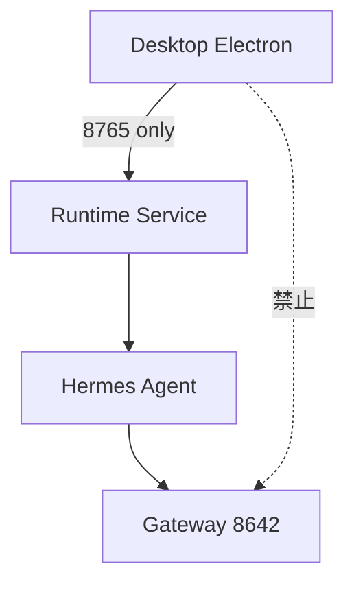

# PRD v1.3.1 — Desktop Boot & Runtime Boundary Closure

## 分支与基线

1. `git merge feat/prd-v1.3-work-task-runtime` 快进合入 `main`（v1.3 已验绿），再 `git checkout -b feat/prd-v1.3.1-desktop-boot-closure`
2. 保持现有无关本地改动（electron.vite/install-location-resolver/build-info 等）不动，不纳入提交

## 目标

- 启动唯一 SOT：Auth + User Bootstrap + `RuntimeConnectionState`（七态）
- 删除 `welcome/installing/setup` 屏幕与 Hermes Install/Verify IPC
- Desktop quit 不再 `stopGateway` / `stopSshTunnel`；Tray 显示 Runtime 状态
- Legacy `~/.hermes/desktop.json` remote(:8642) 不参与启动

## Phase 0 — 分支

- Merge v1.3 → main，新建 `feat/prd-v1.3.1-desktop-boot-closure`

## Phase 1 — Startup SOT（P0）

- 重写 [`startup-decision.ts`](apps/desktop/src/main/startup/startup-decision.ts)：只依赖 auth/bootstrap/`runtime-connection-manager`；删除 `getConnectionConfig/testRemoteConnection/resolveRuntimeState/startSshTunnel`
- 新增 [`desktop-boot-coordinator.ts`](apps/desktop/src/main/startup/desktop-boot-coordinator.ts)：`bootstrap()` 缓存 `runtimeBootstrapPromise`；`resolveStartupDecision()` 先 `await runtimeBootstrapPromise`（3–5s 超时 → `RuntimeStarting`）
- 调整 [`index.ts`](apps/desktop/src/main/index.ts)：register Runtime IPC → 启动 bootstrap → createWindow
- 契约 [`startup-contract.ts`](apps/desktop/src/shared/startup/startup-contract.ts)：`StartupDecision{nextScreen: login|runtime-recovery|main, reason, runtimeState}`，删 `skipAgentInstall/skipModelSetup/shouldVerifyInBackground/connectionMode`
- [`useStartupGate.ts`](apps/desktop/src/renderer/src/hooks/useStartupGate.ts)：删除 `verifyInstall` 后台检查

## Phase 2 — Screens（P0）

- [`App.tsx`](apps/desktop/src/renderer/src/App.tsx)：删 `Welcome/Install/Setup` import 与 `handleInstallComplete/Failed/RetryInstall`；删 `smc-v13-*` sessionStorage
- 新增 [`screens/RuntimeRecovery/`](apps/desktop/src/renderer/src/screens/RuntimeRecovery/)：`RuntimeRecoveryScreen` + `Status` + `Actions`，覆盖 RuntimeStarting / RuntimeMissing / RuntimeDegraded / PairingRequired / Incompatible（复用 `window.copilotRuntime` pairing/repair/diagnostics）
- 删除 `screens/Install/`、`screens/Setup/`；`Welcome` 若无 onboarding 复用则删除
- 删 `AgentSourceSelect`、`INSTALL_CMD`、`install.css`、相关 i18n（未被使用部分）

## Phase 3 — Preload/Main IPC 收口（P1）

- [`preload/index.ts`](apps/desktop/src/preload/index.ts) + `index.d.ts`：删 `checkInstall/checkInstallStatus/verifyInstall/startInstall/startInstallWithSource/onInstallProgress`
- [`main/index.ts`](apps/desktop/src/main/index.ts)：删 `check-install/verify-install/start-install/start-install-with-source` handler 与 installer 依赖
- 评估 `installer.ts` 保留范围：Doctor/enterprise 用保留，Startup 不再引用；`runInstall*` 不再由 IPC 触达

## Phase 4 — Runtime Job / Repair（P1）

- runtime-client：补 `runtime` domain 封装 `install/doctor/jobs`（若 OpenAPI 已含则接）
- RuntimeRecovery `Repair Runtime` → Main → `POST /api/v1/runtime/install` → job progress；`Run Doctor` → `POST /runtime/doctor`

## Phase 5 — Shutdown / Tray（P1）

- [`main/index.ts`](apps/desktop/src/main/index.ts)：quit 路径删 `stopGateway()` / `stopSshTunnel()`，仅 close streams/SSE/views/IPC
- Tray：[`tray-manager.ts`](apps/desktop/src/main/shell/tray-manager.ts) 增加 Runtime 状态；`index.ts` 用 `onRuntimeConnectionStateChanged` 驱动，去掉 `setHealthStatusCallback(Gateway)`/`setGatewayRunning` 启动绑定
- Gateway 生产生命周期不收 Desktop 直接控制（保留 serve 桥接；不新增 desktop→gateway）

## Phase 6 — Legacy Remote 迁移（P0/P1）

- 新增迁移 `legacy-hermes-connection-v1`：读旧 `desktop.json` → 备份 + marker；不把 8642 当 Runtime URL
- Startup 忽略 `connectionMode=remote/8642`

## Phase 7 — Settings（P2）

- `ConnectionSection` 改以 `window.copilotRuntime`（8765 + pairing/repair/status）；模型配置入口移 Settings → Runtime Configuration/Secrets（UI 先收口到 Runtime API，占位亦可）

## Phase 8 — CI Guards + E2E

新增 `apps/desktop/scripts/` guards 并接入 `guard`：
- `check:no-desktop-hermes-install`（禁 git clone/uv/pip/hermes setup 安装链）
- `check:no-startup-hermes-direct`（startup/App/useStartupGate 禁 testRemoteConnection/startGateway/verifyInstall/runInstall 等）
- `check:no-desktop-gateway-lifecycle`
- `check:no-startup-hermes-home`
- `check:no-desktop-hermes-port`（production code 禁 `8642` / `/v1/chat/completions`）

E2E：补 startup 用例（Ready→Main；Hermes not installed→Degraded 不进 Install；legacy remote 配置忽略；network spy 仅 8765）

## 验证

- `apps/desktop` `npm run typecheck` + `npm run guard`
- 相关单测/E2E 通过
- `lat check`（desktop 若涉及）
- 一次性本地 commit（不 push），不混入无关改动

## 明确不做

- 不删除 LocalTask；不动 runtime/tasks 的 Kernel 边界
- 不修改 plan 文件
- 不在 Desktop 保留任何 Hermes 安装/8642 启动依赖