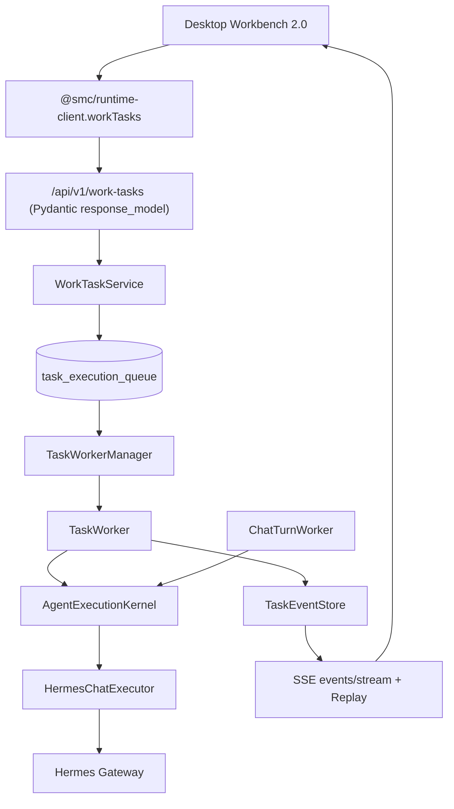

# SMC Copilot PRD v1.3 实施计划

## 基线结论

v1.2 已交付完整 Chat Runtime（HermesChatExecutor / ChatTurnWorker / ChatEventService / Queue / Recovery）。v1.3 起点现状：

- **WorkTask 七张表已存在**（迁移 `011_v16_work_tasks`），[`work_task_service.py`](services/runtime/src/services/work_task_service.py) 与 [`runtime/tasks/executor.py`](services/runtime/src/runtime/tasks/executor.py) 真执行，但：无 Pydantic schema（API 返回 `dict`）、无 `POST /work-tasks` 创建端点、无 assign/approvals/artifacts/snapshot 路由
- **调度非 durable**：[`runtime/tasks/scheduler.py`](services/runtime/src/runtime/tasks/scheduler.py) 为内存队列；[`recovery.py`](services/runtime/src/runtime/tasks/recovery.py) 未挂 lifespan
- **双 Hermes 链**：Task 走 [`hermes_adapter.py`](services/runtime/src/runtime/tasks/hermes_adapter.py) 自构 SSE + `event_normalizer.py`，与 Chat 的 [`hermes_chat_executor.py`](services/runtime/src/services/hermes_chat_executor.py) + `hermes_chat_mapper` 重复
- **双 Task Domain**：Team Hub 仍走 `LocalTask`（[`task_runtime.py`](services/runtime/src/services/task_runtime.py) + [`api/v1/tasks.py`](services/runtime/src/api/v1/tasks.py)）
- **Client 错位**：[`packages/runtime-client-ts/src/domains/index.ts`](packages/runtime-client-ts/src/domains/index.ts) `createTaskDomain` 指向不存在的 `POST /work-tasks`，缺 start/retry/events
- **Desktop**：[`TaskWorkbenchScreen.tsx`](apps/desktop/src/renderer/src/screens/TaskWorkbench/TaskWorkbenchScreen.tsx) 走 legacy `/api/v1/tasks`，registry 已注释不可见；Main [`clients/task-client.ts`](apps/desktop/src/main/copilot-runtime-client/clients/task-client.ts) 无调用方

约束（贯穿全程）：不删 LocalTask 表（v1.5 才删）；Service 禁止直接改 status，必须经 state machine；`runtime/tasks/**` 禁止出现 `/v1/chat/completions` 直连；Workbench 2.0 必须 gate `tasks.work.v2` capability。

## Phase 1：Task Domain SOT

1. 新建 [`services/runtime/src/schemas/work_tasks.py`](services/runtime/src/schemas/work_tasks.py)：`WorkTaskCreate / WorkTaskPatch / WorkTaskResponse / TaskRunResponse / TaskEventResponse / TaskStartResult / TaskApprovalResponse / TaskArtifactResponse / TaskSnapshotResponse`；`WorkTaskType = Literal[chat, expert, expert_team, web, workflow, coding, business, remote_assignment]`
2. 扩展 [`db/models/work_tasks.py`](services/runtime/src/db/models/work_tasks.py)：WorkTask 增 `description / workspace_id / active_run_id / chat_run_id / assigned_profile_id / assigned_instance_id / parent_task_id / result_summary / error_code / error_message / created_by / legacy_source_id`；TaskRun 增 `chat_run_id`；Alembic `016_v13_task_domain_sot`
3. 新建 [`runtime/tasks/state_machine.py`](services/runtime/src/runtime/tasks/state_machine.py)：`transition(task, target)` 实现 §8 状态机（`draft→ready→queued→running→{waiting_approval, waiting_input, completed, failed, cancelled}` + `interrupted` + remote `claiming/expired`），禁 `completed/cancelled→running`；`failed/interrupted→queued` 供 retry；WorkTaskService/Executor 全部改走 transition
4. [`api/v1/work_tasks.py`](services/runtime/src/api/v1/work_tasks.py)：补 `POST /` `PATCH /{id}` `DELETE /{id}` `POST /{id}/assign`；全部接口补 `response_model`，消除 `dict[str, Any]`；列表改 cursor 分页（禁固定 limit=200）
5. Legacy 迁移：[`api/v1/tasks.py`](services/runtime/src/api/v1/tasks.py) 改为 Compatibility Adapter 路由到 WorkTaskService；Alembic 幂等数据迁移 `LocalTask → WorkTask`（含 `legacy_source_id`、状态映射）；保留 LocalTask read compatibility
6. 重新生成 OpenAPI + TS schema；按 Contract Diff 决定 `runtimeApi`/`bundleVersion` bump

验收：新 Task 只进 WorkTask；`pytest tests/test_work_tasks.py` 全绿。Commit：`feat(work-task): establish canonical work task contract` + `refactor(task): adapt legacy local tasks to work tasks`

## Phase 2：Durable Task Scheduler

1. 新表 `task_execution_queue`（`id/taskId/runId/priority/status(queued|claimed|running|completed|failed|cancelled)/availableAt/claimedBy/claimedAt/leaseExpiresAt/attempt`），迁移 `017_v13_task_execution_queue`
2. 新建 `runtime/tasks/task_worker.py`（原子 Claim：`UPDATE ... WHERE status='queued'` 或等价 SQLite 事务）、`task_worker_manager.py`（并发上限沿用 Endpoint=2/Instance=1 + priority/availableAt/retry delay）、`task_recovery_service.py`
3. `POST /work-tasks/{id}/start` 异步化：Create TaskRun → Insert Queue → `status=queued` → commit → **HTTP 202**，不等待 Hermes（验收 <500ms）
4. Recovery 挂 lifespan（对齐 Chat Recovery 注册方式）：`queued→继续`、`claimed+expired lease→queued`、`running→interrupted`（禁止重发 Hermes）
5. 替换/收敛内存 `scheduler.py`；Shutdown：停止接受 → cancel/persist workers

Commit：`feat(task-runtime): add durable task execution queue` + `feat(task-runtime): add task worker and restart recovery`

## Phase 3：统一 Agent Execution Kernel

1. 新建 [`services/runtime/src/runtime/execution/`](services/runtime/src/runtime/execution/)：`kernel.py`（`AgentExecutionKernel.execute(request, cancel) -> AsyncIterator[AgentExecutionEvent]`）、`request.py`、`event.py`（§12.2 全事件类型）、`policy.py`（approval/tool/data policy 判定）
2. Kernel 底层复用 `HermesChatExecutor`；`ChatTurnWorker` 与 `TaskWorker` 均改走 Kernel
3. [`hermes_adapter.py`](services/runtime/src/runtime/tasks/hermes_adapter.py) 降为 Kernel Compatibility Adapter；**删除** Task 独立 `httpx.stream /v1/chat/completions` 与 `event_normalizer.py` 重复解析
4. WorkTask↔ChatRun 关联：`WorkTask.chat_run_id`、`TaskRun.chat_run_id/hermes_session_id`；Conversational Task 绑定语义落地（§13）

Commit：`refactor(task-runtime): execute through agent execution kernel` + `refactor(task-runtime): remove direct hermes transport`

## Phase 4：Events & Interaction

1. 新建 [`contracts/runtime-events/task-event.schema.json`](contracts/runtime-events/task-event.schema.json)（§14 全部 21 种 `task.*` 事件）；`version.json` `runtimeEvents` 按 diff bump；写库前 validate；`UNIQUE(runId, sequence)` 已有
2. Approval 闭环：[`task_approval_service.py`](services/runtime/src/services/task_approval_service.py) 补路由（`GET approvals` / `POST approve|reject`）；Worker 收到 tool requires approval → `task.approval.requested` + `waiting_approval` 挂起 → 决策后 resume/terminate；`approvalPolicy` 在 Runtime 执行
3. Clarify/Input：TaskInteraction（`clarify/confirmation/missing_input`，`pending/resolved/expired/cancelled`），`running→waiting_input→running`
4. Resource Lock：Worker 执行前 acquire、结束 release；冲突排队不并发（§25）
5. Checkpoint 接线：Worker 关键节点写 `TaskRunCheckpoint`（execution/artifact/interaction/safe_resume）

Commit：`feat(task-runtime): add durable task event contract` + `feat(task-runtime): integrate approval and interaction` + `feat(task-runtime): enforce resource locks`

## Phase 5：Artifacts & Observability

1. Artifact 闭环：ArtifactScanner → TaskArtifact → `task.artifact.created`（禁止仅凭 LLM 文本判断成果）；API：list/get/`open`/`save-as`（Desktop 本地模式 `local_path` 为主事实源）
2. `GET /work-tasks/{id}/snapshot` 返回 `{ task, activeRun, events, approvals, interactions, artifacts, runtime }`
3. TaskRun 观测字段（queue/execution duration、tokens、toolCalls、approvalCount、artifactCount、retryNumber、exitReason）；`/api/v1/diagnostics/summary` 增 `taskRuntime` + `scheduler` 字段；指标 `task_queue_depth` 等（§27）

Commit：`feat(task-runtime): add artifacts and checkpoints`

## Phase 6：Team & Routing 收敛

1. 新表 `task_routing_rules`（taskType/profileType/profileId/requireApproval/priority/enabled/`execution_mode` 预留 `single_agent|agent_team`，v1.3 只实现 single_agent）；路由顺序：Explicit Assignment → Task Type Rule → Profile Type → Default
2. Team Hub ingest 从 `TaskRuntimeService.ingest_assignment → LocalTask` 改为 `WorkTaskService.create_from_assignment → WorkTask`；`TeamTaskBinding.local_task_id → work_task_id` 迁移
3. Remote Assignment 单一链路：Remote → WorkTask → Lease → TaskRun → Result → Complete（禁双链并存）

Commit：`feat(task-routing): persist work task routing rules` + `refactor(team-task): ingest assignments into work tasks`

## Phase 7：runtime-client Task Domain

1. 新建 [`packages/runtime-client-ts/src/domains/work-task.ts`](packages/runtime-client-ts/src/domains/work-task.ts)：WorkTask/WorkTaskCreate/WorkTaskPatch/TaskRun/TaskEvent/TaskApproval/TaskInteraction/TaskArtifact/TaskStartResult 全部 generated 类型；修正 `createTaskDomain` 对齐真实端点（list/get/create/patch/delete/start/cancel/retry/assign/runs/events/events-stream/approvals/artifacts/snapshot），消除 `unknown`
2. Desktop Main [`clients/task-client.ts`](apps/desktop/src/main/copilot-runtime-client/clients/task-client.ts) 改用新 domain；`ServeTaskAdapter` 从 stub 转 ready
3. Guard：Desktop 禁止 `renderer → /api/v1/tasks` 直连（纳入既有 path ownership guard 体系）

Commit：`feat(runtime-client): add typed work task domain`

## Phase 8：Task Workbench 2.0

1. Desktop 新 IPC 链：`work-tasks-api`（Main → runtime-client.workTasks）+ Preload `window.workTasks` + `index.d.ts`；TaskWorkbench 从 `/api/v1/tasks` + Renderer 直连 SSE 切到 Main SSE（复用 `readSseStream`）
2. 三栏布局（§21）：左栏筛选（All/Running/Waiting Approval/Waiting Input/Failed/Completed + Local/Team + 搜索/排序）；中栏 Header（Start/Cancel/Retry）+ Conversation/Execution Timeline，**复用 Chat 渲染组件**（禁复制 Tool Card）；Composer（补充要求/继续/重试 + 附件）；右栏 Tabs（Context/Agent/Tools/Files/Outputs/Runtime）
3. `TaskWorkbenchProjection` reducer 增量消费 SSE（禁每事件全量 reload）；首屏 1 snapshot request + SSE subscribe
4. Capability gate：Workbench 2.0 仅在 `tasks.work.v2` 存在时启用，否则回退旧 Workbench；恢复 registry 入口

Commit：`refactor(desktop): migrate task workbench to work tasks` + `feat(workbench): build task workbench 2.0`

## Phase 9：Integration E2E + CI Guard

1. L1：create → assign → start → queued → claim → completed 全链测试；L2：Fake Hermes（复用 [`scripts/mock_hermes_gateway.py`](services/runtime/scripts/mock_hermes_gateway.py)）验证 delta/tool/usage/artifact/approval/failed/cancel
2. Recovery E2E：queue 不丢、running→interrupted 不重复执行；Resource Lock 冲突阻塞/释放继续
3. Guard 脚本：`check:no-legacy-local-task-client`、`check:no-task-direct-hermes`、`check:worktask-state-machine`、`check:task-contract-drift`，接入 CI
4. 文档收口：`docs/architecture/` + 各 AGENTS.md + `lat.md/` 更新并 `lat check`

Commit：`test(task-runtime): add durable scheduler integration tests` + `ci(task): enforce work task architecture boundaries` + `docs(task): document unified work task runtime`

## 执行节奏

1. 严格 Phase 1→9 串行；每阶段跑对应门禁（runtime pytest / contract breaking check / desktop typecheck+guard），失败先修债再前进
2. 按用户选择：中途不 commit；各 Phase 文末的 Commit 信息作为最终一次性 commit 的 message 素材（全部门禁通过后汇总提交，不推送远端）
3. 每个子项目完成后按其 AGENTS.md 要求更新 `lat.md/` 并跑 `lat check`；Desktop 收尾按 007 规则同步 docs