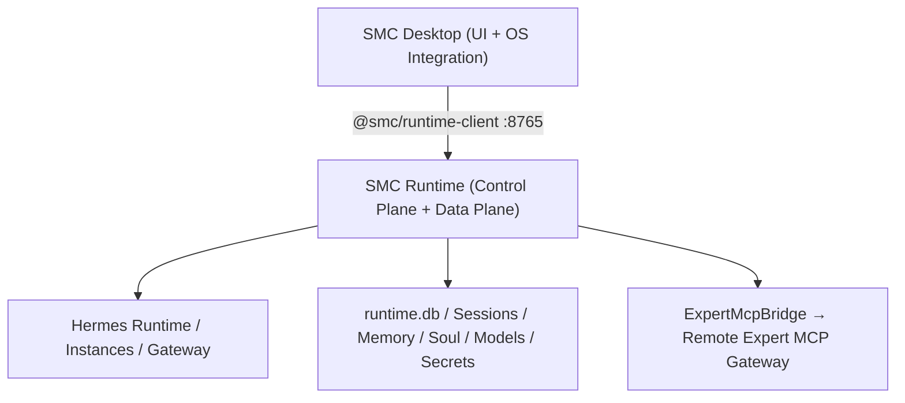

# PRD v1.4 实施计划：Desktop Thin Client & Runtime Control Plane Closure

## 现状差异（已核实）

**Runtime 已具备**：`/api/v1/runtime/{status,capabilities,install,update,rollback,doctor,jobs,versions}`、McpService、SecretService、GatewaySupervisor、Diagnostics、Sessions（list/search/get/delete）。

**Runtime 缺失**：
- 三层 Readiness v2（`GET /api/v1/runtime/readiness`；现有 [runtime_status_service.py](services/runtime/src/services/runtime_status_service.py) 是单 status 聚合模型，正是 `RuntimeDegraded` 过度阻断的根源）
- Memory Domain（无 `api/v1/memory.py` / `services/memory_service.py`）
- `GET /instances/{id}/sessions/stats`
- Expert MCP Gateway（无 `integrations/expert_mcp/` / `api/v1/expert_mcp.py`）
- Runtime DB 路径统一（[core/config.py:30](services/runtime/src/core/config.py) 仍默认 `~/.hermes/desktop/sqlite.db`）

**Desktop 待删除/迁移**：
- UI：[PortalRuntimeSection.tsx](apps/desktop/src/renderer/src/screens/SettingsDrawer/server/PortalRuntimeSection.tsx)、[CopilotServeRuntimeSection.tsx](apps/desktop/src/renderer/src/modules/hermes-runtime/sections/CopilotServeRuntimeSection.tsx)、[HermesAgentSection.tsx](apps/desktop/src/renderer/src/screens/SettingsDrawer/server/HermesAgentSection.tsx)（[ServerPanel.tsx](apps/desktop/src/renderer/src/screens/SettingsDrawer/server/ServerPanel.tsx) 当前组合 5 个 Section）
- Main：`src/main/aios/`（aios:start/stop/restart/doctor）、`src/main/copilot-serve/`（deploy/start/stop/restart）、`src/main/mcp-skill-gateway-runtime/`（本地 Proxy :48742 + restartGateway 泄漏）、[memory.ts](apps/desktop/src/main/memory.ts)（直读 state.db/MEMORY.md，即终端报错来源）、[session-catalog-profile-reader.ts](apps/desktop/src/main/session-catalog/session-catalog-profile-reader.ts)（better-sqlite3 直读 state.db）
- Legacy IPC（[src/main/index.ts](apps/desktop/src/main/index.ts)）：`get-hermes-version`/`run-hermes-doctor`/`run-hermes-update`/`get-env`/`get-config`/`get-model-config`/`start-gateway`/`stop-gateway`/`list-sessions`/`list-profiles`/`create-profile`/`delete-profile`/`read-memory`/`read-soul`/`write-soul`/skills/models/cron/`list-mcp-servers` 等
- Preload：`window.copilotServe`、`window.aiosRuntime` 退出正式 API

**客户端缺口**：[packages/runtime-client-ts](packages/runtime-client-ts/src/domains/index.ts) 现有 runtime/work-task/chat/instance 四个 domain，需补 readiness/diagnostics/runtimeJobs/runtimeVersions/sessions/memory/mcp/expertMcp。

## 目标架构

## 实施顺序（依赖驱动，Runtime API 先行）

### Phase A — Runtime 缺失 API（PRD Phase 2/4/5/6 的服务端）

1. **Readiness v2**：`runtime.py` 新增 `GET /readiness`，返回 `{service, execution{chatReady,taskReady}, maintenance, expertMcp}` 四层 checks；`runtime_status_service.py` 拆分 domain checks；`core/capabilities.py` 加 `runtime.readiness.v2`
2. **Session Stats**：`api/v1/sessions.py` 加 `GET /instances/{id}/sessions/stats` → `{totalSessions, totalMessages}`；capability `sessions.runtime-managed`
3. **Memory Domain**：新增 `api/v1/memory.py`、`schemas/memory.py`、`services/memory_service.py`、`integrations/hermes/memory_adapter.py`（Runtime 侧读写 `~/.hermes/memories/*` 合法，Desktop 不读）；API 含 `GET memory`、`POST/PATCH/DELETE entries`、`PUT content`、`PUT user-profile`；capability `memory.runtime-managed`
4. **Expert MCP Gateway**：新增 `integrations/expert_mcp/{client,gateway_bridge,auth_provider,descriptor,tool_cache,diagnostics,errors}.py` + `services/expert_mcp_gateway_service.py` + `api/v1/expert_mcp.py`（status/config/connect/reconnect/test/tools/diagnostics/logs + instance enable/disable）；复用 McpService 注册 managed server `smc-expert-gateway`（streamable_http）；Token 入 SecretStore（scope `expert-mcp`）；保留现有 Desktop Proxy 的 2MB limit/timeout/结构化错误保护（PRD §48）
5. **Runtime DB 迁移**：`core/config.py` 默认 DB 改为 `%LOCALAPPDATA%/SMC/CopilotRuntime/data/runtime.db`；启动时 legacy `~/.hermes/desktop/sqlite.db` → backup → copy → alembic upgrade → integrity check → migration marker
6. 每步 `npm run contracts:generate` 重生成 `contracts/runtime-api/openapi.yaml`

### Phase B — runtime-client-ts Domain 扩展（PRD §41）

- [packages/runtime-client-ts/src/domains/](packages/runtime-client-ts/src/domains/index.ts) 新增/扩展：`runtime`（+readiness）、`diagnostics`、`runtimeJobs`（含 SSE events）、`runtimeVersions`、`sessions`（+stats）、`memory`、`mcp`、`expertMcp`

### Phase C — Desktop Server Panel 收口（PRD Phase 1/3）

- 新增 `SettingsDrawer/server/`：`RuntimeServiceSection.tsx`（Connection/Endpoint/Version/Service/Execution/Maintenance + Refresh/Diagnostics/Logs/Export Bundle）、`HermesRuntimeSection.tsx`（走 `/runtime/*` Job + SSE 进度）、`HermesInstancesSection.tsx`（由 CopilotRuntimeInstancesSection 改名）、`ExpertMcpGatewaySection.tsx`、`RuntimeLogsSection.tsx`（Runtime/Instance/ExpertMCP/Jobs 四 Tab）
- `ServerPanel.tsx` 只保留上述 5 个；删除 PortalRuntimeSection / CopilotServeRuntimeSection / HermesAgentSection；导航改名 Server & Agent → Runtime & Agent（i18n en + zh-CN）

### Phase D — Desktop Domain Gate（PRD Phase 2 客户端）

- Main `runtime-capability-manager.ts` 接入 `/readiness`；`window.copilotRuntime` 增加 `getReadiness` + 订阅
- Chat→`execution.chatReady`、Task→`execution.taskReady`、MCP→`service.ready`、Expert Tools→`expertMcp.ready`、Update→`maintenance.ready`
- RuntimeDegraded 全局 Banner 改为 Domain Banner（Agent execution unavailable / Expert tools unavailable / Update service unavailable）；**禁止任何 legacy fallback**，缺 capability 显示「请升级 Runtime」（PRD §43）

### Phase E — Desktop Data Plane 迁移（PRD Phase 5，修终端报错）

- `session-catalog` 改走 Runtime Sessions API（删 `session-catalog-profile-reader.ts` 的 better-sqlite3/state.db 直读）
- Workspaces/Hermes 的 Memory 页（`useProfileMemory`、`Memory.tsx`、`hermesDefaultApi`）改走 `window.copilotRuntime` memory 域；删除 `src/main/memory.ts`
- Soul/Profile/Skill/Model/MCP 等逐域切到 runtime-adapters（复用 ServeConfigurationAdapter / ServeMcpAdapter，补 Session/Soul/Skill/Model adapters）

### Phase F — Desktop Main 清理（PRD Phase 7/8）

- 删 `src/main/aios/` supervisor + `aios:*` IPC + `window.aiosRuntime`（仅保留 Endpoint Config 契约）
- 删 `copilot-serve` deploy/start/stop/restart/open-runtime-dir IPC + `window.copilotServe`（保留只读 connection 探测供启动门控）
- 删 `mcp-skill-gateway-runtime/` proxy/lifecycle/register（Expert MCP UI 改走 Runtime API）
- 删 §34 列出的 legacy IPC；`window.hermesAPI` 仅保留 Desktop-local 能力（窗口控制、locale、dialog 等）
- `profile-runtime.db` 停增 domain 数据 + 加 migration marker `desktop-domain-db-v1`

### Phase G — 开发生命周期（PRD §44）

- 根 `package.json`：`dev:runtime` 改为 alembic upgrade → dev bootstrap → register dev Hermes（`HERMES_DEV_EXECUTABLE`）→ ensure default Instance → uvicorn；新增 `dev:runtime:service`（纯 FastAPI）

### Phase H — CI Guards / E2E / 文档（PRD Phase 9）

- `apps/desktop` guard 脚本：`check:no-desktop-portal-runtime`、`no-desktop-runtime-process-control`、`no-desktop-hermes-control`、`no-desktop-hermes-data`、`no-desktop-domain-db`、`no-desktop-expert-mcp-proxy`；runtime 侧 `check:no-runtime-legacy-desktop-db`；挂入 `npm run guard`
- E2E 覆盖 PRD §52 Case 1–9（重点：Runtime Offline 不出现 Install/Start；Case 7 Memory 不碰 state.db；Case 8 Main 不监听 48742）
- 文档：根 + desktop + runtime `AGENTS.md`、ADR-006~010、`docs/architecture/contract-flow.md`、desktop `docs/API_CONTRACTS.md`、两侧 `lat.md` + `lat check`

## 验收

- 每个 Phase 后：runtime `pytest` + `ruff`；desktop `npm run typecheck` + `npm test` + `npm run guard`
- 终端报错消除：启动链路不再出现 `getSessionStats failed: no such table: sessions`
- DoD（PRD §58）：Desktop 中不存在 Portal/Serve/Runtime/Hermes 进程管理器、Hermes DB/文件读取器、Expert MCP Local Proxy