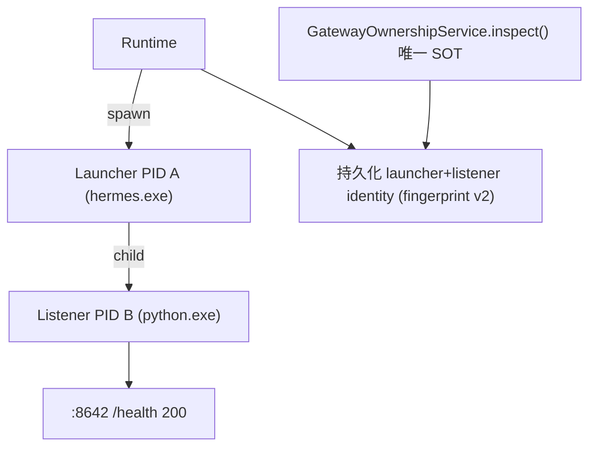

# PRD v1.5.2 Hotfix 实施计划：Gateway Listener Identity & Ownership SOT Closure

## 背景与根因（已确认）

现状代码（v1.5.1 已落地）存在两套 Ownership 事实源：

- 旧路径：[instance_gateway_service.py:268](services/runtime/src/services/instance_gateway_service.py) `_ownership_for()` → 直接调 `verify_ownership()`，被 `refresh_instance_status()`(L292)、`_probe_and_recover_unlocked()`(L921)、`_stop_instance_unlocked()`(L510) 使用
- 新路径：`GatewayOwnershipService.inspect()`（start/stop/restart/reconcile/diagnostics 共 6 处）

且 [gateway_process.py](services/runtime/src/runtime/gateway_process.py) `start()` 把 spawn 的 `process.pid`（Launcher）直接当作 Gateway PID 捕获 fingerprint，而真实 Hermes 进程模型是 Launcher(hermes.exe) → Listener(python.exe) 监听 :8642，导致 `A != B` 被误判 `GATEWAY_PORT_OWNERSHIP_CONFLICT`；Health Worker 再用 `not owned → exited` 把状态打崩并被 `_NO_AUTO_RESTART_CODES`(L863) 永久锁死。

## Phase 1 — Ownership SOT 收口（PRD §22-25, Phase 1 最先做）

- 删除 `InstanceGatewayService._ownership_for()`（[instance_gateway_service.py:268-275](services/runtime/src/services/instance_gateway_service.py)）
- `refresh_instance_status()`(L277-355)、`_probe_and_recover_unlocked()`(L905-1041)、`_stop_instance_unlocked()`(L510 附近) 全部改调 `await self._ownership.inspect(...)`
- `verify_ownership()` 保留在 [gateway_process.py:126](services/runtime/src/runtime/gateway_process.py)，仅作 `GatewayOwnershipService` 内部 helper；`InstanceGatewayService` 不再 import 它

## Phase 2 — Listener Resolver（PRD §15-18, §62, §64）

- 新增 [services/runtime/src/runtime/gateway_listener.py](services/runtime/src/runtime/gateway_listener.py)：
  - `GatewayLauncherIdentity` / `GatewayListenerIdentity`(frozen dataclass: pid, create_time, executable_path, port) / `GatewayProcessIdentity(launcher, listener)`
  - `GatewayListenerResolver.resolve(launcher_pid, gateway_port, timeout)`：循环 `find_pids_listening_on_port(port)` 直到 startup timeout；候选须满足 `listener_pid == launcher_pid` 或 `listener_pid ∈ psutil.Process(launcher_pid).children(recursive=True)`（lineage 验证，§17）
- psutil 底层 helper 复用 `gateway_process.py` 现有 `is_pid_alive` / 端口枚举函数

## Phase 3 — Fingerprint v2 + Migration（PRD §10-12, §20-21）

- 新增 migration `services/runtime/migrations/versions/20260810_v152_gateway_listener_identity.py`（revision `021_v1_5_2_gateway_listener_identity`，down_revision=`020_v1_5_1_gateway_fingerprint`，沿用 020 的 `batch_alter_table` 风格）
- [db/models/runtime.py:83-119](services/runtime/src/db/models/runtime.py) HermesInstance 新增列：`gateway_launcher_pid`(Integer)、`gateway_launcher_create_time`(Float)、`gateway_listener_pid`(Integer)、`gateway_listener_create_time`(Float)、`gateway_listener_executable_path`(String(1024))
- 既有数据处理（§12）：迁移中 `gateway_launcher_pid = pid`，`gateway_listener_pid = NULL`；**禁止**把旧 `pid` 复制为 listener_pid；`gateway_fingerprint_version` 语义升级为 1=legacy / 2=launcher+listener
- 旧列 `pid`/`process_create_time` 进入兼容期，新代码不再写入（短期映射到 listener 字段读取见 §10）

## Phase 4 — Startup Identity（PRD §13-14, §19-20, §48-51）

- 重构 `GatewayProcessManager.start()`（[gateway_process.py:359-458](services/runtime/src/runtime/gateway_process.py)）：spawn → 捕获 launcher identity → 等待端口 → `GatewayListenerResolver` 发现 listener → lineage 验证 → 鉴权 /health → 持久化最终 identity（`fingerprint_version=2`）→ Running
- `GatewayProcessHandle`(L244-273) 扩展：`launcher_pid/launcher_process/launcher_create_time` + `listener_pid/listener_create_time`；`handle.pid` 不再解释为 listener PID
- `_watch_process()`(L307-331) 改语义：launcher wait() 退出 → 事件 `gateway.launcher.exited`（**不等于** gateway exited）；真正 `gateway.process.exited` 只能由 listener fingerprint 失效（listener PID dead）触发，由 Health Worker 判定（§51）；Listener watcher 为可选 P1，本 hotfix 不强制（§52）
- `InstanceGatewayService._start_instance_unlocked` 的 `_persist_fingerprint()`(L72-93) 改写 v2 全字段
- 停止路径：terminate 需同时覆盖 launcher 与 listener（owned 前提下），沿用"非 owned 不 kill"安全边界

## Phase 5 — Health Worker 修复（PRD §35-44, §66-68）

- 重写 `_probe_and_recover_unlocked()`（[instance_gateway_service.py:905-1041](services/runtime/src/services/instance_gateway_service.py)）每 tick 流程：load → `inspect()` → 统一 `_apply_gateway_observation(instance, result)` 持久化（ownership_state / process_state / api_state / pid / listener_pid / healthy / last_error*）→ eligibility → recovery 决策
- 硬规则（§37）：`UNKNOWN/FOREIGN/CONFLICT != EXITED`；仅 listener PID 确认消失或 fingerprint STALE 才能 `process_state=exited`
- Process State 新语义（§38）：starting / alive / exited / foreign / unknown；`process_state` 由 `GatewayOwnershipResult.process_state` 给出（扩展 `GatewayOwnershipResult`，见 §65）
- `last_error_code` 锁死修复（§41-44）：每轮先重新 inspect 取当前事实，再决定 recovery policy；当本轮 `ownership ∈ {owned, adopted}` 且 healthy 时自动清 `last_error/last_error_code` 并恢复 running/eligible
- State invariant（§68）：持久化时禁止 `process_state=exited AND api_state=healthy` 组合

## Phase 6 — Reload / Reconcile / Safe Adoption v2（PRD §26-34, §53-55）

- 升级 [gateway_ownership_service.py](services/runtime/src/services/gateway_ownership_service.py) `inspect()` 决策顺序：① listener fingerprint 验证（listener_pid alive + create_time match + 监听目标端口 + 鉴权 health → adopted/owned，launcher 存活与否不影响，§28）② legacy fingerprint v1 升级路径（端口探测 listener → 证据验证 → 持久化 v2，§29）③ Safe Adoption ④ 端口冲突分类
- `SafeAdoptionEvidence` 扩展为 v2（§31）：port_match / gateway_command_match / profile_match / authenticated_health / hermes_environment_match / launcher_listener_lineage_match(bool|None) / runtime_version_compatible
- `runtime_version_compatible` 定义（§32-33）：listener 来源可被证明属于当前 RuntimeVersion 启动链，**禁止** `listener_exe == launcher_exe` 的强等判断，也**禁止** `python.exe → Hermes` 的弱化（§34）
- `reconcile_instances_on_boot()` / `reconcile_instance()`（L659-803）复用同一 inspect + `_apply_gateway_observation`；reconcile 禁止 restart/kill/force takeover（§47）

## Phase 7 — Diagnostics / Contracts / Desktop（PRD §85-89）

- [schemas/runtime.py](services/runtime/src/schemas/runtime.py)：`InstanceStateObserved` 增加 `listenerPid/launcherPid/listenerCreateTime` 等；`InstanceDiagnosticsResponse` 增加 launcher/listener/lineage/ownership.source 结构（示例见 PRD §86）；补齐 `InstanceHealthResponse` 缺的 `ownershipState/executionEligible`（现状 dict 已返回但 schema 未定义）
- 仓库根执行 `npm run contracts:generate` 再生成 `contracts/runtime-api/openapi.yaml` + `packages/runtime-client-ts`；禁止 Desktop 手工扩展 DTO
- Desktop 仅改 [HermesInstancesSection.tsx](apps/desktop/src/renderer/src/screens/SettingsDrawer/server/HermesInstancesSection.tsx)：在 Process/Gateway/Ownership 行基础上增加 Listener PID 展示（diagnostics 可选展示 Launcher PID）；不加 Force Kill/Takeover

## Phase 8 — Tests / Guards / Docs（PRD §69-80, §93-94）

- 单测（services/runtime/tests/，PRD §72-80 共 9 项）：same-process owned、child listener owned、launcher exits→adopted、runtime reload adopt、worker 不破坏 adoption、refresh 不破坏 adoption、历史 conflict 自动清除、healthy foreign → conflict、PID reuse → stale
- CI guards（沿用 `scripts/check-*.mjs` 纯 Node stdlib 模式，注册进 `package.json` 的 `guard` 链）：
  - `check:gateway-ownership-sot` — 禁止 `instance_gateway_service.py` 出现 `verify_ownership(`
  - `check:no-launcher-pid-as-listener` — 禁止未经 resolver 的 `gateway_listener_pid = process.pid`
  - `check:no-not-owned-equals-exited` — 禁止 `not ownership.owned → EXITED` 模式
- 文档：更新 [services/runtime/AGENTS.md](services/runtime/AGENTS.md) Hermes Supervisor hard rules（§93 六条）、`lat.md/`（gateway-supervisor/ownership 相关节）、新增 ADR（Launcher vs Listener Identity、Ownership SOT；编号按现有 ADR-020 顺延，实施时确认）；最后运行 `lat check`
- 单元/集成测试用 `uv` 运行（Python 3.12 固定）

## 验收（PRD §97 六项硬指标 + §81-84）

1. Launcher PID ≠ Listener PID 不再产生 `GATEWAY_PORT_OWNERSHIP_CONFLICT`
2. `inspect()` 唯一 SOT，guard 通过
3. ADOPTED 在 refresh/worker 后保持
4. `not owned` 不再推导 `exited`
5. 历史 conflict 自动清除，不再每 5s `gateway.recovery.failed`
6. 不修改 Chat/Task 逻辑；default instance 恢复 `executionEligible=true` 后 Chat 自然恢复
- E2E（§81-83，需真实 Windows Hermes 环境）：`npm run dev:runtime` 采集真实 Launcher/Listener PID 验证进程模型；Desktop 联调 Chat 恢复；5 分钟 worker 稳定性观察。此步在实施完成后由用户配合执行。

## 关键改动文件清单

- `services/runtime/src/runtime/gateway_process.py`（handle v2 / start 重构 / watcher 语义）
- `services/runtime/src/runtime/gateway_listener.py`（新增）
- `services/runtime/src/services/gateway_ownership_service.py`（inspect v2 / evidence v2 / result 扩展）
- `services/runtime/src/services/instance_gateway_service.py`（删 `_ownership_for` / 统一 inspect / `_apply_gateway_observation` / worker 重写）
- `services/runtime/src/db/models/runtime.py` + `migrations/versions/20260810_v152_*.py`
- `services/runtime/src/schemas/runtime.py`
- `services/runtime/scripts/check-*.mjs` ×3 + `package.json`
- `contracts/runtime-api/openapi.yaml` + `packages/runtime-client-ts/`（再生成）
- `apps/desktop/.../HermesInstancesSection.tsx`
- `services/runtime/tests/test_gateway_listener_identity*.py` 等测试
- `services/runtime/AGENTS.md` / `lat.md/` / `docs/adr/`

## 提交策略

按 PRD §92 建议分阶段 commit（refactor SOT → feat identity → fix worker → tests → ci → docs）；实施完成后征得用户确认再提交。