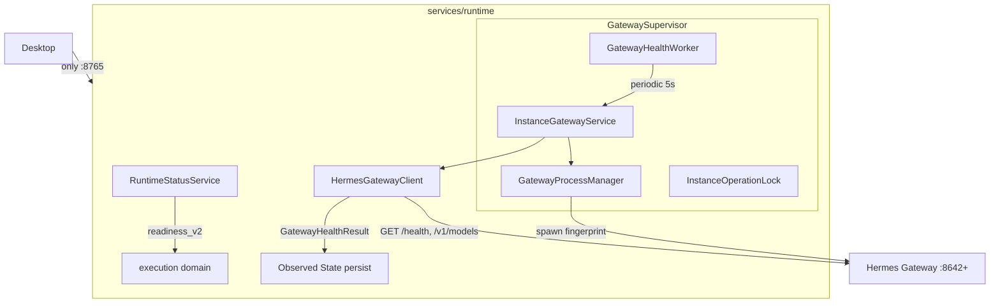

# PRD v1.5 Hermes Supervisor 实施

## 背景与现状

Runtime 已具备 Gateway 进程 spawn、`API_SERVER_KEY` 注入、端口冲突检测（`gateway_port_conflict`）、boot reconcile 基础，但存在 PRD §4 的五个缺口。关键现状落点：

- `HermesInstance`（`services/runtime/src/db/models/runtime.py` L83-99）：仅 `status/healthy/auto_start/pid/last_error`，**缺全部 v1.5 supervisor 字段**
- `HermesGatewayClient.health_check()`（`services/runtime/src/integrations/hermes/client.py` L40-64）：返回 `bool`，fallback 为 `status_code < 500 → True`（**假健康 bug**），**无 `GatewayHealthResult`**
- `InstanceGatewayService`（`services/runtime/src/services/instance_gateway_service.py`）：`_check_port_for_start` L100、`reconcile_instances_on_boot` L291、`refresh_instance_status` L130
- `GatewayProcessManager`（`services/runtime/src/runtime/gateway_process.py`）：`is_pid_alive` L20（仅 `psutil.pid_exists`，**无 create_time 校验**）
- Readiness（`services/runtime/src/services/runtime_status_service.py` L51-133）：**`select(HermesInstance).limit(1)` L95-96** 取首条作为 default
- Workers：`services/runtime/src/workers/` 有 `WorkerSupervisor`（`supervisor.py`），但**无 periodic Gateway health worker**；生命周期挂接在 `core/lifecycle.py` L337-377
- Alembic：`services/runtime/migrations/`，最新 head = `018_v13_task_phase456`
- Contracts：根 `package.json` L17/19，`contracts/runtime-api/openapi.yaml` + `packages/runtime-client-ts/src/generated/schema.d.ts`
- Desktop：现状仅 pull `GET /runtime/readiness`、`/instances/*`，**无 health push/SSE**；Desktop 不允许访问 `:8642`

## 架构总览

## 分阶段实施（Phase 1-9）

### Phase 1 — Gateway Health Semantics
目标：消除 `status_code < 500 → healthy` 假健康。

- `integrations/hermes/client.py`：新增 `@dataclass GatewayHealthResult{reachable, authenticated, healthy, status_code, source, error_code, latency_ms}`；重写 `health_check()` 返回该结构
  - 主检查 `GET /health`（Bearer）：200+`status==ok` → 全 true；401/403 → `reachable=true, authenticated=false, healthy=false, GATEWAY_AUTH_FAILED`；404 → `reachable=true, healthy=false, GATEWAY_HEALTH_ENDPOINT_UNAVAILABLE` 后允许 fallback；conn refused → 全 false, `GATEWAY_UNREACHABLE`
  - Fallback `GET /v1/models`：2xx→healthy；401/403→unauthorized；404/5xx→healthy=false；**删除 `<500→True`**
- 所有调用点（`instance_gateway_service.py` L120-128 `_wait_for_health`、`refresh_instance_status` L130）改为消费 `GatewayHealthResult`
- 测试：`tests/test_gateway_health_semantics.py`（200/401/403/404/fallback-401/conn-refused）

### Phase 2 — Process Ownership Fingerprint
目标：禁止以 PID 作为唯一所有权证据，防 PID 复用误杀。

- `runtime/gateway_process.py`：新增 `GatewayProcessFingerprint{pid, process_create_time, executable_path, gateway_port, instance_id}`；`GatewayProcessManager.start()` 在 spawn 后用 `psutil.Process(pid).create_time()/.exe()` 记录并持久化到 `HermesInstance.process_create_time`
- 新增 `verify_ownership(inst) -> OwnershipResult(owned|stale|foreign|unknown)`：PID alive **且** `create_time` 匹配 **且** PID 监听期望端口 **且** exe 匹配；任一不符 → `foreign`，**DO NOT KILL**，`error_code=GATEWAY_PROCESS_OWNERSHIP_CONFLICT`
- 升级 `_check_port_for_start`（`instance_gateway_service.py` L100）→ 正式 `PortOwnershipResult{free|owned|foreign|unknown}`；仅在 `owned` 时允许 terminate/kill/restart
- `is_pid_alive` 保留但所有 ownership 判断改走 `verify_ownership`
- Boot reconcile 接入指纹校验
- 测试：`tests/test_gateway_process_ownership.py`（correct pid / pid-reused-createTime-diff / foreign-port / exe-mismatch）

### Phase 3 — Desired / Observed State + DB 迁移
- Alembic 新迁移 `019_v1_5_hermes_supervisor_state`（基于 head `018_v13_task_phase456`）：`HermesInstance` 新增
  `desired_state, process_state, api_state, ownership_state, process_create_time, last_health_check_at, last_healthy_at, last_transition_at, consecutive_health_failures, consecutive_health_successes, restart_count, last_error_code`
- 数据迁移：`auto_start=true → desired_state=running` 否则 `stopped`；`process_state/api_state/ownership_state=unknown`（**不信任旧 `healthy`**）
- `db/models/runtime.py` + `core/runtime_enums.py`：新增 `DesiredState(running|stopped)`、`GatewayProcessState(missing|starting|alive|exited|foreign|unknown)`、`GatewayApiState(unknown|unreachable|unauthorized|degraded|healthy)`、`OwnershipState`
- `InstanceStatus` 沿用（`created/starting/running/stopping/stopped/error`）
- 重构 `start/stop/restart`：先写 `desired_state` 再 reconcile；start→`desired=running`，stop→`desired=stopped`，restart 保持 `desired=running` + controlled stop→start

### Phase 4 — Gateway Health Worker
- 新增 `services/runtime/src/workers/gateway_health_worker.py`，注册进 `WorkerSupervisor`（`workers/supervisor.py`），由 `core/lifecycle.py` 在 boot 阶段随 `start_all()` 启动
- 配置（`core/config.py`，沿用 snake_case + SCREAMING alias 模式）：
  `gateway_health_interval_seconds=5`、`gateway_health_failure_threshold=3`、`gateway_health_recovery_threshold=2`
- 每轮仅处理 `desired_state=running OR status in (running, starting)` 的 Instance；流程：resolve RuntimeVersion → verify_ownership → verify PID/port → `GET /health` → 更新 observed state → persist → 计数 `consecutive_health_failures/successes`（1 次失败=degraded，连续 3 次=error/unhealthy；连续 2 次成功恢复 healthy）
- 启动阶段（`start_instance`）保持严格：`_wait_for_health` 在 `hermes_gateway_start_timeout_seconds` 内必须 ready，**不使用失败阈值**
- `InstanceOperationLock`（`asyncio.Lock` per instance）防止 Health Worker 与 API restart 并发

### Phase 5 — Automatic Recovery
- 配置：`gateway_auto_recovery_enabled=true`、`gateway_max_restarts=3`、`gateway_restart_window_seconds=300`
- Health Worker 检测 `desired=running + process exited` → 自动 restart（走 `InstanceOperationLock`）
- Restart budget：窗口内超 3 次 → `observed=error, GATEWAY_CRASH_LOOP`，停止自动重启
- **禁止自动 restart**：`GATEWAY_AUTH_FAILED` / `GATEWAY_PORT_OWNERSHIP_CONFLICT` / configuration_invalid → mark error + surface diagnostics，等待人工/配置修正
- 测试：`tests/test_gateway_crash_recovery.py`（crash→recover）、`tests/test_gateway_crash_loop.py`（超预算停重启）、auth-failure 不重启

### Phase 6 — Readiness 修正
- `runtime_status_service.py` L95-96：**删除 `select(HermesInstance).limit(1)`**，改为显式 `name=="default"`（或后续 `DEFAULT_HERMES_INSTANCE_ID` 配置，v1.5 先用 `default`）
- `execution` 域扩展返回：`{ready, chatReady, taskReady, defaultInstance{id,status,healthy,gatewayApiState}, instances{total,running,healthy,error}}`
- 规则：`chatReady = default Instance API healthy`；v1.5 `taskReady` 同 default；**其它 Instance error 不得拖垮默认**（多实例不再全局互相影响）
- `ExecutionReady` 最终条件：RuntimeVersion valid AND desired=running AND process owned+alive AND API authenticated+healthy
- 测试：`tests/test_readiness_multi_instance.py`（default healthy + coding error → chatReady=true）

### Phase 7 — API / Contracts / Desktop
- 扩展 `GET /api/v1/instances/{id}/health`（`api/v1/instances.py` L90）→ `InstanceHealthResponse{runtime{version,executableVerified}, process{state,pid,owned}, gateway{port,reachable,authenticated,healthy,latencyMs}, checkedAt}`
- 新增 `GET /api/v1/instances/{id}/state` → `InstanceStateResponse{desired, observed{process,api,ownership}, recovery{restartCount,lastError...}}`
- 新增 `GET /api/v1/instances/{id}/diagnostics`（不返回 Secret）
- `InstanceResponse` 保留 `status/healthy/pid/lastError` 作为 compatibility projection，不再塞新字段
- Contracts：改 Pydantic schemas → `npm run contracts:generate`（根）→ 重新生成 `contracts/runtime-api/openapi.yaml` + `packages/runtime-client-ts/src/generated/schema.d.ts`
- runtime-client-ts：新增 `runtime.instances.getState(id)/getHealth(id)/getDiagnostics(id)`，返回完整类型（禁止 `unknown`）
- Capabilities（`api/v1/runtime.py` L58）：新增 `hermes.supervisor.v1`、`hermes.gateway.health-v2`、`hermes.gateway.process-ownership`、`hermes.gateway.auto-recovery`、`instances.desired-state`、`instances.observed-state`
- Desktop：Instance Panel 改为消费 Observed State / state API；确认 Desktop 不直连 `:8642`（不 psutil / 不 port check / 不 health http / 不 kill / 不 spawn）

### Phase 8 — Observability
- Metrics：`hermes_gateway_up`、`hermes_gateway_health_latency_ms`、`hermes_gateway_restart_total`、`hermes_gateway_crash_total`、`hermes_gateway_auth_failure_total`、`hermes_gateway_port_conflict_total`；labels=`instanceId,profile,port`（**禁止** API Key/Token label）
- 内部事件（先入 structured logs/metrics，不建 Event Store）：`gateway.process.started/exited`、`gateway.health.changed`、`gateway.auth.failed`、`gateway.port.conflict`、`gateway.recovery.started/completed/failed`、`instance.desired_state.changed`、`instance.observed_state.changed`
- `GET /api/v1/diagnostics/summary`（`api/v1/diagnostics.py` L27）增加 `hermesSupervisor{runtimeVersion, managedInstances, desiredRunning, processAlive, gatewayHealthy, gatewayErrors}`
- Gateway logs 继续走 `GET /instances/{id}/logs`，log 路径 metadata 进 diagnostics

### Phase 9 — CI / E2E / Docs
- 单测覆盖 PRD §78-86：health 200/401/fallback-401、pid-reuse、port-conflict（foreign PID 仍存活）、crash→recover、crash-loop、auth-failure-no-restart、multi-instance、runtime-restart adopt、shutdown 只杀 owned
- E2E：沿用现有 pytest 模式（无独立 e2e 目录），新增 supervisor E2E
- CI guards：`check:gateway-health-semantics`、`check:gateway-process-ownership`、`check:no-desktop-gateway-health`、`check:no-desktop-port-management`、`check:instance-readiness-sot`（挂入现有 `npm run guard` / nx target）
- ADR：`docs/adr/ADR-015`（Ownership Model）、`ADR-016`（Health Semantics）、`ADR-017`（Process Fingerprinting）、`ADR-018`（Desired vs Observed）、`ADR-019`（Auto Recovery Policy）
- 更新 `services/runtime/AGENTS.md` 硬规则 + `lat.md/`（gateway-supervisor.md / runtime-service.md / profiles-instances.md / data-model.md）+ `lat check`

## 实施顺序与提交策略
按 Phase 1→2→3→4→5→6→7→8→9 顺序，每个 Phase 独立可测；提交信息遵循 PRD §91（如 `fix(hermes): reject unauthorized gateway as unhealthy`、`feat(runtime): add gateway process ownership fingerprint` 等）。每 Phase 完成跑 `pytest` 相关子集；contracts 变更在 Phase 7 统一生成。

## 验收（PRD §96 七项硬性指标）
1. 401/403 → Authentication Failed 而非 Healthy
2. 进程退出 5 秒级自动发现（无需 Desktop refresh）
3. PID 复用不误杀
4. 8642 被未知占用 → Port Ownership Conflict，不自动 kill
5. 其它 Instance error 不拖垮默认 Chat
6. Crash 按 budget 恢复，Crash Loop 停自动重启
7. Desktop 只访问 :8765

## 关键修改文件
- `services/runtime/src/integrations/hermes/client.py`（GatewayHealthResult + health_check 重写）
- `services/runtime/src/runtime/gateway_process.py`（fingerprint + verify_ownership + PortOwnershipResult）
- `services/runtime/src/services/instance_gateway_service.py`（desired/observed 重构 + reconcile v2）
- `services/runtime/src/services/runtime_status_service.py`（default 显式查询 + 多实例聚合）
- `services/runtime/src/workers/gateway_health_worker.py`（新增）
- `services/runtime/src/db/models/runtime.py` + `services/runtime/migrations/versions/019_v1_5_hermes_supervisor_state.py`（新增）
- `services/runtime/src/core/config.py` / `core/runtime_enums.py` / `core/lifecycle.py`
- `services/runtime/src/api/v1/instances.py` / `diagnostics.py` / `runtime.py`（capabilities）
- `services/runtime/src/schemas/*`（InstanceHealthResponse / InstanceStateResponse / Readiness 扩展）
- `packages/runtime-client-ts/`（getState/getHealth/getDiagnostics）
- `apps/desktop/`（Instance Panel 消费 Observed State）
- `docs/adr/ADR-015..019`、`services/runtime/AGENTS.md`、`services/runtime/lat.md/*`