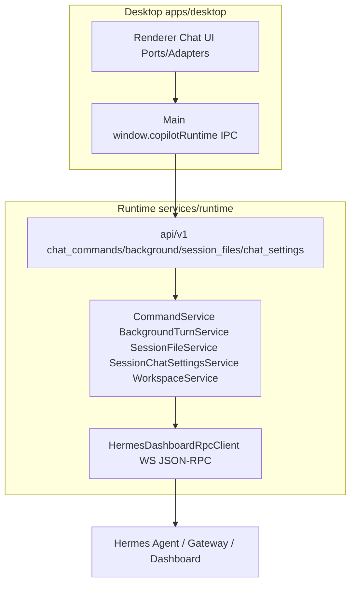

# PRD v1.6 P0 实施计划（Phase 1-3 + Chat 路径 Legacy Purge）

## 背景与现状

- v1.5.x 已完成 Runtime Supervisor / Model Catalog / Desktop SSE 链路；Queue P1 已基本实现。
- P0 整体未启动：无 `chat_commands`/`background-turns`/`session-files`/`chat-settings` API；Runtime 无 Hermes Dashboard RPC Client；Desktop 侧 `slashCommands.ts` 仅 4 个本地命令，Session Model 仍走 `hermesDefaultChat.setSessionModel`。
- 现有落点：
  - Runtime 路由注册：[services/runtime/src/api/router.py](services/runtime/src/api/router.py)（36 个 router）
  - Hermes 集成层：[services/runtime/src/integrations/hermes/client.py](services/runtime/src/integrations/hermes/client.py)（仅 HTTP，无 Dashboard WS）
  - Chat 服务：[chat_run_service.py](services/runtime/src/services/chat_run_service.py)、[chat_queue_service.py](services/runtime/src/services/chat_queue_service.py)、[chat_turn_worker.py](services/runtime/src/services/chat_turn_worker.py)
  - Desktop Ports：[apps/desktop/src/renderer/src/modules/chat/ports/](apps/desktop/src/renderer/src/modules/chat/ports/)（8 个 Port，缺 Workspace/Voice/Preferences）
  - Contracts：[contracts/runtime-api/openapi.yaml](contracts/runtime-api/openapi.yaml)

## 目标架构

## Phase 0 — Contracts 先行（所有后续阶段的前置）

- 在 [contracts/runtime-api/openapi.yaml](contracts/runtime-api/openapi.yaml) 新增：
  - `GET /api/v1/instances/{instanceId}/chat/commands`（FR-01）
  - `POST /api/v1/chat-runs/{runId}/commands/execute`（FR-02，返回 `handled|send_prompt|error`）
  - `POST /api/v1/chat-runs/{runId}/background-turns`（FR-03）
  - `GET /api/v1/instances/{instanceId}/sessions/{sessionId}/files`、`.../files/search`、`POST/DELETE .../files/{fileId}/context`（FR-12/13）
  - `GET/PATCH /api/v1/instances/{instanceId}/sessions/{sessionId}/chat-settings`（FR-04/08，字段 `modelId`、`contextFolder`）
  - Workspace：`listDirectory` / `readFile`（FR-06，具体路径按 Runtime 分层规范定）
- 事件契约扩展：`command.*`、`background.*`、`session.settings.changed`、`workspace.changed`、`file.*`（[contracts/runtime-events/](contracts/runtime-events/)）
- 运行 contracts 生成，同步 [packages/runtime-client-ts/src/domains/chat.ts](packages/runtime-client-ts/src/domains/chat.ts) 新增 client 方法。

## Phase 1 — Runtime 数据 Ownership 收口（Session + Attachment/Session File）

Runtime 侧：
- 新增 [services/runtime/src/api/v1/session_files.py](services/runtime/src/api/v1/session_files.py) 与 `session_file_service.py`：统一 `SessionFileRole`（prompt_attachment/context_file/agent_output/artifact），优先扩展现有 Attachment 表（PRD §51）；FR-14 从结构化 Tool Event 识别 Agent Output。
- 复用现有 `sessions.py` + `HermesSessionAdapter` 提供 sessions/messages 读取。

Desktop 侧：
- 改 [aiosSessionAdapter.ts](apps/desktop/src/renderer/src/modules/chat/adapters/aios/aiosSessionAdapter.ts)：`window.hermesAPI` → `window.copilotRuntime`（FR-09）。
- 改 [aiosFilesAdapter.ts](apps/desktop/src/renderer/src/modules/chat/adapters/aios/aiosFilesAdapter.ts)：上传走 Runtime Attachment API，list/search/+Ctx/-Ctx 走新 Session File API（FR-11）；不重设计 `SessionFilesPanel` UI。

Legacy Purge（仅 Chat 路径）：
- 删除 [apps/desktop/src/main/sessions.ts](apps/desktop/src/main/sessions.ts)、`main/session-cache.ts`、`main/chat-files/platform/db.ts`、`main/chat-files/platform/session-context-folder-store.ts` 中 `~/.hermes/state.db` better-sqlite3 直连（FR-10）。
- 不拆 hermes-config IPC / profile-runtime-ipc / ssh-remote（用户确认不在本次范围）。

## Phase 2 — Hermes Command Bridge（Slash Catalog/Execute + /btw）

Runtime 侧：
- 新建 [services/runtime/src/integrations/hermes/dashboard_rpc_client.py](services/runtime/src/integrations/hermes/dashboard_rpc_client.py)：WS JSON-RPC（connect/request/timeout/notification/reconnect），Desktop 永不知 Dashboard 地址（PRD §47）。
- 新建 `chat_command_service.py` + [api/v1/chat_commands.py](services/runtime/src/api/v1/chat_commands.py)：command catalog（实时取自 Hermes）与 `slash.exec`，结果归一为 `handled/send_prompt/error`，send_prompt 由 Runtime 侧转 ChatTurn（FR-02）。
- 新建 `background_chat_service.py` + `chat_background.py`：`chat_runs` 表扩展 `run_kind/parent_run_id/parent_turn_id`（不建第二套存储，§50）；底层调 Hermes `prompt.background`；发 `background.*` 事件；强制不改变 Main Run 状态/Queue/Context。
- Capability Snapshot 增加 `slashCommands` 等能力位（§48）。

Desktop 侧：
- 改 [aiosCommandVoiceAdapter.ts](apps/desktop/src/renderer/src/modules/chat/adapters/aios/aiosCommandVoiceAdapter.ts) 与 [slashCommands.ts](apps/desktop/src/renderer/src/modules/chat/components/composer/slashCommands.ts)：Agent 命令以 Runtime Catalog 为 SOT，Desktop 仅合并纯 UI 命令（/new /clear /model /settings）；可从 references 迁 Slash UX（catalog merge、search、args hint）。
- `/btw` UX：主 Turn Streaming 时输入 /btw 立即创建 Side Question，独立展示结果（§65 验收）。

## Phase 3 — Session Workspace（Context Folder + Worktree + Session Model）

Runtime 侧：
- 新表 `session_chat_settings`（`instance_id, session_id, model_id, context_folder`，唯一键 (instance_id, session_id)，§49）+ `session_chat_settings_service.py` + chat-settings API。
- `workspace_service.py`：`listDirectory/readFile/getContextFolder/setContextFolder`，做 path traversal/symlink/授权目录校验（§70 安全验收，Runtime 为授权层）。
- FR-05：ChatTurn 执行前 `session.create/resume` 传真实 `cwd=contextFolder`，禁止 system prompt 代替。
- Session Model 优先级：Session Override > Instance Default > Hermes config.yaml；不得写回 config.yaml（§64 验收）。

Desktop 侧：
- 新增 `ChatWorkspacePort`（[ports/](apps/desktop/src/renderer/src/modules/chat/ports/)）+ `aiosWorkspaceAdapter.ts`。
- 从 references 迁 WorktreePanel / ContextFolderChip / RemoteFolderPicker 的 UI（Tree/Expand/Icon/Resize/Toolbar），数据全部换 ChatWorkspacePort；Open Terminal = Runtime 返回 validated path → Main 开 OS Terminal（FR-07）。
- 补齐 contextFolder 全链：ChatSurface → useChatController → ChatRuntimePort → runtime-client → Runtime → Hermes cwd。
- 改 [aiosModelsAdapter.ts](apps/desktop/src/renderer/src/modules/chat/adapters/aios/aiosModelsAdapter.ts)：Session Model 读写走 Runtime chat-settings，移除 `hermesDefaultChat.setSessionModel` 调用。

## 验证

- 单元：Runtime Command/Background/SessionFile/ChatSettings/Workspace 服务；Desktop adapter 测试。
- 边界 CI：复用/扩展 `check-no-desktop-hermes-data.mjs` 等 guard，确认被删 state.db 路径后 CI 通过。
- 验收脚本对照 PRD §64（Model）、§65（/btw）、§66（Workspace）、§67（Files）、§70（安全）、§71（架构扫描）。
- 回归：Default/Expert/Team/MCP Chat 主要流程。

## 关键约束（全程遵守）

- 禁止 Desktop 直访 `~/.hermes`/state.db/config.yaml/Gateway/Dashboard WS；缺口一律补 Runtime API，禁止 Desktop fallback。
- 禁止生产代码 import `references/copilot-desktop`。
- Renderer 不直接 fetch Runtime URL，统一走 Preload → Main → runtime-client-ts。
