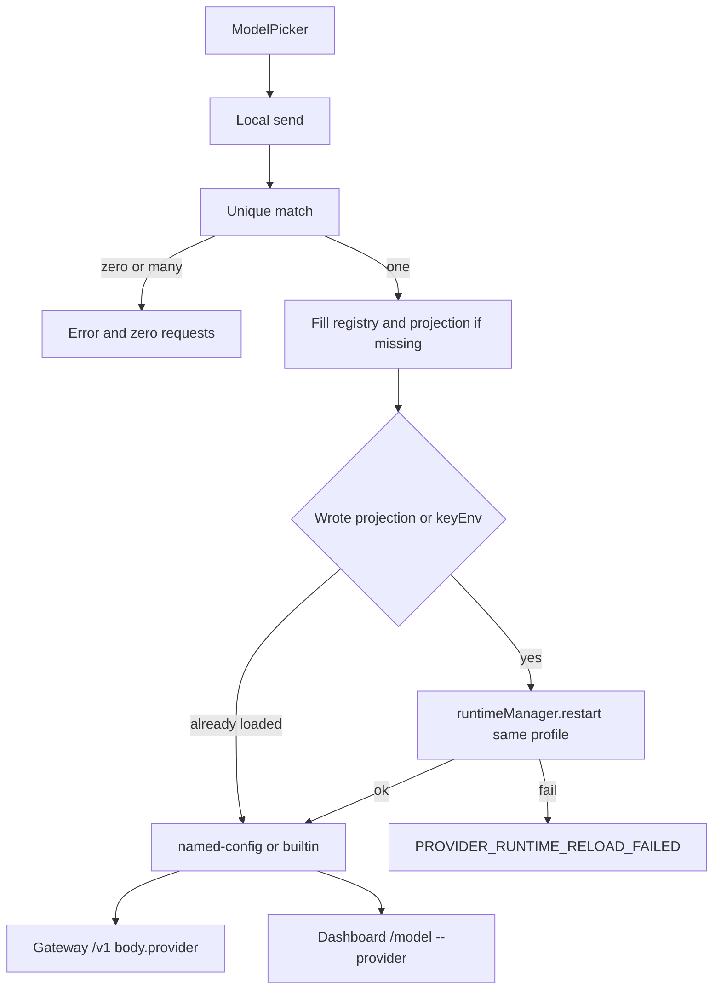

# Provider Identity 本机路由实现计划

依据 [docs/work/PRD-WORK-Provider-Identity-Chat-Routing-Stability-v1.0.md](docs/work/PRD-WORK-Provider-Identity-Chat-Routing-Stability-v1.0.md) v1.1，状态 `APPROVED_FOR_PLAN`。实现以 §2.1（D-01～D-10）为准。§12 里「投影漂移可 MERGE」不执行；漂移默认阻止，只有用户再次保存同一 Provider 时由 registry 覆盖该 Desktop-owned 条目。

不改 Hermes Agent、NEW-API、NodeDeskClaw bootstrap、remote/ssh 发送与重启，也不做消歧 UI 或「采用 YAML 回写 registry」。不改打包 bake-in。



## 现有代码怎么接

- Gateway 两条本机请求都在 [apps/work/src/main/hermes.ts](apps/work/src/main/hermes.ts) 把 `override.provider` / `override.baseUrl` 原样放进 body（约 654 行和 1047 行）。这里改成 Resolver 输出的 `hermesProvider`，named-config 不再带作为身份的 `base_url`。
- Dashboard 正常路径在 [apps/work/src/renderer/src/screens/Chat/hooks/useDashboardChatTransport.ts](apps/work/src/renderer/src/screens/Chat/hooks/useDashboardChatTransport.ts) 的 `resolveDashboardProviderForModel`（517 行起）用 baseURL 猜 slug，并且允许落到 `custom:`。本机发送禁止调用它。该函数只留在 remote/ssh 现有路径。
- Registry 仍是 [apps/work/src/main/providers-store.ts](apps/work/src/main/providers-store.ts) 的 `providers.json` v1（id/name/baseUrl）。v2 在同一文件加 `providerKey`、`keyEnv`、`apiMode`，密钥仍只进 profile `.env`。
- 投影写在 [apps/work/src/main/agent-config-providers.ts](apps/work/src/main/agent-config-providers.ts) 的 `providers:`。`custom_providers:` 只作迁移只读来源，线上 strategy 不输出 `custom` 或 `custom:<name>`。
- 现有 [apps/work/src/shared/url-key-map.ts](apps/work/src/shared/url-key-map.ts) `customProviderEnvKey` 生成的是 `CUSTOM_PROVIDER_*_KEY`。本契约新 key 使用 D-03，不复用这个函数的结果当新 Provider 的 keyEnv。已有 `providers:` / `custom_providers:` 的 `key_env` 原样保留。
- [apps/work/src/main/hermes.ts](apps/work/src/main/hermes.ts) 的 `restartGateway` 直接 `return false`，且 `startGateway` 拒绝由 Work 拉起进程。本机重启走 [apps/work/src/main/runtime/runtime-service-adapter.ts](apps/work/src/main/runtime/runtime-service-adapter.ts) 的现有 `restart(profile)`。

## 新拥有者

Main 新建 `apps/work/src/main/provider-identity/`：

- `provider-ref.ts`：`builtin:<slug>` / `named:<providerKey>`，providerKey 按 PRD §13.2 生成且创建后不可变。
- `runtime-provider-resolver.ts`：纯解析。输出只允许 `strategy: builtin | named-config`。不读 baseURL 当身份，不 fallback。
- `provider-save-transaction.ts`：同一 Provider 的 registry、`.env` keyEnv、`providers:<providerKey>` 投影。写前留 T0 备份；投影写入失败则回滚。重启失败不回滚已提交文件，错误码 `PROVIDER_RUNTIME_RELOAD_FAILED`，模型请求次数为 0。
- `local-migrate-and-send.ts`：本机发送编排，顺序固定为 D-09。无法唯一匹配时 Session 用 `SESSION_PROVIDER_UNRESOLVED`，无 Session override 的全局 `model:` 用 `ACTIVE_MODEL_PROVIDER_UNRESOLVED`。

## Todos

每个 Todo 的 `status` 从 `planned` 开始。只有对应验收用例跑出 Evidence 才能标 `verified`。

```yaml
id: t1-resolver
requirement_refs: [REQ-STATE-001, REQ-API-001]
acceptance_refs: [A-STATE-001, A-API-001, A-NEG-001, A-NEG-003]
files_or_symbols:
  - apps/work/src/main/provider-identity/provider-ref.ts
  - apps/work/src/main/provider-identity/runtime-provider-resolver.ts
implementation_goal: 冻结 ProviderRef 与只含 builtin/named-config 的解析结果，错误码 PROVIDER_ROUTE_UNRESOLVED。
preconditions: 无文件写入。
state_transition: 无持久状态。
side_effect_scope: 无。
failure_cases: [缺 ProviderRef, 多匹配, 要求 custom 或 custom 冒号前缀]
verification: vitest 解析矩阵；断言 hermesProvider 不含 bare custom。
status: planned
evidence: 待跑
```

```yaml
id: t2-registry-save
requirement_refs: [REQ-DATA-001, REQ-TXN-001, REQ-SEC-001, REQ-CHECK-001]
acceptance_refs: [A-DATA-001, A-TXN-001, A-TXN-002, A-SEC-001, A-CHECK-001, A-NEG-004, A-NEG-006]
files_or_symbols:
  - apps/work/src/main/providers-store.ts
  - apps/work/src/main/provider-identity/provider-save-transaction.ts
  - apps/work/src/main/config.ts
implementation_goal: providers.json v2；apiMode 闭集；keyEnv 按 D-03；密钥只写 .env；跨 profile 0 mutation。
preconditions: 目标 profileHome 由 Desktop 显式传入，不读 HERMES_PROFILE 覆盖。
state_transition: v1 providers.json 保留 UUID，补 providerKey 后写 v2。
side_effect_scope: 该 profile 的 providers.json、.env、config.yaml 的 providers 段。
failure_cases: [PROVIDER_KEYENV_CONFLICT, PROVIDER_API_MODE_INVALID, PROVIDER_SAVE_ROLLBACK_FAILED, PROFILE_SCOPE_MISMATCH]
verification: 现有 providers-store.test.ts 加 v2/冲突/回滚；断言 models.json、session 表、model.api_key 无密钥。
status: planned
evidence: 待跑
```

```yaml
id: t3-projection
requirement_refs: [REQ-PROJ-001]
acceptance_refs: [A-PROJ-001, A-NEG-005]
files_or_symbols:
  - apps/work/src/main/agent-config-providers.ts
implementation_goal: 只投影 providers 的 providerKey。已有 key_env 保留。漂移未再保存则 PROVIDER_PROJECTION_DRIFT 且 0 mutation。未知 custom_providers 不删。
preconditions: registry v2 记录已存在。
state_transition: ABSENT 到 PROJECTED；不一致停在 DRIFTED 直到显式再保存覆盖。
side_effect_scope: 该 profile config.yaml 中被证明为 Desktop-owned 的 providers 条目。
failure_cases: [PROVIDER_PROJECTION_DRIFT, 未知 ownership]
verification: agent-config-providers 测试覆盖一致、漂移阻止、未知条目保留。
status: planned
evidence: 待跑
```

```yaml
id: t4-model-session
requirement_refs: [REQ-DATA-002, REQ-DATA-003, REQ-MIGRATE-001]
acceptance_refs: [A-DATA-002, A-DATA-003, A-MIGRATE-001]
files_or_symbols:
  - apps/work/src/main/models.ts
  - apps/work/src/main/session-model-override-store.ts
implementation_goal: 新模型和会话使用 ProviderRef。旧行仅在迁移模块做唯一匹配。无消歧 UI。
preconditions: registry 可读。
state_transition: legacy model/session 到 v2，或保持 unresolved。
side_effect_scope: models.json 的身份字段；desktop_session_model_overrides 增加 provider_ref 与 legacy 快照列。
failure_cases: [PROVIDER_IDENTITY_AMBIGUOUS, 旧 apiMode 与 Provider 不一致]
verification: models 与 session-model-override-store 测试。
status: planned
evidence: 待跑
```

```yaml
id: t5-local-send
requirement_refs: [REQ-API-002, REQ-API-003, REQ-MIGRATE-002, REQ-OBS-001]
acceptance_refs: [A-API-002, A-API-003, A-MIGRATE-002, A-COMPAT-001, A-OBS-001, A-NEG-002]
files_or_symbols:
  - apps/work/src/main/provider-identity/local-migrate-and-send.ts
  - apps/work/src/main/hermes.ts
  - apps/work/src/main/ipc/register.ts
  - apps/work/src/renderer/src/screens/Chat/hooks/useDashboardChatTransport.ts
  - apps/work/src/main/runtime/runtime-service-adapter.ts
implementation_goal: 本机同一次发送按 D-09 补齐、必要时重启、再发 named-config。两条 Gateway body 与 Dashboard /model 使用同一 hermesProvider。keyEnv 非空但无值则 PROVIDER_SECRET_MISSING。日志不含密钥。
preconditions: connection mode 为 local。remote/ssh 分支不调用本模块。
state_transition: 唯一匹配的 legacy session 或全局 model 段迁到 canonical 后发送；0 或多匹配则不发。
side_effect_scope: 本动作可写 registry、投影、.env、session 行，以及 Desktop-owned 的 model.provider/model/base_url/api_mode。重启只调用现有 runtime restart。
failure_cases: [SESSION_PROVIDER_UNRESOLVED, ACTIVE_MODEL_PROVIDER_UNRESOLVED, PROVIDER_SECRET_MISSING, PROVIDER_RUNTIME_RELOAD_FAILED]
verification: hermes 请求 fixture 与 dashboard 本机命令测试。断言本机发送路径不再调用 resolveDashboardProviderForModel；失败分支 fetch 次数为 0。
status: planned
evidence: 待跑
```

```yaml
id: t6-golden-identity
requirement_refs: [A-GOLDEN-001, D-10]
acceptance_refs: [A-GOLDEN-001]
files_or_symbols:
  - apps/work/src/main/provider-identity/*.test.ts
implementation_goal: 身份门禁必须 PASS。上游 401 记 FAIL。上游不可达或非 401 记 BLOCKED，不把身份断言改成失败，也不写成上游全量 PASS。
preconditions: T1 到 T5 的单元与集成断言已绿。
state_transition: 无额外产品状态。
side_effect_scope: 仅测试与 evidence 记录。
failure_cases: [路由断言不一致, HTTP 401, 上游不可达]
verification: 本地 vitest 断言同一 ProviderRef、同一 hermesProvider、bare-custom 次数为 0。不把真实 NEW-API 可达性当成合入前置。
status: planned
evidence: 待跑
```
