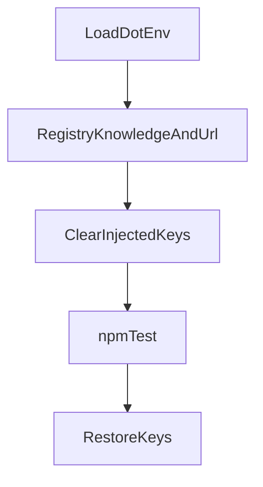

# 0.7.10 npm test 门禁实现计划

依据 [docs/work/PRD-WORK-RELEASE-NPM-TEST-GATE-HOTFIX-v0.7.10.md](docs/work/PRD-WORK-RELEASE-NPM-TEST-GATE-HOTFIX-v0.7.10.md)，`status = APPROVED_FOR_PLAN`。实现以 `HF-G-01`～`HF-G-16` 为准。本计划 `plan_contract: smc.plan.v3.7`，claim `GES_NATIVE`。仓库内没有 `smc-plan-from-approved-prd-ponytail` 技能包，因此沿用 [`.cursor/plans/session_restore_splash_faae8f3f.plan.md`](.cursor/plans/session_restore_splash_faae8f3f.plan.md) 的字段。本计划状态是 `planned`，不是 `approved`。

基线：smc-copilot `580404ab`。`HF-G-03` 已落地：telemetry、feature-mode、token-store 使用 `C:\tmp`，不存在则创建。不重做这三处。不改 [apps/work/.env](apps/work/.env) 的任何变量值，不改 `electron-builder.yml`，不跳过 `npm test`，不重写知识库锁和 skill-run bundle 锁，不重锁 UI 基线，不打 0.7.10 安装包。

## 已关闭且本计划不得改选的合同

- 文件名：非法字符就地换成 `-`，最长 80，只去盘符和 UNC。
- `npm test` 子进程看不见 `.env` 注入的全部键；烘焙步骤仍读这些值；文件不改。
- Electron 缺 `app` 或 `getPath` 失败时 userData 为空；测试替身也补上 `app`；真实 `getPath("userData")` 不变。
- Skill Run 绑定写失败仍然失败；测试库必须能写入一条元数据。
- 记忆库只改测试替身的 `close`。
- 知识库页面只补 `desktopAuth` / `onConnectionConfigChanged` 夹具。
- 锁文件不改哈希。CLI 缺失是 `runtime_invalid`。
- 半边 IPC：preload、类型、清单、渲染调用一起删。源码检索改到现行文件。路径按规范化结果比较。其余失败断言不放宽。

## T1. 发版脚本只对测试子进程隔离 `.env`

[apps/work/scripts/build-work-release.ps1](apps/work/scripts/build-work-release.ps1) 在 `Invoke-Step "Run tests"` 之前，记下本次从 `.env` 注入的键，从当前进程临时去掉，再跑 `npm test`，无论成功失败都写回。更早的更新地址校验和知识库配置生成仍看见原值。不打开、不改写 `.env`。

在 [apps/work/tests/release-builder-config.test.ts](apps/work/tests/release-builder-config.test.ts) 断言脚本含这层保存、清除、恢复，并且不含对 `.env` 的 `Set-Content`。

## T2. 生成文件名

改 [apps/work/src/main/files/agent-output/generated-file-name.ts](apps/work/src/main/files/agent-output/generated-file-name.ts)：去掉 `split("/").pop()`。非法字符就地替换，截到 80。盘符前缀和 UNC 仍去掉。`a<>:"/\\|?*b` 得到 `a---------b`。现有 [generated-file-name.test.ts](apps/work/src/main/files/agent-output/generated-file-name.test.ts) 不改期望。

## T3. Electron `app`

[apps/work/src/main/runtime/hermes-runtime-config.ts](apps/work/src/main/runtime/hermes-runtime-config.ts) 的 `workRuntimeConfigPath` 在读取 `app.getPath("userData")` 抛错或缺导出时返回 `""`。真实 Electron 的返回值不变。给 [account-store.test.ts](apps/work/src/main/account-store.test.ts)、[wallet-store.test.ts](apps/work/src/main/wallet-store.test.ts)、[hermes-account.test.ts](apps/work/src/main/hermes-account.test.ts) 的 electron 替身补上 `app.getPath`。

## T4. 记忆库替身与 Skill Run 落库

只改 [apps/work/tests/memory-limits.test.ts](apps/work/tests/memory-limits.test.ts)，让 `better-sqlite3` 假构造带 `close`。不改 [sqlite-database.ts](apps/work/src/main/sqlite-database.ts) 的 fallback 条件。

[skill-run-session-materialize.test.ts](apps/work/src/main/skill-run/skill-run-session-materialize.test.ts) 的替身库必须能写入一条 skill-run 会话元数据，使四条用例写出消息。生产路径在 `KNOWLEDGE_BINDING_PERSIST_FAILED` 时仍省略正式缓存并失败，不改成报成功。对照 [session-metadata-store.ts](apps/work/src/main/session-metadata-store.ts) 读回失败的原因改测试库表，不吞掉这个错误。

## T5. 知识库页面夹具

[knowledge-chat-page.test.ts](apps/work/tests/knowledge-chat-page.test.ts)、[knowledge-fail-closed.test.ts](apps/work/tests/knowledge-fail-closed.test.ts)、[knowledge-page-host.test.ts](apps/work/tests/knowledge-page-host.test.ts) 补上 `desktopAuth.getState`、`onStateChanged`，以及 `hermesAPI.onConnectionConfigChanged`。不改 [Chat.tsx](apps/work/src/renderer/src/screens/Chat/Chat.tsx) 的调用方式。

## T6. 半边 IPC

先列出 preload `ipcRenderer.invoke` 中主进程没有注册的通道。至少包括 `materialize-chat-session-turn`：preload 在 [index.ts](apps/work/src/preload/index.ts)，类型在 [index.d.ts](apps/work/src/preload/index.d.ts)，渲染调用在 [useDashboardChatTransport.ts](apps/work/src/renderer/src/screens/Chat/hooks/useDashboardChatTransport.ts)，旧清单在 [ipc-handlers.test.ts](apps/work/tests/ipc-handlers.test.ts)。同一批删除，并改 [useDashboardChatTransport.test.tsx](apps/work/tests/../src/renderer/src/screens/Chat/hooks/useDashboardChatTransport.test.tsx)。保留 [chat-session-materialize.ts](apps/work/src/main/chat-session-materialize.ts) 的进程内函数及其直接测试。其余半边通道按同一规则处理。仍存在的 preload 方法补齐类型，不删仍在使用的方法。

## T7. 检索、路径、CLI 状态与其余断言

- `askpass-security` 与 `electron-security` 改到现行所有者，不搬回旧字符串。
- `file-store` 比较规范化后的同一路径，不要求 `ADMINI~1`。
- CLI 文件缺失时 [availability-backend](apps/work/src/main/hermes/availability-backend.ts) 路径得到 `runtime_invalid`。
- 工具集 YAML、SSH 引号、删除会话清附件、第一条 skill delta、CRLF Result、主题按 appearance（light 不得变成 dark）、本地 publish 不得声称生产成功、OpenClaw/技能目录、远程会话与 cron 端口、profile 在 CLI 已保存时不改文件：保持现有断言，改实现或夹具。
- 知识库锁与 skill-run consumer lock 不改锁文件、不改期望哈希。代码和夹具对齐锁。对不上时停止并说明差异，不重写锁。

## 验收

聚焦测试覆盖上述文件后，在当前进程已设置 `.env` 那 7 个键的情况下跑 `npm test`，退出码为 0；再在未设置这些键时跑一次，退出码为 0。不运行 electron-builder。
