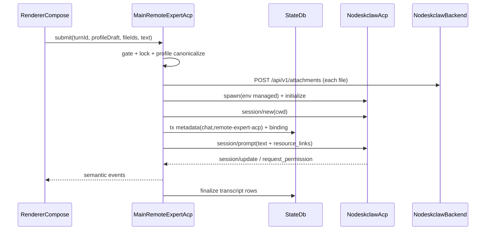

# Remote ACP Expert 接入实现计划

依据 [docs/expert/PRD-SMC-COPILOT-Original-Chat-ACP-Remote-Expert-Integration-v1.0.md](docs/expert/PRD-SMC-COPILOT-Original-Chat-ACP-Remote-Expert-Integration-v1.0.md)（`APPROVED_FOR_PLAN`）。`plan_contract: smc.plan.v3.7`，claim `GES_NATIVE`，字段沿用 [`.cursor/plans/release_test_gate_hotfix_1312044c.plan.md`](.cursor/plans/release_test_gate_hotfix_1312044c.plan.md)。本计划状态 `planned`。

## 基线核对（已在本地验证）

- SMC：`work/prd-v6.3` HEAD = `be619f66`。PRD 写的 `0efacd23…` 是这个 commit 的 **tree** SHA，源码一致；Evidence 一律记 `be619f66`。
- Provider：`D:\git_ai\nodeskclaw` tag `remote-expert-frontend-contract-v1.0.0` 对象 `9f694a3b…`、target `e08428af…`，与 PRD 一致。
- 组件 digest = `sha256(raw SHA256SUMS)`，本地重算：Catalog `e5bd3f36…`、ACP Adapter `29acb865…`、Remote Agent `c8bc0ed8…`（CRLF；LF 物化 `9bb6b0cd…`），全部匹配。
- aggregate `bundleDigest 598ae09b…` 不是 `sha256(SHA256SUMS)`。按 Provider [`tools/contracts/seal_remote_expert_contracts.py`](D:/git_ai/nodeskclaw/tools/contracts/seal_remote_expert_contracts.py) 计算：SHA256SUMS 去掉 `manifest.json`/`SHA256SUMS` 两行，按路径排序后用 LF 拼接再取 sha256。

## 从 Provider 源码确认的协议事实（属于实现发现，不是语义缺口）

- 启动：`nodeskclaw-acp serve --profile <file>`，一个进程只服务一个 profile（与 PRD「每个 Chat 独立 child」一致）。profile 按 YAML 解析，canonical JSON 可直接写入。版本探测：`nodeskclaw-acp version`，输出 JSON。
- Child env：`NODESKCLAW_BASE_URL`、`NODESKCLAW_CREDENTIAL_MODE=managed`、`NODESKCLAW_ACCESS_TOKEN`、`NODESKCLAW_REFRESH_TOKEN`、`NODESKCLAW_ACP_MAX_SESSIONS=1`。argv 里只放 profile 路径。
- 版本：二进制 `adapterVersion=1.6.1`，`adapterContractVersion=1.1.0`。binding 的 `acp_adapter_version/digest` 记 contract 的 `1.1.0` 和 `29acb865…`；二进制版本单独 pin 在 lock 里，只用于诊断和完整性校验。
- stdout 是 NDJSON JSON-RPC。`session/new` 和 `session/resume` 都要求绝对路径 `cwd`，resume 时该目录还必须存在。Main 为每个 binding 建 `userData/remote-expert-acp/sessions/<sha256(session_id)>`。
- Resume 错误映射：`ACP_SESSION_NOT_FOUND` 对应 not_found，`ACP_SESSION_RESUME_FORBIDDEN` 对应 forbidden，`ACP_SESSION_AGENT_MISMATCH` 对应 `ACP_SESSION_PROFILE_MISMATCH`。远端 busy 时照常 adopt，下一次 prompt 返回 `ACP_SESSION_BUSY`。
- Permission：Agent 反向发出请求，`id=perm-N`，method `session/request_permission`，选项 `allow_once`/`reject_once`。Client 回 `{outcome:{outcome:"selected",optionId}}`。关窗或按 Esc 一律回 `reject_once`；`cancelled` 会取消整个 run，P0 不发送。
- Cancel 是 `session/cancel` 通知。错误放在 JSON-RPC `error.data.symbol`。
- 附件：先 `POST /api/v1/attachments`（multipart 字段 `file`）拿到 `attachment_ref`，再在 prompt 里放 `{type:"resource_link",uri:"nodeskclaw://attachment/{ref}",name}`。
- Artifact：URI 是 `nodeskclaw://artifact/{run_id}/{artifact_id}`。字节由 `GET /api/v1/remote-agent/runs/{run_id}/artifacts/{artifact_id}` 返回，带 `X-Checksum-SHA256`，需要 `expert:view` 权限；期望 checksum 取自 `GET .../artifacts` 列表里的 `checksum_sha256`。风险：契约 schema 只写了元数据，字节返回是 Provider 实现行为；SMC 侧用 fixture 测试锁住这一行为。

## 已确定的设计决定

- 范围：做 T0–T16。T17 只做 resolver、完整性校验和 dev 覆盖，**不改** `electron-builder.yml` 和 `extraResources`。打包和 T18 另起计划。
- 与旧 Expert 互斥：Remote Expert gate 开启时，[Chat.tsx](apps/work/src/renderer/src/screens/Chat/Chat.tsx) 不再挂 `ExpertContextControl`，也不走 `submitExpert`。gate 关闭时旧行为不变。
- Gate：环境变量 `SMC_WORK_REMOTE_EXPERT=off|alpha`。未打包默认 `alpha`，打包默认 `off`。同时要求 lock 中 `frontendContractGate=passed`。打包版在 `productionGate=unpassed` 时只能显式设为 `alpha`。
- SMC Design Decision：只能在没有持久化消息的新 Chat 上选择 Remote Expert。已有 `hermes-chat` 会话不做重分类（对应 PRD §12.2），在这种会话里选 expert 会走「新建 Chat」。
- 新代码不 import `src/main/skill-run/**`、`src/main/expert/**`、`renderer/modules/expert/**`、`preload/expert-api.ts`、`shared/expert.ts`。附件上传在新 context 内单独实现，不复用 Skill Run gateway。

## Todo 字段约定

每个 Todo 写明：`requirement_refs / acceptance_refs / files_or_symbols / side_effect_scope / failure_cases / verification(oracle)`，并按 PRD §29 维护 `status / evidence`。依赖：T0 完成前不开始 T4/T5；T1、T2 完成前不接 renderer 的 remote submit。

## T0 Contract lock

- REQ-ACP-001 / A-ACP-001
- 新增 `apps/work/contracts/nodeskclaw/remote-expert-frontend-v1.0.0/`：`contract-lock.json`（tag、tagObjectSha、targetCommit、implementationCommit、bundleDigest、protocol、三个组件的 version/digest 含 LF 物化、gates、adapterBinaryVersion `1.6.1`），vendored aggregate 与组件 `SHA256SUMS`/`manifest.json`，以及 `consumer-fixtures/smc-copilot-v6.3/*` 和 v1.1.0 golden。
- 新增 `src/main/remote-expert-acp/contract-lock.ts` + test：复算组件 digest 和 bundleDigest（照搬上述算法），篡改负例覆盖 digest、version、缺 lock 三种。
- 失败：`ACP_CONTRACT_LOCK_MISSING`、`ACP_CONTRACT_INCOMPATIBLE`。Oracle：元组完全相等才判 COMPATIBLE。

## T1 Session metadata 迁移 + binding store

- REQ-ACP-002 / A-ACP-002
- [session-metadata-store.ts](apps/work/src/main/session-metadata-store.ts)：`ExpertProvider` 联合加入 `remote-expert-acp`；`isSessionClassification` 加 `(chat, remote-expert-acp)`；`ensureTable` 的检测从 `tableAllowsKbSet` 扩展为同时检测 `remote-expert-acp`；沿用 RENAME→CREATE→INSERT SELECT→DROP，放进一个事务，迁移前后行数一致才提交。
- 新增 `remote-expert-binding-store.ts`：建 PRD §9.1.2 的表，提供 insert、get、markState。冲突返回 `REMOTE_BINDING_CONFLICT`。不更新 profile 字段。
- 测试：用含 hermes-chat/skill-run/kb-set 的旧库做迁移，旧行逐字段不变；唯一约束测试；全库扫描不含 token。

## T2 Shared 契约 + preload API

- REQ-ACP-005 / A-ACP-005
- 新增 `src/shared/remote-expert-acp/{contract,ipc,events,errors}.ts`：固定 IPC channel 白名单 `remote-expert:*`，以及 semantic event 联合（assistant delta、reasoning、tool call/result、permission request/resolved、artifact、lifecycle、turn end）。
- 新增 `src/preload/remote-expert-api.ts`，在 [preload/index.ts](apps/work/src/preload/index.ts) 和 `index.d.ts` 中暴露 `remoteExpert`。
- 扩展 [tests/preload-api-surface.test.ts](apps/work/tests/preload-api-surface.test.ts) 和 [tests/ipc-handlers.test.ts](apps/work/tests/ipc-handlers.test.ts)，把新的 register 文件纳入双向检查。另加负例：没有 raw method 透传，payload 里没有 token 或 URL。

## T3 Catalog client

- REQ-ACP-003 / A-ACP-003
- `catalog-client.ts` 用 `createAuthorizedBackendTransport().withAuthRetry` 调 list/get 两个端点，按 vendored schema 校验，Main 内存 TTL 缓存 60 秒。403 映射 `REMOTE_EXPERT_CATALOG_AUTH`，5xx 映射 `..._UNAVAILABLE`，schema 不符映射 `..._SCHEMA_INVALID`。
- 测试：ready/unavailable/forbidden golden；401 刷新一次；DTO 不含 URL。

## T4 Binary resolver + compatibility gate + feature gate

- REQ-ACP-001/017/018 / A-ACP-001/017（resolver 部分）/018
- `acp-binary-resolver.ts`：打包时只认 `process.resourcesPath/nodeskclaw-acp/nodeskclaw-acp.exe`，旁边的 `distribution-manifest.json` 按 `acp-adapter.desktop.manifest.v1` 校验 sha256。dev（`!app.isPackaged`）才接受 `SMC_WORK_ACP_ADAPTER_PATH`。
- `compatibility-gate.ts`：不带 token 跑 `version`，比对 lock。`remote-expert-feature-gate.ts` 实现上面的 gate 规则。IPC `getAvailability` 返回 `{enabled, reason}`。
- 失败：`ACP_BINARY_MISSING`、`ACP_BINARY_INTEGRITY_FAILED`、`ACP_BINARY_UNSUPPORTED`、`ACP_ADAPTER_VERSION_UNREADABLE`、`REMOTE_EXPERT_PRODUCTION_GATE_BLOCKED`。测试：篡改二进制、打包版忽略 dev 路径、打包默认 off。

## T5 Managed credential + process manager

- REQ-ACP-004/014 / A-ACP-004/014
- `managed-credential-bridge.ts`：从 `readStoredSession()` 和 `resolveBackendBaseUrl()` 组装 child env，调用前先 `ensureFreshAccessToken()`。
- `acp-process-manager.ts`：以 sessionKey 为键，ensure 去重；`windowsHide`；stdout 只交给 JSON-RPC parser；stderr 经净化后进 diagnostics；记录 crash 并只影响对应 session。
- 测试：child env 断言；argv 里没有 token；两个 child 互不影响；crash 注入。

## T6 ACP client + initialize/new

- REQ-ACP-007 / A-ACP-007
- `acp-jsonrpc-transport.ts`：NDJSON 帧解析，管理 pending 请求，转发反向 request。`acp-client.ts`：封装 initialize/new/resume/prompt/cancel/close，校验 `initialize-desktop` 声明的 capabilities。
- `acp-session-manager.ts`：按 PRD §14.2 的提交顺序执行。binding 写库失败时尽力 `session/close`，并写一条 orphan 诊断（只含 hash）。
- 测试：用假 adapter（node 脚本回放 golden）做 initialize 超时、畸形 JSON、未知通知等用例。

## T7 Compose RemoteExpertContextControl

- REQ-ACP-006/019 / A-ACP-006/019
- 新增 `renderer/screens/Chat/remote-expert/{RemoteExpertContextControl,RemoteExpertSelector,RemoteExpertStatus}.tsx`，经 `ChatInput.toolbarExtras` 挂载。显示选中 expert 和 durable refs 摘要；unavailable 项显示但置灰。
- [Chat.tsx](apps/work/src/renderer/src/screens/Chat/Chat.tsx)：gate 开启时不挂 `ExpertContextControl`。已绑定的会话修改 durable context 时弹确认，确认后新建 Chat。
- 文案只加在 `locales/en/`。测试：组件测试、选择不发请求、unavailable 置灰、不出现旧入口。

## T8 Prompt + semantic event mapper

- REQ-ACP-007 / A-ACP-007
- [chatRuns.ts](apps/work/src/renderer/src/screens/Layout/chatRuns.ts) 加 `ChatExecutionMode "remote-expert"`。`Chat.tsx` 的 `handleSubmitOrQueue` 新增 remote 分支，经 `useRemoteExpertTransport.ts` 调用。
- Main 端 `acp-event-mapper.ts` 处理 `agent_message_chunk`、`agent_thought_chunk`、`tool_call`、`tool_call_update`、`resource_link`、`end_turn`。`turn_id` 防重复提交；不明确的结果标 `ACP_OUTCOME_UNKNOWN`，不盲目重发。
- 测试：golden 流映射；required 字段缺失时 turn 失败；unknown 通知不导致崩溃。

## T9 Transcript 物化 + history 分类

- REQ-ACP-013/002 / A-ACP-013
- 新增 `remote-expert-session-materialize.ts`，以 [chat-session-materialize.ts](apps/work/src/main/chat-session-materialize.ts) 为模板写 `sessions/messages`。`platform_message_id = remote-acp:{turn_id}:{kind}:{n}`。行形状对齐 `sessions.ts HistoryItem`，让 `dbItemsToChatMessages()` 能还原。
- `session-cache.ts`、`SidebarRecentSessions.tsx isExactHistoryPair`、preload `CachedSession` 类型都加 `(chat, remote-expert-acp)`。
- 测试：重复物化不产生重复行；重开 DB 后语义一致；ExpertProjectionStore 的 spy 调用次数为 0。

## T10 Resume / recovery

- REQ-ACP-008/019 / A-ACP-008
- `Layout.tsx handleResumeSession` 和 `resolveResumeExecutionMode` 识别 remote pair。Main 依次读 binding、过 gate、比对 profile digest、spawn、`session/resume`；并发请求合并。
- 语义失败时标 `resume_blocked`：transcript 可读，提交禁用。offline 时返回 `ACP_SESSION_TEMPORARILY_UNAVAILABLE`，可以重试。metadata 显示 remote 但 binding 缺失时报 `REMOTE_BINDING_NOT_FOUND`。
- 测试：RPC trace 里没有 `session/new`；not-found、forbidden、mismatch 三种负例。

## T11 Attachment bridge

- REQ-ACP-009 / A-ACP-009
- `remote-attachment-bridge.ts`：`fileIds` 解析为 ManagedFile，remote-only 的文件先物化到本地；逐个 multipart 上传，校验返回的 `att_` ref；全部成功后才拼 prompt。ref 不写进 binding。
- 测试：任一附件失败则不发 prompt；PDF/XLSX fixture；捕获 resource_link 断言。

## T12 Artifact 落到 ManagedFile

- REQ-ACP-010 / A-ACP-010
- [managed-file.ts](apps/work/src/shared/files/managed-file.ts) 加 `remote-expert-acp`。[materialize-remote-expert-artifact.ts](apps/work/src/main/files/materialize-remote-expert-artifact.ts)、`file-service.ts saveRemoteArtifactAs`、`file-preview-service.ts`、`file-association-store.ts` 改成 exhaustive switch，类型穷尽由 `never` 保证。
- 新增 `remote-artifact-bridge.ts`：严格解析 URI（拒绝 `..`、编码分隔符、多余段），写 `.partial`，比对 sha256，失败删掉 `.partial`。相同 artifact 去重到同一个 ManagedFile。
- 测试：provider 路由测试（NEG-005）、hash 不符、URI 穿越负例。

## T13 Permission bridge

- REQ-ACP-011 / A-ACP-011
- `permission-mapper.ts` 把反向请求映射为 semantic 状态。新增 `RemoteExpertPermissionView.tsx`，参考 `SkillRunStatusBar` 的视觉，只有 Allow once / Reject once 两个按钮；关窗或 Esc 发 `reject_once`。
- 同一个 request id 只接受第一次决定；发送失败时保持 unresolved。测试：三种决定的 RPC trace；backend spy 没有 approval HTTP 调用。

## T14 Cancel / close / recovery

- REQ-ACP-012 / A-ACP-012
- Abort 发 `session/cancel`。5 秒内没有终态才 kill，并标 recovery required。删除或关闭 Chat 时尽力 `session/close`，binding 标 `closed`。
- 测试：hung child 注入；重复 cancel；不影响其它 session。

## T15 Diagnostics / 安全加固

- REQ-ACP-015/014 / A-ACP-015/014
- `diagnostics.ts`：PRD §19 的事件名和公共字段，session id 只记 hash，并做 redaction。
- 测试：日志 schema；在 IPC 快照、日志、两个 DB、诊断导出中做 secret 正则扫描。

## T16 Forbidden dependency 静态测试

- REQ-ACP-016 / A-ACP-016
- 新增 `tests/remote-expert-acp-isolation.test.ts`：扫描新 context 的 main、shared、preload、renderer 所有文件的 import 和标识符，覆盖 PRD A.3 列表以及 `src/main/skill-run/**`。再加 runtime spy：remote 提交时 `expert.start` 和 `skillRun.start` 的调用次数为 0。

## T17（缩减）Binary 验证证据

- REQ-ACP-017 / A-ACP-017 只完成 resolver 部分，状态保持 `blocked` 直到打包计划完成。
- 用 Provider 的 `scripts/build_desktop_adapter.py` 本地构建 exe，经 dev 覆盖完成 GC-01 风格的联调，并记录 evidence。不改 `electron-builder.yml`。

## 收尾

- 先跑新模块的聚焦 vitest，再跑全量 `npm test`，并跑 `npm run check:i18n-source-locale-only`。
- 更新 `apps/work/lat.md/` 中 Remote Expert 相关 section，并跑 `lat check`。
- 提交前交给 code-review subagent，按 PRD §30 的 12 条逐条检查。
