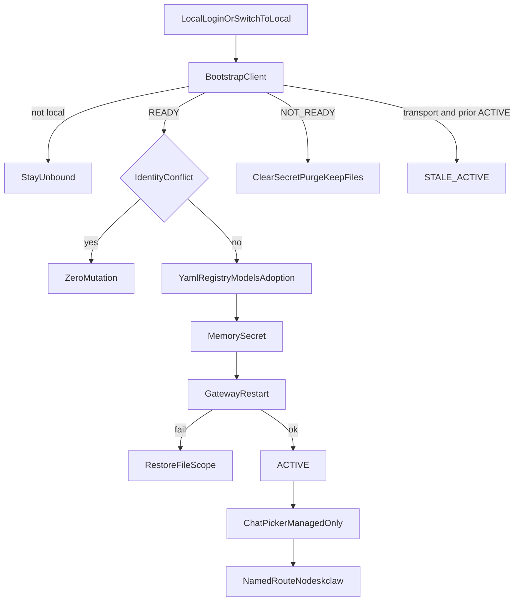

# Runtime Provider Bootstrap 实现计划

依据 [docs/work/PRD-WORK-RUNTIME-PROVIDER-BOOTSTRAP-v1.0.md](docs/work/PRD-WORK-RUNTIME-PROVIDER-BOOTSTRAP-v1.0.md) v1.1，`status = APPROVED_FOR_PLAN`。实现以 §0.3 的 `RPB-D-01`～`RPB-D-18` 为准，并覆盖正文中与之冲突的旧句。本计划 `plan_contract: smc.plan.v3.7`，claim `GES_NATIVE`。仓库内没有 `smc-plan-from-approved-prd-ponytail` 技能包，因此沿用 [`.cursor/plans/p0.1_wiring_plan_14d2635d.plan.md`](.cursor/plans/p0.1_wiring_plan_14d2635d.plan.md) 的字段。本计划状态是 `planned`，不是 `approved`。

基线：smc-copilot `9a4e7618d576790e0201aa8b2a0ed4e6ec4e70e6`，NodeDeskClaw `7abb73e90e163f85257208ac4aa58e4914d2da6e`。不改 NodeDeskClaw Backend、Hermes Agent Core、remote/ssh 发送路径、辅助任务、`saveNamedProvider(secret=...)`。



## 现有入口

- Auth 传输已在 [`apps/work/src/main/auth/authorized-backend-transport.ts`](apps/work/src/main/auth/authorized-backend-transport.ts) 的 `createAuthorizedBackendTransport`。Bootstrap 客户端只通过它 `POST /api/v1/runtime/model-bootstrap`，请求体固定 `consumer=smc-copilot`、`runtime=hermes-agent`。
- 登录与登出在 [`apps/work/src/main/auth/auth-ipc.ts`](apps/work/src/main/auth/auth-ipc.ts)。成功 `writeStoredSession` 之后、`restoreExpertSubsystemAfterAuth` 之前，仅当 connection mode 为 local 才 `bootstrap("login")`。登出在清 Portal session 之前完成本地 purge；远端 logout 失败不阻止本地清除。
- 命名路由已在 [`apps/work/src/main/provider-identity/runtime-provider-resolver.ts`](apps/work/src/main/provider-identity/runtime-provider-resolver.ts)。`named:nodeskclaw` 依赖 [`apps/work/src/main/providers-store.ts`](apps/work/src/main/providers-store.ts) 里恰好一条无 secret 的 Registry 记录，加上 [`apps/work/src/main/agent-config-providers.ts`](apps/work/src/main/agent-config-providers.ts) 的 `providers.nodeskclaw`。不走 `saveNamedProvider(secret=...)`。
- Catalog 已按 profile 的 `models.json`，Picker 在 [`apps/work/src/renderer/src/screens/Chat/hooks/useModelConfig.ts`](apps/work/src/renderer/src/screens/Chat/hooks/useModelConfig.ts) 调 `listModels`。过滤只加在 Chat Picker。`listModels` 仍返回完整 catalog。
- 活动模型写入 [`apps/work/src/main/config.ts`](apps/work/src/main/config.ts) 的 `setModelConfig`：只写 `model.provider=nodeskclaw` 与 `model.default`。身份地址只留在 YAML `providers.nodeskclaw.base_url`。
- Hermes 子进程环境在 [`apps/work/src/main/runtime/hermes-cli-runner.ts`](apps/work/src/main/runtime/hermes-cli-runner.ts) 的 `buildHermesCliEnv` 与 [`apps/work/src/main/hermes.ts`](apps/work/src/main/hermes.ts) 的 `tuiGatewayEnv`。保留键 `NODESKCLAW_RUNTIME_MODEL_API_KEY` 只经单一 overlay 进入 Hermes child。无 ACTIVE secret 时从 child env 删除该键，即使 `.env` 或 `process.env` 里已有同名值。不写 `process.env`。
- Gateway 重启继续用 [`apps/work/src/main/runtime/runtime-service-adapter.ts`](apps/work/src/main/runtime/runtime-service-adapter.ts) 的 `restart(profile)`。

## Todos

每个 Todo 的 `status` 从 `planned` 开始。只有对应验收跑出 Evidence 才能标 `verified`。

```yaml
id: rpb-t1-bootstrap-client
requirement_refs: [REQ-API-001]
acceptance_refs: [A-API-001, A-API-002, A-API-003]
files_or_symbols:
  - apps/work/src/main/runtime-provider/runtime-provider-contract.ts
  - apps/work/src/main/runtime-provider/nodeskclaw-bootstrap-client.ts
  - apps/work/src/main/runtime-provider/runtime-provider-errors.ts
  - apps/work/src/main/auth/authorized-backend-transport.ts#createAuthorizedBackendTransport
implementation_goal: Main 通过现有 AuthorizedBackendTransport 拉取并严格校验 Bootstrap。NOT_READY 是 HTTP 200 且无 api_key。schema 失败、401、超时都不写文件、不重启 Gateway。
preconditions: 已有可刷新的 NodeDeskClaw session。Backend URL 来自现有 Auth endpoint。
state_transition: 无投影。失败码为 RUNTIME_BOOTSTRAP_UNAUTHORIZED、RUNTIME_BOOTSTRAP_UNAVAILABLE 或 RUNTIME_BOOTSTRAP_SCHEMA_INVALID。
side_effect_scope: 仅 Main 内存中的已校验契约。不把 api_key 交给 Renderer 或日志。
failure_cases: [缺 api_key 的 READY, default_model 不在 models, 重复 model id, 非 http/https 的 base_url, provider 不是 new-api]
verification: mock transport 断言路径、body、Renderer payload 不含 api_key，失败前后受管文件 digest 不变。
status: planned
evidence: pending
```

```yaml
id: rpb-t2-secret-and-env
requirement_refs: [REQ-SEC-001, REQ-RUNTIME-001]
acceptance_refs: [A-SEC-001, A-SEC-002, A-SEC-003, A-RUNTIME-001, A-RUNTIME-002, A-RUNTIME-003]
files_or_symbols:
  - apps/work/src/main/runtime-provider/managed-runtime-secret-store.ts
  - apps/work/src/main/runtime/hermes-cli-runner.ts#buildHermesCliEnv
  - apps/work/src/main/hermes.ts#tuiGatewayEnv
implementation_goal: 按 profile 加身份 epoch 保存内存密钥。Hermes launch 路径共用 applyManagedRuntimeSecretOverlay。无 READY secret 时 child env 不含保留键。非 Hermes child 不调用 overlay。
preconditions: secret 只在校验后的 READY api_key 进入 store。
state_transition: 安装、替换、按 profile 清除。
side_effect_scope: Hermes child env。不写 .env、config.yaml、providers.json、models.json、process.env、日志派生值。
failure_cases: [序列化 secret, 日志出现 prefix 或 length 或 fingerprint, 普通 child 带上保留键]
verification: Hermes child 含当前密钥；普通 child 与 process.env 不含；持久文件扫描精确密钥出现次数为 0。
status: planned
evidence: pending
```

```yaml
id: rpb-t3-projection
requirement_refs: [REQ-PROJ-001, REQ-DATA-001, REQ-MIGRATE-001]
acceptance_refs: [A-PROJ-001, A-PROJ-002, A-PROJ-003, A-DATA-001, A-DATA-002, A-DATA-003, A-MIGRATE-001, A-MIGRATE-002]
files_or_symbols:
  - apps/work/src/main/runtime-provider/runtime-provider-projection.ts
  - apps/work/src/main/runtime-provider/runtime-model-projection.ts
  - apps/work/src/main/agent-config-providers.ts
  - apps/work/src/main/providers-store.ts
  - apps/work/src/main/models.ts
  - apps/work/src/main/config.ts#setModelConfig
  - apps/work/src/main/session-model-override-store.ts
implementation_goal: 当前 profile 写入 providers.nodeskclaw、无密钥 Registry 记录、catalog 受管行、活动模型的 provider 与 default，并在改写前刷新 runtime-provider-adoption.json。身份冲突 0 写入。受管行按 models[] 精确增删改。合法的 named:nodeskclaw 会话覆盖保留，其余改写成企业默认。
preconditions: 显式 profile。不把 HERMES_PROFILE 改写成调用方 profile。remote/ssh 不进入本写入。
state_transition: 无冲突则投影提交；冲突停在 MANAGED_PROVIDER_IDENTITY_CONFLICT。
side_effect_scope: 该 profile 的 config.yaml 受管字段、providers.json 的 nodeskclaw 记录、models.json 中 providerRef=named:nodeskclaw 的行、runtime-provider-adoption.json、该 profile 的会话覆盖。不写 .env，不写 custom_providers，不写 model.base_url 身份，不删无关行。
failure_cases: [providerKey 被普通记录占用, keyEnv 被其它 Provider 占用, default_model 不在集合中, 投影后语义核对失败]
verification: YAML 与 Registry 字段等于契约且无 api_key。受管 model id 集合等于 Bootstrap models。非受管行 digest 不变。活动模型 provider 与 default 正确，身份 base_url 只在 providers.nodeskclaw。
status: planned
evidence: pending
```

```yaml
id: rpb-t4-orchestrator
requirement_refs: [REQ-STATE-001, REQ-CHECK-001, REQ-RUNTIME-002]
acceptance_refs: [A-STATE-001, A-STATE-002, A-STATE-003, A-CHECK-001, A-CHECK-002, A-CHECK-003, A-RUNTIME-004, A-RUNTIME-005, A-RUNTIME-006]
files_or_symbols:
  - apps/work/src/main/runtime-provider/runtime-provider-orchestrator.ts
  - apps/work/src/main/runtime-provider/runtime-provider-observability.ts
  - apps/work/src/main/runtime/runtime-service-adapter.ts
implementation_goal: bootstrap、refresh、clear、getPublicState 是唯一编排入口。同一 profile 单飞，logout 作废进行中的 apply。相同 revision、投影和密钥一致则 0 文件写入且不重启。密钥变了只换内存并重启。NOT_READY 清密钥、purge Gateway、保留投影。ACTIVE 遇传输失败进入 STALE_ACTIVE 并保留当前运行态。重启失败回滚受管文件范围，且不得宣称 ACTIVE。
preconditions: t1 到 t3 的写入函数只被 orchestrator 调用。
state_transition: UNBOUND 到 FETCHING 到 APPLYING 到 ACTIVE，或 NOT_READY、ERROR、STALE_ACTIVE、CLEARING。
side_effect_scope: 当前 profile 的受管文件、内存密钥、该 profile 的 Gateway restart。公共状态不含 secret。
failure_cases: [RUNTIME_GATEWAY_RESTART_FAILED, RUNTIME_SECRET_PURGE_UNVERIFIED, RUNTIME_PROVIDER_ROLLBACK_FAILED, 作废操作晚到仍写 ACTIVE]
verification: 同 revision no-op 的重启次数为 0。密钥变化的文件 diff 为 0 且 Gateway 重启一次。NOT_READY 后旧密钥不能再进 child env。传输失败后的 STALE_ACTIVE 仍可用上次密钥，文件 digest 不变。
status: planned
evidence: pending
```

```yaml
id: rpb-t5-lifecycle
requirement_refs: [REQ-AUTH-001, RPB-D-05, RPB-D-09, RPB-D-11, RPB-D-13]
acceptance_refs: [A-AUTH-001, A-AUTH-002, A-AUTH-003, A-AUTH-004, A-AUTH-005]
files_or_symbols:
  - apps/work/src/main/auth/auth-ipc.ts
  - apps/work/src/main/ipc/register.ts
implementation_goal: local 登录在 writeStoredSession 之后 bootstrap，失败不撤销 Portal 登录。启动恢复 session 且 mode 为 local 时重新 bootstrap，不从磁盘读成员密钥。切到 local、切换 profile、身份变化按同一编排。登出先 CLEARING，清密钥并 purge，再恢复 adoption 文件里的活动模型，然后 UNBOUND。remote/ssh 不投影。
preconditions: connection mode 与活动 profile 已有现成读取点。
state_transition: local 登录进入 FETCHING。非 local 登录留在 UNBOUND。登出到 UNBOUND。
side_effect_scope: 仅当前 profile。切换 profile 时清上一 profile 的内存密钥，不写其它 profile 的文件。
failure_cases: [远端 logout 失败仍完成本地 purge, 身份切换后旧密钥进入新 Hermes env, remote 登录改了全局模型]
verification: bootstrap NOT_READY 后 session 仍在。登出后活动模型回到 adoption 记录，受管投影仍在，内存密钥为空。remote fixture 的发送与改动前一致。
status: planned
evidence: pending
```

```yaml
id: rpb-t6-picker-and-send
requirement_refs: [REQ-UI-001, RPB-D-07, RPB-D-08, RPB-D-17]
acceptance_refs: [A-UI-001, A-UI-002, A-UI-003, A-UI-004]
files_or_symbols:
  - apps/work/src/renderer/src/screens/Chat/hooks/useModelConfig.ts
  - apps/work/src/renderer/src/screens/Chat/Chat.tsx
  - apps/work/src/main/hermes.ts
  - apps/work/src/main/ipc/register.ts
  - apps/work/src/shared/
implementation_goal: 公共状态不含 secret。local 且会话存在时，ACTIVE 与 STALE_ACTIVE 的 Picker 只列上次成功应用的模型。其它已登录状态无可选项。UNBOUND 不列 named:nodeskclaw。发送只接受 named:nodeskclaw 且模型属于该集合。未就绪发送返回 RUNTIME_NOT_READY，ERROR 返回当前 errorCode。hermesProvider 为 nodeskclaw，strategy 为 named-config。
preconditions: getPublicState 已由 t4 提供。listModels 不按运行态删行。
state_transition: 无额外持久化。发送读取已提交身份。
side_effect_scope: 无。模型网络只在 route 成功之后。
failure_cases: [未就绪时 hermesone 或其它本地 provider 发出请求, Renderer 收到 api_key, UNBOUND 仍可选企业模型]
verification: 四种状态下 Picker id 与 RPB-D-07 一致，且 listModels 行数不变。MODEL_CREDENTIAL_DISABLED 的发送次数为 0。
status: planned
evidence: pending
```

```yaml
id: rpb-t7-settings-lock
requirement_refs: [RPB-D-16]
acceptance_refs: [A-UI-005]
files_or_symbols:
  - apps/work/src/main/ipc/register.ts
  - apps/work/src/renderer/src/screens/Providers/Providers.tsx
implementation_goal: 已登录且 connection mode=local 时，Main 拒绝该 profile 上用户发起的活动模型、LLM Provider、模型库、凭证池、OAuth、工具密钥、浏览器自动化、语音、研究训练、消息平台写入。错误为 RUNTIME_PROVIDER_SETTINGS_LOCKED，0 写入。编排器的受管写入和辅助任务写入不受拒绝。
preconditions: 锁的判定使用 public runtime state 与 connection mode，不用 Renderer 传来的 secret。
state_transition: 被拒绝的用户写入停在锁定，运行态不变。
side_effect_scope: 无。
failure_cases: [按钮隐藏但 IPC 仍写入, 辅助任务被误拒, 编排器投影被同一锁拒绝]
verification: 每个被锁入口一次用户写入，目标文件 digest 不变。辅助任务写入和 orchestrator 投影仍成功。
status: planned
evidence: pending
```

```yaml
id: rpb-t8-verification
requirement_refs: [REQ-EVID-001, REQ-GATE-001]
acceptance_refs: [A-EVID-001, A-EVID-002]
files_or_symbols:
  - apps/work/src/main/runtime-provider/*.test.ts
implementation_goal: 记录实际执行的 targeted tests、typecheck、Work tests 与 build。身份断言与上游 HTTP 分开。401 为 FAIL，上游不可达为 BLOCKED。合成 fixture 不代替 Golden Consumer。日志与 Evidence 带 providerRef、revision、state、modelRequestCount、errorCode，不带 secret。
preconditions: t1 到 t7 的断言已实现。
state_transition: planned 到 implemented 只表示代码写完。verified 需要实际 Evidence。
side_effect_scope: 测试与 evidence 记录。
failure_cases: [只有测试文件没有运行结果, HTTP 401, 上游不可达被写成全量 PASS, Evidence 含 api_key]
verification: A-API 到 A-UI 各有一条 evidence。Golden 的 NodeDeskClaw inference count 与 NEW-API 直连分开记录。无 API Key。
status: planned
evidence: pending
```
