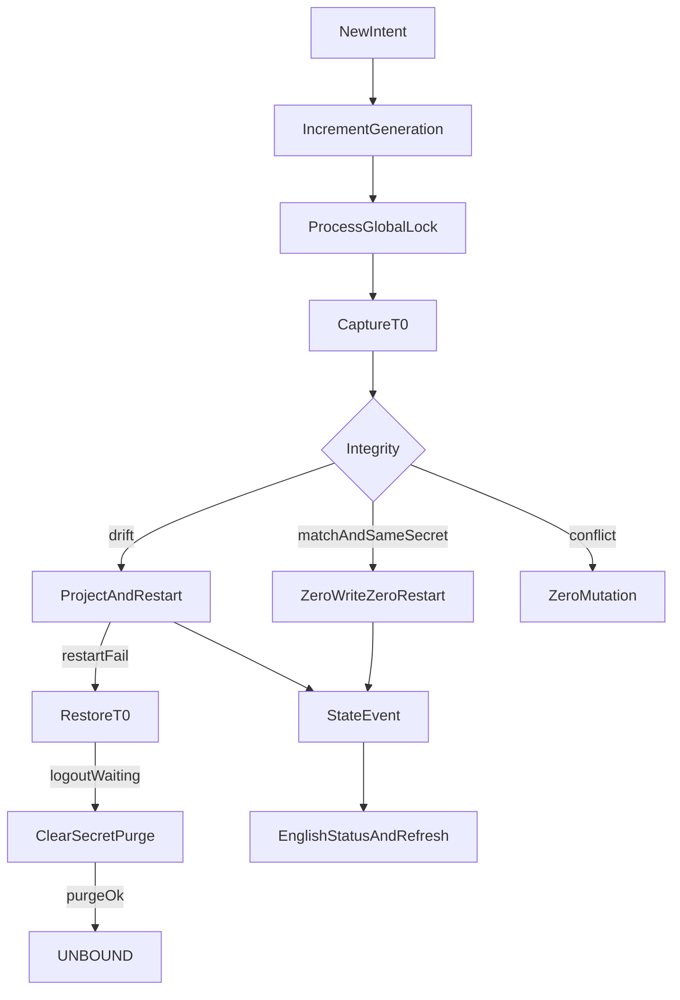

# Runtime Provider Bootstrap v1.2 收敛实现计划

依据 [docs/work/PRD-WORK-RUNTIME-PROVIDER-BOOTSTRAP-v1.2-CLOSURE-RECONCILE.md](docs/work/PRD-WORK-RUNTIME-PROVIDER-BOOTSTRAP-v1.2-CLOSURE-RECONCILE.md)，`status = APPROVED_FOR_PLAN`。实现以 §0.5 的 `RPB-C-01`～`RPB-C-07` 为准，并覆盖正文中与之冲突的旧句。本计划 `plan_contract: smc.plan.v3.7`，claim `GES_NATIVE`。仓库内没有 `smc-plan-from-approved-prd-ponytail` 技能包，因此沿用 [`.cursor/plans/runtime_bootstrap_plan_3eb14da3.plan.md`](.cursor/plans/runtime_bootstrap_plan_3eb14da3.plan.md) 的字段。本计划状态是 `planned`，不是 `approved`。

基线：smc-copilot `e83aaba9afb62dda047aa922badf319a8b0a3cb7`。不改 NodeDeskClaw Backend、Hermes Agent Core、llm-proxy、remote/ssh 发送、辅助任务、`saveNamedProvider(secret=...)`。不增加后台轮询、第二个 Provider 或 `model_limits`。



## 现有入口

- 编排已在 [`apps/work/src/main/runtime-provider/runtime-provider-orchestrator.ts`](apps/work/src/main/runtime-provider/runtime-provider-orchestrator.ts)。进程里只有一个递增的 `ticket`。被取代的操作在释放写入权之前仍可能用旧快照回滚。本计划用进程级单写者队列替换该窗口。
- 文件快照已在 [`apps/work/src/main/runtime-provider/runtime-provider-projection.ts`](apps/work/src/main/runtime-provider/runtime-provider-projection.ts) 的 `captureManagedFiles`。它不含会话覆盖，也不含内存密钥元数据。
- 会话覆盖在当前 profile 的 `state.db`。[`getSessionMetadataBySessionId`](apps/work/src/main/session-metadata-store.ts) 对同一 `session_id` 使用 `LIMIT 1`。归属判断必须列出该 `session_id` 的全部 `profile_id`：集合为空则按企业默认改写；集合含目标 profile 则改写；集合非空且不含目标 profile 则保留。`""`、`undefined` 与 `"default"` 是同一个目标。
- 发送门在 `gateLocalRuntimeSend`。`UNBOUND` 目前放行。`RPB-C-07` 要求活动模型为 `nodeskclaw` 且内存没有成员密钥时返回 `RUNTIME_NOT_READY`。
- 设置锁在 `isRuntimeSettingsLocked`。新的 `runtime-provider-refresh` 不得调用它。
- Chat 文案只加英文源 locale：[`apps/work/src/shared/i18n/locales/en/chat.ts`](apps/work/src/shared/i18n/locales/en/chat.ts)。PRD 中文是语义。

## Todos

每个 Todo 的 `status` 从 `planned` 开始。只有对应验收跑出 Evidence 才能标 `verified`。

```yaml
id: rpb-c-t1-coordinator
requirement_refs: [REQ-CONC-001, RPB-C-02, RPB-C-05]
acceptance_refs: [A-CONC-001, A-CONC-002, A-CONC-003]
files_or_symbols:
  - apps/work/src/main/runtime-provider/runtime-provider-operation-coordinator.ts
  - apps/work/src/main/runtime-provider/runtime-provider-orchestrator.ts
implementation_goal: 进程级单写者。Intent 到达立即 generation++。进入队列前、取得锁后、restart 与 probe 返回后都检查 generation。被取代且已写入的操作先回到自己的 T0 再放锁，不得 set ACTIVE。登出等待中的旧回滚失败只记在旧操作上，登出继续。
preconditions: 现有 bootstrap、clear、refresh 都改走同一入口。
state_transition: 旧 generation 到 ABORTED_SUPERSEDED。当前 generation 才能到 ACTIVE。
side_effect_scope: 当前持锁操作的受管范围。同一时刻最多一个受管写入。
failure_cases: [旧操作晚到仍写 ACTIVE, 旧回滚覆盖新提交, 登出被回滚失败挡住]
verification: 后发 refresh 与后发 logout 的 ACTIVE 次数为 0。回滚失败后 purge 成功的最终状态是 UNBOUND，内存密钥为空。
status: planned
evidence: pending
```

```yaml
id: rpb-c-t2-transaction
requirement_refs: [REQ-TXN-001, RPB-C-05]
acceptance_refs: [A-TXN-001, A-TXN-002, A-TXN-003]
files_or_symbols:
  - apps/work/src/main/runtime-provider/runtime-provider-transaction.ts
  - apps/work/src/main/runtime-provider/runtime-provider-projection.ts
  - apps/work/src/main/session-model-override-store.ts
implementation_goal: 第一次 mutation 前捕获 T0。T0 含 config.yaml、providers.json、models.json、runtime-provider-adoption.json 的字节或缺失，目标库里可被本操作改写的会话覆盖行，内存密钥与 revision 的元数据，公共状态，以及重启前的 Gateway 观察元数据。明文密钥不进快照文件。restart 或 probe 失败、以及被取代后，都在持锁时恢复完整 T0。
preconditions: t1 已提供持锁区间。
state_transition: 失败停在回滚后的 T0。无登出意图且回滚失败时状态为 ERROR，错误为 RUNTIME_PROVIDER_ROLLBACK_FAILED。
side_effect_scope: 受管文件、目标库中可改写的覆盖行、内存密钥、该 profile 的 Gateway。
failure_cases: [只恢复文件而留下新覆盖行, 回滚把密钥写入磁盘]
verification: 覆盖行改写后制造 restart 失败，覆盖行 digest 回到 T0，受管文件回到 T0，快照里密钥出现次数为 0。
status: planned
evidence: pending
```

```yaml
id: rpb-c-t3-session-scope
requirement_refs: [REQ-SCOPE-001, RPB-C-01]
acceptance_refs: [A-SCOPE-001, A-SCOPE-002]
files_or_symbols:
  - apps/work/src/main/session-metadata-store.ts
  - apps/work/src/main/runtime-provider/runtime-provider-projection.ts
implementation_goal: 按 session_id 列出全部 metadata.profile_id，不用 LIMIT 1。其它 profile 的行保留。缺元数据的行，以及目标库里其余行（含 skill-run 行），按父 PRD D-08 改写成企业默认。不改 skill-run 执行路径。
preconditions: 显式目标 profile。会话库是该 profile 的 state.db。
state_transition: 其它 profile 行保持原路由。其余非法覆盖成为 named:nodeskclaw 与企业默认模型。
side_effect_scope: 目标 profile 的 state.db 中可改写的 desktop_session_model_overrides 行。
failure_cases: [LIMIT 1 把目标行当成其它 profile, 其它 profile 行被改写]
verification: research profile 行 digest 不变。无 metadata 的行变成企业默认。skill-run 模块不读取该覆盖表。
status: planned
evidence: pending
```

```yaml
id: rpb-c-t4-integrity
requirement_refs: [REQ-CHECK-001, RPB-C-03]
acceptance_refs: [A-CHECK-001, A-CHECK-002, A-CHECK-003]
files_or_symbols:
  - apps/work/src/main/runtime-provider/runtime-provider-integrity.ts
  - apps/work/src/main/runtime-provider/runtime-provider-orchestrator.ts
implementation_goal: checkManagedRuntimeProjection 只读。MATCH 需要 YAML、无密钥 Registry、受管 model 集合与行字段、model.provider、model.default、可改写会话覆盖、adoption 文件均一致。ACTIVE、revision 相同、内存密钥相同且 MATCH 时，文件写入与 Gateway 重启都为 0。同 revision 漂移走完整事务并重启。身份冲突 0 写入。
preconditions: t2 与 t3 的写入只由编排器在修复事务中调用。
state_transition: MATCH 留在 ACTIVE。DRIFTED 修复后才可宣称新的 ACTIVE。IDENTITY_CONFLICT 停在该错误。
side_effect_scope: 检查本身无写入。修复只写受管范围。
failure_cases: [只比 model id 就 no-op, 漂移只改文件不重启]
verification: 默认模型漂移的重启次数为 1。完整 MATCH 的重启次数为 0。冲突后受管文件 digest 不变。
status: planned
evidence: pending
```

```yaml
id: rpb-c-t5-state-event
requirement_refs: [REQ-EVENT-001]
acceptance_refs: [A-EVENT-001, A-EVENT-002, A-EVENT-003]
files_or_symbols:
  - apps/work/src/shared/runtime-provider-state.ts
  - apps/work/src/main/ipc/register.ts
  - apps/work/src/preload/index.ts
  - apps/work/src/preload/index.d.ts
  - apps/work/src/renderer/src/screens/Chat/hooks/useModelConfig.ts
implementation_goal: 语义变化后发出 runtime-provider-state-changed。载荷按 §9.1，不含密钥。相同语义载荷不重复发送。useModelConfig 只刷新当前 profile。其它 profile 的事件不改当前选择器。
preconditions: 公共状态已由编排器提交。
state_transition: 无额外持久化。FETCHING 最终到达的 ACTIVE 不依赖无关事件。
side_effect_scope: IPC 事件与当前选择器的重新读取。
failure_cases: [事件含 api_key, 监听器抛错改变 Main 状态, 其它 profile 事件清空当前列表]
verification: restore 后选择器收到一次 ACTIVE 事件并只列出 modelIds。重复相同 payload 的发送次数为 1。
status: planned
evidence: pending
```

```yaml
id: rpb-c-t6-ux-refresh-send
requirement_refs: [REQ-UI-001, REQ-REFRESH-001, RPB-C-04, RPB-C-06, RPB-C-07]
acceptance_refs: [A-UI-001, A-UI-002, A-UI-003, A-REFRESH-001, A-REFRESH-002, A-REFRESH-003]
files_or_symbols:
  - apps/work/src/shared/i18n/locales/en/chat.ts
  - apps/work/src/renderer/src/screens/Chat/hooks/useModelConfig.ts
  - apps/work/src/main/ipc/register.ts
  - apps/work/src/main/hermes.ts
implementation_goal: Chat 用英文显示八种运行态语义。刷新按钮只在 STALE_ACTIVE、NOT_READY、ERROR 出现，IPC 只调用 bootstrapRuntimeProvider("refresh")，不经过设置锁。未登录或非 local 不拉取，状态保持 UNBOUND。活动模型为 nodeskclaw 且没有内存密钥时，发送返回 RUNTIME_NOT_READY，模型请求次数为 0。
preconditions: t5 已提供状态事件。listModels 仍返回完整 catalog。
state_transition: 刷新复用 t1 的 generation。设置写入被锁时，刷新仍可执行。
side_effect_scope: 刷新的副作用等于一次 bootstrap。按钮本身不写文件。
failure_cases: [刷新被设置锁拒绝, FETCHING 也显示刷新按钮, 无密钥仍向 nodeskclaw 发请求, remote 刷新改了本地投影]
verification: 三种可见状态下按钮存在，其余状态不存在。设置写入 digest 不变。无密钥发送次数为 0。英文文案与中文语义一一对应。
status: planned
evidence: pending
```

```yaml
id: rpb-c-t7-observability
requirement_refs: [REQ-OBS-001]
acceptance_refs: [A-OBS-001, A-OBS-002]
files_or_symbols:
  - apps/work/src/main/runtime-provider/runtime-provider-observability.ts
implementation_goal: 每个 Intent 记录 operation_id、generation、reason、profile、stage、status、runtime_state、revision、errorCode。阶段覆盖 INTENT 到 COMPLETE。日志不含 api_key、Authorization，以及密钥的 prefix、length、fingerprint。
preconditions: t1 分配 generation。
state_transition: 无持久业务状态。
side_effect_scope: 日志。
failure_cases: [日志出现密钥或派生值, 被取代操作没有 ROLLBACK stage]
verification: 一条被取代再登出的日志能重建 generation 顺序，且序列化结果不含密钥。
status: planned
evidence: pending
```

```yaml
id: rpb-c-t8-verification
requirement_refs: [REQ-EVID-001]
acceptance_refs: [A-EVID-001, A-EVID-002, A-EVID-003]
files_or_symbols:
  - apps/work/src/main/runtime-provider/*.test.ts
implementation_goal: 记录 L1 契约、L2 事务与并发、L3 Renderer 与 IPC 的实际命令。L4 Golden Consumer 未执行则记 BLOCKED，不记 PASS。401 为 FAIL。上游不可达为 BLOCKED。合成 fixture 不代替 Golden。Evidence 不含 API Key。
preconditions: t1 到 t7 的断言已实现。
state_transition: planned 到 implemented 只表示代码写完。verified 需要实际 Evidence。
side_effect_scope: 测试与 evidence 记录。
failure_cases: [只有测试文件没有运行结果, 上游不可达被写成全量 PASS, Evidence 含 api_key]
verification: A-CONC 到 A-REFRESH 各有一条本地 evidence。Golden 的 NodeDeskClaw inference count 与 NEW-API 直连分开记录。
status: planned
evidence: pending
```
