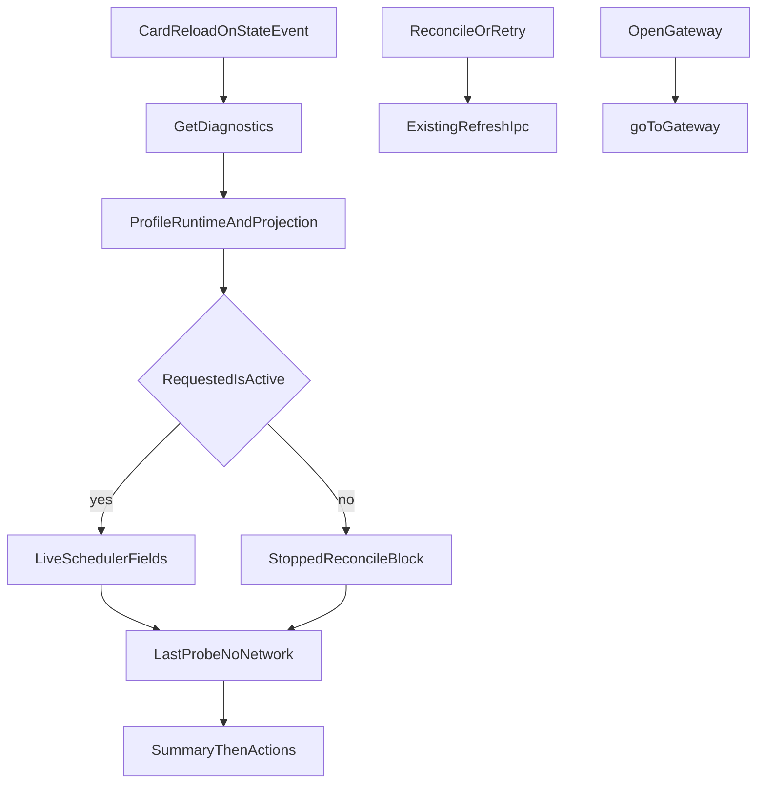

# Runtime Provider Operations Diagnostics v1.4 实现计划

依据 [docs/work/PRD-WORK-RUNTIME-PROVIDER-OPERATIONS-DIAGNOSTICS-v1.4.md](docs/work/PRD-WORK-RUNTIME-PROVIDER-OPERATIONS-DIAGNOSTICS-v1.4.md)。实现以 §0.6 的 `RPB-D-01`～`RPB-D-07` 为准，并覆盖正文中与之冲突的旧句。仓库内没有 `smc-plan-from-approved-prd-ponytail` 技能包，因此沿用 [`.cursor/plans/runtime_reconcile_plan_b0580f81.plan.md`](.cursor/plans/runtime_reconcile_plan_b0580f81.plan.md) 的 `smc.plan.v3.7` 字段，claim `GES_NATIVE`。

2026-09-28 用户已把 PRD 设为 `APPROVED_FOR_PLAN`，并放行 Golden 状态门槛。本计划状态是 `planned`。v1.2 NodeDeskClaw inference、v1.2 NEW-API 直连、v1.3 自动收敛，以及未执行的 v1.4 运营卡片 / Bundle / Data Plane Golden，都记 `BLOCKED`，不得记 `PASS`。

基线：smc-copilot `be0c302c0308fc0099734a9b8f1050463ea9c5b2`。不改 NodeDeskClaw Backend、Hermes Agent Core、NEW-API、llm-proxy、remote/ssh 发送。不增加第二 Provider、`model_limits`、WebSocket/SSE 或 Renderer 轮询。诊断读取不访问网络、不写投影、不写密钥、不重启 Gateway。英文文案只加在 `apps/work/src/shared/i18n/locales/en/providers.ts`。



## 现有入口

- 只读探针在 [`getLastProbe`](apps/work/src/main/runtime/runtime-manager.ts)。快照只读这次结果，不调用探测或启动。
- 调度器在 [`runtime-provider-reconcile-scheduler.ts`](apps/work/src/main/runtime-provider/runtime-provider-reconcile-scheduler.ts)。现有 `arm`、`clearTimer`、`onResume` 的 Busy Skip 和到期回调的先后顺序保持不变。新增字段只能跟着这些已有路径写。
- 活跃 profile 比较沿用现有规则：`""`、文件侧 `undefined` 和 `"default"` 相同。比较对象是 [`getActiveProfileNameSync`](apps/work/src/main/utils.ts)。
- 刷新入口保持 [`runtime-provider-refresh`](apps/work/src/main/ipc/register.ts)。卡片的 Reconcile now 与 Retry reconcile 都走它。
- Gateway 页面由 [`goTo`](apps/work/src/renderer/src/screens/Layout/Layout.tsx) 切换到 `"gateway"`。Providers 目前没有这个回调。
- 日志入口是 [`logRuntimeProviderOperation`](apps/work/src/main/runtime-provider/runtime-provider-observability.ts) 和 `logRuntimeProviderReconcile`。历史只追加 allowlist 投影，记录失败不得冒泡。

## Todos

每个 Todo 的 `status` 从 `planned` 开始。只有对应验收跑出 Evidence 才能标 `verified`。

```yaml
id: rpb-d-t1-schema
requirement_refs: [REQ-DIAG-001, REQ-SEC-001, RPB-D-01, RPB-D-04]
acceptance_refs: [A-DIAG-001, A-DIAG-003, A-SEC-001]
files_or_symbols:
  - apps/work/src/shared/runtime-provider-diagnostics.ts
implementation_goal: Snapshot、Event、Bundle 的严格 schema 与纯函数。summary 按 §8.1。非活跃 profile 的收敛块为 STOPPED、触发结果和时间为 null、consecutiveUnavailable 为 0。URL 去掉 userinfo、query、hash。当前用户 home 前缀换成 USER_HOME。managedSecretPresent 与 authenticatedSessionPresent 只是布尔值。
preconditions: RPB-D-01 与 RPB-D-04。
state_transition: 无持久状态。
side_effect_scope: 纯数据。
failure_cases: [非法 URL 被保留, 非活跃 profile 带上活跃 timer]
verification: 非法 URL 得到 null。非活跃 profile 的 nextDueAt 为 null。序列化结果不含密钥。
status: planned
evidence: pending
```

```yaml
id: rpb-d-t2-history
requirement_refs: [REQ-HIST-001, REQ-SEC-001]
acceptance_refs: [A-HIST-001, A-HIST-002, A-HIST-003]
files_or_symbols:
  - apps/work/src/main/runtime-provider/runtime-provider-diagnostics-history.ts
  - apps/work/src/main/runtime-provider/runtime-provider-observability.ts
implementation_goal: 进程内 200 条 ring，只保留 allowlist 字段。未知字段丢弃。满了淘汰最旧。重启清空。operation 与 reconcile 日志都进入历史。记录函数抛错时吞掉，不改变 Runtime 流程。
preconditions: t1 的事件投影。
state_transition: 0 到 200。
side_effect_scope: Main 内存。
failure_cases: [原样保存任意对象, 记录失败打断 bootstrap]
verification: 250 条后剩 200 且首条是输入第 51 条。含 api_key 的对象序列化后没有密钥。注入记录异常后 Runtime 终态不变。
status: planned
evidence: pending
```

```yaml
id: rpb-d-t3-scheduler-diagnostics
requirement_refs: [REQ-SCHED-001, RPB-D-03, RPB-D-06]
acceptance_refs: [A-SCHED-001, A-SCHED-002]
files_or_symbols:
  - apps/work/src/main/runtime-provider/runtime-provider-reconcile-scheduler.ts
  - apps/work/src/main/runtime-provider/runtime-provider-reconcile-bindings.ts
implementation_goal: 只读 diagnostics 暴露 schedulerState、lastTrigger、lastResult、lastAttemptAt、lastSuccessfulFetchAt、nextDueAt、consecutiveUnavailable。nextDueAt 等于仍武装的 timer。到期回调清掉 timer 后的 Busy Skip 使 nextDueAt 为 null。休眠恢复遇到过渡态时保留未来 timer。Busy Skip 只改 lastTrigger 和 lastResult 为 SKIPPED_BUSY。START 不改 lastResult。被接受的 READY 或明确 NOT_READY 更新 lastSuccessfulFetchAt。被取代的结果不改这些字段。stop 只清 timer 和 phase。不改变 v1.3 的间隔、退避和是否调用 bootstrap。
preconditions: 现有 one-shot scheduler。
state_transition: 诊断字段跟着已有 timer 与被接受结果。
side_effect_scope: 调度器内存读模型。
failure_cases: [Busy Skip 排了新 due, START 覆盖上一轮终态, 休眠忙跳过清掉未来 timer]
verification: 被接受的 T1 加 delay 得到 nextDueAt。stop 后 nextDueAt 为 null。休眠 Busy Skip 的 active timer 仍为 1，lastAttemptAt 不变。
status: planned
evidence: pending
```

```yaml
id: rpb-d-t4-post-apply
requirement_refs: [REQ-PROJ-001, RPB-D-07]
acceptance_refs: [A-PROJ-001, A-PROJ-002, A-PROJ-003]
files_or_symbols:
  - apps/work/src/main/runtime-provider/runtime-provider-orchestrator.ts
  - apps/work/src/main/runtime-provider/runtime-provider-contract.ts
implementation_goal: 每次 checkManagedRuntimeProjection 更新该 profile 的 Last Projection Check。Gateway 重启成功后、set ACTIVE 前再做一次只读检查。结果是 MATCH 才可 ACTIVE。不是 MATCH，或检查抛异常，都回滚这次自己的 T0，状态为 ERROR，错误码 RUNTIME_PROVIDER_POST_APPLY_DRIFT。进程重启后记录为 UNKNOWN。不新增第二套投影算法。
preconditions: 现有 T0 rollback。
state_transition: DRIFTED 修完成功后记录 MATCH。失败停在 ERROR。
side_effect_scope: 现有投影事务。
failure_cases: [复验失败仍 ACTIVE, 异常停在 APPLYING]
verification: 注入复验 drift 后 ACTIVE 次数为 0，错误码是 POST_APPLY_DRIFT。成功修复后的记录是 MATCH。
status: planned
evidence: pending
```

```yaml
id: rpb-d-t5-snapshot-ipc
requirement_refs: [REQ-DIAG-001, REQ-IPC-001, RPB-D-04]
acceptance_refs: [A-DIAG-002, A-IPC-001, A-IPC-002]
files_or_symbols:
  - apps/work/src/main/runtime-provider/runtime-provider-diagnostics.ts
  - apps/work/src/main/ipc/register.ts
  - apps/work/src/preload/index.ts
implementation_goal: runtime-provider-get-diagnostics 聚合 public state、Last Projection Check、活跃 profile 的调度诊断、getLastProbe。连续读取不访问 NodeDeskClaw、NEW-API 或重启 Gateway。聚合异常返回 RUNTIME_DIAGNOSTICS_UNAVAILABLE，runtime mutation 为 0。Renderer 只能传 profile。
preconditions: t1、t3、t4。
state_transition: 无写入。
side_effect_scope: 只读 IPC。
failure_cases: [读取时发起 bootstrap, IPC 返回 api key]
verification: 100 次读取的网络和文件写入为 0。返回 JSON 不含密钥。
status: planned
evidence: pending
```

```yaml
id: rpb-d-t6-export
requirement_refs: [REQ-EXP-001, REQ-SEC-001]
acceptance_refs: [A-EXP-001, A-EXP-002, A-EXP-003, A-EXP-004]
files_or_symbols:
  - apps/work/src/main/runtime-provider/runtime-provider-support-export.ts
  - apps/work/src/main/ipc/register.ts
implementation_goal: runtime-provider-export-diagnostics 由 Main 弹 Save Dialog。Renderer 不传路径。文件名是 smc-copilot-runtime-diagnostics-YYYYMMDD-HHmmss.json。目标已存在或是 symlink 时返回 DIAGNOSTICS_EXPORT_TARGET_EXISTS，写入次数为 0。exclusive create，UTF-8 JSON 加结尾换行。序列化超过 1 MiB 时只删最旧 history，snapshot 不截断。取消不落文件。写入失败尽量删除这次的新文件，不删除其它文件。
preconditions: t2 的 history 与 t5 的 snapshot。
state_transition: 无 Runtime 状态。
side_effect_scope: 用户选择的新 JSON 文件。
failure_cases: [覆盖已有文件, Bundle 含 config.yaml 或密钥]
verification: 已存在目标的 digest 不变。超限后 snapshot 仍完整且文件不超过 1 MiB。
status: planned
evidence: pending
```

```yaml
id: rpb-d-t7-card
requirement_refs: [REQ-UI-001, REQ-REC-001, REQ-OPS-001, RPB-D-01, RPB-D-02, RPB-D-05]
acceptance_refs: [A-UI-001, A-UI-002, A-UI-003, A-REC-001, A-REC-002, A-REC-003, A-OPS-001, A-OPS-002]
files_or_symbols:
  - apps/work/src/renderer/src/screens/Providers/EnterpriseRuntimeCard.tsx
  - apps/work/src/renderer/src/screens/Providers/Providers.tsx
  - apps/work/src/renderer/src/screens/Layout/Layout.tsx
  - apps/work/src/shared/i18n/locales/en/providers.ts
implementation_goal: local、已有 session、Runtime 不是 UNBOUND 时，Providers 顶部显示 SMC Enterprise Runtime 只读卡片。首次可见和 onRuntimeProviderStateChanged 时重读快照。不为倒计时发 IPC。Reconcile 与 Retry 都调用现有 refresh。Open Gateway 通过 Layout.goTo("gateway")，不重启。错误码动作按 RPB-D-02，明确不健康时再加 Open Gateway。FETCHING、APPLYING、CLEARING 无按钮。英文源文案使用 RPB-D-05 的两句。Auxiliary tab 不锁定。诊断失败时卡片显示不可用，Providers 页面继续渲染。
preconditions: t5 与 t6 的 preload。
state_transition: Renderer 只保存快照副本。
side_effect_scope: 现有 refresh、页面切换、用户导出。
failure_cases: [卡片内 restart, Unauthorized 仍显示 Retry, 非英文源码写死中文]
verification: ACTIVE 且 Gateway 不健康时仍有 Reconcile 和 Export。identity conflict 没有删除按钮。10 分钟无状态事件时 diagnostics IPC 次数为 0。
status: planned
evidence: pending
```

```yaml
id: rpb-d-t8-verification
requirement_refs: [REQ-GATE-001, REQ-EVID-001]
acceptance_refs: [A-GATE-001, A-EVID-001, A-EVID-002, A-EVID-003]
files_or_symbols:
  - apps/work/src/main/runtime-provider/runtime-provider.test.ts
implementation_goal: 记录 L1 到 L3 的实际命令。v1.2 NodeDeskClaw inference、v1.2 NEW-API 直连、v1.3 自动收敛，以及未执行的 v1.4 运营 Golden，分开记为 BLOCKED。401 为 FAIL。Evidence 不含 API Key。
preconditions: t1 到 t7 的断言已实现。
state_transition: planned 到 implemented 只表示代码写完。verified 需要实际 Evidence。
side_effect_scope: 测试与 evidence 记录。
failure_cases: [把状态放行写成 Golden PASS]
verification: A-DIAG 到 A-OPS 各有一条本地 evidence。四条未执行 Golden 都是 BLOCKED。
status: planned
evidence: pending
```
