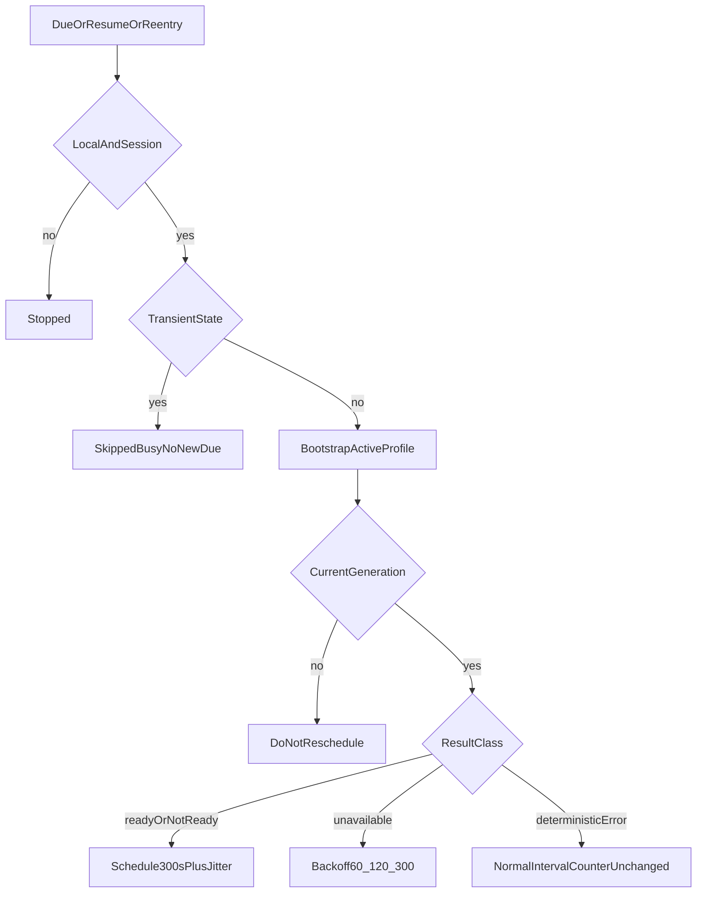

# Runtime Provider Continuous Reconcile v1.3 实现计划

依据 [docs/work/PRD-WORK-RUNTIME-PROVIDER-CONTINUOUS-RECONCILE-v1.3.md](docs/work/PRD-WORK-RUNTIME-PROVIDER-CONTINUOUS-RECONCILE-v1.3.md)。实现以 §0.6 的 `RPB-R-01`～`RPB-R-09` 为准，并覆盖正文中与之冲突的旧句。本计划 `plan_contract: smc.plan.v3.7`，claim `GES_NATIVE`。仓库内没有 `smc-plan-from-approved-prd-ponytail` 技能包，因此沿用 [`.cursor/plans/runtime_closure_plan_83bd9e83.plan.md`](.cursor/plans/runtime_closure_plan_83bd9e83.plan.md) 的字段。

2026-09-27 你已明确放行 `REQ-GATE-001`，允许在 v1.2 L4 Golden 仍为 BLOCKED 时起草本计划。PRD `status` 保持 `REVIEW`。本计划状态是 `planned`，不是 `approved`。实施不得把 v1.2 或 v1.3 Golden 写成 PASS。

基线：smc-copilot `22e61a07349758722d71b8665fd2a7cb14bfa093`。不改 NodeDeskClaw Backend、Hermes Agent Core、NEW-API、llm-proxy、remote/ssh 发送、辅助任务、Member Key 落盘。不增加第二 Provider、`model_limits`、WebSocket/SSE 推送或 Renderer 轮询。调度器不直接写投影、密钥或 Gateway。



## 现有入口

- 编排在 [`apps/work/src/main/runtime-provider/runtime-provider-orchestrator.ts`](apps/work/src/main/runtime-provider/runtime-provider-orchestrator.ts)。`bootstrapRuntimeProvider` 自己调用 `beginRuntimeIntent`。被取代时仍返回当时的公共状态，调用方无法分辨这次结果是否被接受。调度器要先拿到 `accepted`，再按 `RPB-R-09` 写 `lastAttemptAt`、`consecutiveUnavailable` 和 `nextDueAt`。
- 活跃 profile 由 [`getActiveProfileNameSync`](apps/work/src/main/utils.ts) 读取，缺失时为 `"default"`。切 profile 已在 [`apps/work/src/main/ipc/register.ts`](apps/work/src/main/ipc/register.ts) 调用 `bootstrapRuntimeProvider("profile_switch", name)`。
- 切回 local 同时调用 `startHermesBootstrapAsync()` 和 `bootstrapRuntimeProvider("switch-local")`。本计划只删除后者。
- 登录、恢复和登出在 [`apps/work/src/main/auth/auth-ipc.ts`](apps/work/src/main/auth/auth-ipc.ts)。登出现在先 `clearRuntimeProvider("logout")`。本计划改为先停调度器。
- 退出在 [`apps/work/src/main/app/start.ts`](apps/work/src/main/app/start.ts) 的 `before-quit`。这里还没有 `powerMonitor` resume。

## Todos

每个 Todo 的 `status` 从 `planned` 开始。只有对应验收跑出 Evidence 才能标 `verified`。

```yaml
id: rpb-r-t1-accepted-result
requirement_refs: [REQ-RECON-001, RPB-R-09]
acceptance_refs: [A-COAL-003, A-RECON-001]
files_or_symbols:
  - apps/work/src/main/runtime-provider/runtime-provider-orchestrator.ts
implementation_goal: bootstrapRuntimeProvider 返回 state 以及本次 generation 在返回时是否仍是当前值。被取代的返回 accepted=false。调度器和不新增的第二写入器都只在 accepted 时分类结果。公共状态、投影和密钥语义保持 v1.2。
preconditions: 现有 coordinator 的 runtimeIntentCurrent。
state_transition: 被取代的调用不改公共状态的下一轮所有权。
side_effect_scope: 返回值。不新增文件写入。
failure_cases: [把后来者的 ERROR 当成这次不可达, 被取代结果仍把计数加一]
verification: 手动刷新取代进行中的后台读取后，后台返回 accepted=false，连续不可达计数不变。
status: planned
evidence: pending
```

```yaml
id: rpb-r-t2-scheduler
requirement_refs: [REQ-SCHED-001, REQ-TIME-001, RPB-R-01, RPB-R-02, RPB-R-05, RPB-R-06]
acceptance_refs: [A-SCHED-001, A-SCHED-002, A-SCHED-003, A-TIME-001, A-TIME-002, A-TIME-003, A-COAL-001]
files_or_symbols:
  - apps/work/src/main/runtime-provider/runtime-provider-reconcile-scheduler.ts
  - apps/work/src/main/runtime-provider/runtime-provider-reconcile-scheduler.test.ts
implementation_goal: 进程内一个 one-shot timer。触发时读取 active profile。过渡态只记 SKIPPED_BUSY，不调用 beginRuntimeIntent，不武装新 due。被接受的 READY 或明确 NOT_READY 将计数归零并排 300000～360000ms。被接受的 RUNTIME_BOOTSTRAP_UNAVAILABLE 按 60/120/300 秒加 0～30 秒抖动进入 BACKOFF。确定性错误保持计数并排正常间隔。随机源失败时 jitter=0。时钟和随机数可注入。
preconditions: t1 的 accepted 结果。
state_transition: STOPPED、SCHEDULED、RUNNING、BACKOFF。同一时刻最多一个 timer。
side_effect_scope: Main 内存 timer 与诊断。经编排器的一次 Bootstrap。
failure_cases: [setInterval, 多个 timer, Busy Skip 排了 5 分钟, 不可达打满循环]
verification: 连续 start 的 active timer 为 1。三次 unavailable 的延迟落入三档。成功 fetch 后计数为 0。APPLYING 时 Bootstrap 次数为 0。
status: planned
evidence: pending
```

```yaml
id: rpb-r-t3-lifecycle
requirement_refs: [REQ-LIFE-001, RPB-R-03, RPB-R-04]
acceptance_refs: [A-LIFE-001, A-LIFE-002, A-LIFE-003, A-LIFE-004]
files_or_symbols:
  - apps/work/src/main/auth/auth-ipc.ts
  - apps/work/src/main/ipc/register.ts
implementation_goal: 本地登录和恢复的被接受结果启动调度器。不可达则 BACKOFF，其余进入 SCHEDULED。登出和 session 清除先 stop，再 clearRuntimeProvider。切离 local 时 stop。切回 local 删除 bootstrapRuntimeProvider("switch-local")，保留 startHermesBootstrapAsync，并由调度器发一次 local_reentry。profile_switch 与手动刷新的被接受结果重排下一轮。普通 JWT auth:refresh 不调用 Bootstrap。
preconditions: t2 的 start、stop、arm。
state_transition: 无 session 或非 local 或 quitting 时 STOPPED。
side_effect_scope: 调度器资格与一次切回 local 的读取。
failure_cases: [登出后 timer 再拉取, remote 继续轮询, 切回 local 发生两次 Bootstrap, 调度器启动失败导致登录失败]
verification: SCHEDULER_STOP 早于 logout intent。切回 local 的 reason 只有 local_reentry。登录在调度器抛错时仍返回会话。
status: planned
evidence: pending
```

```yaml
id: rpb-r-t4-resume-quit
requirement_refs: [REQ-RESUME-001, REQ-COAL-001, RPB-R-07, RPB-R-08]
acceptance_refs: [A-RESUME-001, A-RESUME-002, A-COAL-002]
files_or_symbols:
  - apps/work/src/main/app/start.ts
  - apps/work/src/main/runtime-provider/runtime-provider-reconcile-scheduler.ts
implementation_goal: powerMonitor resume 按 RPB-R-07 处理。没有 lastAttemptAt，或距上次被接受尝试不少于 60 秒，且不是过渡态时，只发一次 resume_reconcile。60 秒内保留原 timer。before-quit 先标记 quitting 并清 timer。进行中的 scheduled_reconcile、resume_reconcile、local_reentry 被 generation 取代并回滚自己的 T0。登录、手动刷新、profile_switch 不因 quit 被这条规则取代。
preconditions: t1 能识别后台 reason 的 generation。t2 的单 timer。
state_transition: resume 最多一个读取。quit 后不再武装 timer。
side_effect_scope: 该 profile 上被取代后台操作自己的 T0。
failure_cases: [休眠补跑多个 timer, quit 期间后台读取重启 Gateway, 新鲜 resume 另开读取]
verification: lastAttemptAt 缺失的 resume 次数为 1。60 秒内 resume 的立即读取次数为 0。后台读取遇 quit 后 ACTIVE 次数为 0。
status: planned
evidence: pending
```

```yaml
id: rpb-r-t5-observability
requirement_refs: [REQ-OBS-001, REQ-SEC-001]
acceptance_refs: [A-OBS-001, A-OBS-002, A-SEC-001, A-SEC-002, A-SEC-003]
files_or_symbols:
  - apps/work/src/main/runtime-provider/runtime-provider-observability.ts
implementation_goal: 每次后台尝试记录 runtime_provider_reconcile。字段只有 trigger、scheduler_state、result、runtime_state、backend_state、error_code、next_due_delay_ms、consecutive_unavailable。result 覆盖 START、SKIPPED_BUSY、NOOP_MATCH、RECONCILED、NOT_READY、STALE_ACTIVE、ERROR、STOPPED_INELIGIBLE。日志不含 api_key、Authorization、JWT、prefix、length、fingerprint。
preconditions: t2 有结果分类。
state_transition: 无持久业务状态。
side_effect_scope: 日志。
failure_cases: [诊断含密钥, SKIPPED_BUSY 与 BACKOFF 无法区分]
verification: 忙和不可达两条日志可以区分，序列化结果不含密钥。
status: planned
evidence: pending
```

```yaml
id: rpb-r-t6-verification
requirement_refs: [REQ-GATE-001, REQ-EVID-001]
acceptance_refs: [A-GATE-001, A-EVID-001, A-EVID-002, A-EVID-003]
files_or_symbols:
  - apps/work/src/main/runtime-provider/runtime-provider-reconcile-scheduler.test.ts
implementation_goal: 记录 L1 调度契约和 L2 生命周期的实际命令。v1.2 L4 与 v1.3 Golden 未执行则都记 BLOCKED，不记 PASS。401 为 FAIL。上游不可达为 BLOCKED。Evidence 不含 API Key。
preconditions: t1 到 t5 的断言已实现。
state_transition: planned 到 implemented 只表示代码写完。verified 需要实际 Evidence。
side_effect_scope: 测试与 evidence 记录。
failure_cases: [只有测试文件没有运行结果, 把放行门禁写成 Golden PASS]
verification: A-SCHED 到 A-SEC 各有一条本地 evidence。v1.2 NodeDeskClaw inference、v1.2 NEW-API 直连、v1.3 自动收敛三条分开记录为 BLOCKED。
status: planned
evidence: pending
```
