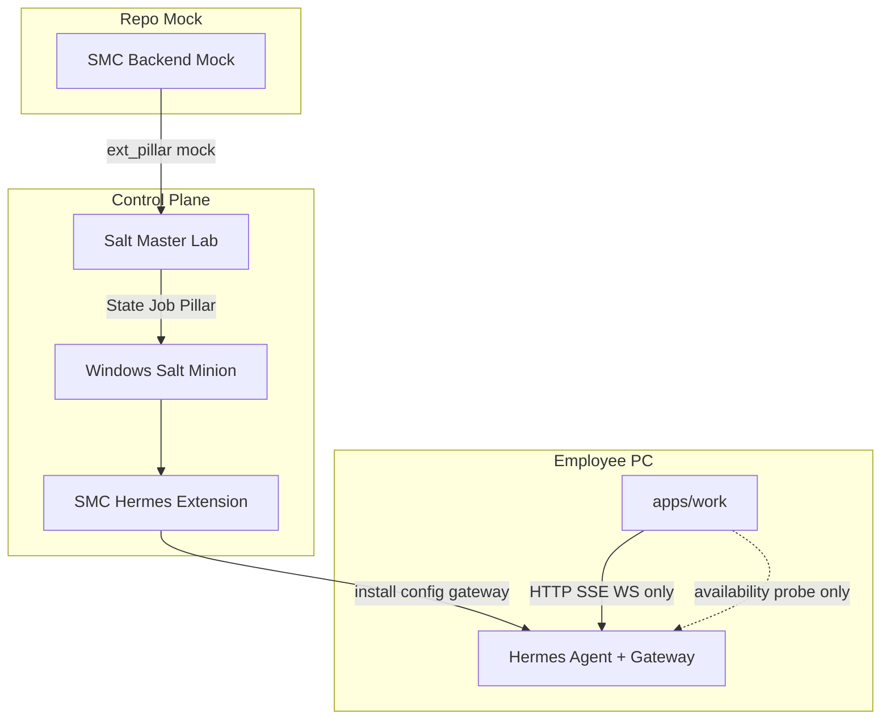

# Salt v2.0 Endpoint Control Plane 实施计划

## 范围与约束（已确认）

- **范围**：Full v2.0（Phase 0→9 结构落地），Backend 为 **repo-only**：接口 + mock pillar/binding，不接真实 SMC Management Backend。
- **边界**：Salt 只接管 Endpoint Control Plane；Chat/Session/Attachment/Task 不经 Salt。
- **硬禁令**（PRD §25）：不删 Runtime；不改 Chat Transport 为 Salt Proxy；禁止双 Ownership；Hermes 不复用 Salt Python；代码落 `infra/salt`。

## 目标架构



## 现状结论（调研）

| 面 | 现状 | v2.0 动作 |
|---|---|---|
| Endpoint Control | Runtime `:8765` 经 [`runtime-management-backend.ts`](apps/work/src/main/runtime/runtime-management-backend.ts) 管 install/gateway | 冻结 → Salt 替代 |
| Chat Data Plane | [`hermes.ts`](apps/work/src/main/hermes.ts) 已直连 Gateway | **保留**，仅拆分 + Availability |
| Connection Ready | Splash 依赖 `readiness.service.ready`（[`RuntimeProvider.tsx`](apps/work/src/renderer/src/runtime/RuntimeProvider.tsx)） | Salt 模式改 `HermesAvailabilityBackend` |
| Ownership 风险 | default→Runtime；non-default→Legacy spawn | `control-owner.json` + 禁双写 |
| 契约 | OpenAPI 混控制面/数据面（bundle 1.4.0） | 控制面冻结/deprecated；数据面迁 Hermes，不扩 Runtime |
| `infra/salt` | **不存在** | 新建独立 Python 包（勿绑 `services/runtime` pyproject） |

---

## Phase 0 — Runtime Freeze + Inventory

**交付**

1. ADR / AGENTS 路由更新：Endpoint Control Plane SOT → Salt；Runtime 控制面仅 P0/P1。
2. [`scripts/salt-migration-inventory.py`](scripts/salt-migration-inventory.py) → `migration-inventory.{json,md}`（FULL/PARTIAL/NO + 加权替代率）。
3. 契约治理：控制面 tags（`runtime`/`endpoint`/`sync`/`bootstrap`/`gateways`/…）标记 freeze；TS 控制面方法 `@deprecated`（不删）。

**验收**：Inventory 可跑；控制面 PR 默认拒绝功能性扩展。

---

## Phase 1 — Salt Lab 骨架（repo-only）

**新建树**

```text
infra/salt/
  lab/                    # docker-compose Master + fixture Minion configs
  extensions/
    _modules/smc_hermes.py
    _states/smc_hermes.py
    _grains/smc_endpoint.py
    _returners/smc_backend.py
    _pillar/smc_external.py
    _beacons/smc_hermes_health.py
    _utils/               # 可复用逻辑（路径/校验）；禁止 import services.runtime
  states/                 # top.sls + hermes.sls + gateway.sls
  pillar/                 # mock desired state fixtures
  pyproject.toml          # 独立 uv/pytest/ruff（对齐 Runtime 工具链习惯，独立 env）
  tests/
```

**验收（Lab）**：Key / Remote Exec / Grains / Pillar / State / Job Return / `saltutil.sync_*` 在文档化步骤下可复现（Windows Minion 可先用 fixture + 单元测，真机 Lab 标为可选）。

---

## Phase 2–4 — SMC Hermes Extension（核心）

| Phase | Module/State | 对标 Runtime |
|---|---|---|
| 2 | `smc_hermes.{version,inspect,install,upgrade,rollback,health,doctor,restart}` | `installation_service` / `update_service` / probe |
| 3 | Windows `task.present` 用户登录自启 Gateway；`control-owner.json`=`salt` | `gateway_supervisor` |
| 4 | External Pillar mock → ConfigRevision/Snapshot/Validate/Apply/Rollback | `configuration_service` |

**实现原则**

- 逻辑**复制/提炼** Runtime 中可测算法（路径布局、校验、原子写），放 `_utils`；**禁止**运行时依赖 `services/runtime`。
- Hermes 独立 venv/bundle；Salt Python ≠ Hermes Python。
- Gateway 用 Salt `win_task`（`task.present`，Logon trigger）；不经 apps/work spawn。
- Secret：Pillar 引用 ID/密文；Returner/日志脱敏。

**验收**：HERMES-001~004、GATEWAY-001~002、CONFIG-001~003（mock pillar）。

---

## Phase 5 — Backend Binding（Mock）

```text
infra/salt/mock_backend/
  desired_state.py      # Endpoint + User + Department + Role + Expert + ConfigVersion
  fixtures/
```

- `_pillar/smc_external.py` 调 mock HTTP/本地 fixture。
- `EndpointUserBinding`：user switch → pillar refresh → 禁止沿用前用户 Secret。
- Desktop **禁止**写 Pillar。

**验收**：USER-001/002、SECRET-001（单测）。

---

## Phase 6 — apps/work Direct Mode（关键客户端改动）

### 6.1 拆分 [`hermes.ts`](apps/work/src/main/hermes.ts)（PRD §18）

```text
apps/work/src/main/hermes/
  transport/{gateway-http,gateway-ws,dashboard}.ts
  availability-backend.ts
  legacy-process/gateway-process.ts   # 仅 control_owner!=salt
```

### 6.2 `HermesAvailabilityBackend`

- 只做：本地 Hermes 定位（复用 [`hermes-runtime-locator.ts`](apps/work/src/main/runtime/hermes-runtime-locator.ts)）+ Gateway `/health`（[`getApiUrl`](apps/work/src/main/hermes.ts)）。
- **不做**：install / spawn / Runtime `ensureReady`。

### 6.3 模式开关

```text
SMC_HERMES_CONTROL_OWNER=salt|runtime
%ProgramData%\SMC\control-owner.json  →  { "hermes": "salt"|"runtime" }
```

`salt` 时：

- Splash / [`RuntimeProvider`](apps/work/src/renderer/src/runtime/RuntimeProvider.tsx) 走 Availability，不调 `runtimeEnsureLocalReady`。
- IPC：`start/stop/restart-gateway`、`run-hermes-update/doctor` → 拒绝或只读提示（企业模式 UI 无 Install/Restart Runtime）。
- [`register.ts`](apps/work/src/main/ipc/register.ts) 禁止 `getRuntimeManagementBackend()` 写路径；`send-message` 前只 probe Availability。
- Chat transport **不变**。

### 6.4 Guard 补齐（对标 desktop）

在现有 3 个 guard 上增加：

- `check:no-renderer-runtime-http`（禁 Renderer `:8765`）
- `check:salt-mode-no-gateway-spawn`（`control_owner=salt` 时禁 Legacy spawn）
- 更新 [`check-work-renderer-contract.mjs`](apps/work/scripts/check-work-renderer-contract.mjs) / preload 测试：salt 模式 API 面（availability 替代 ensureReady 语义）

### 6.5 UI

- [`ConnectionErrorScreen`](apps/work/src/renderer/src/screens/ConnectionError/ConnectionErrorScreen.tsx)：企业文案「等待 Salt 安装/恢复」；去掉 Runtime Repair。
- `RuntimePane`：展示 control owner + Gateway 可达性，非 Runtime Service 状态。

**验收**：WORK-001~005（Runtime 进程关闭仍可 Chat）；OFFLINE-001。

---

## Phase 7–9 — Canary / 度量 / Go-No-Go

- Phase 7：5~10 台文档化 Canary runbook（repo 内 checklist）；Runtime 保留只读。
- Phase 8：Inventory 重跑；替代率与稳定性指标模板。
- Phase 9：Go 门槛（API/Service ≥85%，LOC ≥75%，P0/P1=0）；不达标则保留 Runtime。**v2.0 不删 Runtime**。

---

## 推荐 Commit 顺序（对齐 PRD §26）

01 Lab 结构 → 02 grains → 03 execution module → 04 hermes state → 05 gateway task → 06 external pillar mock → 07 config revision → 08 returner → 09 work availability → 10 salt mode 去 Runtime 启动依赖 → 11 enterprise UI → 12 salt tests → 13 runtime freeze → 14 inventory report

---

## 首批落地优先级（执行时）

1. `infra/salt` 骨架 + inventory 脚本 + freeze 文档  
2. Execution module 最小闭环：`inspect/health/install`（fixture）  
3. apps/work：`availability-backend` + `SMC_HERMES_CONTROL_OWNER=salt` 启动分叉  
4. Gateway scheduled-task state + control-owner 互斥  
5. Pillar mock + config apply/rollback  
6. Guard + Direct Mode 回归测试  

## 明确不做（本计划）

- 真实 SMC Backend / 生产 Salt 集群接入  
- 删除 `services/runtime` 或迁 Chat/Task 出 Runtime  
- 把 Chat SSE 改成 Salt 代理  
- 一次性大爆炸替换（必须可回退 `control-owner=runtime`）
