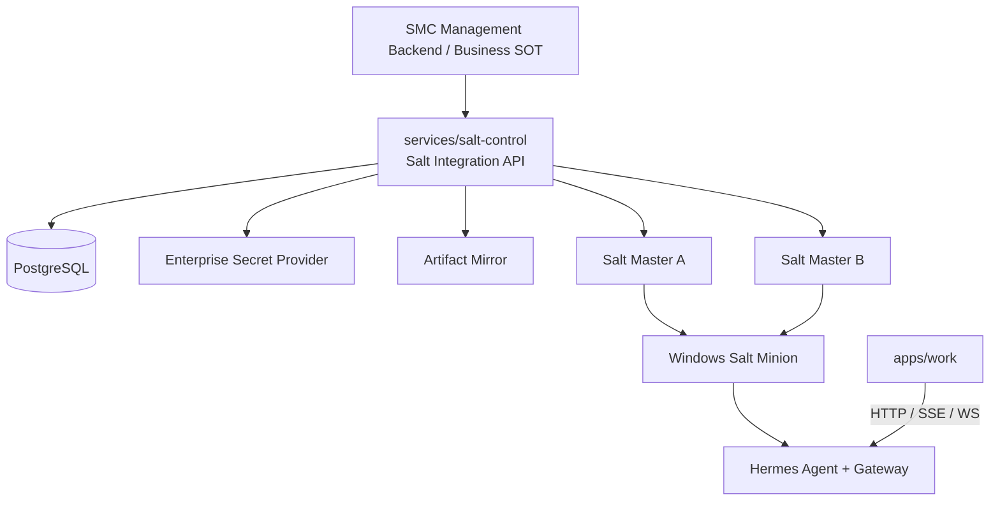

# SMC Copilot Salt Migration v2.2 实施计划

## 1. 实施结论

v2.1 已完成代码级替代，但尚未证明生产可用。v2.2 必须先完成真实服务接入和 Windows 灰度，再退役 Runtime Endpoint Control Plane。

当前基线：

```text
commit                 d9934598832d
Endpoint API           92.1%
Endpoint Service       90.3%
Endpoint LOC           94.1%
Salt pytest            61 passed
Salt ruff              passed
Inventory decision     GO (static/repo evidence only)
Hardware Canary        NOT PROVEN
Production rollout     NO-GO
```

当前生产阻塞：

1. `bootstrap.ps1` 使用 Enrollment Token hash 推导 Endpoint ID，未调用真实 Backend。
2. `enroll-minion.ps1` 只写本地报告，未完成 pending key 指纹比对与 accept。
3. `smc_secret.py` 使用 fixture 和实验缓存，未使用真实 Secret API/DPAPI。
4. `smc_backend.py` Returner 仍写本地 JSONL，未使用 HTTPS、重试和幂等。
5. Artifact 使用共享 HMAC key，manifest 的 SHA/镜像地址仍是占位值。
6. Windows Canary 仍包含 stub/skip，未形成 5 台真实终端证据。

## 2. 固定架构与边界



职责固定如下：

- `services/salt-control`：Salt 集成服务，负责 Enrollment、Desired State、Key accept、Job Return、Artifact Metadata、Secret Broker、Rollout；不承载 Chat/Task。
- SMC Management Backend：Endpoint、User、Department、Role、Expert、配置和授权的业务 SOT；Salt Control 通过 Adapter 读取，不复制业务规则。
- Salt Master/Minion：Endpoint Control Plane；Salt 不代理 Chat/SSE/WebSocket。
- `apps/work`：继续直接连接 Hermes Gateway；Salt 模式只做 Availability Probe。
- `services/runtime`：v2.2 只退役 Endpoint Control Plane；Chat、Task、Approval、Kanban、Memory 等业务 Domain 不得误删。

硬约束：

```text
禁止删除整个 services/runtime
禁止 Salt 代理 Chat Data Plane
禁止 Salt 与 Runtime 同时管理 Gateway
禁止 Gateway 使用 System fallback
禁止 Salt Python 作为 Hermes Python
禁止生产 External Pillar fallback 到 mock
禁止 Pillar/Grain/Return/日志输出 Secret 明文
禁止以 dry-run、fixture 或 skipped test 作为 Canary PASS
禁止在未满足环级门禁时扩大灰度
```

## 3. 新增目录与项目

```text
services/salt-control/
  AGENTS.md
  project.json
  pyproject.toml
  alembic.ini
  migrations/
  src/
    main.py
    app.py
    api/v1/
      enrollments.py
      desired_state.py
      job_returns.py
      secrets.py
      artifacts.py
      rollouts.py
      health.py
    core/
      config.py
      auth.py
      idempotency.py
      logging.py
    db/
      models.py
      repositories/
    integrations/
      management_backend.py
      salt_master.py
      secret_provider.py
      artifact_store.py
    services/
      enrollment_service.py
      desired_state_service.py
      return_service.py
      secret_service.py
      artifact_service.py
      rollout_service.py
    schemas/
    workers/
  tests/

contracts/salt-control-api/
  openapi.yaml

infra/salt/
  master/
  rollout/
  tests/integration/
  tests/canary/

.github/workflows/
  salt-control-ci.yml
  salt-canary.yml
```

技术栈固定为 Python 3.12、FastAPI、Pydantic v2、SQLAlchemy 2、Alembic、PostgreSQL、httpx、cryptography、pytest、ruff。`services/salt-control` 是独立包，禁止运行时 import `services/runtime`。

## 4. 公共 API 契约

统一前缀：`/salt/v1`。FastAPI/Pydantic 是契约 SOT，生成 `contracts/salt-control-api/openapi.yaml`，CI 检查 drift。

### 4.1 Endpoint Enrollment

#### `POST /salt/v1/enrollments`

用途：一次性 Enrollment Token 换取稳定设备身份和 Salt Master 配置。

请求：

```json
{
  "enrollmentToken": "one-time-token",
  "requestId": "uuid",
  "device": {
    "hostname": "PC-001",
    "machineGuidHash": "sha256",
    "windowsBuild": 26100,
    "arch": "AMD64"
  }
}
```

响应：

```json
{
  "enrollmentId": "enr_xxx",
  "endpointId": "ep_xxx",
  "masters": ["salt-a.internal", "salt-b.internal"],
  "masterFingerprints": ["sha256:..."],
  "deviceCredential": "opaque-256-bit-secret",
  "expiresAt": "ISO-8601"
}
```

规则：

- Token 一次性、短期、绑定租户和部署批次；服务端只保存 hash。
- Endpoint ID 只能由服务端生成，禁止 hostname、username、token hash 推导。
- `requestId` 幂等；重复请求返回同一 Enrollment，不生成第二个 Endpoint。
- `deviceCredential` 仅首次返回，客户端使用 Windows DPAPI Machine Scope 保存；服务端只存 hash。

#### `POST /salt/v1/enrollments/{enrollmentId}/fingerprint`

请求：`endpointId`、Minion 公钥指纹、`requestId`。

服务行为：

1. 使用 Salt Master Adapter 查询 pending key。
2. 对比 Endpoint ID 和 SHA-256 指纹。
3. 两台 Master 均完成 accept。
4. 执行 `test.ping`、`saltutil.sync_all`、`state.highstate`。
5. 任一步失败时保持原 Control Owner，不切换为 Salt。

响应状态：`pending | accepted | synced | highstate | rejected | failed`。

#### `GET /salt/v1/enrollments/{enrollmentId}`

客户端轮询 Enrollment 状态；不得返回 Secret、Master 私钥或完整 Salt Job Return。

### 4.2 Desired State

#### `GET /salt/v1/endpoints/{endpointId}/desired-state`

认证：Salt Master Service Credential；Endpoint 不直接读取完整 Pillar API。

查询参数：`knownRevision`。

响应：

```json
{
  "schema": "smc.desired-state.v2",
  "endpointId": "ep_xxx",
  "revision": "rev_xxx",
  "notModified": false,
  "user": {
    "userId": "u_xxx",
    "windowsAccount": "DOMAIN\\user",
    "windowsSid": "S-1-5-...",
    "profileDir": "C:\\Users\\user"
  },
  "hermes": {
    "home": "C:\\Users\\user\\AppData\\Local\\hermes",
    "version": "0.20.0",
    "artifactRef": "hermes/windows/AMD64/0.20.0"
  },
  "profiles": [],
  "mcp": {},
  "secrets": [{"name": "DASHSCOPE_API_KEY", "ref": "smc://providers/dashscope"}],
  "rollout": {"ring": "ring0", "desiredOwner": "salt"}
}
```

规则：

- User 来自 Backend `EndpointUserBinding`，禁止从 Grain/USERNAME 推导。
- Backend 不可用时 External Pillar 返回 unavailable，不得生成空配置覆盖 last-known-good。
- Revision 不变时返回 `notModified=true`；所有配置 Apply 记录 revision 和审计事件。

### 4.3 Job Return

#### `POST /salt/v1/job-returns:batch`

请求：最多 100 条已脱敏 Return；唯一键为 `jid + endpointId + function`。

规则：

- 幂等 upsert；响应逐条给出 accepted/duplicate/rejected。
- Returner 发送失败时写 DPAPI Machine Scope 加密 spool，指数退避，最大保留 7 天/100 MB。
- 达到上限时丢弃最旧成功类记录，失败类记录优先保留并产生本地告警。
- 服务端日志、错误响应不得回显完整 Pillar、env、token、Secret。

### 4.4 Secret Resolve

#### `POST /salt/v1/secrets:resolve`

请求：`endpointId`、`userId`、Secret Ref 列表、`requestId`。

规则：

- Endpoint Device Credential 鉴权；服务端校验 EndpointUserBinding 和 Secret ACL。
- Secret Value 只在 TLS 响应体中短期返回，`Cache-Control: no-store`。
- 客户端使用 DPAPI User Scope 缓存，并绑定 Windows SID；用户切换后旧缓存不可解密/复用。
- `smc_secret` 禁止公开 `reveal=true` 风格接口；改为 `materialize(refs, target)`，Return 只包含 ref/status。
- Secret Provider 使用 HTTP Adapter 接企业 Vault；测试使用注入 Fake，生产禁止 fixture fallback。

### 4.5 Artifact Metadata

#### `GET /salt/v1/artifacts/{component}/{version}`

响应：`component/version/platform/arch/size/sha256/url/manifestSignature/keyId/rollbackVersion`。

签名规则：

- Release CI 生成 canonical JSON manifest，使用 Ed25519 私钥签名。
- 私钥只存在 Release Secret Store；Salt Control、Master、Minion 和仓库均不得持有私钥。
- 客户端 manifest 固定 `keyId + Ed25519 public key`，先验 manifest 签名，再验 Artifact SHA-256。
- 禁止 HMAC shared signing key；签名或 checksum 错误必须 fail closed，禁止激活版本。

### 4.6 Rollout

#### `POST /salt/v1/rollouts`

创建组件/版本/目标环/设备过滤条件/失败阈值/观察期。

#### `GET /salt/v1/rollouts/{rolloutId}`

返回目标数、完成数、成功率、失败率、回滚率、P0/P1、当前状态。

#### `POST /salt/v1/rollouts/{rolloutId}:advance|pause|rollback`

要求操作员身份、原因和 requestId；所有操作写不可变审计日志。自动触发暂停条件：P0/P1、Secret 泄漏、签名绕过、Owner 冲突、成功率低于 SLO。

## 5. 数据模型

PostgreSQL 最小表：

```text
endpoints
  id, tenant_id, machine_guid_hash, hostname, platform, arch, status,
  device_credential_hash, created_at, last_seen_at

endpoint_user_bindings
  endpoint_id, user_id, windows_account, windows_sid, profile_dir,
  active, revision, bound_at, revoked_at

enrollments
  id, endpoint_id, token_hash, state, local_fingerprint,
  master_fingerprints, expires_at, completed_at, error_code

desired_state_revisions
  id, endpoint_id, user_id, revision, payload_json, checksum,
  source_revision, created_at

job_returns
  jid, endpoint_id, function, success, payload_redacted,
  received_at, unique(jid, endpoint_id, function)

artifact_manifests
  component, version, platform, arch, size, sha256, url,
  manifest_signature, key_id, rollback_version, released_at

rollouts
  id, component, version, ring, state, thresholds_json,
  observation_started_at, created_by

rollout_targets
  rollout_id, endpoint_id, state, attempt_count, last_error, updated_at

audit_events
  id, actor_type, actor_id, action, target_type, target_id,
  request_id, metadata_redacted, occurred_at
```

Migration 必须可升级和降级；测试使用临时 PostgreSQL，不使用 SQLite 替代生产语义。

## 6. 认证与安全决策

- Bootstrap：一次性 Enrollment Token。
- Endpoint：Opaque Device Credential，DPAPI Machine Scope 保存；Header `Authorization: Device <credential>`。
- Salt Master/Backend/Worker：OAuth2 Client Credentials 获取 5 分钟 JWT；权限按 audience/scope 分离。
- Operator Rollout API：企业 OIDC JWT，要求 `salt.rollout.admin` 权限。
- 所有生产 API 仅 HTTPS；服务间证书由企业 CA 管理。
- 日志统一结构化输出 `requestId/endpointId/jid/errorCode`，所有 token/secret/env/config value 经过 redact。
- Enrollment、Secret、Key accept、Owner switch、Rollout 操作必须写审计日志。
- 限流：Enrollment Token 10 次/分钟/IP；Secret 30 次/分钟/Endpoint；Return Batch 60 次/分钟/Endpoint。

## 7. Phase 0 — 生产基线与门禁

实施：

1. 保存 v2.1 基线证据到 `docs/salt/evidence/v2.1/`：测试、inventory、Windows Case 结果模板。
2. 新增 ADR：Salt Control Service、认证、Artifact 签名、Runtime Endpoint 退役边界。
3. 新增 Salt Control API 版本文件和 contract generate/check 流程。
4. Guard 禁止以下内容进入生产：
   - `sha256=aaaa...`
   - `artifacts.internal.smc` 占位域名
   - production fixture/mock fallback
   - HMAC Artifact 签名
   - Returner local lab sink
   - Secret XOR/默认 key
   - Canary skipped/stub 作为 PASS
5. v2.1 的 mock/lab 文件保留，但必须只能由明确的 `SMC_SALT_ENV=lab|test` 加载。

验收：

```text
uv run --project infra/salt pytest infra/salt/tests
uv run --project infra/salt ruff check infra/salt
uv run --project infra/salt python scripts/salt-migration-inventory.py --check
npm run contracts:check
```

Commit：`01 chore(salt-v22): establish production baseline and guards`

## 8. Phase 1 — Salt Control Service

按以下顺序实施：

1. 建立独立 Nx/Python Service、PostgreSQL 配置、Alembic、health/readiness。
2. 先写 Pydantic schema 和 API characterization tests，再实现数据库和 service。
3. 实现 Management Backend Adapter；生产为 HTTP Adapter，测试为 Fake，禁止运行时 import Runtime。
4. 实现 Salt Master Adapter：生产通过 Salt Wheel/Local Client 查询 pending key、accept、ping、sync_all、highstate；测试注入 Fake。
5. 实现七类 API 和不可变 audit event。
6. 生成 OpenAPI，加入 contracts drift CI。
7. 新增 `salt-control-ci.yml`：ruff、format-check、pytest、Alembic upgrade/downgrade、OpenAPI drift、安全 guard。

错误码固定：

```text
enrollment_token_invalid
enrollment_token_expired
enrollment_token_replayed
endpoint_identity_conflict
minion_key_missing
minion_fingerprint_mismatch
master_accept_failed
sync_all_failed
highstate_failed
binding_missing
desired_state_unavailable
secret_forbidden
artifact_not_found
artifact_signature_invalid
rollout_gate_failed
```

验收：

- 所有 API 正常、鉴权、幂等、过期、重放、权限不足、Backend/DB/Salt Master 故障测试通过。
- OpenAPI 生成两次无 diff。
- Alembic 空库升级、上一版本升级、downgrade/upgrade 循环通过。
- 错误响应和日志扫描不含 Secret/Token。

Commit：

```text
02 feat(salt-control): scaffold service and database
03 feat(salt-control): add secure endpoint enrollment
04 feat(salt-control): add desired state and binding adapter
05 feat(salt-control): add job return and secret broker
06 feat(salt-control): add artifact and rollout APIs
07 contract(salt-control): generate and guard OpenAPI
```

## 9. Phase 2 — Production Salt Master

拓扑固定：两台 Linux Salt Master，Active/Passive Failover。

Minion 配置：

```yaml
master:
  - salt-a.internal
  - salt-b.internal
master_type: failover
random_master: true
master_alive_interval: 60
verify_master_pubkey_sign: true
auto_accept: false
```

要求：

1. 两台 Master 由受控配置发布，Salt Master PKI、accepted Minion Keys、file_roots 和 Extension Release 保持一致。
2. Master 私钥由 Secret Management 下发，禁止进入 Git/Artifact。
3. `pillar_safe_render_error: true`；生产禁用本地 mock pillar。
4. SLS/Extension 使用版本化只读 Release，不允许在生产 Master 直接编辑。
5. Key accept 只能由 Salt Control Enrollment Service 执行，操作员手工 accept 必须进入 break-glass 审计。
6. 每日备份 PKI、Master 配置、accepted keys、rollout metadata；每季度恢复演练。
7. Master A 停止时，Minion 在 120 秒内连接 Master B；已运行 Gateway 不受影响。

新增验证：

```text
test.ping
key.finger
key.finger_master
saltutil.sync_all
sys.list_modules
sys.list_state_modules
smc_hermes.inspect
state.highstate
```

Commit：`08 feat(salt): add production multimaster failover configuration`

## 10. Phase 3 — Windows Client Live Integration

替换 v2.1 实验行为：

1. `bootstrap.ps1` 调 `POST /enrollments` 获取 Endpoint ID、Master 列表、指纹和 Device Credential。
2. Device Credential 使用 DPAPI Machine Scope 写入 `%ProgramData%\SMC\credentials\device.dat`；ACL 仅 SYSTEM/Administrators。
3. `client-manifest.json` 从签名 Bootstrap Release 获取；本地 manifest 同时作为 schema/example，生产不得包含占位 SHA/URL。
4. 下载 Salt MSI 后校验 SHA-256 和 Authenticode Publisher，再调用 `msiexec`。
5. 生成 Minion key 后使用 `salt-call key.finger` 或等价 Salt API 取得官方 SHA-256 指纹，禁止自行对 PEM 文本做 stand-in hash。
6. `enroll-minion.ps1` HTTPS 上报指纹并轮询 Enrollment，成功后验证 ping/sync/highstate。
7. `fresh-install`、`migrate-runtime-to-salt`、`repair`、`rollback-to-runtime` 全部幂等；机器重启后从 durable journal 恢复。
8. Control Owner 只有在 `highstate + Gateway health + apps/work probe` 全通过后切到 `salt`。

Bootstrap 状态日志：

```text
PREFLIGHT
ENROLLMENT_CREATED
MSI_VERIFIED
MINION_INSTALLED
MINION_CONFIGURED
KEY_REPORTED
KEY_ACCEPTED
EXTENSIONS_SYNCED
HIGHSTATE_APPLIED
HERMES_VERIFIED
OWNER_SWITCHED
WORK_VERIFIED
COMPLETED
ROLLBACK
```

验收场景：断网、HTTP 429/500、Token 过期、MSI 损坏、Master A 宕机、重启续跑、重复执行、已有 Minion、已有 Runtime、Owner 冲突。

Commit：

```text
09 feat(salt-client): connect bootstrap to enrollment API
10 feat(salt-client): add DPAPI device credential and durable journal
11 feat(salt-client): finalize idempotent fresh migrate repair rollback
```

## 11. Phase 4 — Security Supply Chain

### 11.1 Artifact

- 新增 Release 工具生成 canonical manifest、SHA-256 和 Ed25519 signature。
- `smc_artifact` 改为信任 keyId/public key，不接收 Pillar signing secret。
- 解压前检查文件数、总大小、单文件大小、路径穿越、symlink/reparse point。
- staging/activate/rollback 保持原子化；health 失败自动恢复上一版本。

### 11.2 Secret

- 删除 fixture 自动发现和默认 cache key。
- 新增 Secret API Client；使用 Endpoint Credential，严格超时和证书校验。
- `materialize` 写 Hermes `.env` 时使用临时文件 + ACL + 原子替换；返回值仅包含成功/失败 ref。
- DPAPI User Scope 绑定 Windows SID；User Binding 变化时撤销旧 cache、停止旧 Gateway Task、刷新 Pillar。

### 11.3 Returner

- Returner 改为 HTTPS batch；请求包含 requestId、jid、endpointId 和 payload checksum。
- 发送前递归 redact；失败进入 DPAPI 加密 spool，后台定时 flush。
- Job Return API 幂等；重复发送不生成重复数据。

安全测试：

```text
篡改 artifact bytes
篡改 manifest/signature/keyId
ZIP 路径穿越/压缩炸弹/reparse point
Secret ACL 越权
User A -> User B 缓存隔离
HTTP error/log/return/spool 明文扫描
Device Credential 文件 ACL
Return 重放与 payload 篡改
```

Commit：

```text
12 security(salt): replace HMAC artifact verification with Ed25519
13 security(salt): replace secret fixture cache with API and DPAPI
14 feat(salt): replace local return sink with HTTPS encrypted spool
```

## 12. Phase 5 — Real Windows Canary 与灰度

新增 `.github/workflows/salt-canary.yml`，仅 `workflow_dispatch`，使用标签：

```text
self-hosted
Windows
X64
smc-salt-canary
```

Workflow 不得携带 Secret 到日志；输出 JUnit、脱敏 Bootstrap/Highstate/Work Probe 报告和 Endpoint Evidence Bundle。

真实 Case：

```text
Case A  Fresh Windows 11
Case B  Existing Runtime -> Salt
Case C  User A -> User B
Case D  Master/Backend Offline
Case E  Upgrade + Failed Upgrade + Rollback
Case F  Salt -> Runtime break-glass rollback
```

灰度环：

| Ring | 规模 | 观察期 | 晋级门禁 |
|---|---:|---:|---|
| Lab | 2 VM | 24h | A-F 全通过 |
| Ring 0 | 至少 5 台 IT/开发设备 | 7 天 | P0/P1=0，SLO 全通过 |
| Ring 1 | 5% 单部门 | 7 天 | 无 Owner 冲突，回滚率达标 |
| Ring 2 | 25% 多部门 | 14 天 | 多 Master/用户/网络验证通过 |
| Ring 3 | 100% | 30 天 | Runtime fallback=0，审计/灾备通过 |

SLO：

```text
Bootstrap Success              >= 99.0%
Enrollment Success             >= 99.0%
Highstate Success              >= 99.5%
Gateway Availability           >= 99.9%
Config Apply Success           >= 99.5%
Gateway Recovery p95           <= 120s
Automatic + Manual Rollback    < 1.0%
Secret Plaintext Leak          = 0
Control Owner Conflict         = 0
P0/P1                          = 0
```

自动暂停：任一 P0/P1、Secret 泄漏、签名绕过、Owner 冲突、Gateway Availability/SLO 失败。暂停后只允许诊断或 rollback，不允许 advance。

每环证据保存到：

```text
docs/salt/evidence/v2.2/<ring>/<date>/
  summary.json
  test-results.xml
  metrics.json
  incidents.md
  approval.md
```

真实设备标识、用户名、Token、Secret 必须脱敏；`approval.md` 由发布负责人签字后才能 Advance。

Commit：

```text
15 test(salt): replace canary stubs with live endpoint assertions
16 ci(salt): add self-hosted windows canary workflow
17 feat(salt-control): add ring rollout gates and rollback
```

## 13. Phase 6 — Runtime Endpoint Control Plane 退役

开始条件：Ring 3 连续 30 天满足 SLO、P0/P1=0、Runtime fallback=0、灾备演练通过。

退役对象由 `infra/salt/migration-capabilities.yaml` 的 `verified FULL` 记录驱动，包括：

```text
Endpoint Enrollment/Inventory
Hermes Install/Upgrade/Rollback
Gateway Supervisor/Ownership
Desired State/Configuration
Endpoint Sync/Resource Sync
Endpoint Diagnostics/Version/Health
相关 Runtime Worker 和 Windows 机器启动项
```

不得退役：

```text
Chat / Chat Runs / Session Chat
Task / WorkTask / Remote Task / Worker
Approval / Kanban
Memory / Attachment / Workspace
仍标记 PARTIAL/NO 且无新归属的业务能力
```

退役顺序：

1. Runtime Endpoint API 标记 deprecated，客户端和文档停止使用。
2. 新增 `SMC_RUNTIME_ENDPOINT_CONTROL_ENABLED=false`，默认关闭 Endpoint Router、Worker、Installer、Gateway Supervisor。
3. 关闭时 Endpoint API 返回 `410 runtime_endpoint_control_decommissioned`，不得静默执行。
4. 先停止/禁用客户端 Runtime Service，保留文件和 rollback 脚本一个发布周期。
5. 确认无 fallback 后卸载客户端 Runtime Endpoint 组件。
6. 删除 Runtime Endpoint 专属代码前运行 characterization tests，保留业务 Domain 及数据库迁移安全。
7. 更新 Runtime OpenAPI、生成 client、更新 ADR/AGENTS/inventory。

回退：

- 30 天观察期内保留签名 Runtime rollback bundle。
- Rollback 先暂停 Rollout，停止 Salt Gateway，恢复 snapshot/owner=runtime，启用 Runtime，reconcile，验证 Gateway/Work。
- 回退后禁止自动重新 Advance，必须创建新的 rollout revision。

Commit：

```text
18 deprecate(runtime): disable endpoint control routes and workers
19 chore(runtime): remove endpoint startup and installer ownership
20 chore(migration): finalize runtime endpoint decommission inventory
```

## 14. 测试矩阵

| ID | 场景 | 必须证明 |
|---|---|---|
| ENROLL-201 | Token 正常/过期/重放 | 一次性、幂等、失败关闭 |
| ENROLL-202 | Minion 指纹不一致 | 两台 Master 均不 accept |
| ENROLL-203 | Master A 故障 | Master B 可完成或明确恢复 |
| STATE-201 | Backend/Pillar unavailable | 保留 last-known-good |
| STATE-202 | User Binding 切换 | Task/Home/Secret 全部切到新用户 |
| ARTIFACT-201 | Ed25519 正常 | 验签、checksum、activate、health |
| ARTIFACT-202 | 篡改/路径穿越 | 拒绝激活 |
| ARTIFACT-203 | Upgrade health 失败 | 自动回滚上一版本 |
| SECRET-201 | ACL allow/deny | 只允许绑定用户/Endpoint |
| SECRET-202 | User Switch | A Secret 不可被 B 解密/复用 |
| RETURN-201 | Backend Offline | 加密 spool + 恢复后 flush |
| RETURN-202 | 重放 batch | 服务端幂等无重复 |
| BOOT-201 | Fresh/重复/重启续跑 | 幂等且完成同一 Endpoint |
| MIGRATE-201 | Runtime -> Salt | Home/Data 保留，Owner 原子切换 |
| MIGRATE-202 | Salt -> Runtime | rollback 后 Gateway/Work 正常 |
| WORK-201 | Runtime 停止 | Startup/Chat/Session/File/Slash 正常 |
| OFFLINE-201 | Master/Backend 停止 | 已运行 Chat Data Plane 正常 |
| ROLLOUT-201 | SLO 失败 | 自动 pause，禁止 advance |
| RUNTIME-201 | Endpoint flag=false | Endpoint API 410，业务 API 正常 |

## 15. CI 与验证命令

每个 Phase 必须先跑其局部测试，再跑最终组合验证。

```powershell
# Salt
uv run --project infra/salt ruff check infra/salt
uv run --project infra/salt pytest infra/salt/tests
uv run --project infra/salt python scripts/salt-migration-inventory.py --check

# Salt Control
uv run --project services/salt-control ruff check .
uv run --project services/salt-control ruff format --check .
uv run --project services/salt-control pytest
uv run --project services/salt-control alembic upgrade head

# Contracts
npm run contracts:generate
npm run contracts:check

# Work（涉及 apps/work 时在 apps/work 目录执行 lat search/update/check）
npm run guard --workspace apps/work
npm test --workspace apps/work
npm run typecheck --workspace apps/work

# Runtime（Phase 6）
npm run guard --prefix services/runtime
uv run --project services/runtime pytest

# Monorepo
npm run verify:agent-context
npm run affected:check
```

若仓库实际 script 名称不同，实施者先读取对应 `package.json/project.json`，只调整命令，不得降低验收范围。

## 16. Cursor 执行规则

1. 开始每个 Phase 前读取根 `AGENTS.md` 和目标子项目 `AGENTS.md`。
2. API/Event 修改先读取 `contracts/` 与 `docs/architecture/contract-flow.md`。
3. 对 `apps/work` 或 `services/runtime` 修改时，在对应项目目录运行 `lat search`；功能完成后更新其 `lat.md/` 并执行 `lat check`。
4. 每个 Phase 独立实现、测试、提交；禁止一次性生成全部代码后统一修复。
5. 先写 characterization/contract/security test，再替换 v2.1 mock/stub。
6. 不覆盖用户已有修改；提交前检查 `git diff`，只提交当前 Phase 文件。
7. Manual Gate（真实 Endpoint、发布批准、30 天观察期）没有证据时保持 todo 为 pending，不得声称完成。
8. `.env`、Token、证书、私钥、设备标识、真实用户数据不得提交仓库。
9. 所有生产 fallback 必须 fail closed 或 last-known-good；禁止隐式回到 Runtime/Direct Owner。
10. 计划与源码冲突时，以安全边界、API 契约和 Go/No-Go 门禁为准；需要改变这些决策必须先提交 ADR。

## 17. 最终 Definition of Done

只有全部满足才能完成 v2.2：

- Salt Control 七类 API 已上线，鉴权、幂等、审计和数据库迁移验证通过。
- 双 Master Failover、Key Enrollment、Fileserver/Extension 发布和恢复演练通过。
- Windows Bootstrap 不再使用 token hash Endpoint ID，不再写本地 Enrollment stand-in。
- Artifact 使用 Ed25519，客户端无签名私钥/共享 HMAC key。
- Secret 使用真实 API + DPAPI，Returner 使用 HTTPS + 加密 spool。
- 真实 Windows A-F Case 全通过，至少 5 台 Ring 0 证据完整。
- Ring 0/1/2/3 未越级，所有观察期和 SLO 通过。
- Master/Backend/Runtime Offline 不破坏现有 Hermes Chat Data Plane。
- Runtime Endpoint Control Plane 已按职责退役，非 Endpoint 业务 Domain 保留。
- Inventory 仍达到 API ≥85%、Service ≥85%、LOC ≥75%、P0/P1=0。
- 所有 CI、契约、灾备、安全和日志泄密检查通过。
- 具备暂停、按环回滚、单机恢复和完整审计报告。

