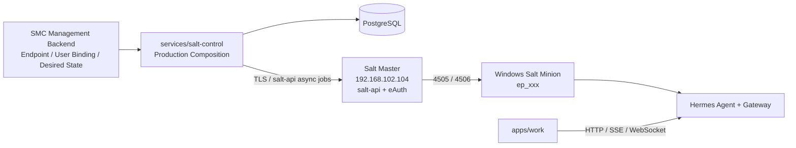

# SMC Copilot Salt Migration PRD v2.3

## 1. 版本目标

v2.3 只完成一件事：把当前已连接 `192.168.102.104` 的 Windows Minion 变成由真实 Salt Control 管理、可接管 Hermes、可完整回退、可审计的首台迁移终端。

v2.3 完成后才允许启动 v2.4 Ring 0（至少 5 台 / 7 天）。本版本禁止扩大灰度，禁止退役 Runtime Endpoint Control Plane。

## 2. 已核验基线

代码基线：

```text
Repository             E:\git\smc-copilot
Branch                 codex/codex-worktree
Commit                 45b1c17
infra/salt tests       83 passed
salt-control tests     20 passed
Contracts              passed
Migration inventory    GO: API 92.1% / Service 87.5% / LOC 93.5%
```

当前终端：

```text
Salt service           Running / Automatic
Salt Master            192.168.102.104
Master ports           4505 open / 4506 open
Current Minion ID      ITBJB0676
master_finger          missing
SMC endpoint-id        missing
control-owner.json     missing
bootstrap journal      missing
HermesLocalService     stopped
```

用户已通过 `salt-call.exe` 验证本地 Salt 能力。生产验收仍必须补充 Master 侧 `test.ping`、Job Return、Extension Sync 和 Highstate 证据；`salt-call test.ping` 仅执行本地模块，不能单独证明 Master 控制链路。

当前仓库状态：`.github/workflows/salt-canary.yml`、`.github/workflows/salt-control-ci.yml` 和 `.cursor/review/` 尚未跟踪。实施者先确认来源，不覆盖现有内容；属于 v2.2 的工作流须单独评审后提交。

## 3. v2.2 生产阻塞项

1. `services/salt-control/src/app.py` 默认使用 `build_in_memory_repos()`。
2. Salt Master、Management Backend、Artifact Store、Secret Provider 默认均为 Fake。
3. `core/auth.py` 使用实验 HS256 JWT，非企业 OIDC/JWKS。
4. Enrollment 的部分幂等状态保存在 `repos.extras`，服务重启后丢失。
5. Fingerprint 接口同步等待 `ping → sync_all → highstate`，真实 Highstate 易导致 HTTP 超时。
6. `infra/salt/states/hermes.sls` 在 Hermes 验证前写入 `control-owner=salt`。
7. `migrate-runtime-to-salt.ps1` 的生产路径仍以全部返回 `True` 的 Hook 模拟接管。
8. `configure-minion.ps1` 默认写入不存在的 `salt-b.internal`，单 Master 环境会产生错误故障转移行为。
9. 当前 Minion ID 是主机名，不是 Backend 分配的稳定 `endpointId`，且未锁定 Master 指纹。
10. v2.2 证据只证明仓库门禁通过，真实 A-F Canary、Ring 0 和观察期仍为 NOT PROVEN。

## 4. 固定架构



固定边界：

- Salt Control 只做 Endpoint Control Plane，不承载 Chat/Task。
- Salt Master API 使用 TLS、eAuth 和函数白名单，不开放任意 `cmd.*`。
- `apps/work` 继续直连 Hermes Gateway；Master/Backend 离线不得中断已运行 Chat。
- 用户绑定来自 Management Backend，禁止从 Salt Service 的 `USERNAME` 推断。
- 单 Master 可完成首台 Lab 闭环；未部署第二 Master 前不得进入 Ring 0。
- 所有生产依赖不可用时 fail closed 或保留 last-known-good，禁止回退 Fake/内存实现。

## 5. Phase 0 — 基线、状态与发布门禁

### 实施

1. 新建 `docs/salt/evidence/v2.3/first-endpoint/<date>/baseline.json`，记录脱敏后的版本、服务、端口、Minion ID、Master、Hermes/Runtime 状态。
2. 在 Master 侧记录：
   - `salt-key -L`
   - `salt ITBJB0676 test.ping`
   - 当前 Minion 公钥指纹
   - Master 公钥指纹
3. 为 v2.2 增加完成状态约束：仓库门禁用 `implemented`，真实硬件证据用 `proven`；Manual Gate 不得被 Cursor 自动标记 completed。
4. 检查两份未跟踪 Workflow；确认正确后纳入独立提交，错误则修复但不覆盖用户修改。
5. 在任何客户端修改前备份：Minion 配置、Minion PKI、公钥指纹、服务启动类型、Hermes Home、Gateway Task、Runtime/Direct Owner 状态。

### 退出门禁

- Master 侧能够定位 `ITBJB0676` 并成功下发 `test.ping`。
- 已取得可信 Master 指纹；不得从不受信任的网络响应自动接受。
- 备份可恢复，证据中无 Token、私钥、Secret、真实用户姓名。

## 6. Phase 1 — Salt Control 生产装配

### 6.1 PostgreSQL Repository

新增：

```text
services/salt-control/src/db/repositories/sqlalchemy.py
services/salt-control/src/db/unit_of_work.py
services/salt-control/migrations/versions/*_v23_persistence.py
```

实现全部 Repository Protocol。新增持久化表：

```text
enrollment_tokens
idempotency_keys
endpoint_operations
operation_steps
```

要求：

- 所有写操作使用数据库事务；`jid + endpointId + function` 保持唯一。
- 删除生产路径对 `repos.extras` 的依赖。
- Enrollment Token 只保存 hash；Device Credential 只在首次响应返回，数据库只保存 hash。
- 服务重启后 Enrollment、Operation、Rollout、Returner 幂等状态不丢失。
- Alembic 验证空库升级、前一版本升级、downgrade/upgrade 循环。

### 6.2 Production Composition

在 `app.py` 分离：

```text
build_test_state()        InMemory + Fake，仅 pytest/test
build_lab_state()         明确 SMC_SALT_ENV=lab
build_production_state()  PostgreSQL + Live Adapter
```

生产启动必须拒绝：

- `Fake*` 或 InMemory Repository
- 默认 `lab-only-change-me`
- 占位 Master、指纹、Artifact URL、签名公钥
- 非 HTTPS 的 Backend/Secret/Artifact/Salt API URL

`/ready` 必须检查 DB、Backend、Salt API、Artifact Metadata 和 Secret Provider；`/health` 只反映进程存活。

### 6.3 认证

- Operator/Service Token 改为企业 OIDC/JWKS 校验：issuer、audience、exp、nbf、kid、scope 全部校验。
- Lab JWT 仅允许 `SMC_SALT_ENV=lab|test`。
- Salt Control 到 Salt API 使用 Secret Store 提供的服务凭据，禁止写入 Git 或日志。
- 保留 Endpoint Device Credential + DPAPI Machine Scope。

### 退出门禁

- PostgreSQL 重启、Salt Control 重启后首台 Endpoint 状态一致。
- 生产配置加载测试证明 Fake、内存仓库和 Lab JWT 均不能启动。
- CI 通过 ruff、pytest、Alembic、OpenAPI drift 和日志泄密扫描。

## 7. Phase 2 — 真实 Salt Master Adapter 与 Extension 发布

### 7.1 Salt API Adapter

新增 `services/salt-control/src/integrations/salt_api.py`，实现现有 `SaltMaster` Protocol，并扩展异步 Job：

```text
list_pending     wheel key.list_all + key.finger
accept           wheel_async key.accept
delete_key       wheel_async key.delete
ping             local_async test.ping
sync_all         local_async saltutil.sync_all
highstate        local_async state.highstate
get_job          jobs.lookup_jid / job cache
```

规则：

- 调用 `https://<master-api>/login` 获取短期 eAuth Token；Token 只在内存中缓存。
- Salt Control 只允许目标 `ep_*` 和固定函数白名单。
- 禁止执行任意 Shell、PowerShell、`cmd.run` 或不在白名单中的 Module。
- Fingerprint 报告接口完成校验和 Key Accept 后返回 `202`；后续 `ping/sync/highstate` 由持久化 Operation Worker 执行，客户端轮询 Enrollment 状态。
- Worker 保存 Salt JID、开始/完成时间、脱敏结果和错误码，进程重启后续跑。

### 7.2 Master 发布

在 `192.168.102.104` 配置：

- `salt-api` + `rest_cherrypy`，仅 TLS，证书由企业 CA 或受控内部 CA 签发。
- `external_auth` 仅授权 Key 管理和 `test.ping`、`saltutil.sync_all`、`saltutil.refresh_pillar`、`state.show_highstate`、`state.highstate`、`smc_hermes.*`。
- `auto_accept: false`；人工 accept 只作 break-glass 并写审计。
- 将 `infra/salt/extensions/_modules|_states|_utils|_returners` 发布到 Salt fileserver 根目录对应 `_modules|_states|_utils|_returners`。
- 将 `infra/salt/states`、`top.sls` 和环境配置以带版本 Release 发布；禁止在 Master 在线目录直接编辑。
- 发布支持 current/previous 原子切换和回滚。

### 退出门禁

- Salt Control 可从真实 Master 查询 pending key、接受指定指纹并获得 JID/Return。
- Master 下发 `saltutil.sync_all` 后 `sys.list_modules` 包含 `smc_hermes`。
- 错误指纹、未授权函数、过期 Token、TLS 错误全部 fail closed。

## 8. Phase 3 — Management Backend、Binding 与 Desired State

### 实施

新增真实 HTTP Adapter：

```text
services/salt-control/src/integrations/management_backend_http.py
services/salt-control/src/integrations/artifact_store_http.py
services/salt-control/src/integrations/secret_provider_http.py
```

Management Backend 内部契约固定为：

```text
GET /internal/v1/endpoints/{endpointId}/binding
GET /internal/v1/endpoints/{endpointId}/desired-state
```

Binding 必须包含：

```text
userId
windowsAccount
windowsSid
profileDir
revision
```

Desired State 必须包含：Hermes Home/Version、签名 Artifact Ref、Profile、MCP、Secret Ref、Ring 和 `desiredOwner`。

规则：

- 首台终端未绑定用户时返回 `binding_missing`，不得创建 System Gateway Task。
- Backend 不可用时只返回已持久化且未过期的 last-known-good；不得生成空 Pillar。
- Artifact Metadata 必须有 Ed25519 `keyId/publicKey/signature/sha256/rollbackVersion`。
- Secret Provider 按 endpointId + userId + ref 校验 ACL；返回值不得进入 Pillar、Grain、Returner 或日志。

### 退出门禁

- 首台 Endpoint 能取得唯一 User Binding 和 Desired State revision。
- 用户 SID、Profile 和 Hermes Home 与本机实际用户一致。
- Backend/Artifact/Secret 任一不可用时不会改写现有配置或切换 Owner。

## 9. Phase 4 — 无重装接管现有 Minion

新增：

```text
infra/salt/client/windows/adopt-existing-minion.ps1
infra/salt/client/minion_identity.py
infra/salt/tests/canary/ExistingMinionAdoption.Tests.ps1
```

### 身份迁移流程

```text
ITBJB0676 accepted and online
  → Salt Control 创建 ep_xxx
  → 保存旧配置/旧 ID/PKI/服务状态
  → 停止 salt-minion
  → 写入 id=ep_xxx + master_finger
  → 启动 salt-minion
  → Master 出现 ep_xxx pending key
  → 对比本机与 Master pending 指纹
  → accept ep_xxx
  → Master 下发 test.ping
  → sync_all + state.show_highstate + highstate test=True
  → highstate apply
  → 完成后撤销 ITBJB0676 旧 Key
```

旧 Key 在新身份完成前保持 accepted，用于恢复：失败时停止服务、恢复旧配置和 `ITBJB0676`、启动服务并验证旧 Key 在线。

修改 `configure-minion.ps1`：

- `MasterB` 改为可选；只有配置了真实第二 Master 才渲染 failover list。
- 单 Master 渲染标量 `master: 192.168.102.104`，不得写入 `salt-b.internal`。
- 写配置前验证 Master Fingerprint 非空且格式正确。
- 使用临时文件 + 原子替换；失败恢复备份。

### 退出门禁

- `%ProgramData%\SMC\endpoint-id` 为 Backend 分配的 `ep_*`。
- Minion 配置包含可信 `master_finger`，Master 侧 `salt ep_xxx test.ping` 成功。
- `saltutil.sync_all`、`sys.list_modules`、`state.show_highstate` 和 Highstate 成功。
- 旧 `ITBJB0676` Key 仅在新身份完全通过后撤销；身份回滚演练通过。

## 10. Phase 5 — Hermes/Gateway 真实接管

### 10.1 修复 Owner 违规

1. 从 `infra/salt/states/hermes.sls` 删除提前写入 `control-owner=salt` 的 State。
2. 将安装拆分为 `prepare/adopt → verify → handover commit`；prepare 阶段不得 Claim Owner。
3. `smc_hermes.install/upgrade` 在 migrate 模式不得隐式切换 Owner。
4. 新增 `smc_handover` Execution/State Module，Owner 只能由它原子切换。
5. `migrate-runtime-to-salt.ps1` 删除全部 `lambda: True` Hook；生产环境发现 Stub Hook 必须立即失败。
6. Rollback 恢复快照中的真实初始 Owner（`runtime`、`direct` 或无文件），禁止固定写成 `runtime`。

### 10.2 真实接管顺序

```text
inspect existing Hermes Home
snapshot config/home/task/owner/runtime state
verify signed artifact + isolated Python
render user-bound Gateway Task but do not start
stop current Gateway
pause Runtime supervisor or Direct owner
atomically switch owner=salt
start Salt-managed Gateway Task as bound user
verify /health
run apps/work startup/chat/session/file/slash probe
write migration marker + COMPLETED journal
```

任一步失败：停止 Salt Gateway、恢复快照和原 Owner、恢复原 Gateway/Runtime、执行 Work probe；回滚失败标记 P0 并禁止继续。

### 退出门禁

- Gateway Task 以 Backend Binding 的 Windows 用户运行，禁止 SYSTEM fallback。
- Owner 全程无双管；`control_owner_conflict=0`。
- Hermes 使用独立 Python/venv，不依赖 Salt Python。
- `apps/work` 在 Runtime 停止、Backend/Master 暂时离线时仍可使用既有 Chat Data Plane。
- 完成一次 Salt → 原 Owner 的 break-glass 回滚，再重新迁移成功。

## 11. Phase 6 — 首台证据与 v2.4 决策

证据目录：

```text
docs/salt/evidence/v2.3/first-endpoint/<date>/
  baseline.json
  master-connectivity.json
  enrollment.json
  extension-sync.json
  highstate.json
  hermes-inspect.json
  gateway-health.json
  work-probe.json
  rollback.json
  metrics-24h.json
  approval.md
```

所有文件必须脱敏：Endpoint 使用哈希别名；禁止保存真实用户名、SID、Token、Secret、私钥、完整 Pillar 和未脱敏 Return。

首台 24 小时观察指标：

```text
Minion online                    100%
Highstate apply success         100%
Gateway availability            >= 99.9%
Gateway recovery p95            <= 120s
Owner conflict                  0
Secret plaintext leak           0
Unexpected Runtime fallback     0
P0/P1                           0
```

只有指标达标、Rollback 演练成功、审批签字后，v2.4 才能创建 Ring 0（5 台 / 7 天）。第二 Master 在 v2.4 Ring 0 前必须部署并完成故障转移演练。

## 12. 测试矩阵

| ID | 场景 | 验收 |
|---|---|---|
| PROD-301 | production 启动包含 Fake/InMemory/Lab JWT | 启动失败 |
| DB-301 | Salt Control/DB 重启 | Enrollment/Operation/Return 状态不丢失 |
| MASTER-301 | Salt API TLS/eAuth 正常 | pending/accept/JID/Return 可追踪 |
| MASTER-302 | 错误指纹/未授权函数 | fail closed，无 Key 被接受 |
| MASTER-303 | Job 超时/服务重启 | Operation 可续跑，不重复 Highstate |
| ADOPT-301 | ITBJB0676 → ep_xxx | 新身份在线后才撤销旧 Key |
| ADOPT-302 | ID 切换中断电 | 恢复旧 ID 或继续同一 Operation |
| STATE-301 | highstate test=True | 无 Owner 写入、无破坏变更 |
| OWNER-301 | Hermes prepare 失败 | Owner 保持原值 |
| OWNER-302 | Gateway health/Work probe 失败 | 原子回滚原 Owner |
| OWNER-303 | 初始 Owner=direct/无文件 | Rollback 不错误写成 runtime |
| USER-301 | Binding 缺失/System 用户 | 禁止创建/启动 Gateway Task |
| OFFLINE-301 | Master/Backend 暂时离线 | 已运行 Gateway/Chat 不受影响 |
| SECURITY-301 | Artifact/Secret/Return 日志扫描 | Secret 泄漏为 0 |

## 13. Cursor 实施顺序与提交边界

Cursor 必须逐阶段实施、测试、提交；Manual Gate 保持 pending，禁止因为脚本存在而标记完成。

```text
01 docs(salt-v23): capture live baseline and evidence rules
02 feat(salt-control): add PostgreSQL repositories and durable operations
03 security(salt-control): add production OIDC and composition guards
04 feat(salt-control): add live salt-api adapter and async job worker
05 feat(salt-control): add live backend artifact and secret adapters
06 feat(salt-master): add versioned extension release and eAuth policy
07 feat(salt-client): adopt an existing minion with reversible identity migration
08 fix(salt): make Hermes owner handover atomic and remove stub hooks
09 test(salt-canary): prove first endpoint migration and rollback
10 docs(salt-v23): publish 24h evidence and v2.4 go-no-go
```

实施规则：

1. 开始前读取根 `AGENTS.md`、`services/salt-control/AGENTS.md`；API 修改先读取 `contracts/` 与 `docs/architecture/contract-flow.md`。
2. 不覆盖当前未跟踪文件，不提交 `.env`、证书、Token、真实设备/用户数据。
3. 生产代码不得以 Fake、Fixture、Stub、Skipped Test 或本地 JSON 作为成功证据。
4. 每个 Phase 先写失败场景测试，再实现代码；每次提交只包含当前 Phase。
5. 任何 Owner、Minion ID、Master Key 的远程修改均为 Manual Gate，必须由操作员明确执行。
6. 单 Master 首台验证成功不等于 Production Rollout GO。

## 14. 验证命令

```powershell
uv run --project infra/salt ruff check infra/salt
uv run --project infra/salt pytest infra/salt/tests
uv run --project infra/salt python scripts/salt-migration-inventory.py --check

uv run --project services/salt-control ruff check .
uv run --project services/salt-control ruff format --check .
uv run --project services/salt-control pytest
uv run --project services/salt-control alembic upgrade head

npm run contracts:generate
npm run contracts:check
npm run guard --workspace apps/work
npm test --workspace apps/work
npm run typecheck --workspace apps/work
```

真实 Master 命令必须在 `192.168.102.104` 上由授权操作员执行并脱敏归档：

```text
salt ep_xxx test.ping
salt ep_xxx saltutil.sync_all
salt ep_xxx sys.list_modules
salt ep_xxx state.show_highstate
salt ep_xxx state.highstate test=True
salt ep_xxx state.highstate
salt ep_xxx smc_hermes.inspect
salt ep_xxx smc_hermes.health
```

## 15. Definition of Done

- Salt Control 生产实例使用 PostgreSQL、企业认证和全部真实 Adapter；重启不丢状态。
- `192.168.102.104` 的 salt-api/eAuth/TLS、Extension Release、异步 Job Return 闭环通过。
- 当前终端从 `ITBJB0676` 安全迁移到 Backend 分配的 `ep_*`，配置可信 Master 指纹。
- 用户 Binding、Desired State、签名 Artifact、Secret ACL 全部来自真实服务。
- Hermes/Gateway 接管不使用 Stub Hook，不提前写 Owner，失败可恢复原 Owner。
- Master 侧 Ping、Sync、Highstate、Hermes Inspect/Health、Work Probe 和 Rollback 证据完整。
- 首台终端连续 24 小时达到指标且无 P0/P1、无 Secret 泄漏、无 Owner 冲突。
- Runtime 未卸载、未全局退役；Ring 0 未提前启动。
- 输出 v2.4 Ring 0 Go/No-Go，未部署第二 Master 时结论必须为 NO-GO。
