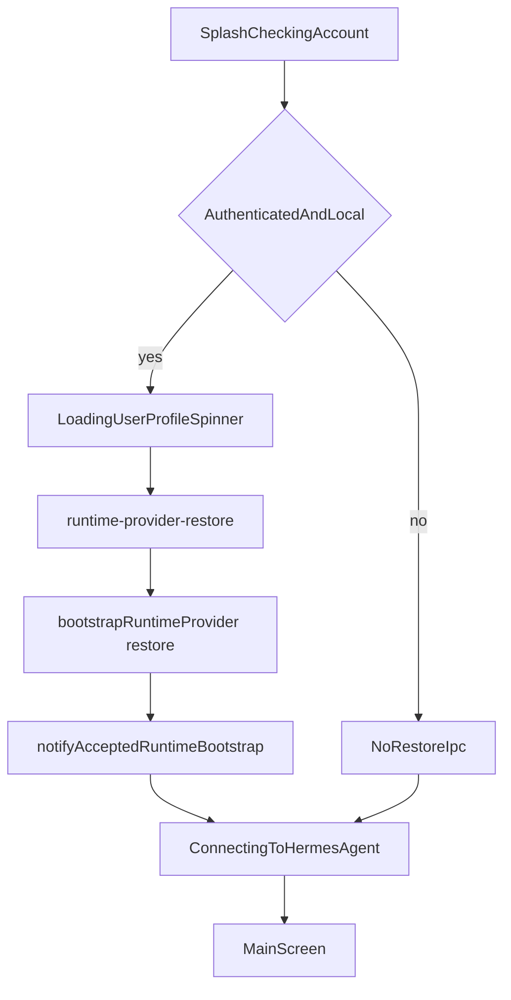

# Session Restore Splash 实现计划

依据 [docs/work/PRD-WORK-RUNTIME-PROVIDER-SESSION-RESTORE-BOOTSTRAP-HOTFIX-v1.6.md](docs/work/PRD-WORK-RUNTIME-PROVIDER-SESSION-RESTORE-BOOTSTRAP-HOTFIX-v1.6.md)，`status = APPROVED_FOR_PLAN`。实现以 `HF-G-01`～`HF-G-05` 与 `HF-D-01`～`HF-D-12` 为准。本计划 `plan_contract: smc.plan.v3.7`，claim `GES_NATIVE`。仓库内没有 `smc-plan-from-approved-prd-ponytail` 技能包，因此沿用 [`.cursor/plans/runtime_bootstrap_plan_3eb14da3.plan.md`](.cursor/plans/runtime_bootstrap_plan_3eb14da3.plan.md) 的字段。本计划状态是 `planned`，不是 `approved`。

基线：smc-copilot `e5ce6ecf1347e9b463487234ffd142f583e0bb69`。不改 Bootstrap HTTP 合同、`NOT_READY` 清密钥、设置锁、`scheduled_reconcile`、切回 local 的 TRIGGER-006、非英文语言包、历史启动页英文硬编码句。



## 现有入口

- 过早的 restore 在 [`apps/work/src/main/auth/auth-ipc.ts`](apps/work/src/main/auth/auth-ipc.ts) 的 `registerAuthIpc`：`hydrateTokenStore()` 之后、`app.whenReady()` 之前调用 `bootstrapRuntimeProvider("restore")`。这段整段删除。`auth:login` 仍在 local 模式调用 `bootstrapRuntimeProvider("login")` 和 `notifyAcceptedRuntimeBootstrap`，且不传 profile。`auth:refresh` 继续不 bootstrap。
- [`apps/work/src/main/app/start.ts`](apps/work/src/main/app/start.ts) 的 `whenReady` hydrate 只衔接 `startKnowledgeProviderAfterAuth()`。本计划不改这个文件。
- 相邻 IPC 已在 [`apps/work/src/main/ipc/register.ts`](apps/work/src/main/ipc/register.ts) 的 `runtime-provider-refresh`，preload 在 [`apps/work/src/preload/index.ts`](apps/work/src/preload/index.ts) 的 `refreshRuntimeProvider`。新通道沿用同一对文件和 [`apps/work/src/preload/index.d.ts`](apps/work/src/preload/index.d.ts)。
- 冷启动在 [`apps/work/src/renderer/src/App.tsx`](apps/work/src/renderer/src/App.tsx) 的 `runBootstrap`：`Checking account…` 之后，已登录就 `runRuntimeConnect()`，状态行变成 `Connecting to Hermes Agent…`。`handleSwitchToLocal` 与 `handleReconnect` 再次进入 `runBootstrap`。`skipPortalLogin()` 为真时不查账号，直接连接。
- 启动页在 [`apps/work/src/renderer/src/screens/SplashScreen/SplashScreen.tsx`](apps/work/src/renderer/src/screens/SplashScreen/SplashScreen.tsx)，只有 `.splash-status`，没有转圈。样式在 [`apps/work/src/renderer/src/assets/main.css`](apps/work/src/renderer/src/assets/main.css)。
- `I18nProvider` 已包住 App。新句子写入 [`apps/work/src/shared/i18n/locales/en/auth.ts`](apps/work/src/shared/i18n/locales/en/auth.ts)，键 `loadingUserProfile`，原文 `Loading user profile`。`AppBootstrap` 用 `useI18n().t("auth.loadingUserProfile")`。不改 zh-CN。`Checking account…` 与 `Connecting to Hermes Agent…` 保持硬编码。

## Todos

每个 Todo 的 `status` 从 `planned` 开始。只有对应验收跑出 Evidence 才能标 `verified`。

```yaml
id: hf-t1-remove-early-restore
requirement_refs: [HF-D-01, HF-D-02]
acceptance_refs: [A-HF-001, A-HF-005]
files_or_symbols:
  - apps/work/src/main/auth/auth-ipc.ts#registerAuthIpc
  - apps/work/src/main/auth/auth-ipc.test.ts
implementation_goal: 删除 registerAuthIpc 里 ready 之前的 hydrate-then-restore。auth:login 的 login bootstrap 保持一次且不传 profile。
preconditions: hydrateTokenStore 与 auth:refresh 现有测试仍可跑。
state_transition: 注册 IPC 时 bootstrapRuntimeProvider 调用次数为 0。
verification: npm test -- src/main/auth/auth-ipc.test.ts 在 apps/work。断言 registerAuthIpc 不调用 restore；登录仍调用 login。
```

```yaml
id: hf-t2-splash-restore-ipc
requirement_refs: [HF-D-03, HF-D-04, HF-D-05, HF-D-06, HF-D-09]
acceptance_refs: [A-HF-002, A-HF-003, A-HF-004, A-HF-006, A-HF-007, A-HF-008, A-HF-011]
files_or_symbols:
  - apps/work/src/main/auth/auth-ipc.ts#restoreRuntimeProviderForSplash
  - apps/work/src/main/ipc/register.ts
  - apps/work/src/preload/index.ts#restoreRuntimeProvider
  - apps/work/src/preload/index.d.ts
implementation_goal: 新增 runtime-provider-restore。mode 不是 local 或没有会话时立即返回当前公开状态，不调用 bootstrap，不 notify。否则调用 bootstrapRuntimeProvider("restore")，不传 profile。accepted 为真时 notifyAcceptedRuntimeBootstrap。抛错或 30000ms 传输失败时结束 IPC，不清除会话，返回 getRuntimeProviderPublicState()。generation 冲突继续走现有 coordinator，不新写状态机。
preconditions: hf-t1 已去掉提前 restore，保证一次冷启动最多这一次 restore。
state_transition: MODEL_LIST_EMPTY 得到 NOT_READY、backendState=MODEL_LIST_EMPTY、isRuntimeSettingsLocked 为 true，与 login 收到同一响应一致。
verification: 同目录 Main 单测覆盖跳过、MODEL_LIST_EMPTY、notify、抛错不清除会话。A-HF-006 复用现有 orchestrator generation 测试，本 IPC 只断言调用时不传 profile。
```

```yaml
id: hf-t3-splash-gate
requirement_refs: [HF-D-08, HF-D-09, HF-D-10, HF-D-11, HF-D-12]
acceptance_refs: [A-HF-005, A-HF-008, A-HF-009, A-HF-010, A-HF-012]
files_or_symbols:
  - apps/work/src/renderer/src/App.tsx#runBootstrap
  - apps/work/src/renderer/src/screens/SplashScreen/SplashScreen.tsx
  - apps/work/src/renderer/src/assets/main.css
  - apps/work/src/shared/i18n/locales/en/auth.ts#loadingUserProfile
implementation_goal: 只有首次冷启动且 skipPortalLogin 为假、getState 已登录、getConnectionConfig().mode 为 local 时，把状态行设为 Loading user profile、SplashScreen 显示行旁转圈，并 await restoreRuntimeProvider。返回后才进入现有 runRuntimeConnect。screen 在此之前保持 splash。handleSwitchToLocal、handleReconnect、skipPortalLogin 传入 restore=false，不发 IPC，不显示这句。登录成功路径不显示这句。
preconditions: hf-t2 的 preload 方法已存在。
state_transition: 无新的全屏层。转圈只在 IPC 未返回时存在。
verification: renderer 测试断言等待文案、转圈、settle 前不是 main，以及 reconnect / skip 不调用 IPC。不把 UI 测试当成 NOT_READY 的证据。
```

## 不做

- 不改 [`apps/work/src/main/app/start.ts`](apps/work/src/main/app/start.ts)。
- 不新增 Bootstrap 客户端，不复制 restore 状态机。
- 不改 `MODEL_LIST_EMPTY` 文案、设置锁、清密钥或 Gateway 重启。
- 不改非英文 locale。`加载用户资料` 只留在 PRD，不写入代码。
