# Skill Run Prompt Binding Contract Alignment (PRD v4.0.2)

## 已确认根因

当前存在两套彼此独立、结论不一致的 callability 判定：

- Catalog：[`mapPublicSkillCatalogTools()`](apps/work/src/main/skill-run/skill-run-contract-parser.ts) 将每个非 `form` 的 skill 标为 `callable`，并**丢弃** `interactionMode`、`promptField`、`supportsAttachments`。

```123:125:apps/work/src/main/skill-run/skill-run-contract-parser.ts
    const callability: SkillCatalogToolItem["callability"] =
      interactionMode === "form" ? "unsupported" : "callable";
```

- Start：[`bindPromptFirstTool()`](apps/work/src/main/skill-run/skill-run-contract-parser.ts) 从 raw schema 重新推导是否可支持，并把字段名硬编码为 `"prompt"`；同时 [`callSkill()`](apps/work/src/main/skill-run/skill-run-gateway-client.ts) 发送 `arguments: { prompt: input.prompt }`。

`schemaHasUnsupportedShape()` 还会拒绝 *optional* 的 object/array properties；这正是 `customer-profiling` 在 Catalog 已判定为 `callable` 之后，仍以 `UNSUPPORTED_SCHEMA` 失败的原因。

Contract v1.2.1 的 descriptor 字段已在 [tools-list.response.schema.json](contracts/skill-run/v1.2.1/mcp/tools-list.response.schema.json) 确认（`capabilityKind`、`interactionMode` 为 required；`promptField`、`supportsAttachments` 为 optional）。

```mermaid
flowchart LR
  raw[tools/list descriptor] --> norm[normalizeSkillToolDescriptor]
  norm --> cls[classifySkillInvocation]
  cls --> item[SkillCatalogToolItem]
  item --> rend[Renderer selection gate]
  rend --> start[SkillRunService.start]
  start --> recls[classifySkillInvocation on live catalog]
  recls --> bind[buildPromptFirstArguments]
  bind --> call["tools/call arguments[promptField]"]
```



## 范围说明

- 直接按本 plan 实施；不落地 PRD 文件；`feature-mode-store.ts` 的 `DEFAULT_MODE` 保持当前本地值不变。
- 仅 P0：不做 JSON Schema form，不执行 `interactionMode=form`，不做 attachment upload，不新增 service/IPC/session/file owner。

## Slice 1 — Shared DTO and classifier

**[apps/work/src/shared/skill-run.ts](apps/work/src/shared/skill-run.ts)**

- 新增 `SkillInvocationMode = "prompt-first" | "parameters-required" | "form-required" | "unsupported-schema"`。
- 新增 `SkillInvocationReasonCode = "FORM_REQUIRED" | "PROMPT_FIELD_MISSING" | "PROMPT_FIELD_INVALID" | "EXTRA_REQUIRED_PARAMETERS" | "ROOT_SCHEMA_UNSUPPORTED" | "COMPOSITE_SCHEMA_UNSUPPORTED" | "CONTRACT_MISMATCH"`。
- 扩展 `SkillCatalogToolItem`：required 字段包括 `interactionMode: "chat" | "form"`、`supportsAttachments: boolean`、`invocationMode: SkillInvocationMode`；optional 字段包括 `promptField?: string | null`、`reasonCode?: SkillInvocationReasonCode`。`inputSchema` 仍为只读 projection；renderer 绝不可据此构造 arguments。

**[apps/work/src/main/skill-run/skill-run-contract-parser.ts](apps/work/src/main/skill-run/skill-run-contract-parser.ts)**

- `normalizeSkillToolDescriptor(raw)` — 解析单个 v1.2.1 descriptor；对非 `skill` 的 `capabilityKind`，或缺失 `name`/`interactionMode`，返回 `null`。
- `classifySkillInvocation(tool)` → `{ invocationMode, callability, reasonCode?, promptField? }`。判定顺序：`interactionMode === "form"` → `FORM_REQUIRED`；root `$ref` / 非 `object` 的 `type` → `ROOT_SCHEMA_UNSUPPORTED`；root `oneOf`/`anyOf`/`allOf`/`if`/`then`/`else`/`dependentRequired`/`dependentSchemas` → `COMPOSITE_SCHEMA_UNSUPPORTED`；缺失/空白 `promptField` 或不在 `properties` 中 → `PROMPT_FIELD_MISSING`；`properties[promptField].type !== "string"` → `PROMPT_FIELD_INVALID`；`required` 含 `promptField` 以外的字段 → `EXTRA_REQUIRED_PARAMETERS`（`parameters-required`）；否则为 `prompt-first` / `callable`。
- **Optional complex properties 不再取消资格**（PRD 5.4 / AC-04）：删除 `schemaHasUnsupportedShape` 中拒绝 optional `object`/`array`/`$ref` members 的 `properties` loop。
- 将 `mapPublicSkillCatalogTools()` 改写为 `normalize → classify → SkillCatalogToolItem`。
- 用新 binder 替换 `bindPromptFirstTool()`：在 live catalog 中查找 tool，重新执行 `classifySkillInvocation()`，并返回 `{ ok: true, tool, promptField, arguments: { [promptField]: trimmedPrompt } }`。Error codes 改为 `SKILL_*` 集合（`SKILL_FORM_REQUIRED`、`SKILL_PARAMETERS_REQUIRED`、`SKILL_PROMPT_FIELD_MISSING`、`SKILL_PROMPT_FIELD_INVALID`、`SKILL_UNSUPPORTED_SCHEMA`、`SKILL_CONTRACT_MISMATCH`），外加既有 `TOOL_NOT_FOUND` / `TOOL_NOT_CALLABLE`。

需接受的行为后果：按 PRD 5.4 fail-closed，省略 `promptField` 的 descriptor 现为 `unsupported-schema`。既有 fixtures 必须补上 `promptField: "prompt"`。

## Slice 2 — Gateway and service binding

**[apps/work/src/main/skill-run/skill-run-gateway-client.ts](apps/work/src/main/skill-run/skill-run-gateway-client.ts)**

- `callSkill({ toolName, arguments, idempotencyKey })` — 将 `arguments` 原样传给 `tools/call`。Client 只保留 MCP transport 职责，不含 prompt 语义。`X-Idempotency-Key`、auth transport、same-origin policy 均不改动。

**[apps/work/src/main/skill-run/skill-run-service.ts](apps/work/src/main/skill-run/skill-run-service.ts)**

- 在 `start()` 中保持既有 gate 顺序（disposed → feature mode → consumer lock → `RUN_ALREADY_ACTIVE` → idempotent replay → catalog ready），再使用新 binder 结果。将 `promptField` 与 `arguments` 存入 `ActiveRun`，确保 `pending-submit` 在 `gateway.callSkill` *之前* 持久化（既有 `persistContinuation?.(initialProjection)` 调用仍位于 async block 之前）。
- 向 `callSkill` 传入 `arguments: bindResult.arguments`。永不接受 Renderer 提交的 `promptField`/`inputSchema`/`interactionMode`/release metadata — `SkillRunStartInput` 保持不变（`toolName`、`prompt`、`clientRequestId`、`sessionId`、`profileId`、`authGeneration`）。

## Slice 3 — Renderer selection and submit gates

- **[SkillCatalogPanel.tsx](apps/work/src/renderer/src/modules/skill-run/SkillCatalogPanel.tsx)**：对 `disabled`、`onClick` 与 `selectHighlighted()`，以 `tool.invocationMode === "prompt-first"` 替代 `callability === "callable"` 做门控；按 `reasonCode` 渲染每张 card 的 reason 文案。保留该文件既有 spacing style。
- **[Chat.tsx](apps/work/src/renderer/src/screens/Chat/Chat.tsx)**：`resolveRestoredSkillSelection` 在第 155 行伪造 `callability: "callable"` — 将 fallback 改为 `callability: "unsupported"`、`invocationMode: "unsupported-schema"`、`reasonCode: "CONTRACT_MISMATCH"`、`interactionMode: "chat"`、`supportsAttachments: false`；并在 catalog store 变为 `ready` 时重新 resolve，使 unpublished/changed skill 无法提交。在 `handleSubmitOrQueue` 中，于 enqueue/`submitSkill` 之前，当 `selectedSkill.invocationMode !== "prompt-first"` 时拒绝。Submit 路由顺序（slash → skill → expert → local chat）不变。
- **[SkillSelectionBar.tsx](apps/work/src/renderer/src/modules/skill-run/SkillSelectionBar.tsx)**：当 active selection 不是 `prompt-first` 时显示 unavailable 提示。
- **[locales/en/skillRun.ts](apps/work/src/shared/i18n/locales/en/skillRun.ts)**：新增 reason copy keys（`reasonFormRequired`、`reasonParametersRequired`、`reasonPromptFieldMissing`、`reasonPromptFieldInvalid`、`reasonUnsupportedSchema`、`reasonContractMismatch`、`skillUnavailable`）。仅英文 — 按 `.cursor/rules/work-i18n-source-locale.mdc`，`locales/zh-CN` 及其他 locale 不在本次范围。

## Slice 4 — Tests and regression

- 新增 `apps/work/src/main/skill-run/skill-run-contract-parser.test.ts`，覆盖 PRD 11.1 matrix：`prompt`、`query`、optional scalar、optional object、optional array、extra required、`form`、root `$ref`、root array、`oneOf`/`anyOf`/`allOf`、missing `promptField`、non-string `promptField`。另加 invariant 测试：每个 `callable` catalog item 都能成功 bind。
- [skill-run-service.test.ts](apps/work/src/main/skill-run/skill-run-service.test.ts)：为 `callableTool` 增加 `promptField`；对 `promptField: "query"` 的 skill 断言 `arguments.query`；保留 `PARAMETERS_REQUIRED` 类拒绝（error code 已重命名）；增加 tamper（`toolName` 不在 catalog）与 unpublish-after-selection 拒绝用例。
- [skill-run-gateway-client.test.ts](apps/work/src/main/skill-run/skill-run-gateway-client.test.ts)：断言 `tools/call` body 使用 contract 的 `promptField`，且 idempotency/auth headers 不变。
- [skill-run-e2e.test.ts](apps/work/src/main/skill-run/skill-run-e2e.test.ts)：为 `SKILL_TOOL` 增加 `promptField: "prompt"`；增加 unsupported-schema 与 extra-required 负向 fixtures；重跑 Checkpoint B 链路（Catalog → Selection → Submit → `tools/call` → SSE/poll → Result → Artifact → Restart）。
- 更新 [SkillCatalogPanel.test.tsx](apps/work/src/renderer/src/modules/skill-run/SkillCatalogPanel.test.tsx)、[SkillSelectionBar.test.tsx](apps/work/src/renderer/src/modules/skill-run/SkillSelectionBar.test.tsx)、[skillSelectionRestore.test.ts](apps/work/src/renderer/src/screens/Chat/skillSelectionRestore.test.ts)，适配加宽后的 DTO 与新门控。

## Docs and verification

- 更新 [apps/work/lat.md/skill-run.md](apps/work/lat.md/skill-run.md)（“Prompt-first Main validation”，以及 Checkpoint B 中关于 optional object/array 会被拒绝的说明 — 该规则现已有意放宽），并交叉核对 [skill-run-integration.md](apps/work/lat.md/skill-run-integration.md)。
- 在 `apps/work` 中运行：`npm run guard`、`npm run typecheck`、`npm test`、`npm run test:skill-run-e2e`，然后 `lat check`。

## Definition of done

Catalog 与 Start 共享同一 classifier；`promptField` 由 contract 驱动；`callable` 蕴含 bindable；非 prompt-first 的 skill 在 submit 前被带 reason 阻断；Main 仍对 live auth-scoped catalog 二次校验；不引入 form 能力、不新增第二套 lifecycle owner；Local Chat / Expert / File / Session 路径无回归。
