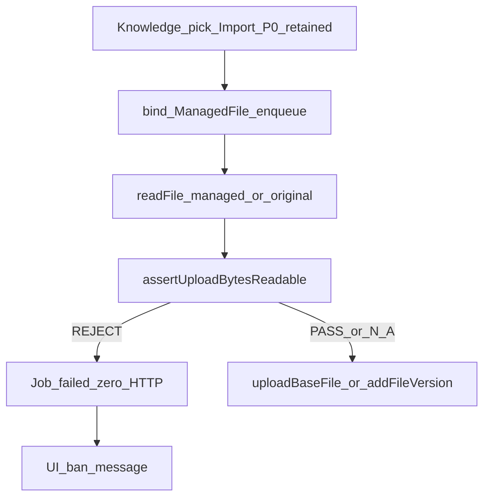

# Attachment Upload-Byte Gate P0.1

**PRD:** [docs/work/smc-copilot-Attachment-Upload-Byte-Gate-P0.1-PRD.md](docs/work/smc-copilot-Attachment-Upload-Byte-Gate-P0.1-PRD.md) (`APPROVED_FOR_PLAN`)

**Hard bar:** unreadable `pdf/doc/docx/xls/xlsx` upload buffers MUST NOT hit Knowledge HTTP; Import P0 and Chat stay unchanged; Eisoo v2.0 out of scope.



## Approach (locked from grilling)

- New platform module [`upload-byte-gate.ts`](apps/work/src/main/files/upload-byte-gate.ts): `(fileName, bytes) → PASS | NOT_APPLICABLE | REJECT`.
- Reuse [`detectStrictContentKind`](apps/work/src/main/files/file-security.ts) / `extensionFromName`; **do not** call path-based `validateFileContent`.
- STRICT set for this release only: `pdf`, `doc`, `docx`, `xls`, `xlsx`. Empty buffer → REJECT. All other extensions → `NOT_APPLICABLE`.
- Inspect signature window on the **upload buffer** (same rules as P0: PDF within first 1024, ZIP/OLE at start) — no second path read for the gate.
- Knowledge hooks: after `readFile`, before HTTP in [`knowledge-job-runtime.ts`](apps/work/src/main/knowledge/knowledge-job-runtime.ts) L97–104 and [`register-knowledge-base-ipc.ts`](apps/work/src/main/knowledge/register-knowledge-base-ipc.ts) `addFileVersion` L337–343.
- Path policy unchanged: `managedPath || originalPath`.
- Error: `FILE_UPLOAD_CONTENT_UNREADABLE` in [`file-errors.ts`](apps/work/src/shared/files/file-errors.ts); Job `errorCode` stores that string; log `CONTENT_UPLOAD_CHECK` metadata only.

## Implementation slices

### 1. Gate module + error code

- Add `FILE_UPLOAD_CONTENT_UNREADABLE` + shared English message constant (aligned with en i18n).
- Implement `assertUploadBytesReadable` + `logUploadByteCheckEvent` in `upload-byte-gate.ts`.
- Export from [`files/index.ts`](apps/work/src/main/files/index.ts).
- Unit tests [`upload-byte-gate.test.ts`](apps/work/src/main/files/upload-byte-gate.test.ts): A-UBG-001/002/004/005/008 (matrix + no content in logs).

### 2. Knowledge runtime + addFileVersion

- In `runProviderUpload`: gate after `readFile`; on REJECT set Job `failed` + `errorCode: FILE_UPLOAD_CONTENT_UNREADABLE`, return without `uploadBaseFile`.
- In `addFileVersion`: gate after `readFile`; on REJECT throw sanitizable error with that code (no HTTP).
- Extend [`knowledge-job-runtime.test.ts`](apps/work/src/main/knowledge/knowledge-job-runtime.test.ts) (or new colocated test with mocks): REJECT → upload spy count 0; PASS pdf → upload called with same bytes (A-UBG-001/002/003/004).
- Cover addFileVersion reject path (A-UBG-006) via focused test or IPC handler unit test with mocked provider.

### 3. Knowledge UI warning

- Add `knowledge.uploads.uploadContentUnreadable` in [`locales/en/knowledge.ts`](apps/work/src/shared/i18n/locales/en/knowledge.ts) only: content cannot be read as declared type; upload forbidden. No Eisoo confirmed wording.
- [`KnowledgeUploadPanel.tsx`](apps/work/src/renderer/src/screens/Knowledge/features/file-job/KnowledgeUploadPanel.tsx): when Job snapshot `status===failed` and `errorCode===FILE_UPLOAD_CONTENT_UNREADABLE`, show the same alert pattern as pick errors (`data-testid` for upload-byte reject). Job queue already lists failed jobs; banner ensures the ban message is visible (A-UBG-007).
- Extend [`knowledge-uploads-page.test.ts`](apps/work/tests/knowledge-uploads-page.test.ts) for failed-job errorCode mapping.

## Out of scope

- Chat composer / Import P0 removal or bypass
- Eisoo native / PreparedKnowledgeContent
- Expanding STRICT to pptx/images
- Changing `contentHash` or plaintext-on-disk

## Verification

From `apps/work`:

```bash
npm test -- upload-byte-gate.test.ts knowledge-job-runtime.test.ts knowledge-uploads-page.test.ts
npm run typecheck
```

(Adjust globs if new test filenames differ.) Confirm A-UBG-001–008 oracles in test names/comments.
