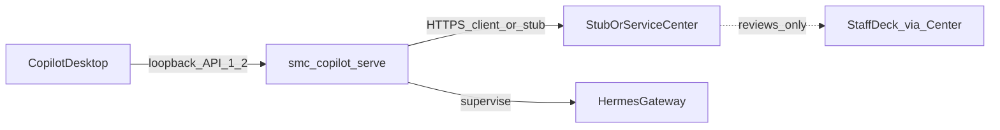

# v1.5 企业终端同步分阶段总计划

## 定位与约束

- **产品目标**：把现有 v1.4 本机 Hermes 控制面升级为「企业 Work Copilot 可信执行节点」（Endpoint Identity → Desired State → Remote Task v2 → StaffDeck 经验沉淀）。
- **基线**：v1.4.0 @ `1b4b06f`；建议分支 `feature/runtime-v1.5-endpoint-sync`；Runtime API → `1.2`。
- **本仓库范围**：[`smc-copilot-serve`](src/) 控制面、安装器、CI、本地 API、集成 Client。Desktop UI / Service Center 服务端 / StaffDeck / nodeskclaw **不在本仓实现**。
- **硬约束**：Service Center **无可联调 mock/真实接口** → 默认 `AIOS_SERVICE_CENTER_USE_STUB=true`，用 **Stub Client + Fake Center（测试内存态）** 闭环；禁止把占位发布制品打进 Stable。

## 架构主链路

**离线优先**：中心不可达时本地 Chat/Instance 继续；Outbox 累积；恢复后按 sequence 回传。

**集成策略（锁定）**：

| 组件 | 行为 |
|------|------|
| [`integrations/service_center/`](src/integrations/service_center/) | 新增；契约对齐 PRD §19 |
| `StubServiceCenterClient` | 默认生产/开发可用；内存记录 enroll/changes/acks/events/tasks/artifacts/experience |
| `HttpServiceCenterClient` | 实现同一 Protocol；中心未就绪前不设为默认 |
| Fake Center fixtures | `tests/fakes/service_center.py` 预置 Desired State、Assignment、Review 剧本 |
| [`integrations/team_hub/`](src/integrations/team_hub/) | M3 起降为兼容 Adapter，标记 Deprecated |

## 里程碑总览

| 里程碑 | 主题 | 验收门禁 |
|--------|------|----------|
| **M0** | Production Release Gate | §26.1 无占位、真实 maintenance、签名 MSI、非 skip E2E |
| **M1** | Endpoint Identity + Sync Foundation | §26.2 + cursor/inbox/outbox 基础 |
| **M2** | Desired State + Resource Sync | §26.3 含回滚 |
| **M3** | Remote Task v2 + Delivery | §26.4 |
| **M4** | Experience + StaffDeck Bridge | §26.5 |
| **M5** | API 1.2 + 文档 + 全链路验收 | DoD §29 |

严格按 PRD §28 提交顺序；**M0 未关门禁不得把企业同步能力合入 Stable 发布通道**（功能可在 feature 分支并行开发，但发布门禁仍以 M0 为准）。

---

## M0 — Production Release Gate（FR-00–FR-05）

**目标**：消除 v1.4 发布脚手架占位，形成可签名、可安装、可自更新的真实制品。

**关键改动**

- [`build/runtime-bundle.ps1`](build/runtime-bundle.ps1)：嵌入真实 Python + site-packages；产出 `runtime-bundle-1.5.0-win-x64.zip`；隔离机跑 `runtime-launcher.exe --version/database check/health`。
- [`build/hermes-wheelhouse.ps1`](build/hermes-wheelhouse.ps1)：公司 hermes-agent tag → 真实 wheel + hashed lock + SBOM；**禁止** placeholder wheel / 空 wheelhouse 成功。
- 新增 `runtime-maintenance.exe`：停 UserDaemon → 备份 DB → 解压 → 原子切换 → Alembic → 启动 → 健康检查；失败回滚。
- [`src/services/runtime_service_update.py`](src/services/runtime_service_update.py)：`apply()` 调度 maintenance，**不再**返回 `applied: false` + stub steps。
- [`installer/wix/`](installer/wix/)、[`installer/bootstrapper/`](installer/bootstrapper/)：正式 MSI + Burn Setup；`/quiet` 等开关；Stable 构建失败即失败（去掉 `continue-on-error`）。
- CI（`.github/workflows/runtime-windows.yml`）：签名失败阻断；Manifest 正式发布；[`tests/test_windows_e2e_gated.py`](tests/test_windows_e2e_gated.py) 去掉无条件 `pytest.skip()`。

**Capability**：`runtime.release.production`、`runtime.maintenance.apply`、`installer.windows.production`。

**风险**：签名证书/真实 Hermes wheel 依赖外部制品源——计划中以「CI secret + 公司 artifact 仓」为准；本地开发可用 gated 真实 fixture，不得再造 README 占位包。

---

## M1 — Endpoint Identity & Sync Foundation（FR-06–FR-14, FR-34–FR-35）

**目标**：终端可注册、可吊销；双向同步骨架（cursor / inbox / outbox / heartbeat）在 Stub 上可跑通。

**数据模型（新表）**：`endpoint_enrollments`、`endpoint_credentials`、`sync_channels`、`sync_cursors`、`sync_inbox`、`delivery_outbox`、`endpoint_inventory_snapshots`。

**模块**

- Client：`integrations/service_center/{client,auth,dto,protocol}.py`
- Services：`endpoint_enrollment_service`、`endpoint_inventory_service`、`runtime_sync_service`
- Runtime：`sync_protocol.py`、`delivery_backoff.py`
- Workers：`endpoint_heartbeat_worker`、`delivery_outbox_worker`
- API：[`/api/v1/endpoint/*`](prd/ver1.5.md)、[`/api/v1/sync/status|now|channels|dead-letters`](prd/ver1.5.md)（资源/冲突 API 在 M2 补全）

**行为要点**

- Ed25519 密钥 + DPAPI 私钥；access token 30min；吊销停止 sync/tasks，**不**停本地 Chat。
- 消息信封：`protocolVersion/sequence/messageType/signature`；inbox 按 `messageId` 去重。
- Outbox：`pending → sending → acknowledged → retry → dead_letter`；指数退避 + jitter。
- 迁移：现有 [`sync_outbox`](src/db/models/task_related.py) → `delivery_outbox`，保留未发送记录。

**Stub 剧本**：Fake Center 提供 enroll → token → heartbeat → inventory → changes(空) → acks。

---

## M2 — Desired State & Resource Sync（FR-15–FR-22, FR-36）

**目标**：中心声明 Desired State；Runtime 生成 Reconciliation Plan → 应用 → Actual State；失败可回滚。

**数据模型**：`desired_state_revisions`、`desired_state_resources`、`resource_installations`、`resource_conflicts`。

**模块**：`desired_state_service`、`resource_sync_service`、`desired_state_reconciler`、`resource_bundle`、`artifact_client`；worker `desired_state_worker`；补全 sync resources/conflicts API。

**资源所有权**：Center Managed / Local Managed / Hybrid（`baseline` + `allowedOverrides` + `effectiveValue`）。

**同步对象**：Profile Bundle、Expert、Skill、Plugin、MCP 定义、Policy。MCP 流程：中心定义（含 `requiredSecretNames`）→ 本地 secret 绑定 → 现有 [`mcp_config_compiler`](src/runtime/mcp_config_compiler.py) → check/test。**Secret 值永不入中心。**

**Artifact cache**：`%LOCALAPPDATA%\HermesRuntime\artifact-cache`；校验签名/SHA-256/路径穿越/数量与体积上限。

**Stub 剧本**：下发含 Profile+Skill+MCP 的 revision → apply → 健康探针 → Actual State；故意坏 checksum 验证回滚。

---

## M3 — Remote Task Assignment v2（FR-23–FR-33）

**目标**：替换 Team Hub 轮询原型为主路径；Assignment 租约、幂等、事件回传、结果与 Artifact 交付。

**数据模型**：`remote_task_assignments`、`task_leases`、`task_delivery_records`、`result_artifacts`。

**模块**：`remote_task_service`、`task_delivery_service`、`artifact_delivery_service`；worker `assignment_worker`；API `/api/v1/remote-tasks/*`。

**执行路径**：Assignment → claim/lease → 资源预检 → **经 Instance 控制面**跑 Hermes（复用 [`task_runtime`](src/services/task_runtime.py) / Instance gateway，禁止走旧 Profile Gateway 状态）→ 事件 taxonomy + 脱敏 → Result Manifest → presigned upload（Stub 模拟）→ complete/fail。

**策略门控**：任务携带 `approvalPolicy/workspacePolicy/toolPolicy/dataPolicy`；**不能绕过**现有 [`workspace_guard`](src/services/workspace_guard.py) / [`approval_service`](src/services/approval_service.py)。

**兼容**：`team_hub` → Adapter；旧 API Deprecated。Profile Chat 保留一周期，新代码只用 `/instances/{id}/chat/*`。

**Stub 剧本**：重复下发同 `assignmentId+version` 只执行一次；lease 过期停止结果提交；中心 cancel 终止 Run。

---

## M4 — Experience Capture & StaffDeck Bridge（FR-37–FR-44）

**目标**：任务完成后采集证据 → 脱敏 → Candidate → Desktop 用户审核 → 经 Center 提交 StaffDeck；本地最高状态 `submitted`。

**数据模型**：`experience_evidence`、`experience_candidates`、`experience_submission_records`。

**模块**：`experience_capture_service`、`experience_candidate_service`、`staffdeck_bridge_service`、`experience_redactor`；worker `staffdeck_review_worker`；API `/api/v1/experience/*`。

**禁止**：自动 `accepted/published`；自动升企业 Skill；StaffDeck/nodeskclaw 直连本机 Gateway。

**Stub 剧本**：complete task → evidence → candidate → user approve → submit → Fake Center 回写 review status。

---

## M5 — Desktop 契约、文档与正式验收

**本仓交付**

- [`src/core/capabilities.py`](src/core/capabilities.py)：`apiVersion: "1.2"` + PRD §21 全部新 capability。
- 文档对齐：`README.md`、`docs/api-contract.md`、`docs/runtime-architecture.md`、`docs/runtime-desktop-contract.md`、`docs/runtime-installation.md`、`docs/INDEX.md`、`.env.example`、OpenAPI；删除 `D:\Programs` / 手工 Python 正式安装描述。
- `lat.md/`：新增 endpoint-sync、desired-state、remote-task-v2、experience 等章节；更新 [`deployment`](lat.md/deployment.md)、[`task-runtime`](lat.md/task-runtime.md)、[`data-model`](lat.md/data-model.md)、[`tests`](lat.md/tests.md)；`lat check` 通过。
- Windows 全链路 E2E（PRD §25.3）：安装 → enroll(Stub) → Hermes → Chat → Desired State → Remote Task → 断连/恢复 → Runtime/Hermes 更新 → Repair → Uninstall。

**Desktop UI**：本仓只保证 API 1.2 契约；UI 由 Desktop 仓消费（计划中标注接口就绪点，不实现 React）。

---

## 横切：配置、生命周期、测试、安全

- **Config**：`AIOS_SERVICE_CENTER_BASE_URL`、`AIOS_SERVICE_CENTER_USE_STUB`（默认 true）、domain allowlist、超时与响应体上限。
- **Lifecycle**：在 [`src/core/lifecycle.py`](src/core/lifecycle.py) 注册 M1–M4 workers；均可取消。
- **分层**：router 薄壳 → services 编排 → repositories 仅 DB → integrations 外呼 → runtime 纯协议/文件逻辑（符合 architecture skill）。
- **测试金字塔**：每里程碑先单测（PRD §25.1 列表）→ Fake Center 集成测 → M0/M5 Windows E2E。
- **安全**：Loopback API；HTTPS only 出站；inventory 禁真实路径/MAC/序列号；事件禁完整 prompt/工具 I/O/密钥。

## 文档与 lat 同步（每里程碑结束）

按 `AGENTS.md`：更新对应 `lat.md/` → `lat check`。本规划阶段不改代码；实施阶段每个 M 结束必须完成该清单。

## 明确不做（本总计划边界）

- Service Center / StaffDeck / nodeskclaw / Expert Factory 服务端
- Linux/macOS 安装器、公网 Runtime API、组织 RBAC 主数据
- 跨用户共享 DPAPI、自动发布企业 Skill
- 在无证书/无真实 Hermes 源时「假装」Stable 发布成功
