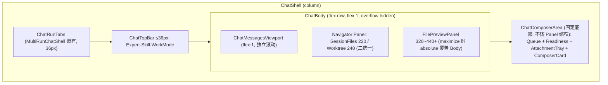

# v1.6.1 Chat 模块组件与 Layout 复刻优化

## 现状关键事实（已核实）

- `ChatSurface`（[ChatSurface.tsx](apps/desktop/src/renderer/src/modules/chat/components/ChatSurface.tsx)）唯一消费方是 [AiosCopilotChatHost.tsx](apps/desktop/src/renderer/src/screens/Hermes/pages/Chat/AiosCopilotChatHost.tsx)，slot API 可破坏性重构。
- 当前 Composer 在 `chat-body > chat-main` 内、RightPanel 是 `aside.chat-right-panel`（外层控宽 min(400px,42%)）— 即 PRD §4/§5 指出的两个问题源头。
- 宽度链 `--chat-content-max:960px` → `.chat-message max-width:920px` → `.chat-bubble max-width:min(720px,100%)`，三层压缩（PRD §6）。
- 已具备可复用能力：MessageList 的 Tool 分组/ReasoningRow/单 Avatar（`showAvatar`/`AvatarSpacer`）、MessageRow 的 hover copy + 相对时间、`FilePreviewPanel` 的 resize + 宽度持久化（440/320）+ maximize、`CopilotChatInput` 的 IME guard/input history/voice/queue/send-stop 切换。
- **缺失**：`useChatScroll` 自动滚动（PRD §25，当前完全不存在）、全容器 Drag&Drop + DropOverlay（现仅 Composer 局部）、完整 Slash Command Palette（现为简单 listbox）、Quick Ask 💭、统一 `ChatLayoutState`、Session Files 宽度自治。
- 已有未接线组件：`components/files/composer/` 下 `ComposerAttachmentTray` / `FileDropOverlay` / `FilePickerButton`。

## 目标结构（PRD §7/§58/§59，Tabs 保留在最顶部）

## Phase 1 — Layout 骨架（最高优先级，PRD §70）

只改布局，不碰功能。

- 新建 [apps/desktop/src/renderer/src/modules/chat/layout/](apps/desktop/src/renderer/src/modules/chat/layout/)：`ChatShell.tsx`、`ChatBody.tsx`、`ChatMessagesViewport.tsx`、`ChatComposerArea.tsx`、`ChatWorkspacePanelHost.tsx`（Panel 仲裁宿主）。
- 重构 `ChatSurface` 为 PRD §59 目标形态：`ChatTopBar / ChatBody(MessageList + FloatingRail + PanelHost) / ChatComposerArea(QueuedMessages + CopilotChatInput)`；Composer 移出 `chat-body`；删除 `chat-main` 与 `aside.chat-right-panel`。
- 收敛 `ChatSurfaceSlots`：移除 `statusBarSlot`/`renderStatusBar`/`contextBarSlot`/`rightPanelSlot`/`showRightPanel`/`filesPanelSlot`，改为 `topBarSlot` + 受控 panel props（`navigatorPanel`、`previewPanel`、`previewMaximized`）。
- 同步改造 `AiosCopilotChatHost`：SessionFilesPanel/FilePreviewPanel/WorktreePanel 从新 props 传入，不再包进 `filesPanelSlot` fragment。
- CSS（[copilot-chat.css](apps/desktop/src/renderer/src/modules/chat/styles/copilot-chat.css)）：`.copilot-chat-root`、`.chat-body`(flex row)、`.chat-messages`(flex:1 + `display:block` + padding 24px/clamp)、`.chat-input-area`(flex-shrink:0 + border-top)；移除 `.chat-right-panel`；`ChatContentRail` 从 MessageList 摘除，超宽屏用 `.chat-messages-inner { max-width:1400px; margin:0 auto }`（PRD §13）。

## Phase 2 — 顶部清理（PRD §34-38）

- `ChatRunHeader` 压缩为 32~36px 单行：仅 Expert/Team 名 + Skill + WorkMode（移除其中的 Return Default 按钮改入溢出菜单或保留超小按钮——实施时对照 PRD §63 模板）。
- `ChatRunStatus` 从常驻布局移除：streaming 由 Orb Avatar/Thinking/Tool 组表达；failed → 消息流 inline error（已有）；保留组件但默认不渲染（Debug Mode 时显示）。
- `chat-diagnostics-bar` 移除主布局，`ChatDiagnosticsExportButton` 移入 TopBar 右侧溢出菜单。
- 删除 `chat-context-folder-bar`，`ContextFolderChip` 移入 Composer `toolbarExtras`（PRD §38，原版即 toolbarExtras）。
- `ChatRunTabs` 保留在 `MultiRunChatShell` 顶部（用户已确认 keep-top），视觉压紧到 36px 行高。

## Phase 3 — 消息流布局（PRD §12-25）

- `.chat-message`：`width:fit-content; max-width:85%; margin-bottom:10px`；agent `margin-right:auto`；user `margin-left:auto; flex-direction:row-reverse`；去掉 row 的 border/background（去 Card 化，PRD §15）。
- `.chat-bubble`：移除 `max-width:min(720px,100%)` 硬限制；user 气泡 `border-radius:16px; border-bottom-right-radius:5px`；agent 气泡 14px/1.6~1.65（PRD §16/17）。
- 审查 `AgentMarkdown` 增加 `.agent-markdown` 作用域（防 Tailwind Preflight 破坏 p/h/ul/blockquote/code/table 间距，PRD §18）。
- 新增 `hooks/useChatScroll.ts`（参考 [references/copilot-desktop/src/renderer/src/screens/Chat/MessageList.tsx](apps/desktop/references/copilot-desktop/src/renderer/src/screens/Chat/MessageList.tsx) 的滚动逻辑）：贴底时 streaming 自动跟随；距底 >60px 暂停跟随；发送新消息强制滚底；禁止逐 token 强制滚动（PRD §25）。

## Phase 4 — Composer 复刻（PRD §27-33, §50-55）

- Composer Card 视觉：`.chat-input-wrapper`（bg-secondary、border-bright、radius 14、focus-within accent glow）；textarea 无边框、`max-height:120px`（现 200px）、`useLayoutEffect` 自增高。
- 用既有 `ComposerAttachmentTray`/`ComposerAttachmentCard` 替换简易 `chat-attachment-chip` 条（PRD §50）。
- Slash 菜单升级为 Command Palette：分类分组、footer hints（↑↓ navigate / ↵ select / tab complete）、参考 [references ChatInput.tsx](apps/desktop/references/copilot-desktop/src/renderer/src/screens/Chat/ChatInput.tsx)；数据源仍走 `commands.listCommands()`（v1.6 Runtime Catalog 不变）。
- 新增 Quick Ask 💭 按钮（有 session + 输入非空 + 非 loading 时显示，PRD §55）。
- 全容器 Drag&Drop：`ChatShell` 层维护 `dragCounter`，接线既有 `FileDropOverlay`，替代 Composer 局部 dragOver（PRD §51）。
- Toolbar 顺序固定：📎 🎙 │ Expert·Skill·PromptAssist │ Model Reasoning Folder │ ContextGauge 💭 Send/Stop（PRD §33）；`QueuedMessages` 上移到 `ChatComposerArea` 顶部。

## Phase 5 — Workspace Panel 治理（PRD §39-47, §60-62）

- 统一 `ChatLayoutState`（sessionFilesVisible / worktreeVisible / previewOpen / previewMaximized / promptNavigatorOpen / navigatorWidth / previewWidth），收敛到 `AiosCopilotChatHost` 一处，落 `run.presentation`（复用 `onPatchRun` 持久化链）；宽度用 localStorage（`hermes:sessionFilesWidth` 等，PRD §61）。
- `ChatWorkspacePanelHost` 实现两层仲裁：Navigator（SessionFiles 220px / Worktree 240px 二选一）+ Detail（FilePreview 440px 默认）；SessionFilesPanel 增加 resize 手柄与宽度持久化（复用 FilePreviewPanel 的 pointer 模式）。
- Preview maximize：`.file-preview-panel--max` 作用域改为 `position:absolute; inset:0` 于 `ChatBody`（`position:relative`），不覆盖 Composer（PRD §43/44）。
- Responsive：≥1440 允许三区；1100-1439 仅 Messages+Preview（Navigator 转 overlay）；<1100 仅 Messages（Panel 转 drawer/overlay）（PRD §47）。
- 清理 `components/session-files/FilePreviewPanel.tsx`（与 `files/preview/FilePreviewPanel.tsx` 重复，确认无引用后删除）。

## 验证（对照 PRD §73 验收清单）

- `npm run typecheck` + `npm test`（cwd=apps/desktop）；Chat 相关既有测试（`FilePreviewPanel.test.tsx` 等）随结构调整同步更新。
- 手工/Playwright 对照 §73 四组验收：Layout（Composer 不缩窄/Header≤40px/Diagnostics 不占位）、Message（85%、单 Avatar、折叠组、hover action）、Composer（单 Card/120px/IME/Slash/Queue/拖放/Quick Ask/Stop 切换）、Workspace（220/240/440、resize、持久化、maximize 只覆盖 Body）。
- 收尾按 `.cursor/rules/007-sync-project-docs.mdc` 同步 `AGENTS.md` 版本行与 `docs/renderer/` 相关页。

## 边界与约束

- 不改 v1.6 Runtime/Hermes 架构、不改任何 Port/Adapter 数据契约（`window.chatRuntime`/`chatFiles` 等保持不变）。
- 禁止生产代码 import `references/copilot-desktop`（仅对照阅读）。
- Renderer 不引入 Node API；新 UI 文案补 en + zh-CN i18n。
- 不触碰含 `#command by loudon` 注释块。