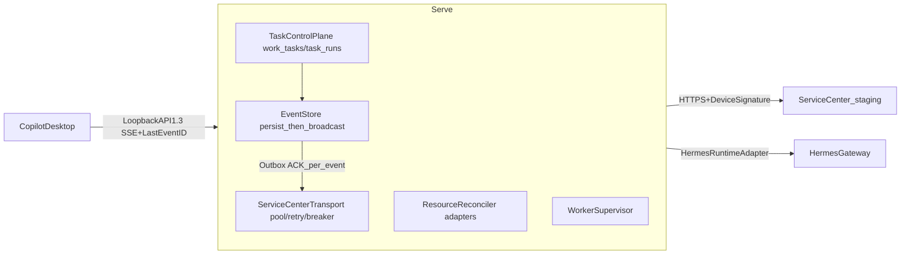

# v1.6 真实执行面、可靠事件流与生产治理总计划

## 定位与约束

- **产品目标**：从「企业终端控制面原型」升级为「可生产运行的本地可信执行节点」（PRD §30 闭环）。
- **基线**：v1.5.0（API `1.2`）→ 目标 API `1.3`；建议分支 `feature/runtime-v1.6-production-execution`。
- **环境（已确认）**：Service Center 测试环境可联调 → `staging_http` 真实集成 + `tests/fakes/` Fake HTTP Server 契约测试双轨；`production_http` 启动门禁代码就绪，Stable 包默认 production。
- **本仓范围**：Runtime 控制面、集成 Client、安装器、CI。Service Center 服务端 / Desktop UI / StaffDeck 页面不在本仓。

## 现状关键缺口（探索结论）

- Sync 事务顺序错误：ACK 在本地 Commit **之前**发送（[runtime_sync_service.py](src/services/runtime_sync_service.py)）；无 ACK Outbox / Sequence Gap / 重放保护
- `HttpServiceCenterClient` 每请求新建 `httpx.AsyncClient`，无池化/重试/熔断/设备签名；无 `AIOS_DEPLOYMENT_MODE`
- Remote Task v2 执行是**模拟成功**（[remote_task_service.py](src/services/remote_task_service.py) `accept()` 直接 `_finish_success`），不调 Hermes Gateway；`local_task_id` 从不写入
- Desired State apply 只写元数据文件，**不真实安装** Profile/Skill/Plugin/MCP；无回滚、无真实探针
- Artifact 上传 `path.read_bytes()` 全量入内存；无分块续传/加密 Spool
- 无 `work_tasks`/`task_runs`/`task_run_events` 表；无 Worker Supervisor；无 `/metrics`、`/health/live|ready`
- CI：Stable E2E 可跳过；`.exe` 是 `.cmd` 改名；maintenance 用裸 `extractall`

## 目标架构主链路

**铁律（PRD §8）**：先持久化 → 再广播 → 再交付；生产模式禁 Stub；Runtime 不复制 Hermes；本地事实优先。

## 里程碑总览

- **M0 Release Gate**：CI 分支修复、真实 Launcher、Stable 强制 E2E、Manifest 发布、Maintenance 安全解压
- **M1 Production Center Transport**：Deployment Mode、共享 HTTP Client、Retry、Circuit Breaker、设备签名、协议协商
- **M2 Reliable Sync**：Commit-before-ACK、ACK Outbox、Sequence Gap、重放保护、Poison Message、逐事件 ACK
- **M3 Real Resource Apply**：Artifact Downloader、Resource Adapter × 6、Revision 事务回滚、Actual State Probe
- **M4 Real Task Execution**：WorkTask/TaskRun/Event 模型、Hermes Adapter、Scheduler、Lease/Cancel/Recovery、SSE Replay
- **M5 Artifact/Policy/Worker**：流式+分块 Artifact、Approval/EffectivePolicy、Worker Supervisor、Metrics/诊断
- **M6 Experience 与正式验收**：自动 Evidence、Provenance、Fingerprint、Windows 全量 E2E、API 1.3 发布

严格按 PRD §28 提交顺序推进；每个 M 结束更新 `lat.md/` 并跑 `lat check`。

---

## M0 — Release Gate（FR-001~005）

- CI [runtime-windows.yml](.github/workflows/runtime-windows.yml)：branches 增加 `master`、`feature/runtime-v1.6-*`；Stable channel 缺 E2E 环境**必须失败**（去掉 secrets 缺省时 skip-and-pass）
- 真实 Launcher：选 **PyInstaller Onefile**（团队 Python 栈、构建链已有 embeddable Python 经验；备选 Nuitka）。替代 `runtime-windows.yml` 中 `.cmd→.exe` 复制；负责解析安装目录、定位嵌入 Python、启动 Uvicorn、写 PID、Stop Signal、退出码
- Maintenance 安全解压：[runtime_maintenance.py](src/local_service/runtime_maintenance.py) 弃用裸 `extractall`，复用/扩展 [archive_policy.py](src/runtime/archive_policy.py) `safe_extract_archive`：ZIP Slip、ADS、Symlink、数量/体积上限、Manifest+SHA-256+Ed25519+版本/平台校验
- Release Pipeline 输出签名 Manifest + SBOM + provenance，发布到正式 Artifact 仓（不只 GHA 临时 artifact）

## M1 — Production Center Transport（FR-101~106）

- 新增 [src/integrations/service_center/](src/integrations/service_center/)：`transport.py`（全服务共享一个 `httpx.AsyncClient`：池化/Keep-Alive/四类超时/禁 Redirect/响应体上限/Graceful Close）、`retry_policy.py`（仅 408/425/429/5xx/ConnectError/ReadTimeout；`Retry-After`+指数退避+Jitter；完成类操作禁重试除非带 Idempotency-Key）、`circuit_breaker.py`（per-host closed/open/half_open；Open 时本地任务继续、Outbox 保留、Desktop 显示 Offline）、`request_signer.py`（`X-Endpoint-Id/Request-Id/Timestamp/Nonce/Body-SHA256/Device-Signature`，签名原文 METHOD+PATH+BODY_SHA256+TIMESTAMP+NONCE）、`response_verifier.py`、`contract_negotiator.py`（`GET /api/v1/runtime-contract`，不兼容则停对应 Channel 不影响本地 Chat）
- [config.py](src/core/config.py)：新增 `AIOS_DEPLOYMENT_MODE`（`development_stub|staging_http|production_http`）；production 启动检查（Base URL/域名白名单/签名公钥/Auth/禁 Legacy Token/Device Credential/TLS Trust）失败非零退出；**production 发现 Stub 启动失败**
- 重构 `HttpServiceCenterClient` 走 Transport；修复 token 水合缺口（`ensure_access_token` 缓存有效时未 `set_access_token`）
- 测试：Fake HTTP Server 契约测试（不用内存注入 Client）：enrollment/refresh/changes/ACK/events/artifact/protocol negotiation + staging 联调脚本

## M2 — Reliable Sync（FR-201~206）

- 重构 [runtime_sync_service.py](src/services/runtime_sync_service.py) `sync_now` 事务顺序：`验证签名 → 验证 Sequence → 写 SyncInbox → Dispatch → 更新 Cursor → Commit → 写 AckOutbox → Ack Worker 发送`；**禁止 Commit 前 ACK**
- 新表：`sync_ack_outbox`、`sync_replay_nonces`、`sync_poison_messages`；修改 `sync_inbox`/`delivery_outbox`（Alembic migration）
- `verify_envelope()`（[sync_protocol.py](src/runtime/sync_protocol.py) 已存在未接线）接入 pull 路径：Endpoint/Tenant/MessageID/Sequence/Timestamp/Nonce/PayloadHash/Center 签名；重放 → `replay_rejected` 不重执行业务
- Cursor 连续性：Sequence 缺口 → `channel.status=sequence_gap`，停推进、请求 Center 重放；Poison Message：`received→processing→retry→quarantined`，隔离后后续 Sequence 按策略继续
- 逐事件交付确认：`events_batch` 响应按 `accepted/duplicate/rejected` 逐条更新 Outbox 状态，不再整批成败
- 新 Worker：`ack_delivery_worker.py`、`event_delivery_worker.py`
- Crash 测试：Inbox 已写未 Commit / Commit 后未 ACK 两个断点，重启验证不丢不重

## M3 — Real Resource Apply（FR-301~308）

- 新增 [src/runtime/resources/](src/runtime/resources/)：`base.py`（`ResourceAdapter` Protocol：validate/stage/apply/verify/rollback/remove）+ `profile_adapter / expert_adapter / skill_adapter / plugin_adapter / mcp_adapter / policy_adapter`
- 新增 Artifact 链：`ArtifactDownloader`（下载到 `.partial` → 流式 SHA-256 → 验签 → Manifest → 压缩包安全扫描 → 原子改名入 Cache）、`ArtifactVerifier`、`ArtifactCache`；禁止测试字符串假 checksum
- Profile：解析 Bundle → forbidden keys → 版本目录 → 写 `profile.yaml/SOUL.md` → 绑定引用 → `hermes config check` → 切版本指针 → 重启 Instance → Gateway Health
- Skill：`hermes skills inspect/check/audit`，审计失败禁启用，保留旧版本；Plugin：Manifest/依赖/静态策略扫描 → install/enable → 重启 → 健康探针；MCP：Secret 本地解析 → [mcp_config_compiler](src/runtime/mcp_config_compiler.py) → `hermes mcp test` → Tool Discovery 验证；**缺 Secret → `blocked`/`missing_secret`，不得标 installed**
- 新表：`resource_apply_runs`、`resource_apply_operations`、`resource_snapshots`；Revision 级事务回滚：任一资源失败 → 逆序回滚全部已完成操作 → 恢复旧版本 → `rolled_back`
- Actual State Probe：来自文件版本/Hermes CLI/Gateway/Tool Discovery/MCP Test 真实探针，不只读 `resource_installations`
- 重构 [desired_state_service.py](src/services/desired_state_service.py) / [resource_sync_service.py](src/services/resource_sync_service.py) 走 Adapter；API：`/resources/reconciliations*`、`/resources/{type}/{id}/probe`

## M4 — Real Task Execution（FR-401~507）

- 新表：`work_tasks`、`task_runs`、`task_run_events`（`UNIQUE(run_id, sequence)`）、`task_run_checkpoints`、`task_approvals`、`task_artifacts`、`task_resource_locks`；修改 `remote_task_assignments`/`task_leases`；迁移：未完成 Assignment → WorkTask（保留原 ID、不自动执行、`migration_pending_review`）；`task_delivery_records` → `task_run_events`+`delivery_outbox`
- 新增 [src/runtime/tasks/](src/runtime/tasks/)：`hermes_adapter.py`（`HermesRuntimeAdapter`：ensure_instance/start_run/stream_run/cancel_run/get_session/health，复用 [HermesGatewayClient](src/integrations/hermes/client.py) 与 [chat_stream_service](src/services/chat_stream_service.py) SSE 能力）、`executor.py`（Assignment→Validate→Resolve Profile/Revision/Instance→Ensure Gateway→Claim→WorkTask→TaskRun→Gateway Chat SSE→事件归一化→持久化→Approval→Finalize→交付）、`event_normalizer.py`（chat chunk→`agent.message.delta`，tool→`tool.*`，usage→`run.usage_json`，done→completed，error→`task.failed`）、`event_store.py`（**先 DB Commit → 再 Desktop SSE 广播 → 再 Outbox**；payload>64KB 转 Artifact）、`scheduler.py`（Endpoint 并发=2、Instance 并发=1、Priority/Deadline/FIFO/Profile/Workspace 互斥/Resource Lock）、`lease_manager.py`（续期周期 `min(center心跳, lease/3)`；连续失败→`lease_at_risk`；到期→停交付+取消 Run+`expired`）、`cancellation.py`（cancel.requested→Cancel Token→abort SSE→Hermes interrupt→Grace Period→必要时停子进程→cancelled；P95≤3s）、`recovery.py`（启动扫描 starting/running/waiting_approval/finalizing/delivering；Session 在→恢复监听，Gateway 失联→`orphaned`，Lease 失效→`expired`，Artifact 未传→恢复 Delivery）
- API：`/api/v1/tasks*`（CRUD/start/cancel/retry/runs/events/`events/stream` 支持 `Last-Event-ID` 从 DB 补发）；旧 `/api/v1/remote-tasks/*` 保留一版本内部转接新模型
- 事件类型全集按 PRD FR-404（task.*/agent.message.*/tool.*/approval.*/artifact.*/runtime.*）
- 验收要点：Assignment 真实调 Gateway、Desktop 实时 Delta、同 Assignment 不重复执行、**最终结果不是模拟固定文本**

## M5 — Artifact、Policy、Worker Supervisor（FR-601~905）

- 新增 [src/runtime/artifacts/](src/runtime/artifacts/)：`spool.py`（`%LOCALAPPDATA%\HermesRuntime\artifact-spool`，状态机 created→…→deleted）、`streaming_hash.py`（分块读+增量 SHA-256，禁 `read_bytes`）、`multipart_upload.py`（阈值上分块、持久化 Part ETag、重启续传）、`encryption.py`（DPAPI 包装数据密钥 + AES-GCM；日志禁记原始路径）、`retention.py`；新表 `artifact_upload_sessions`/`artifact_upload_parts`；API `/artifacts/*`
- 新增 [src/runtime/policy/](src/runtime/policy/)：`effective_policy.py`（Center ∩ Local Enterprise ∩ Profile ∩ Task ∩ User Decision，Center 不得降低本地约束）、`approval_token.py`（一次性、绑 task/run/tool_call/参数 Hash、有过期；参数变则失效）、`workspace_guard_v2.py`（`..`/Symlink/Junction/UNC/盘符/临时目录/大小写绕过防护）
- Worker Supervisor：[src/workers/](src/workers/) `registry.py`+`supervisor.py` 统一注册 10 个 Worker；状态 `starting/running/backing_off/circuit_open/degraded/stopped/failed` + `last_*`/`consecutive_failures`/`next_run_at`；新表 `worker_states`/`worker_incidents`；支持 Backoff/Jitter/熔断/Tick Timeout/Graceful Cancel/手动重启/Critical 标识/Readiness 聚合；单实例 Process Lock（`runtime_already_running`）；Graceful Drain；API `/workers/*`
- 可观测性：`/health/live|ready|details`（Center 离线不影响 Liveness）、`/metrics`（PRD FR-902 指标全集）、诊断包脱敏增强（禁 Secret/Token/私钥/Chat 正文）；统一 Trace Context（request/endpoint/task/run/assignment/event/instance/revision）
- 重构 [lifecycle.py](src/core/lifecycle.py)：Worker 启动全部走 Supervisor；清理 `v15_workers.py` 与独立 Worker 文件的重复

## M6 — Experience v2 与正式验收（FR-1001~1005, §23/25/27/29）

- 自动 Evidence Hook：`task.completed/failed`、`approval.resolved`、`user.correction`、`artifact.created`、`tool.failed`、`runtime.recovery.completed` 事件自动生成脱敏 Evidence
- Provenance：Evidence 引用 task_id/run_id/event_sequence_range/artifact_ids/profile_version/skill_versions/tool_names；新表 `experience_evidence_links`/`experience_fingerprints`；Fingerprint 去重合并计数；质量评分（repeat/reuse/confirmation/quality/compliance/failure_rate）达阈值才建议 Candidate；**提交 StaffDeck 前必须 Desktop 用户批准**
- Team Hub 默认关闭（`AIOS_TEAM_HUB_USE_STUB=false`），兼容模式经 Legacy Adapter → WorkTask；清理旧 `TaskListenerWorker`/`SyncOutboxWorker` 默认启动
- [capabilities.py](src/core/capabilities.py)：`apiVersion: "1.3"` + PRD §21 全部新 capability；README 删除 `D:\Programs`/预装 Python/Node/Git 正式部署要求（降为 Legacy/Developer Installation）
- Hermes 集成测试（真实 Artifact：Install→Instance→Gateway→Chat→Tool→Approval→Complete→Session/Artifact 存在）+ Crash 测试 7 断点 + Windows 11 无开发工具全量 E2E（PRD §25.5）
- 文档：`docs/api-contract.md` 升 1.3、`lat.md/` 全量更新（新章节：可靠同步、资源 Adapter、任务执行面、Worker Supervisor 等）、`lat check` 通过、对照 §27/§29 逐条验收

## 横切约束

- **分层**：router 薄壳 → services 编排 → repositories 仅 DB → integrations 外呼 → runtime 纯协议/文件逻辑；禁止 Service 访问其他 Service 私有 Repository
- **测试金字塔**：每 M 先单测（PRD §25.1 清单）→ Fake HTTP Server 契约测 → staging 联调 → M0/M6 Windows E2E；生产仅用 Alembic 建表
- **安全**：Loopback API；HTTPS only 出站；事件禁完整 prompt/工具 I/O/密钥；诊断包脱敏；本地策略只许更严
- **lat.md**：每个 M 结束更新对应章节 + `lat check`（AGENTS.md 强制清单）

## 明确不做

- Service Center / StaffDeck / nodeskclaw / Expert Factory 服务端；Desktop React；macOS/Linux 正式安装包；多机分布式 Runtime / K8s；自动发布 Skill；业务工作流（AutoTask/邮件/知识库/RPA）
