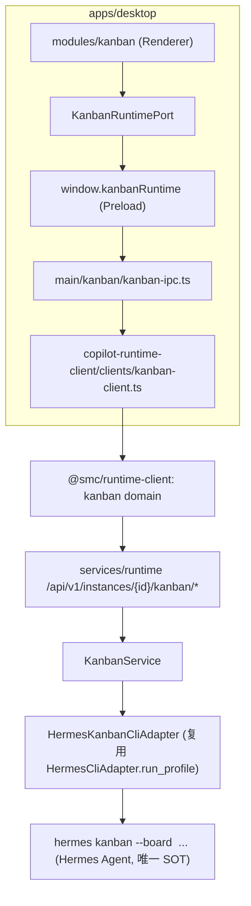

# v1.7 Hermes Kanban 模块迁移计划

## 架构总览

关键边界（PRD §3/§7/§70）：KanbanTask 独立于 WorkTask；Runtime 只做 Facade，禁止直改 kanban.db；Renderer 禁止出现 `hermesAPI`/`HERMES_*`/CLI/DB 访问。

## 勘察结论（已核实）

- 契约流：改 [services/runtime/src/schemas/](services/runtime/src/schemas/) Pydantic → 根目录 `npm run contracts:generate` 重新生成 [contracts/runtime-api/openapi.yaml](contracts/runtime-api/openapi.yaml)（禁止手改）→ `npm run client:generate` 重新生成 [packages/runtime-client-ts/src/generated/](packages/runtime-client-ts/src/generated/)。PRD「先改 openapi.yaml」按此链路执行。
- CLI 复用：[services/runtime/src/integrations/hermes/cli_adapter.py](services/runtime/src/integrations/hermes/cli_adapter.py) 的 `HermesCliAdapter.run_profile(profile, args, timeout=...)`；instance → profile 经 `HermesInstance.profile_name`（参考 [client_factory.py](services/runtime/src/integrations/hermes/client_factory.py)）。
- Desktop 桥接范例：[apps/desktop/src/main/work-tasks/work-tasks-ipc.ts](apps/desktop/src/main/work-tasks/work-tasks-ipc.ts) → `copilot-runtime-client/clients/task-client.ts` → `runtime.tasks`。Kanban 新建独立 preload 命名空间 `window.kanbanRuntime`（与 `workTasks`/`chatRuntime` 惯例一致；PRD §33 的 `window.copilotRuntime.kanban` 为备选，不推荐混入通用连接面 API）。
- UI 蓝本：[references/copilot-desktop/src/renderer/src/screens/Kanban/Kanban.tsx](apps/desktop/references/copilot-desktop/src/renderer/src/screens/Kanban/Kanban.tsx)（COLUMNS/STATUS_TONE/dragAction/POLL_INTERVAL_MS=6000/loadAll/卡片与详情 JSX）与 [references/copilot-desktop/src/main/kanban.ts](apps/desktop/references/copilot-desktop/src/main/kanban.ts)（DTO 字段与 CLI 参数映射，仅供 Runtime Adapter 参考，不复制）。
- 导航：在 [workspace-registry.ts](apps/desktop/src/renderer/src/workspace/workspace-registry.ts) 新增 `kind: "react"` 的 `kanban` 模块，`WorkspaceRenderer` 分发到 `<KanbanPage />`，Route Root 保持 Thin。

## Phase 0 — Contract 与 TS Client

- 新增 [services/runtime/src/schemas/kanban.py](services/runtime/src/schemas/kanban.py)：`KanbanBoard`、`KanbanTask`（含 `allowedActions: list[str]`，PRD §13）、`KanbanTaskDetail`（task+comments+events+parents+children+runs+latest_summary，PRD §23/§39）、`KanbanComment/KanbanEvent/KanbanRun`、`CreateKanbanBoardInput/CreateKanbanTaskInput`（§24 字段全量）、`KanbanTaskActionInput`（§25 判别联合）、`KanbanCapabilities`（§20）、`KanbanDispatchResult`。
- 新增 [services/runtime/src/api/v1/kanban.py](services/runtime/src/api/v1/kanban.py) 路由声明（thin router），保证 OpenAPI 路径生成。
- 执行 `npm run contracts:generate` + `npm run client:generate`。
- 新增 [packages/runtime-client-ts/src/domains/kanban.ts](packages/runtime-client-ts/src/domains/kanban.ts)（`createKanbanDomain`，方法对齐 PRD §31），在 domains/index.ts 与 client 入口暴露 `runtime.kanban`。

## Phase 1 — Runtime 实现

- 新增 `services/runtime/src/integrations/hermes/kanban/`：
  - `base.py`：`HermesKanbanAdapter` Protocol（list_boards/list_tasks/get_task/create_task/execute_action/dispatch/add_comment/list_assignees/capabilities）。
  - `command_builder.py`：所有命令显式携带 `--board <slug>`（PRD §8，禁止 `boards switch` 全局态）。
  - `cli_adapter.py`：内部复用 `HermesCliAdapter.run_profile`；超时分级 read/list 10s、action 20s、dispatch 30s（§58）；`--json` 输出解析；allowedActions 由 (status → 可执行 action) 映射表派生。
  - `errors.py`：stderr/exit code → `HERMES_NOT_INSTALLED`/`KANBAN_BOARD_NOT_FOUND`/`KANBAN_INVALID_TRANSITION`/`KANBAN_DEPENDENCY_BLOCKED`/`KANBAN_TIMEOUT` 等标准错误码（§57）。
- 新增 [services/runtime/src/services/kanban_service.py](services/runtime/src/services/kanban_service.py)：instanceId → profile_name 解析；`dir:<path>` workspace 校验（路径遍历/symlink/非本地盘拦截，§59，复用 Workspace Guard 能力）；编排 adapter。
- [services/runtime/src/api/router.py](services/runtime/src/api/router.py) 注册 `kanban.router`（prefix `/instances/{instance_id}/kanban`）。
- API 面（§20–§28）：`GET capabilities`、`GET/POST/DELETE boards`、`GET tasks`（status/assignee/tenant/includeArchived）、`GET tasks/{id}`、`POST tasks`、`POST tasks/{id}/actions`、`POST tasks/{id}/comments`、`GET assignees`、`POST dispatch`（dryRun）。
- Runtime 单测：command_builder 参数快照、错误码映射、allowedActions 推导（mock CLI 输出，不真实起 hermes 进程）。
- 验收：`curl` Runtime 能读到真实 Hermes Board。

## Phase 2 — Desktop Bridge（Main/Preload）

- 新增 [apps/desktop/src/shared/kanban/kanban-contract.ts](apps/desktop/src/shared/kanban/kanban-contract.ts)：IPC channel 常量 + Renderer 侧 DTO（camelCase，复用 `@smc/runtime-client` 导出类型做映射源）。
- 新增 `src/main/copilot-runtime-client/clients/kanban-client.ts`（封装 `runtime.kanban`，Main-only）。
- 新增 `src/main/kanban/kanban-ipc.ts` 并在 `src/main/index.ts` 注册；新增 `src/preload/kanban-api.ts`（`window.kanbanRuntime`）+ `src/preload/index.d.ts` 类型声明。
- 另加 `pickDirectory`（KanbanWorkspacePort 的 Native 能力，走 `dialog.showOpenDialog`）。
- 更新 `docs/API_CONTRACTS.md`。

## Phase 3 — Renderer Module 骨架

按 PRD §14 建 [apps/desktop/src/renderer/src/modules/kanban/](apps/desktop/src/renderer/src/modules/kanban/)：

- `types/`（看板类型 + `KANBAN_COLUMNS` 8 列常量 + STATUS_TONE + `KanbanTaskAction`）
- `ports/KanbanRuntimePort.ts`、`ports/KanbanWorkspacePort.ts`（§17/§30 接口签名原样落地）
- `adapters/runtimeKanbanAdapter.ts`（实现 Port → `window.kanbanRuntime`）
- `controller/useKanbanController.ts` + `kanbanReducer.ts` + `kanbanSelectors.ts`（§34 状态清单：selectedBoardSlug/boards/tasks/selectedTask/showArchived/loading/actionBusy/error 等）；board 选择持久化到 localStorage（§35），不触碰 Hermes Current Board
- `KanbanPage.tsx`（只接 controller → `KanbanModule`，§16）
- `styles/kanban.css`：全部选择器挂在 `.smc-kanban` scope 下（§54）

## Phase 4 — UI 复刻（逐组件迁移）

参考 `references/copilot-desktop/.../Kanban.tsx` 拆分：

- `components/KanbanHeader.tsx`（Refresh / Archived toggle / Dispatch / New Task）、`BoardSwitcher.tsx`（Board chips + New Board）
- `KanbanBoard.tsx` / `KanbanColumn.tsx`（横向滚动，列宽 260–320px，§37）
- `KanbanTaskCard.tsx`（TaskID/Priority/Age/Title/Assignee/Tenant/Skills/Running live dot/Quick Actions，§11）
- `KanbanTaskActions.tsx`：action 可用性由 `task.allowedActions` 驱动，不在 Renderer 推导状态机（§13）
- `detail/TaskDetailDrawer.tsx` 右侧抽屉：Overview/Comments/Dependencies/Runs/Events 五区（§38）
- `dialogs/`：CreateTaskDialog（§51 布局，含 workspace scratch/worktree/dir + skills + triage）、CreateBoardDialog、BlockTaskDialog、ScheduleTaskDialog
- 未知状态渲染到独立 Unknown 列并记录 diagnostics，不回退 Todo（§66）

## Phase 5 — 拖拽、刷新与导航

- `hooks/useKanbanDragDrop.ts`：HTML5 DnD（对齐参考实现）；from/to → action 映射表（§12：→Done=complete、→Blocked=block、Blocked→Ready=unblock、Running→Ready=reclaim、Todo→Ready=promote、→Scheduled=schedule、Done→Archived=archive），仅作为「目标列 → action verb」翻译；合法性同时受 `allowedActions` 门控；无效目标禁止 drop；拖 Done 前确认（对齐参考行为）。
- `hooks/useKanbanRefresh.ts`：6s 轮询 + window focus / visibilitychange 刷新（§40/§42 P0）；Runtime 不可达时显示 `Runtime unavailable`，无任何 fallback（§69）。
- 导航接入：`workspace-registry.ts` 增加 `kanban` 模块（`kind: "react"`，固定 Tab）；`WorkspaceRenderer` 分发 `<KanbanPage />`；i18n `navigation.kanban` 与 `kanban.*` 全套 key 补 en / zh-CN。
- 不迁移：HQ (Claw3D) 虚拟 Board、SSH 通道、SSE 实时事件（P1+，§43/§44）。

## Phase 6 — 守卫、测试与收尾

- CI 守卫：新增脚本 `check:no-desktop-kanban-hermes-access` 扫描 `modules/kanban`，禁词 `hermesAPI`/`HERMES_HOME`/`HERMES_PYTHON`/`execFile`/`kanban.db`/`hermes kanban`（§60），挂入 desktop `npm run guard`。
- Desktop 测试：reducer/selectors/drag 映射/adapter 的 Vitest 用例；`npm run typecheck`、`npm test`、Renderer 区 `npm run lint`。
- 按 §64–§68 验收清单人工验证（多 Board 隔离、Create Task 三种 workspace、8 状态展示、7 组拖拽映射、Dispatch 状态回流）。
- 收尾：按 `007-sync-project-docs` 规则增量同步 `AGENTS.md`/`docs/INDEX.md`/`docs/API_CONTRACTS.md`/`docs/renderer/`；更新 desktop 与 runtime 的 `lat.md/` 并跑 `lat check`。